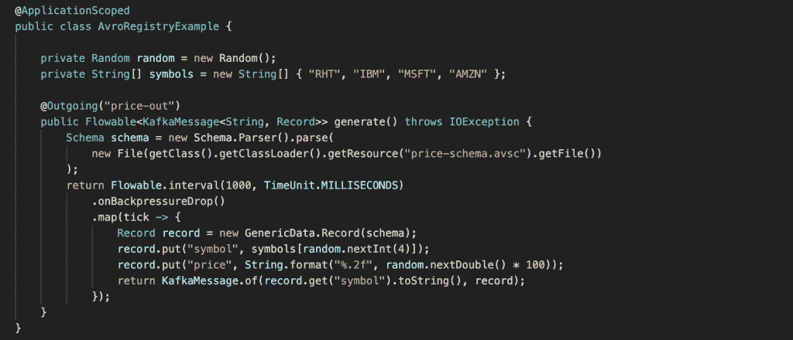

# Red Hat 集成服务注册表入门

> 原文：<https://developers.redhat.com/blog/2019/12/16/getting-started-with-red-hat-integration-service-registry>

新项目需要一些帮助。假设您正准备开始您的企业在过去几个月中一直要求的新功能。你的团队已经准备好开始编码来实现这个会改变你的业务的新的令人敬畏的东西。

为了实现这一点，团队需要与您组织中现有的软件组件进行交互。您的开发人员将需要与您的架构中已经可用的 API 服务和事件端点进行交互。在能够发送和处理信息之前，开发人员需要知道这些服务所期望的结构或模式。


[Red Hat 宣布了](https://developers.redhat.com/blog/2019/11/26/red-hat-simplifies-transition-to-open-source-kafka-with-new-service-registry-and-http-bridge/)[Red Hat Integration](https://www.redhat.com/en/products/integration)服务注册中心的[技术预览版](https://access.redhat.com/support/offerings/techpreview)，以帮助团队管理他们的服务模式。服务注册中心是模式(和 API 设计)工件的存储库，提供了 REST API 和一组可选规则，用于实施内容有效性和演化。团队现在可以使用服务注册中心来查询每个服务端点所需的模式，或者注册和存储新的结构以备将来使用。

## 服务注册中心概述

Red Hat Integration service registry 是标准事件模式和 API 设计的数据存储库。它使开发人员能够将他们的数据结构从应用程序中分离出来，并使用 REST 接口共享和管理他们的数据结构。Red Hat service registry 建立在 [Apicurio Registry](https://github.com/apicurio/apicurio-registry) 开源社区项目之上。

服务注册中心处理以下数据格式:

*   阿帕奇 Avro
*   JSON 模式
*   协议缓冲区
*   OpenAPI
*   AsyncAPI

您可以为添加到注册中心的每个工件配置规则，以控制内容演变。为工件配置的所有规则都必须通过，新版本才能上传到注册中心。这些规则的目标是防止无效内容被添加到注册表中。

## 通过 Apache Kafka 使用服务注册中心

由于 Apache Kafka 将实际的消息值内容作为不透明的字节数组来处理，所以强烈建议使用序列化系统。 [Apache Avro](https://avro.apache.org/) 是对 Kafka 数据进行编码的常用数据格式之一。Avro 是一个数据序列化系统，它依赖于用 JSON 定义的模式，并支持模式版本化。然后，Avro 可以根据我们的模式将我们的数据转换成字节数组，然后发送给 Kafka。消费者可以使用 Avro 模式来正确地反序列化接收到的数据。

Red Hat Integration 服务注册中心提供完整的 Kafka 模式注册中心支持来存储 Avro 模式。此外，提供的 maven 存储库包括一个自定义的 Kafka 客户端串行器/反串行器(SerDe)。这些实用程序可以被卡夫卡客户端开发者用来与注册表集成。这些 Java 类允许 Kafka 客户端应用程序在运行时从服务注册表中推/拉它们的模式。

### 运行 Kafka 和注册表

对于这个例子，我们将使用一个基于 Strimzi 和服务注册中心的本地 [docker-compose](https://docs.docker.com/compose/) Kafka 集群。Service registry 使用 Kafka 作为主数据存储，但是您也可以使用基于内存或 JPA(目前不支持)的存储。我们将使用内存存储来简化使用过程。正如我之前提到的，docker-compose 和内存存储都不推荐用于生产。

首先，下载我预先配置的 [docker-compose.yaml](https://raw.githubusercontent.com/hguerrero/amq-examples/master/registry-example-avro/docker-compose.yaml) 文件，并启动本地运行的服务。

```
$ docker-compose -f docker-compose.yaml up
```

Kafka 将在`localhost:9092`上运行，注册表将在`localhost:8081`上运行

```
Creating network "post_default" with the default driver
Pulling zookeeper (strimzi/kafka:0.11.3-kafka-2.1.0)...
…
zookeeper_1  | [2019-12-09 16:56:55,407] INFO Got user-level KeeperException when processing sessionid:0x100000307a50000 type:multi cxid:0x38 zxid:0x1d txntype:-1 reqpath:n/a aborting remaining multi ops. Error Path:/admin/preferred_replica_election Error:KeeperErrorCode = NoNode for /admin/preferred_replica_election (org.apache.zookeeper.server.PrepRequestProcessor)
kafka_1      | [2019-12-09 16:56:55,408] INFO [KafkaServer id=0] started (kafka.server.KafkaServer)

```

### 创建新的 quartus 项目

现在，我们已经启动了所需的基础设施，我们需要创建一个简单的客户端来向 Kafka 集群发送和使用消息。在这个场景中，我将使用 Kafka 的[微概要反应消息](https://quarkus.io/guides/kafka)扩展创建一个简单的 [Quarkus](https://quarkus.io/) 应用程序。

首先，打开一个新的终端窗口，并使用 Quarkus 插件创建一个新的 Maven 项目:

```
mvn io.quarkus:quarkus-maven-plugin:1.4.2.Final:create \
    -DprojectGroupId=com.redhat \
    -DprojectArtifactId=kafka-registry \
    -Dextensions="kafka"
```

在 Maven 下载了所有需要的工件之后，您将会看到“构建成功”:

```
…
[INFO] 
[INFO] ------------------------------------------------------------------------
[INFO] BUILD SUCCESS
[INFO] ------------------------------------------------------------------------
[INFO] Total time:  01:07 min
[INFO] Finished at: 2019-12-09T12:17:51-05:00
[INFO] ------------------------------------------------------------------------

```

在首选代码编辑器中打开新创建的项目；在我的例子中，我将使用 VS 代码。我的编辑器已经安装了有用的扩展，比如 Java 和 Quarkus。

打开`pom.xml`并移除`quarkus-resteasy`依赖项并添加这些:

```
<dependency>
     <groupId>org.jboss.resteasy</groupId>
     <artifactId>resteasy-jackson2-provider</artifactId>
   </dependency>
   <dependency>
     <groupId>io.apicurio</groupId>
     <artifactId>apicurio-registry-utils-serde</artifactId>
     <version>1.2.1.Final</version>
   </dependency>

```

在`src/main/java/com/redhat/kafka/registry/AvroRegistryExample.java`下创建以下 Java 类，并添加以下代码:

```
package com.redhat.kafka.registry;

import java.io.File;
import java.io.IOException;
import java.util.Random;
import java.util.concurrent.TimeUnit;

import javax.enterprise.context.ApplicationScoped;

import org.apache.avro.Schema;
import org.apache.avro.generic.GenericData;
import org.apache.avro.generic.GenericData.Record;
import org.eclipse.microprofile.reactive.messaging.Outgoing;

import io.reactivex.Flowable;
import io.smallrye.reactive.messaging.kafka.KafkaRecord;

@ApplicationScoped
public class AvroRegistryExample {

   private Random random = new Random();
   private String[] symbols = new String[] { "RHT", "IBM", "MSFT", "AMZN" };

   @Outgoing("price-out")
   public Flowable<KafkaRecord<String, Record>> generate() throws IOException {
       Schema schema = new Schema.Parser().parse(
           new File(getClass().getClassLoader().getResource("price-schema.avsc").getFile())
       );
       return Flowable.interval(1000, TimeUnit.MILLISECONDS)
           .onBackpressureDrop()
           .map(tick -> {
               Record record = new GenericData.Record(schema);
               record.put("symbol", symbols[random.nextInt(4)]);
               record.put("price", String.format("%.2f", random.nextDouble() * 100));
               return KafkaRecord.of(record.get("symbol").toString(), record);
           });
   }
}
```

在代码中，我们指示反应式消息传递扩展通过`Outgoing`注释将项目从流发送到`price-out`。流出的流是一个`Flowable` RX Java 2 流，每秒钟发出新的股票价格。

### 使用模式

您可能会注意到，我们需要这个股票报价机的 Avro 模式来正确格式化消息，所以我们将在`src/main/resources/price-schema.avsc`下创建一个简单的模式，内容如下:

```
{
   "type": "record",
   "name": "price",
   "namespace": "com.redhat",
   "fields": [
       {
           "name": "symbol",
           "type": "string"
       },
       {
           "name": "price",
           "type": "string"
       }
   ]
}
```

在前面的文件中，我们指定了要包含在 Avro 记录中的`symbol`和`price`字段。

我们需要让注册中心知道，这是我们每次向 Kafka 主题发送消息时都要验证的模式。为了对此进行归档，我们将使用注册中心提供的 REST API 来添加模式。

首先，我们将通过使用 cURL 对 API 进行 POST 调用来创建一个类型为`AVRO`的新工件。从 avro 模式文件中删除空格和格式，以获得规范版本。

```
curl -X POST -H "Content-type: application/json; artifactType=AVRO" -H "X-Registry-ArtifactId: prices-value" --data '{"type":"record","name":"price","namespace":"com.redhat","fields":[{"name":"symbol","type":"string"},{"name":"price","type":"string"}]}' http://localhost:8081/api/artifacts -s | jq

```

这个调用将创建一个 id 为`prices-value`的新工件。其余的头用于将模式标识为 AVRO 模式，并指示我们使用 JSON 作为有效负载类型。

```
{
  "createdOn": 1575919739708,
  "modifiedOn": 1575919739708,
  "id": "prices-value",
  "version": 1,
  "type": "AVRO",
  "globalId": 4
}

```

### 配置

接下来，我们需要配置 Kafka 连接器。这是在应用程序属性文件中完成的。因此，打开`src/main/resources/application.properties`下的文件，用以下配置填充它:

```
# Configuration file
kafka.bootstrap.servers=localhost:9092

mp.messaging.outgoing.price-out.connector=smallrye-kafka
mp.messaging.outgoing.price-out.client.id=price-producer
mp.messaging.outgoing.price-out.topic=prices
mp.messaging.outgoing.price-out.key.serializer=org.apache.kafka.common.serialization.StringSerializer
mp.messaging.outgoing.price-out.value.serializer=io.apicurio.registry.utils.serde.AvroKafkaSerializer

mp.messaging.outgoing.price-out.apicurio.registry.url=http://localhost:8081/api
mp.messaging.outgoing.price-out.apicurio.registry.artifact-id=io.apicurio.registry.utils.serde.strategy.TopicIdStrategy
```

在前面的文件中，我们指出我们将连接到在端口 9092 上运行的 localhost Kafka 集群，并使用 smallrye-kafka 扩展配置了消息传递传出通道`price-out`连接器，使用 StringSerializer 作为键，使用`io.apicurio.registry.utils.serde.AvroKafkaSerializer`类作为值。

这个配置将使我们能够使用 Apicurio SerDe 来管理对注册表的访问，从而验证 Avro 记录的模式。

最后两行表示注册中心监听的位置和用于模式检索的策略类型。在我们的例子中，我们使用了一个`TopicIdStrategy`,这意味着我们将搜索与我们发送消息的 Kafka 主题同名的工件。

### 运行应用程序

如果你准备好了，是时候让应用程序运行了。为此，您只需运行以下命令:

```
./mvnw compile quarkus:dev

```

您将在日志中看到您的应用程序正在向 Kafka 发送消息。

```
2019-12-09 14:30:58,007 INFO  [io.sma.rea.mes.ext.MediatorManager] (main) Initializing mediators
2019-12-09 14:30:58,203 INFO  [io.sma.rea.mes.ext.MediatorManager] (main) Connecting mediators
2019-12-09 14:30:58,206 INFO  [io.sma.rea.mes.ext.MediatorManager] (main) Connecting method com.redhat.kafka.registry.AvroRegistryExample#generate to sink price-out
2019-12-09 14:30:58,298 INFO  [io.quarkus] (main) Quarkus 1.0.1.Final started in 1.722s. 
2019-12-09 14:30:58,301 INFO  [io.quarkus] (main) Profile dev activated. Live Coding activated.
2019-12-09 14:30:58,301 INFO  [io.quarkus] (main) Installed features: [cdi, smallrye-context-propagation, smallrye-reactive-messaging, smallrye-reactive-messaging-kafka, smallrye-reactive-streams-operators]
2019-12-09 14:30:58,332 INFO  [org.apa.kaf.cli.Metadata] (kafka-producer-network-thread | price-producer) Cluster ID: B2U0Vs6eQS-kjJG3_L2tCA
2019-12-09 14:30:59,309 INFO  [io.sma.rea.mes.kaf.KafkaSink] (RxComputationThreadPool-1) Sending message io.smallrye.reactive.messaging.kafka.SendingKafkaMessage@12021771 to Kafka topic 'prices'
2019-12-09 14:31:00,083 INFO  [io.sma.rea.mes.kaf.KafkaSink] (vert.x-eventloop-thread-0) Message io.smallrye.reactive.messaging.kafka.SendingKafkaMessage@12021771 sent successfully to Kafka topic 'prices'
2019-12-09 14:31:00,297 INFO  [io.sma.rea.mes.kaf.KafkaSink] (RxComputationThreadPool-1) Sending message io.smallrye.reactive.messaging.kafka.SendingKafkaMessage@5e5f389a to Kafka topic 'prices'
2019-12-09 14:31:00,334 INFO  [io.sma.rea.mes.kaf.KafkaSink] (vert.x-eventloop-thread-0) Message io.smallrye.reactive.messaging.kafka.SendingKafkaMessage@5e5f389a sent successfully to Kafka topic 'prices'
2019-12-09 14:31:01,301 INFO  [io.sma.rea.mes.kaf.KafkaSink] (RxComputationThreadPool-1) Sending message io.smallrye.reactive.messaging.kafka.SendingKafkaMessage@5a403106 to Kafka topic 'prices'
2019-12-09 14:31:01,341 INFO  [io.sma.rea.mes.kaf.KafkaSink] (vert.x-eventloop-thread-0) Message io.smallrye.reactive.messaging.kafka.SendingKafkaMessage@5a403106 sent successfully to Kafka topic 'prices'
2019-12-09 14:31:02,296 INFO  [io.sma.rea.mes.kaf.KafkaSink] (RxComputationThreadPool-1) Sending message io.smallrye.reactive.messaging.kafka.SendingKafkaMessage@3bb2aac0 to Kafka topic 'prices'
2019-12-09 14:31:02,323 INFO  [io.sma.rea.mes.kaf.KafkaSink] (vert.x-eventloop-thread-0) Message io.smallrye.reactive.messaging.kafka.SendingKafkaMessage@3bb2aac0 sent successfully to Kafka topic 'prices'

```

您发送给 Kafka 的消息使用 Apicurio 序列化程序来验证使用 Red Hat Integration service registry 的记录模式。如果你想仔细看看代码，看看如何为 Quarkus 实现`Incoming`模式，看看我的 [amq-examples GitHub 库](https://github.com/hguerrero/amq-examples)中的完整示例。

为了便于从汇合过渡，服务注册中心还增加了与汇合模式注册中心 REST API 的兼容性。这意味着使用汇合客户端库的应用程序可以替换模式注册表，而使用 Red Hat Integration service Registry。

## 摘要

Red Hat Integration service registry 是模式和 API 工件的中央数据存储。开发人员可以查询、创建、读取、更新和删除服务工件、版本和规则，以管理他们的服务结构。开发团队可以使用流行的格式，如 Avro 或 Protobuf 模式，以及 OpenAPI 和 AsyncAPI 定义。通过使用包含的序列化器和反序列化器类，服务注册中心还可以作为 Apache Kafka 客户端的汇合注册中心的替代物。

**参见:**

*   [Red Hat 将 Apache Kafka 支持的 Debezium CDC 连接器升级到技术预览版](https://developers.redhat.com/blog/2019/11/22/red-hat-advances-debezium-cdc-connectors-for-apache-kafka-support-to-technical-preview/)
*   [Red Hat 通过新的服务注册中心和 HTTP 桥简化了向开源 Kafka 的过渡](https://developers.redhat.com/blog/2019/11/26/red-hat-simplifies-transition-to-open-source-kafka-with-new-service-registry-and-http-bridge/)

*Last updated: July 1, 2020*