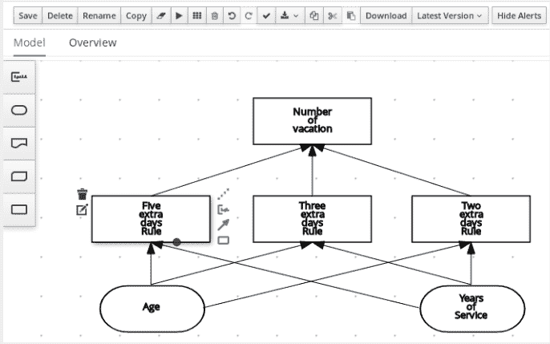

# 好消息:业务自动化与 SOA 无关

> 原文：<https://developers.redhat.com/blog/2019/02/20/good-news-business-automation-is-not-about-soa>

这不是一篇关于面向服务架构(SOA)的文章；它也不是一篇业务流程管理(BPM)文章。这篇文章是关于业务自动化如何改变你创建软件的方式。

起初，开发人员和架构师倾向于将 BPM 套件(或面向业务的架构)的使用与 SOA 联系起来。这种行为会立即导致对主题的不正确的偏见。

高管们明白:要么转型，要么被新的、颠覆性的、技术驱动的创业公司压制。在 2019 年，业务自动化是高管们为了提高业务绩效和降低成本而寻求的关键转型。然而，一些技术团队对此并不十分开放。为什么？

在过去，BPM 套件被用作服务、外部系统和人工任务的大型集中式编排器。2008 年发布的 JBoss SOA 平台就是这样一个集成平台的例子。不幸的是，这种应用不适合新的面向云和微服务的架构。好消息是业务自动化得到了发展，可以帮助团队在 DevOps 中达到下一步: *BizDevOps* 。

## 2019 年的业务自动化

既然学习新的东西永远不会太晚，如果我必须总结的话，这里是每个架构师和开发人员都应该知道的:

业务自动化是关于通过自动化和从应用程序代码中分离业务逻辑(规则和流程)来改进手动任务或手动决策。它是关于使业务团队更接近开发周期(BizDevOps ),并因此能够更快地处理客户反馈。

以下是通过诸如[Red Hat Process Automation Manager](https://developers.redhat.com/products/rhpam/overview/)(RHPAM)等产品使用流程驱动架构的最新技术优势的要点:

*   从应用程序代码中提取业务逻辑(完全适合微服务架构)。
*   为开发周期培育一种新文化:业务团队能够理解并负责创作业务资产，这些资产被转换成代码(稍后将详细介绍)。
*   规则和流程可以拥有独立和自动化的(管道)部署和交付生命周期。
*   可以提供包含业务信息的高级仪表板，以便首席管理人员能够就公司的未来做出决策。
*   无需繁重的代码编程就可以交付应用程序。

但是你可能会问，“非技术业务分析师如何才能更接近技术团队？他们不会编码！?"

## 开发人员创建代码。业务分析师创建业务资产。

商业理念是软件产生的原因。因此，可以理解的是，产生软件的知识驻留在业务分析师团队中。公平地说，业务分析师应该负责维护业务规则和流程(我不是指使用 Microsoft Word)。

但是业务分析师如何创建可消费的业务代码呢？

业务流程模型和符号 2 (BPMN2)、案例管理模型和符号(CMMN)以及决策模型和符号(DMN)等规范允许分析师使用直观的工具使用业务概念来创建资产。在幕后，这些工具将这些资产转换成代码；将代码作为 Maven 项目创建和维护；将代码编译成知识 Java 档案(KJAR)；并在 Process Engine 上部署代码，Process Engine 是 Red Hat Process Automation Manager 的一个组件，负责执行使用 Business Central 创建的业务资产。

## 你们可以说同一种语言

分析师们一直在流利地使用 BPM 符号进行业务流程建模。现在，Red Hat Process Automation Manager 发布了对案例管理(动态流程)和决策建模符号(DMN)的建模和处理的支持。以下决策模型是使用 DMN 建模器(在 7.2 版的技术预览版中可用)创建的:

[](https://developers.redhat.com/blog/wp-content/uploads/2019/01/Screen-Shot-2019-01-25-at-17.58.03.png)

尽管有些开发人员可能第一眼看不明白完整的规则，但是那些有其他角色并参与决策管理的人可以很容易地阅读决策图。换句话说，他们在设计业务规则和决策流时会感觉很舒服(不用编码！).

友好的界面，如 Red Hat Process Automation Manager 组件(称为 *Business Central* )使业务用户能够与开发人员并肩工作，创建现代应用程序。

不要混淆:这不是配器。这是业务规则的图形表示。一个*决策引擎*将负责**执行**规则。如果你想了解更多关于 DMN 的信息，请查看[对象管理小组(OMG)的网站](https://www.omg.org/dmn/) [，](https://www.omg.org/dmn/)负责维护该规范的实体。

## 试一试

如果您想尝试 RHPAM，我建议您按照这些简单的步骤在 Spring Boot 上运行一个完整的创作和执行环境:

1.进入[start.jbpm.org](http://start.jbpm.org)，点击“生成默认业务申请”

2.下载完成后，解压缩项目，进入文件夹，并执行启动脚本:

```
$ unzip business-application.zip
$ cd business-application-service
$ launch.sh clean install

```

3.在浏览器上访问 http://localhost:8090。

在[商业应用库](https://GITHUB.COM/BUSINESS-APPLICATIONS)中，有几个基于 Spring Boot 的商业项目的开源例子。

## 结论

业务自动化不是关于编排。它是关于增强 DevOps 文化没有触及的孤岛之间的沟通:技术和业务。向开源软件添加业务自动化是必须的。开放的文化促进全球知识的积累。这就是为什么可以找到大量关于 RHPAM 的上游版本[jBPM](https://github.com/kiegroup/jbpm)(Red Hat 支持的企业版)的公开文档。

jBPM 有一个由 Red Hat 工程师支持的活跃用户社区，他们可以帮助任何需要业务自动化信息的人。如果你需要(*chat.freenode.net:6667，#jbpm)* ，请随时通过 IRC 频道联系我们。

## 额外资源

以下是 Red Hat 开发人员博客上的相关文章:

*   [借助 Red Hat Process Automation Manager 实现 Spring Boot 业务流程自动化](https://developers.redhat.com/blog/2018/11/01/spring-boot-enabled-business-process-automation-with-red-hat-process-automation-manager/)
*   [在您的云中快速试用 Red Hat Process Automation Manager](https://developers.redhat.com/blog/2018/12/04/quickly-try-red-hat-process-automation-manager-in-your-cloud/)
*   [揭开 Red Hat 决策管理器和流程自动化管理器远程客户端的神秘面纱](https://developers.redhat.com/blog/2018/12/10/demystifying-the-red-hat-decision-manager-and-process-automation-manager-remote-client/)

*Last updated: February 19, 2019*