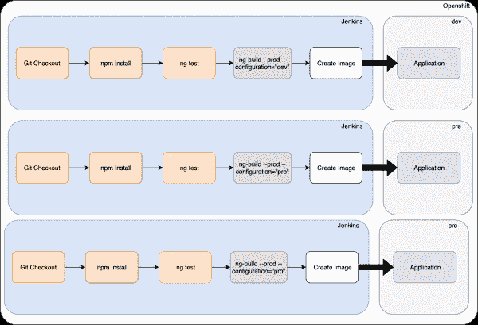
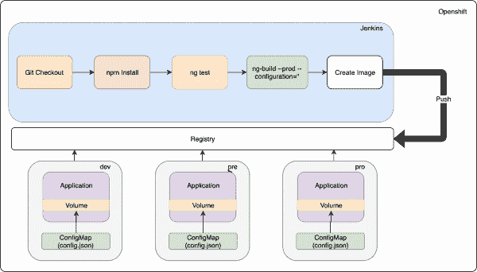

# 使用 Red Hat OpenShift 处理连续交付中的角度环境

> 原文：<https://developers.redhat.com/blog/2019/11/27/handling-angular-environments-in-continuous-delivery-with-red-hat-openshift>

在本文中，我将介绍我们如何部署相同的 [Angular](https://angular.io/guide/build) 应用程序映像，但是对每个环境使用不同的配置。然而，在我们开始之前，让我们回顾一下当我们谈论“连续交付”时我们指的是什么

## 什么是持续交付？

据[ContinuousDelivery.com](https://www.continuousdelivery.com):

> 持续交付是将所有类型的变更——包括新特性、配置、错误修复和实验——投入生产或用户手中的能力，以一种*可持续*的方式*安全*和*快速*。
> 
> 我们的目标是使部署——无论是大规模分布式系统、复杂的生产环境、嵌入式系统还是应用程序——成为可预测的、可按需执行的日常事务。
> 
> 我们通过确保我们的代码总是处于可部署的状态来实现这一切，即使面对成千上万开发人员的团队每天都在做出改变。因此，我们完全消除了传统上遵循“开发完成”的集成、测试和强化阶段，以及代码冻结。

## 如何处理角度环境

角度应用通常有一个配置，包含如下设置:

*   API 的 URL
*   基于环境的应用配置
*   日志

Angular 的 CLI 提供了在构建时设置环境的[应用环境](https://github.com/angular/angular-cli/wiki/stories-application-environments)。

在 Angular 中，如果您查看`angular.json`文件，您可以看到应用程序将如何构建及其特定于环境的设置:

```
"configurations": {
            "production": {
              "fileReplacements": [
                {
                  "replace": "src/environments/environment.ts",
                  "with": "src/environments/environment.prod.ts"
                }
              ],
```

`fileReplacements`部分允许您在构建时替换每个环境所需的文件。

我们可以通过查看代码推断出，当我们运行`ng build` `--configuration=production`时，`src/envrionments/envrironment.ts`文件被替换为`src/envrionments/envrionment.prod.ts`。因此，如果您将`environments/environment.ts`导入到您的应用程序中来访问环境变量属性，您将获得想要的值。

Angular 的 CLI 创造了所有的奇迹:

```
import { Component } from '@angular/core';  
import { environment } from './../environments/environment';

@Component({
  selector: 'app-root',
  templateUrl: './app.component.html',
  styleUrls: ['./app.component.css']
})
export class AppComponent {  
  constructor() {
    console.log(environment.<property>);
  }
  title = 'app works!';
}

```

但是这种设置不适合连续交付，因为我们对每个环境都有一个映像，如图 1 所示:

[](/sites/default/files/blog/2019/11/CD-Angular.png)Figure 1: Not the best setup for continuous delivery.">

然而，还有另一种方法。我们可以通过只构建一次映像，然后使用以下方法将其提升到其他环境来解决这个问题:

在`assets/config`下，创建一个 JSON 文件，其属性为:

```
{
    "server1": "url1",
    "server2": "url2",
    "server3": "url3"
}
```

创建新的提供程序:

```
ng g s providers/appConfig
```

将内容替换为以下内容:

```
import { Injectable } from '@angular/core';
import { HttpClient } from '@angular/common/http';
@Injectable({
  providedIn: 'root'
})
export class AppConfigService {
  private config: any;
  constructor(private http: HttpClient) { }
  public loadConfig() {
    return this.http.get('./assets/config/config.json')
      .toPromise()
      .then((config: any) => {
        this.config = config;
        console.log(this.config);
      })
      .catch((err: any) => {
        console.error(err);
      });
  }
  getConfig() {
    return this.config;
  }
}
```

用以下代码修改`app.module.ts`:

```
import { BrowserModule } from '@angular/platform-browser';
import { NgModule, APP_INITIALIZER } from '@angular/core';
import { AppComponent } from './app.component';
import { AppConfigService } from './providers/app-config.service';
import { HttpClientModule } from '@angular/common/http';
export function initConfig(appConfig: AppConfigService) {
  return () => appConfig.loadConfig();
}
@NgModule({
  declarations: [
    AppComponent
  ],
  imports: [
    BrowserModule,
    HttpClientModule
  ],
  providers: [{
    provide: APP_INITIALIZER,
    useFactory: initConfig,
    deps: [AppConfigService],
    multi: true,
  }],
  bootstrap: [AppComponent]
})

export class AppModule { }
```

在这里，我们添加了`APP_INITIALIZER`提供程序，以便在应用程序启动之前加载，这让我们可以在应用程序初始化之前进行配置。然后我们使用一个调用`appService.loadConfig()`的工厂。然后，如果我们想从组件中使用它，我们注入服务并获得配置:

```
import { Component } from '@angular/core';
import { HttpClient } from '@angular/common/http';
import { AppConfigService } from './providers/app-config.service';
@Component({
  selector: 'app-root',
  templateUrl: './app.component.html',
  styleUrls: ['./app.component.css']
})
export class AppComponent {
  title = 'app';
constructor(private http: HttpClient, private config: AppConfigService) {
console.log(this.config.getConfig());
}
```

## 如何应用红帽 OpenShift 中的配置

要使用我们的特定于环境的配置，我们只需要创建一个`ConfigMap`，然后从`ConfigMap`创建一个新卷(我们将假设应用程序已经部署，并使用`nginx`作为基本映像)

```
oc create configmap config --from-file=<configMapLocation>/config.json
```

现在，在部署配置中设置卷:

```
oc set volume dc/angular --add --type=configmap --configmap-name=config --mount-path=/opt/app-root/src/assets/config --overwrite
```

图 2 显示了我们的架构最终会是什么样子:

[](/sites/default/files/blog/2019/11/CD-Angular-Final.png)Figure 2: Our final architecture layout.">

我希望这篇文章对你有用。

*Last updated: July 1, 2020*