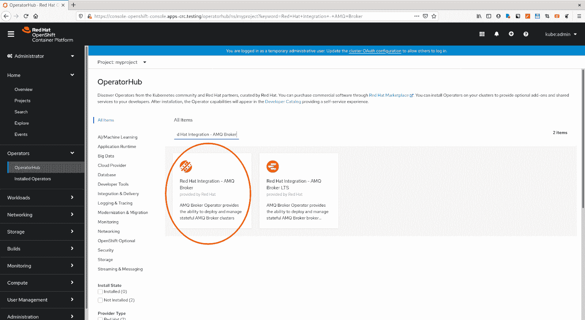
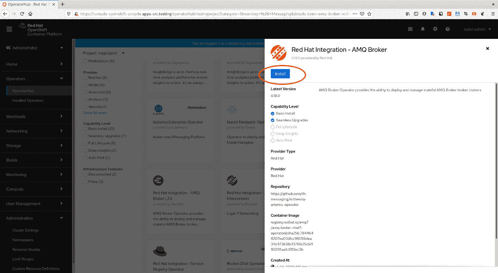
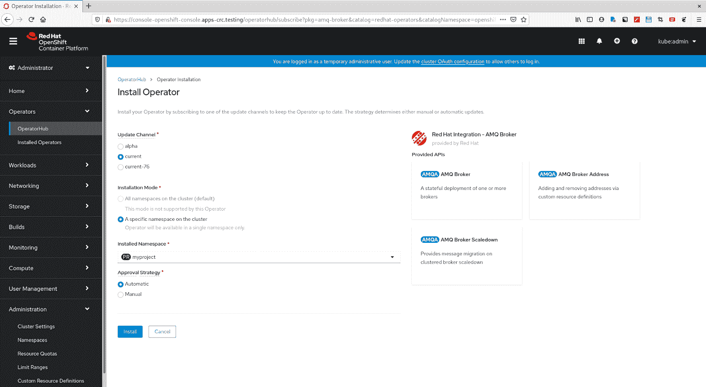
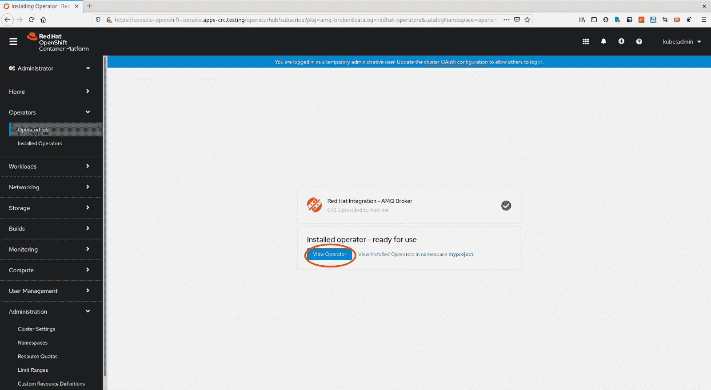
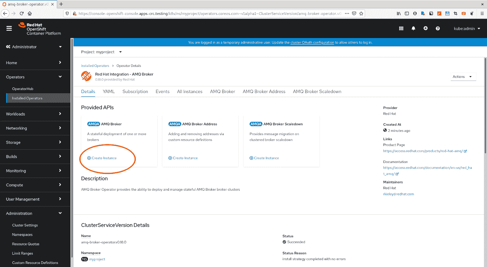
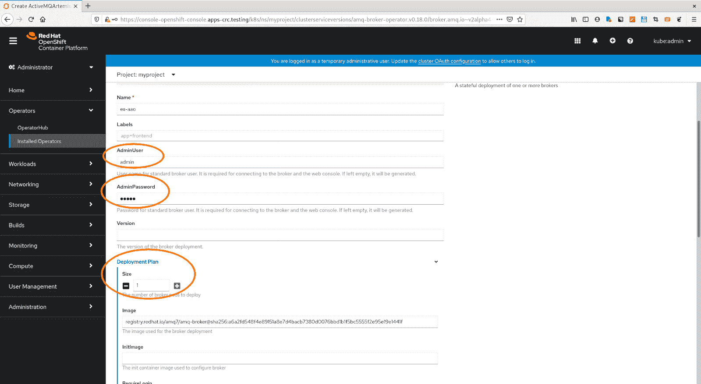

# OpenShift 上 AMQ 经纪人的 Hello World

> 原文：<https://developers.redhat.com/products/amq/hello-world-amq-broker>

## 从 OperatorHub 安装 AMQ 代理操作员

1.  启动您的 web 浏览器，打开一个新的选项卡，其中包含 Openshift 集群 web 控制台的管理员视图。以管理员身份登录控制台。
2.  登录后，点击左侧导航菜单中的**操作员**->-**操作员枢纽**。
3.  在 OperatorHub 页面顶部的项目下拉菜单中，选择要在 Operator 中安装的项目。
4.  页面上显示了许多不同的操作符。您可以使用页面顶部的关键字框**来快速找到 AMQ 经纪人。只需输入文本“红帽集成- AMQ 经纪人运营商”并点击结果运营商。

    > 注意,您可能会在筛选列表中找到两个运算符。在这种情况下,选择名为"红帽集成 AMQ 经纪运营商"的运营商。另一个是 AMQ 经纪人运营商的长期支持(LTS)版本

    **
5.  Click **Red Hat Integration - AMQ Broker Operator**. In the dialog box that appears, click **Install**.

    

    这将带您到 AMQ 经纪人运营商配置页面。

    

    > 目前，AMQ 代理操作者支持监视一个特定的名称空间

6.  Click **Install**.

    当操作器安装完成时，它将显示操作器可以使用了。

    

7.  点击**查看操作员**，将会看到已安装的 AMQ 经纪人操作员详情页面。

## 使用操作员创建 AMQ 代理实例

1.  At the operator details page, click **Create new instance **under the AMQ Broker box.

    

2.  On the creation page, you can configure the broker. Fill in **adminUser **and **adminPassword **with values `admin` and `admin`. Then, under **Deployment Plan**, change the **size **value to `1`. Finally, click the **Create** button at the bottom.

    > 如果您不为**管理员用户**和**管理员密码**提供值，它们将被随机生成。部署计划的大小默认值为 2。

    

3.  Then the console will show you the created Artemis instance with status. Click on the **Name** of the broker instance to see more details.

    

    详细信息页面将如下所示:

    

    它告诉你你已经成功地在 Red Hat OpenShift 中创建了一个 AMQ 经纪人 pod。

## 发送和接收消息

现在，您可以通过发送和接收一些消息来测试代理 pod。

1.  从命令行登录到 OpenShift 集群，并切换到安装了操作符的项目。检查 pod 状态:

    ```
    $ oc get pod

    amq-broker-operator-65545f7f6-xlrbx 1/1 Running  0   53m
    ex-aao-ss-0                         1/1 Running  0   44m

    ```

2.  登录经纪人平台 **ex-aao-ss-0** 。

    ```
    $ oc rsh ex-aao-ss-0
    ```

3.  使用 Artemis CLI 发送一些消息，例如

    ```
    $ amq-broker/bin/artemis producer --user admin --password admin --url tcp://ex-aao-ss-0:61616 --message-count
        100

    OpenJDK 64-Bit Server VM warning: If the number of processors is expected to increase from one, then you should
        configure the number of parallel GC threads appropriately using -XX:ParallelGCThreads=N
    Connection brokerURL = tcp://ex-aao-ss-0:61616
    Producer ActiveMQQueue[TEST], thread=0 Started to calculate elapsed time ...
    Producer ActiveMQQueue[TEST], thread=0 Produced: 100 messages
    Producer ActiveMQQueue[TEST], thread=0 Elapsed time in second : 1 s
    Producer ActiveMQQueue[TEST], thread=0 Elapsed time in milli second : 1796 milli seconds

    ```

4.  消费信息。

    ```
    $ amq-broker/bin/artemis consumer --user admin --password admin --url tcp://ex-aao-ss-0:61616 --message-count
        100

    OpenJDK 64-Bit Server VM warning: If the number of processors is expected to increase from one, then you should
        configure the number of parallel GC threads appropriately using -XX:ParallelGCThreads=N
    Connection brokerURL = tcp://ex-aao-ss-0:61616
    Consumer:: filter = null
    Consumer ActiveMQQueue[TEST], thread=0 wait until 100 messages are consumed
    Consumer ActiveMQQueue[TEST], thread=0 Consumed: 100 messages
    Consumer ActiveMQQueue[TEST], thread=0 Elapsed time in second : 0 s
    Consumer ActiveMQQueue[TEST], thread=0 Elapsed time in milli second : 61 milli seconds
    Consumer ActiveMQQueue[TEST], thread=0 Consumed: 100 messages
    Consumer ActiveMQQueue[TEST], thread=0 Consumer thread finished
    ```

恭喜你！您刚刚部署了 AMQ 代理操作符，并部署了一个代理来发送和接收消息。

有关详情和更多信息，请参考 AMQ 经纪人在线文档:

[https://access.redhat.com/documentation/en-us/red_hat_amq](https://access.redhat.com/documentation/en-us/red_hat_amq)

*Last updated: April 12, 2021*