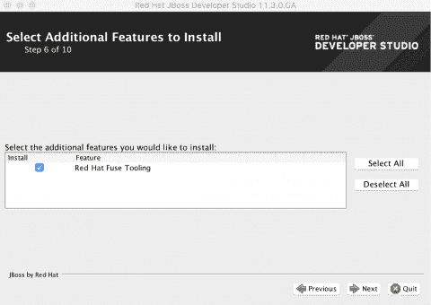
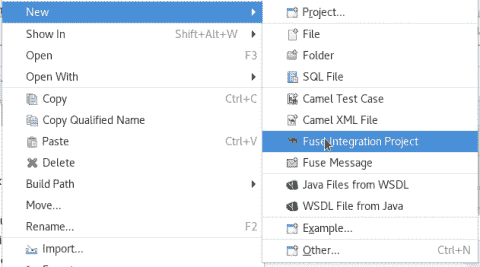
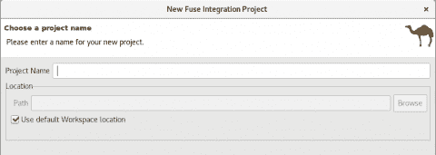
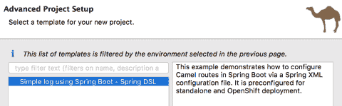

# 通过 CodeReady Studio 开发 Fuse 工具的 Hello World

> 原文：<https://developers.redhat.com/products/fuse/hello-world-fuse-tooling>

## **目标**

本教程将指导您完成使用 Red Hat Fuse 交付云原生集成应用程序的整个生命周期。本教程从安装和配置基于 *Red Hat CodeReady Studio* 的 Fuse 开发环境开始。一旦建立了开发环境，您将构建并部署一个容器化的集成到 OpenShift，Red Hat 的自助式容器应用程序平台。最后，您将体验 OpenShift 上 Fuse 的管理界面，了解如何大规模管理基于容器的集成。

## **设置您的开发环境**

1.  安装 Java SE 开发工具包(JDK)版本 11。我们建议使用开放的 JDK 或甲骨文 JDK。

2.  下载 [CodeReady Studio](https://developers.redhat.com/products/codeready-studio/download) 独立安装程序。

3.  运行 CodeReady 安装程序。

    1.  对于 **Mac/Windows** 开发主机:

        1.  导航到包含下载的 CodeReady Studio JAR 文件的文件夹。

        2.  右键单击下载的名为 codereadystudio-0.0.0 . ga-installer-standalone . jar 的安装程序(0 . 0 . 0 将被您下载的安装程序的版本号替换)

        3.  选择*用- Jar 启动器打开。*

    2.  对于 **Linux** 开发主机:

        1.  导航到包含 CodeReady Studio JAR 文件的文件夹。

        2.  执行名为$ Java-jar codereadystudio-0 . 0 . 0 . ga-installer-standalone . jar 的安装程序

    3.  按照屏幕上的说明继续安装过程。

*   在安装过程中，确保在向导的步骤 6 中安装 Red Hat Fuse 工具:

*   在安装向导的最后一页选择启动 Red Hat Developer Studio 的选项。

## **在 OpenShift 上创建一个新的 Fuse 项目**

*   我们将在我们的应用程序中使用 OpenShift 上内置的 Spring Boot 模板。在项目浏览器窗格中右键单击并选择 New > Fuse Integration Project。

*   在“选择项目名称”页面上，在“项目名称”字段中输入项目名称。单击“下一步”继续，并接受所有其他字段的默认值。

*   在“选择目标环境”页面上，选择“下一步”接受所有默认值。

*   在“高级项目设置”页中，您可以选择预定义的 Spring Boot 模板。
*   选择使用 Spring Boot -斯普林 DSL 的简单日志，然后单击完成。

*   创建项目后，您将能够在项目浏览器窗格中看到您的应用程序。现在，您已经准备好将应用程序部署为 OpenShift 上的容器原生集成了。本教程的其余部分将在课程[Fuse Tooling](/learn)中进行，这是一个交互式环境，您将通过 CodeReady Studio 的本地安装连接到该环境。

## **部署并测试您的应用**

*   继续学习课程[开始使用保险丝工具](https://developers.redhat.com/courses/modern-app-dev/fuse-hello-world/)。

*Last updated: October 14, 2022*