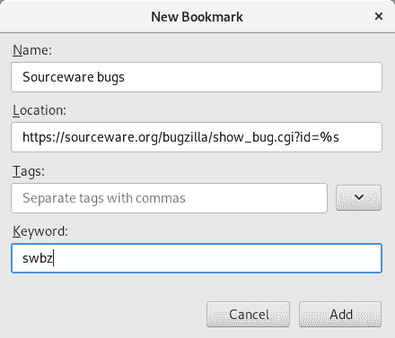

# Red Hat 开发人员如何使用 Firefox 关键字书签创建便捷的快捷方式

> 原文：<https://developers.redhat.com/blog/2019/03/06/how-red-hat-developers-can-create-handy-shortcuts-with-firefox-keyword-bookmarks>

Firefox 提供了一种简单的方式来增强浏览体验。通过一点点配置，您可以将 URL 栏变成一个简单的命令行工具来搜索 bug 数据库、Internet RFCs 和 CVE。当你有一个 bug 的 ID，但是你没有一个可以点击的链接时，这就很方便了。例如，如果你有一个 Red Hat Bugzilla ID，只需在 Firefox 的搜索栏中键入`rhbz <bugid>`，Firefox 就会直接带你找到 Bugzilla 中的那个 bug。

在本文中，在我展示了如何设置基于关键字的书签之后，我分享了我的快捷方式列表，我认为这些快捷方式对于使用 Red Hat 产品、项目和社区的开发人员来说会很方便。

要使用此功能，您必须使用完整的*新书签*对话框创建书签。您可以从书签窗口打开此对话框。按`Ctrl+Shift+O`进入，或从书签菜单中选择*显示所有书签*。在该窗口中，您需要在*组织*菜单中选择*新建书签……*，会出现如下对话框。

关键字书签有一个 URL，其中包含一个`%s`序列(就像在`printf`中一样)和一个关键字名称。当关键字输入到 URL 栏中时，不会直接使用 URL。相反，关键字后面的参数被拼接在 URL 中，而不是在`%s`占位符中。比如一个带有网址`https://example.com/%s`的`example`关键词书签会把地址栏命令`example sample.html`变成`https://example.com/sample.html`。

我发现下面的关键字书签特别有用。当有人在 IRC 上提到一个标识符时，它们允许我快速访问信息，而不用粘贴一个完整的超链接(或者一个指向不提供我想要查看的信息的不同资源的超链接)。

| 关键字 | 统一资源定位器 |
| `swbz` | `https://sourceware.org/bugzilla/show_bug.cgi?id=%s` |
| `rhbz` | `https://bugzilla.redhat.com/bugzilla/show_bug.cgi?id=%s` |
| `gcc` | `https://gcc.gnu.org/%s` |
| `deb` | `https://bugs.debian.org/%s` |
| `rfc` | `http://tools.ietf.org/html/rfc%s` |
| `koji` | `https://koji.fedoraproject.org/koji/search?match=glob&type=package&terms=%s` |
| `bzsourceware` | `https://bugzilla.redhat.com/buglist.cgi?f1=ext_bz_bug_map.ext_bz_bug_id&f2=external_bugzilla.url&o1=equals&o2=equals&query_format=advanced&v2=https%3A%2F%2Fsourceware.org%2Fbugzilla&v1=%s` |

第一个条目适用于 Sourceware Bugzilla 中的 bug，它涵盖了 binutils、glibc、elfutils 和其他一些 bug。例如， [`swbz 18665`](https://sourceware.org/bugzilla/show_bug.cgi?id=18665) 显示了一个 glibc bug，由于我们为安全 bug 创建了 CVE 别名，所以您可以使用 [`swbz CVE-2015-7547`](https://sourceware.org/bugzilla/show_bug.cgi?id=CVE-2015-7547) 得到相同的 bug。

以类似的方式工作，但是使用 Red Hat Bugzilla 实例，它包含 Fedora 和大多数 Red Hat 产品。比如 [`rhbz CVE-2015-7547`](https://bugzilla.redhat.com/bugzilla/show_bug.cgi?id=CVE-2015-7547) 导致红帽产品安全维护的漏洞 bug。

`gcc`有点不同。查看 bug 需要使用 [`gcc PR89225`](https://gcc.gnu.org/PR89225) 。但是你也可以使用 [`gcc r268597`](https://gcc.gnu.org/r268597) 来查看 Subversion 中的具体修订。(这依赖于这样一个事实，即`gcc.gnu.org` web 服务器在根位置重定向了`PR*`和`r*`URL。)

使用`deb`快捷键可以查看单个 bug，如 [`deb 903514`](https://bugs.debian.org/903514) ，或者使用 [`deb libc6`](https://bugs.debian.org/libc6) 或 [`deb src:glibc`](https://bugs.debian.org/src:glibc) 查看二进制或源码包的所有 bug。

可以使用 [`rfc 1035`](http://tools.ietf.org/html/rfc1035) 查看 IETF RFCs。

如果你想在 Koji (Fedora 的构建系统)中定位一个包，你可以使用类似 [`koji binutils`](https://koji.fedoraproject.org/koji/search?match=glob&type=package&terms=binutils) 的东西。

`bzsourceware`允许您在 Red Hat Bugzilla 中对 Sourceware bugs 执行反向查找(这些 bug 已被手动链接)。 [`bzsourceware 18665`](https://bugzilla.redhat.com/buglist.cgi?f1=ext_bz_bug_map.ext_bz_bug_id&f2=external_bugzilla.url&o1=equals&o2=equals&query_format=advanced&v2=https%3A%2F%2Fsourceware.org%2Fbugzilla&v1=18665) 再次提供了关于 glibc 漏洞的信息，用作上面的例子。这种关键字书签可能特别强大，但由于它们是从本质上的 web 应用程序实现细节中派生出来的，它们可能会随着时间的推移而腐烂，需要偶尔调整才能保持工作。

以下访问客户入口网站信息的快捷方式是 Red Hat 特有的:

| 关键字 | 统一资源定位器 |
| `cve` | `https://access.redhat.com/security/cve/%s` |
| `case` | `https://access.redhat.com/support/cases/#/case/%s` |

[`cve CVE-2015-7547`](https://access.redhat.com/security/cve/CVE-2015-7547) 显示了客户门户中同样的漏洞。(这些资源包含面向客户的漏洞信息。)如果您有有效的订阅和案例号，您可以在`case`后输入，您将被定向到该案例的案例概述。(注意，这是面向客户的视图；支持部门的 Red Hat 员工可以使用不同的 URL 访问后端，不幸的是，也可以使用不同的 id。

当然，有许多 Red-Hat 内部资源(使用内部的、非公共的 URL)可以用同样的方式访问。

我希望 Firefox 的这个小功能对你和对我一样有用。