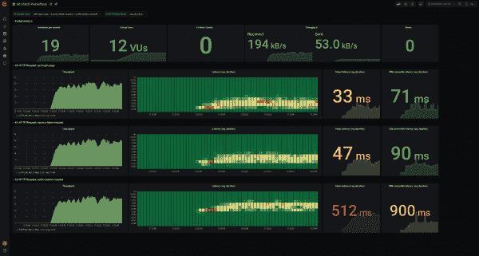

# 如何为 Red Hat 的单点登录技术确定项目规模

> 原文：<https://developers.redhat.com/articles/2021/06/07/how-size-your-projects-red-hats-single-sign-technology>

[Red Hat 的单点登录(SSO)技术](https://access.redhat.com/products/red-hat-single-sign-on)是一种身份和访问管理工具，包含在基于著名的 [Keycloak](https://www.keycloak.org/) 开源项目的 Red Hat 中间件核心服务集合中。与其他 Red Hat 产品一样，用户必须获得订阅，订阅价格根据用于部署产品的核心或 vCPU 的数量而定。

这给像我这样的售前工程师提出了一个有趣的问题。为了帮助我的客户获得正确的订阅数量，我需要勾画出目标架构，并计算他们需要多少个内核。如果有现成的性能基准，这就不是问题；然而，事实并非如此。

本文将帮助同事和客户更精确地评估他们的 SSO 项目。我们将检查我运行的性能基准，我如何设计它们，我收集的结果，以及我如何得出结论来确定我的 SSO 项目的大小。

## 性能基准:构建问题

性能基准测试是一个广泛的话题，如果您没有正确地构建问题，很容易回答一个没有被问到的问题。因此，对于我的情况，我想回答以下问题:

*   哪种架构选择对使用的内核数量影响最大？
*   用户会话的哪个部分对使用的内核数量影响最大？打开会话？续订令牌？验证令牌？
*   从典型的服务器级硬件来看，我们可以期望每个内核每秒处理多少事务(TPS)？

**注**:低端服务器 CPU 和高端服务器 CPU 之间，在单线程性能上可以有明显差距。因此，我对精确的数字不感兴趣，而是对数量级感兴趣(例如，1、10、100 或 1,000 TPS？).

## 规划绩效评估

在 Keycloak 存储库中，有一个评估 Keycloak 性能的[测试套件](https://github.com/keycloak/keycloak/tree/master/testsuite/performance)。经过仔细研究，我决定不使用它，原因有两个:

*   它没有回答我在上一节中列出的问题。
*   测试套件与 Keycloak 开发环境紧密耦合，因此如果需要的话，很难在客户站点上重用。

我将我的方法分为四个主要步骤:

1.  设置 SSO 和底层服务(数据库、负载平衡器等。).
2.  用用户、客户机和领域填充 SSO 数据库。
3.  在 SSO 服务器上生成负载。
4.  收集性能数据。

每个客户都是不同的，有时客户站点可能需要各种工具和技术。考虑到这一点，我将这四个步骤设计成松散耦合的，因此您可以调整每个步骤以使用不同的工具或技术。

只要有可能，我就重用 [Keycloak 领域文件](https://access.redhat.com/documentation/en-us/red_hat_single_sign-on/7.4/html/server_administration_guide/export_import)作为 pivot 格式。它由加载数据库的脚本和在 SSO 服务器上生成负载的负载测试工具使用。

为了设置 SSO 和底层服务，我选择使用将组件部署为 Podman 容器的[ansi ble playbook](https://github.com/nmasse-itix/keycloak-loadtesting-setup/tree/33168b763c3f27486d0e883b7b008783835f3b22)。新团队成员很容易使用和理解它们；此外，它们在客户网站上被广泛使用。

我创建了一个名为 [kci](https://github.com/nmasse-itix/keycloak-import-realm/tree/v0.1.4) 的专用工具来加载包含用户、客户机和领域的数据库。

为了在 SSO 服务器上生成负载，我使用了 [K6](https://github.com/nmasse-itix/keycloak-loadtesting-k6/tree/2475c668116b2591fd9c88fb6caa5c9d77c66e18) ，这是一个用 Go 编写的新颖的性能测试工具，它使用普通 JavaScript 进行测试定义。(不熟悉的可以看看 [k6.io](https://k6.io/) 。)

测试结果由 Prometheus 收集，并通过 Grafana 呈现，如图 1 所示。关于 K6、普罗米修斯和格拉夫纳的初级读本，我推荐阅读这篇文章。

K6, Grafana and Prometheus conducting a benchmark on Red Hat SSO.

Figure 1: K6, Grafana, and Prometheus conducting a benchmark on SSO.

## 设计基准场景

场景是性能基准的关键部分。精心选择的场景将有助于回答我们之前提出的问题。人们应该设计一些场景作为科学实验:

*   选择设置基线并确保性能在任何时间点保持不变的控件。
*   通过一次改变控制实验的一个(且仅一个)参数来制作实验。该实验将反映该参数对性能的影响。

对于我的控制实验，我选择以下配置作为基线:

*   两台 SSO 服务器，每台都有一个专用的物理核心。
*   SSO 服务器由 PostgreSQL 实例提供支持。
*   在 SSO 服务器的前面设置了 Traefik 反向代理，以分散负载。
*   该数据库加载了分布在 5 个领域的 5，000 个用户和 500 个客户端。
*   没有任何特定的性能调整应用于这些组件。

然后从这个基线，我设计了以下场景:

*   **离线令牌:**与基线相同，但请求离线令牌而不是常规令牌。
*   **MariaDB:** 与基线相同，但是用 MariaDB 代替 PostgreSQL。
*   **一个节点:**与基线相同，但是只有一个 SSO 实例有两个物理核心。
*   **大小 S:** 与基线相同，但数据库中的数据较少(1 个领域中有 100 个用户和 10 个客户机)。
*   **大小 L:** 与基线相同，但是数据库中有更多的数据(100，000 个用户和 10，000 个客户端分布在 10 个领域中)。
*   **具有 1 次迭代的 PBKDF2:**与基线相同，但是 pbk df 2 配置为 1 次迭代而不是 27，500 次迭代。
*   **LDAP:** 与基线相同，但是用户加载到 OpenLDAP 实例中，而不是 SSO 数据库中。

在基线和刚才描述的场景中，我选择收集以下指标:

*   用户打开其 SSO 会话:有多少个 TPS？
*   用户刷新其访问令牌:多少 TPS？
*   使用 tokeninfo 端点对用户令牌进行自省:有多少个 TPS？
*   使用 userinfo 端点自省用户令牌:有多少个 TPS？

我选择只关注每秒的事务数量，因为这是一个客观的衡量标准(你能得到的最大值)。有时会在客户网站上讨论延迟数字，但我们对此无能为力。延迟是指服务请求所需的最小 CPU 周期数，只有当瓶颈(如 CPU 争用)开始出现时，延迟才会增加。换句话说:有一个典型的延迟，当超过一个临界点时，延迟开始飙升。只要你没有越过那一点，就没有什么有趣的事情发生。

我在一台裸机服务器上运行了性能基准测试:一台惠普第八代微服务器，配有[至强 E3-1240v2 CPU](https://www.cpubenchmark.net/cpu.php?cpu=Intel+Xeon+E3-1240+V2+%40+3.40GHz&id=1190) 和 16GB 内存。至强 CPU 中只有两个物理内核专用于 SSO 服务器。其余的分配给了负载平衡器、数据库和操作系统。

## 关于 PBKDF2 函数的注释

在下一节中，您将看到吞吐量的大幅增加，这取决于用户密码的存储位置。让我们仔细看看基于密码的密钥派生函数 2 (PBKDF2)函数。

默认情况下，Red Hat 的单点登录工具将用户密码存储在其内部数据库中，并使用 PBKDF2 函数对这些密码进行哈希处理。这个函数的目的是占用大量的 CPU 资源来降低暴力攻击的速度，使其代价过高或时间过长而不实用。可以通过配置迭代次数来调整这种保护的强度。

默认情况下，SSO 执行 27，500 次 PBKDF2 迭代。维基百科告诉我们更多关于迭代次数的安全选择。

**注意**:在 2000 年编写标准时，推荐的最小迭代次数是 1000 次，但是该参数被设计为随着时间的推移而增加，以与 CPU 速度保持一致。2005 年的 Kerberos 标准推荐 4096 次迭代；据报道，苹果公司在 iOS 3 上使用了 2000 英镑，在 iOS 4 上使用了 10000 英镑。2011 年，LastPass 对 JavaScript 客户端使用了 5000 次迭代，对服务器端哈希使用了 100000 次迭代。

这意味着您无法以安全的方式存储密码，同时在用户会话打开期间每个物理内核表现出大量的 TPS。根据定义。

但是，您可以将 SSO 配置为使用来自另一个存储库(例如，您的 Active Directory、OpenLDAP 或 Red Hat 目录服务器)的密码，并依赖这些存储库的安全机制。这将是一个两全其美的方法。

## 结果

基于这些结果，我能够得出以下结论:

*   SSO 项目的关键方面是每秒打开的用户会话数量以及用户密码的存储位置。
    *   如果用户密码存储在第三方系统(例如 LDAP 目录)中，或者如果 PBKDF2 函数配置为一次迭代，SSO 可以支持每个物理内核大约 75 TPS。
    *   否则，SSO 在每个物理内核上只能维持略低于 10 TPS 的速度。
*   更新令牌的成本更低:SSO 可以维持每个物理内核大约 200 TPS。
*   内省令牌的成本相当低。SSO 可以支持每个物理内核大约 1，400–1，1,700 TPS1，400 TPS 使用 tokeninfo 端点，1，700 TPS 使用 userinfo 端点。
*   数据库的选择对性能没有显著影响。
*   使用离线令牌而不是常规令牌对性能有轻微影响(10%的损失)。
*   当不需要高可用性时，单节点设置显示每个物理核心的 TPS 数量增加了 20%。

**注**:一个物理核=两个线程=两个 vCPU。

查看包含完整结果集的存储库。

## 结论

本文中介绍的 SSO 性能基准绝不是这个主题的确定答案。相反，它应该被认为是帮助社区、Red Hatters 和我们的客户更好地确定他们的单点登录项目的初始工作。

需要做更多的工作来测试其他假设，例如外部 [Red Hat Data Grid](/products/datagrid/overview) 服务器的影响，各处可能的优化，通过大量节点实现线性可伸缩性的可能性，甚至是在 [Red Hat OpenShift](/products/openshift/overview) 内部署的影响。

*Last updated: August 15, 2022*