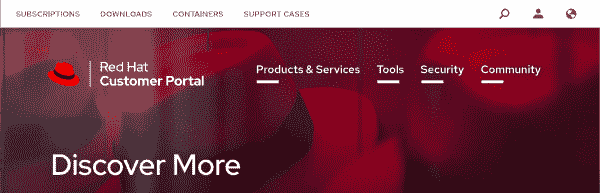
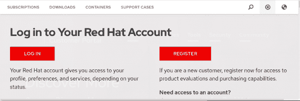
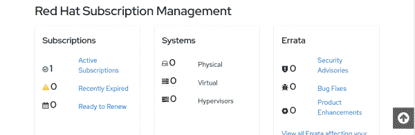
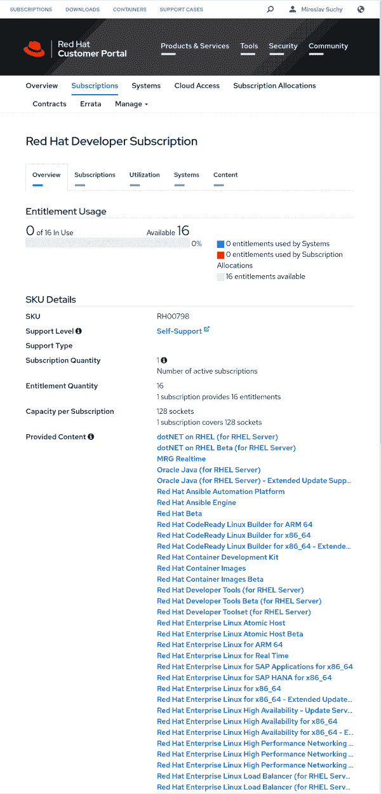

# 如何激活免费的 Red Hat Enterprise Linux 订阅

> 原文：<https://developers.redhat.com/blog/2021/02/10/how-to-activate-your-no-cost-red-hat-enterprise-linux-subscription>

几周前，我们宣布了新的免费 Red Hat Enterprise Linux (RHEL)订阅服务。这里有一个快速指南，适用于那些想要建立订阅并立即开始使用的开发人员。

## 第一步:确保你有一个红帽账户

你已经有一个红帽帐户了吗？如果没有，您需要设置一个。导航到 [Red Hat 客户门户](https://access.redhat.com/)并点击右上角的账户(个人)图标，如图 1 所示。

[](/sites/default/files/blog/2021/02/dl1.png)

Figure 1: Click the account icon in the upper-right corner.

您将看到登录或注册的选项，如图 2 所示。

[](/sites/default/files/blog/2021/02/dl2.png)

Figure 2: Log in or register for a new account.

如果您还没有帐户，请点击**注册**并按照说明进行操作。您将在一分钟内完成注册。

## 第二步:下载免费的 RHEL

导航到 [Red Hat Developer](https://developers.redhat.com/) 并登录您的 Red Hat 帐户。点击页面顶部的 **Linux** 链接，然后**下载 RHEL** 。一旦你进入 [RHEL 下载页面](https://developers.redhat.com/products/rhel/download)，你会看到下载 RHEL ISO 镜像的选项，目前版本为 8.3.0。

你现在可以免费使用 RHEL。或者，你可以建立一个[亚马逊 Web 服务弹性计算云(AWS EC2) RHEL 实例](https://dzone.com/articles/set-up-aws-ec2-instance-redhat-enterprise-linux-8)或者以其他方式使用它。

## 步骤 3:注册您的 RHEL 订阅

在安装了 Red Hat Enterprise Linux 的系统上，运行

```
subscription-manager register --username=admin --password=secret

```

您的系统现在可以使用 Red Hat 的所有内容，包括最新的安全勘误表。

## 关于你的免费 RHEL 订阅

您可以在 [Red Hat 订阅管理页面](https://access.redhat.com/management)上查看您的免费 RHEL 订阅的详细信息，如图 3 所示。

[](/sites/default/files/blog/2021/02/dl3.png)

Figure 3: Subscription details on the Red Hat Subscription Management page.

点击**活动订阅**，然后点击**订阅名称**和**红帽开发者订阅**。您将看到图 4 中的页面，它描述了您的 Red Hat Developer 订阅。

[](/sites/default/files/blog/2021/02/dl4.png)

Figure 4: Red Hat Developer subscription details.

## 结论

注册免费 RHEL 订阅是一个简单的三步过程。一旦您的订阅激活，您可以以各种方式使用您的 Red Hat Enterprise Linux 实例，包括将其作为 AWS EC2 RHEL 实例运行。

*Last updated: October 7, 2022*