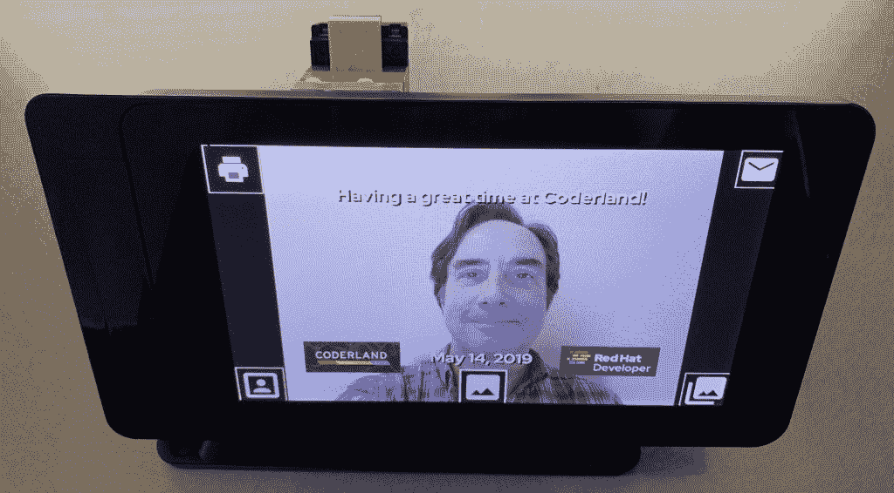
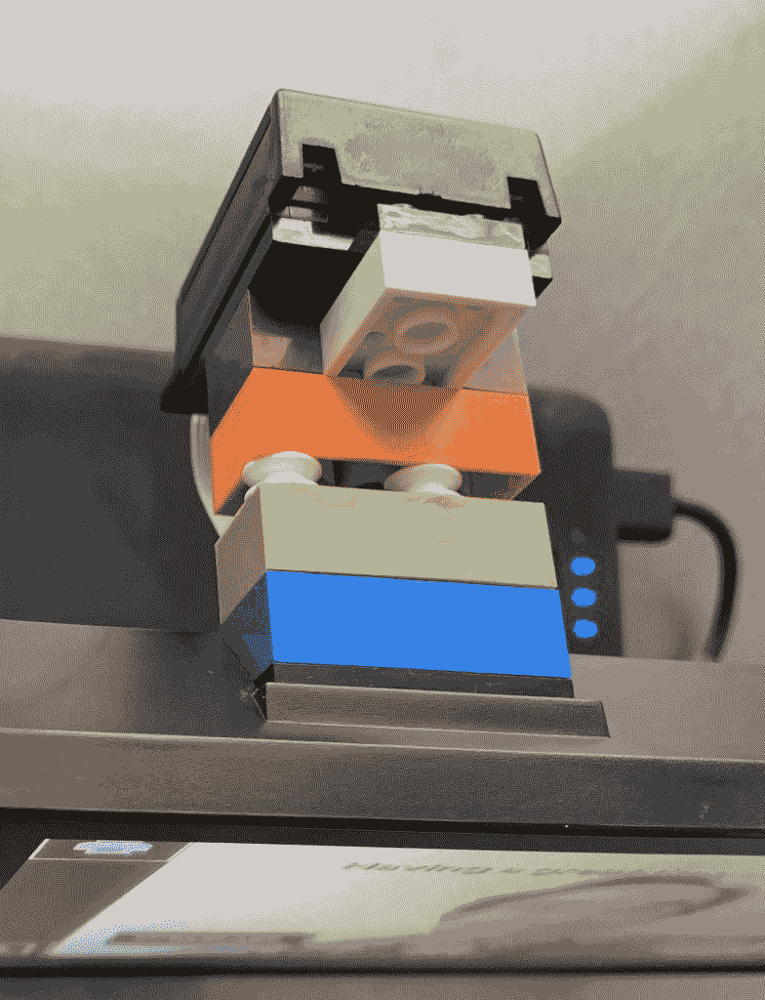
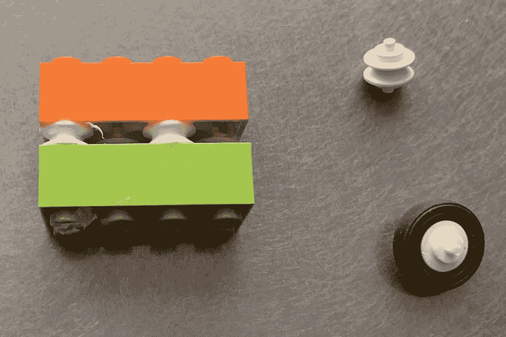
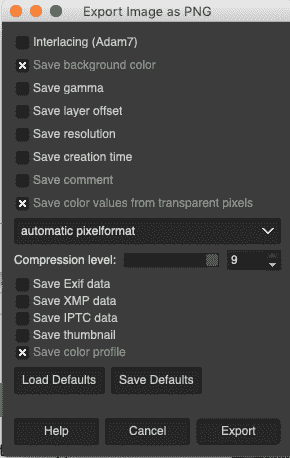
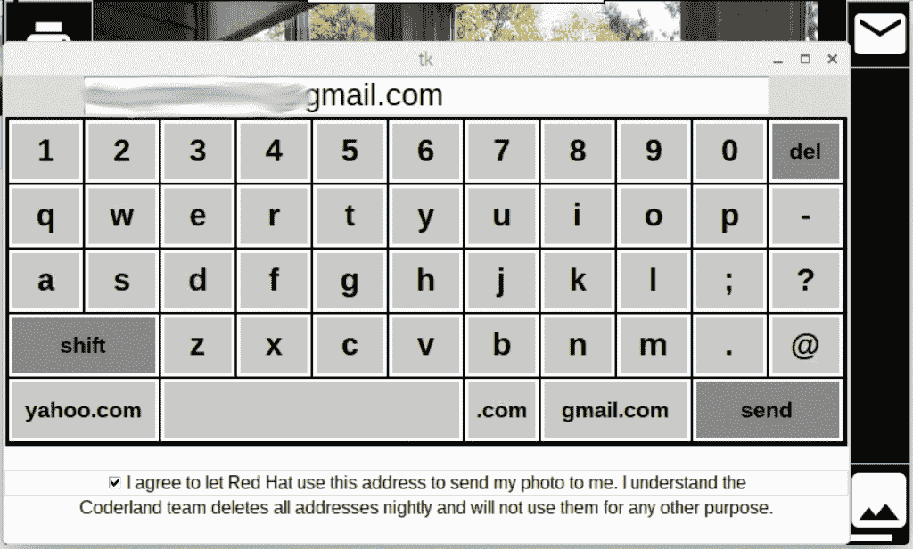
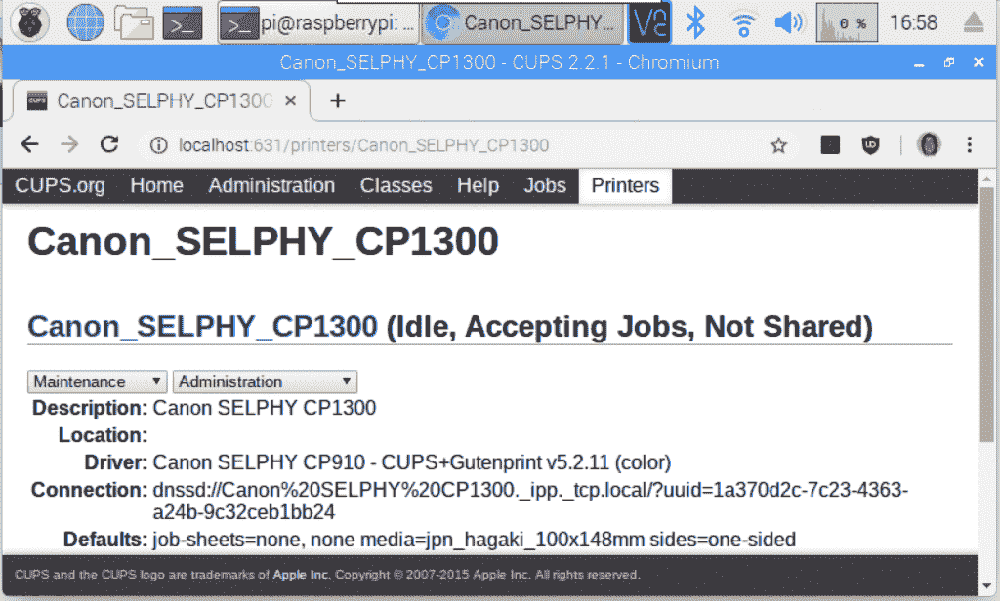
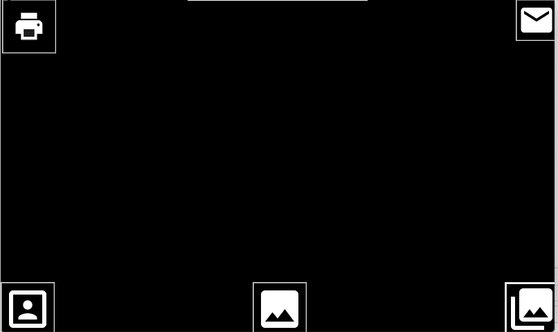

# 如何建立一个树莓派照片亭

> 原文：<https://developers.redhat.com/blog/2019/06/03/how-to-build-a-raspberry-pi-photo-booth>

在最近的[红帽峰会](https://www.redhat.com/en/summit/2019)上的 [Coderland](https://developers.redhat.com/coderland/) 展台都是关于[无服务器计算](https://developers.redhat.com/topics/serverless-architecture/)在[编译驱动](https://developers.redhat.com/coderland/serverless/)中的实现。如果您还没有浏览过这个示例(您确实应该浏览一下)，该代码通过在来自网络摄像头的图像上叠加 Coderland 徽标、日期戳和消息来创建一张纪念照片。我们认为为展台制作一个[树莓派](https://opensource.com/tags/raspberry-pi)版本会很有趣，这样我们就可以为与会者提供免费纪念品。这是成品的外观:



这里显示的情况下，结合了树莓派，触摸屏和摄像头。如您所见，这种设置产生的结果类似于编译驱动程序中的 [Java](https://developers.redhat.com/topics/enterprise-java/) 代码。

## 零件目录表

这是我用来建造一切的东西:

*   [一款树莓派 3B+](https://www.raspberrypi.org/products/raspberry-pi-3-model-b-plus/) (最新款)
*   [官方树莓派触摸屏](https://www.raspberrypi.org/products/raspberry-pi-touch-display/)
*   [官方树莓 Pi 相机模块](https://www.raspberrypi.org/products/camera-module-v2/)
*   [一个 SmartiPi Touch case，用来装上面的三样东西](https://smarticase.com/collections/all/products/smartipi-touch?variant=11864926209)
*   [一个 Tzumi PocketJuice 8，000 mAh 便携式电池组，为一切供电](https://tzumi.com/collections/power-banks-1/products/pocketjuice-endurance-ac-8-000-mah-portable-charger-black)
*   [一台佳能 Selphy CP1300 打印机](https://www.usa.canon.com/internet/portal/us/home/products/details/printers/mobile-compact-printer/cp1300-bkn/selphy-cp1300)

有了这些东西，我们有了一个手持照相亭，可以在背景前给与会者拍照，让他们看起来像是骑在编译驱动上。关于无服务器计算的谈话的一个很好的结尾。我们也有人在展位前停下来问“那是什么东西？”不管你用它做什么，人们都喜欢覆盆子酱。

## 组装硬件

第一项任务是组装箱子。幸运的是， [Smarticase](https://smarticase.com/) 的人给[提供了一个涵盖一切](https://www.youtube.com/watch?v=XKVd5638T_8)的 YouTube 视频。你把触摸屏插在盒子里，然后装上树莓派。包括一根超长的摄像头电缆来连接两者。Pi 可以直接固定在外壳上，也可以用支架固定。我使用了括号方法，因为这样可以很容易地取出 Pi 并更改它的 SD 卡。最后，外壳包括一个小支架来固定相机模块。这是用乐高积木贴在箱子上的:



一个小小的乐高破解:我需要反转积木上的螺柱的方向，这样相机就可以背向屏幕。(事实证明，砖块顶部的小块东西叫做墙筋，底部的小孔叫做管子。你每天都学到一些东西。)多亏了砖博主的这篇文章，我找到了一个简单的方法。我拿了一些乐高轮子，去掉橡胶轮胎部分，然后用轮子连接两块积木。为了确保它不会脱落，我用强力胶把所有东西粘在一起:



## 软件

硬件建好之后，我把最新的 [Raspbian](https://www.raspberrypi.org/downloads/) 安装到一个新的 SD 卡上。我用的是 32GB 的卡，虽然 8GB 的卡(如果你能找到这么小的卡)会有足够的空间。接下来，我克隆了回购 [TouchSelfie-extended](https://github.com/laurentalacoque/TouchSelfie-extended) ，这是另一个 photo booth 项目的分支。有相当多的 RPi 摄影亭，但这是我们需要的最佳匹配。说到这里，我可能应该提一下我们的要求。我们需要照相亭来:

*   拍照并在这些图像上叠加各种东西。
*   让人们用电子邮件把他们的照片发给自己。
*   展示隐私声明，让人们知道我们如何使用他们的信息(剧透:我们没有)。
*   使用便携式照片打印机创建纪念图片。

正如你对 Raspberry Pi 软件的期望，TouchSelfie 扩展包是用 Python 编写的。一旦您克隆了 repo，运行`setup.py`脚本来启用您想要的选项，例如通过电子邮件发送、打印或上传您拍摄的照片。

### 设置覆盖图像

`setup.py`脚本自动化了一些配置，但是还有其他值需要在文件`configuration.json`中设置。要在您拍摄的照片上叠加图像，请为`logo_file`指定一个值:

```
"logo_file": "/home/pi/Documents/TouchSelfie-extended/scripts/Summit Wednesday Overlay.png",
```

设置此值后，软件包会将文件`Summit Wednesday Overlay.png`叠加在照片上。

*告白*:覆盖图像包括问候、硬编码日期以及 Coderland 和 Red Hat 开发者计划徽标。最初的 Java 版本分别生成了这些东西，但是您的作者没有 Python 技能来完成这样的(图像)魔术。

解决这些约束需要一些时间，但结果是您不能在要用作叠加图的 PNG 文件中存储任何 EXIF 数据。以下是有效的 GIMP 设置:



### 启用电子邮件

为了启用电子邮件，我不得不跳过一些 Google/OAuth 的关卡，获得允许代码通过我的 Gmail 帐户发送图像的凭证。这些都存储在一个名为`google_credentials.dat`的文件中。电子邮件设置的其余部分包括对配置文件的简单更改:

```
"email_body": "We're glad you stopped by the booth at Red Hat Summit 2019\. Here's your souvenir photo - Enjoy!\n", 
"email_subject": "Thanks for visiting Coderland!", 
"enable_email": true, 
"gmail_user": "xxxxxxxxxxxxxxxxxx@gmail.com",
```

### 创建隐私声明

设置了电子邮件后，我们需要一份隐私声明，让与会者知道他们的数据只会用于发送照片。我向现有的 Tk Checkbox 小部件添加了一个 Tk 标签。我还改变了逻辑，这样，除非用户点击复选框，否则照片不会被发送。屏幕键盘看起来像这样:



如果与会者用屏幕键盘键入他们的电子邮件地址，点按复选框，然后点按“发送”,照片就会进入他们的收件箱。(毫无疑问，在到达时会与他们所有的朋友和爱人分享。)

### 配置打印机

让打印机工作需要在树莓皮上设置杯子。设置完成后，CUPS 管理控制台会在我们的无线网络上找到打印机:



我无法让内置在原始代码中的 print 命令工作，所以我只是用一个对`lp`的系统调用来替换它:

```
printCommand = 'lp -o raw -o media=postcard -d Canon_SELPHY_CP1300 ' + self.last_picture_filename;
os.popen(printCommand);
```

这里的麻烦是用`media=postcard`指定纸张大小是完全没有记录的。在`lp`手册页中只提到了值`a4`、`letter`和`legal`。在我发现另一个打印机驱动程序源代码中的`postcard`设置之前，Raspberry Pi 中的图像无法正确打印。只是每个项目中突然出现的那些意想不到的生产力杀手之一。

## 成品

最终照相亭打开时会显示以下界面:



底部中间的按钮拍摄照片。如您所料，打印机和信封图标打印并通过电子邮件发送修改后的图片。本文中的第一张图片展示了你拍照后的界面。(FWIW，右下角的按钮允许你拍摄拼贴照片或生成动画 GIF，但这两者都不可打印。一个更有野心的程序员会删除它们。)

## 摘要

就像任何一个 Raspberry Pi 项目一样，如此小而便宜的硬件能做如此酷的事情，令人惊讶。包括打印机和电源模块在内，整个设备的总成本在税前和运费之前约为 265 美元。在 Red Hat Summit 的展台上展示这个很有趣，但你也可以在更私人的活动中，比如派对和婚礼上，展示这个。如果你建立了一个，让我们知道进展如何。然后给我们发个图！

*Last updated: May 30, 2019*