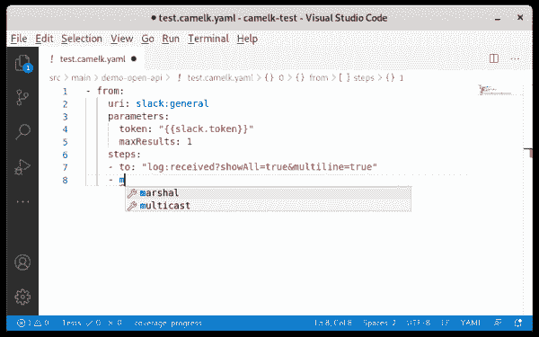
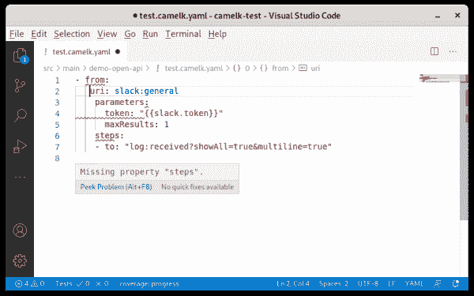
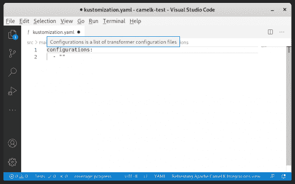

# 如何配置 YAML 模式以简化文件编辑

> 原文：<https://developers.redhat.com/blog/2020/11/25/how-to-configure-yaml-schema-to-make-editing-files-easier>

YAML 是一个友好的数据序列化标准，适用于所有编程语言。虽然配置文件通常是在 YAML 定义的，但它甚至可以用作编程语言，像谷歌的[工作流语言、](https://cloud.google.com/workflows/docs/reference/syntax)或 [Apache Camel K](https://camel.apache.org/camel-k/latest/languages/yaml.html) 。

它的优点是没有任何支架，视觉上很轻便。缺点之一是编辑 YAML 文件可能并不总是容易的。例如，在错误的缩进层次写标签可能很难被发现。为了帮助编辑，可以提供一个 YAML 模式，供大量集成开发环境(ide)使用。不幸的是，这种做法并不普遍。因此，用户会浪费时间寻找丢失或多余的空间以及浏览文档。

在本文中，您将发现提供 YAML 模式的好处，以及如何使它可供所有用户使用，从而更容易编辑 YAML 文件。

## YAML 图式

提供描述 YAML 文件类型结构的模式是可能的。您可能不容易找到该规范，因为它依赖于 [JSON 模式规范](https://json-schema.org/)。YAML 模式允许几个 ide 和编辑器提供代码完成、关于悬停的文档和文件验证，包括 [Eclipse 桌面 IDE](https://marketplace.eclipse.org/content/wild-web-developer-html-css-javascript-typescript-nodejs-angular-json-yaml-kubernetes-xml) 、 [Eclipse Che](https://che.eclipse.org/yaml-language-server-integration-in-che-2596c58a4eec) 、 [VS Code](https://marketplace.visualstudio.com/items?itemName=redhat.vscode-yaml) 、 [IntelliJ](https://www.jetbrains.com/help/ruby/yaml.html?_ga=2.144708535.28385576.1599644963-298921902.1592555844#remote_json) 、 [Emacs](https://emacs-lsp.github.io/lsp-mode/page/lsp-yaml/) 和 [vim](https://github.com/prabirshrestha/vim-lsp) 。

例如，参见图 1 中 Apache Camel K 集成文件的 VS 代码中的代码完成示例。

[](/sites/default/files/blog/2020/09/Screenshot-from-2020-09-11-09-59-33.png)

Figure 1: Code faster with the code completion provided by your YAML schema.

图 2 显示了一个文件验证的例子。

[](/sites/default/files/blog/2020/09/Screenshot-from-2020-09-11-10-02-52.png)

Figure 2: Validate your file against your YAML schema to ensure that it has the right structure.

图 3 显示了一个关于悬停的文档示例。

[](/sites/default/files/blog/2020/09/Screenshot-from-2020-09-11-10-16-23.png)

Figure 3: Hover over a property to see a description.

## 模式注册表

我建议您在 [JSON 模式存储库](https://www.schemastore.org/json/)中注册模式，据我所知，这是 JSON 和 YAML 模式的最大注册库。JSON 模式存储在几个 ide 中被直接[使用](https://www.schemastore.org/json/#editors)或者通过 YAML 语言服务器使用[。它允许自动绑定 YAML 文件和它们对应的模式。最大的优点是它对最终用户是完全透明的。](https://github.com/redhat-developer/yaml-language-server#clients)

为了从 JSON 模式存储和 ide 提供的内置集成中获益，YAML 模式编写者需要为 YAML 文件设置一个文件名模式，并且模式的用户需要遵守该模式。例如，您可以使用这种文件模式 **.myId.yaml.* 注意避免与[已有的文件名模式](https://github.com/SchemaStore/schemastore/search?q=fileMatch&unscoped_q=fileMatch)冲突。与现有的文件名模式冲突会使用户的事情变得复杂。

## 没有文件名模式的模式关联

如果您不想强加文件名模式，那么有两种可能性可以从模式关联中获益。使用这些其他方法中的一种会给用户或者在工具维护期间增加额外的工作量。

### 可能性 1:特定的 IDE 模式关联

大多数 ide 都提供了通过首选项将模式关联到特定文件的方法。在这种情况下，负担在你的用户身上。

也可以编写特定的扩展来自动关联模式。缺点是必须为您想要支持的每个 IDE 编写特定的 IDE 扩展。希望对于其中的一些，有一个特定的 API 来做这件事。例如， [vscode-yaml](https://github.com/redhat-developer/vscode-yaml/wiki/Extension-API#register-contributor) 是实现这一点的一种方式。

### 可能性 2:使用文件内声明

可以使用内联元数据来指定对应于文件的模式。必须使用以下类似模型线的格式:

```
# yaml-language-server: $schema=https://my.url.to/the/schema
```

主要的缺点是这个选项给你的用户带来了负担。这个注释也是特定于 yaml-language-server 的，不是规范的一部分。如果您认为将其直接纳入 YAML 规范会更好，[请在此投票](https://github.com/yaml/yaml-spec/issues/33)。

主要的优点是，通过使用 YAML 语言服务器，它可以在所有最新的 ide 中使用。

## 摘要

提供 YAML 模式给用户带来了巨大的好处。现在，您已经知道了多种方法，可以让您的所有用户轻松访问您的 YAML 模式，并使编辑这些 YAML 文件变得更加容易。从这里开始，我希望看到[模式存储库](https://www.schemastore.org/json/)上注册模式的大幅增加！

*Last updated: January 25, 2021*