# 如何在 iOS 上调试你的移动混合应用

> 原文：<https://developers.redhat.com/blog/2017/07/12/how-to-debug-your-mobile-hybrid-app-on-ios>

继[博客文章系列](https://developers.redhat.com/blog/2017/05/26/how-to-setup-your-apps-to-target-locally-on-device/)之后，今天，我们终于有了第二部分，本章试图以一种简单的方式解释如何使用 Safari web inspector 调试你的混合应用。

如你所知，有时在移动设备上调试移动应用程序可能是一项艰巨的工作，对于 Android 和网页，我们有 Chrome 开发工具，这是一种扩展的方式，博客系列的第 3 部分将介绍这种方法，对于 iOS，我们有类似的东西，称为 Safari web inspector。

随着 iOS 6 和 Safari 6 的推出，苹果发布了 web inspector 来调试和创建网页，这意味着我们有办法调试我们在移动设备上运行的应用程序，并查看我们的计算机 web 浏览器中发生了什么，所以让我们解释一下如何设置所有环境。

**注意:** 这种方法只有在你有 Mac 电脑的情况下才可用。

## 系统要求:

请确保您的系统满足以下要求:

*   MacOSX Lion 版本 10.7.4 或更高版本
*   认证 USB 线
*   Safari 6
*   设备/仿真器
*   XCode 4.5 或更高版本，带 iOS 6 SDK 或更高版本

**注意:** 查看关于菜单中的版本 或者只做以下操作:

*   MAC OS x:SW _ vers-product version
*   XCode:/usr/bin/XCode build-version
*   Safari:mdls-name kMDItemVersion/Applications/Safari . app/

## 启用开发者工具

### 桌面上的 Safari

A .打开 Safari App(图中 1)，点击工具栏左上方的 Safari(图中 2)。

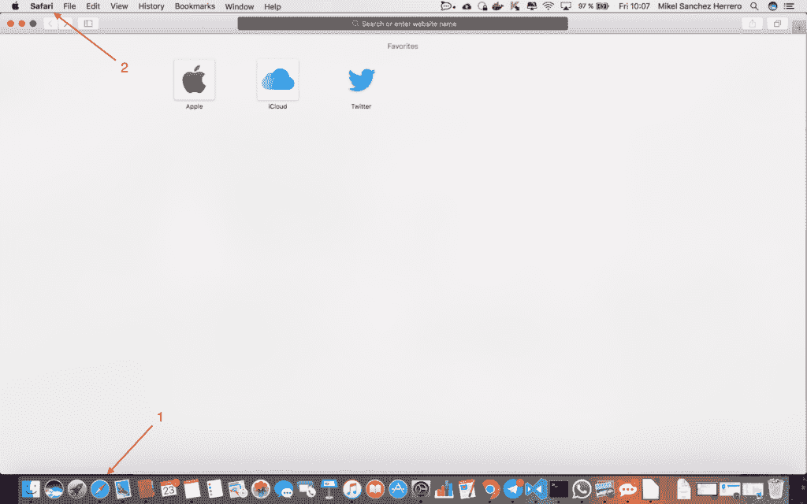

B.点击首选项按钮。

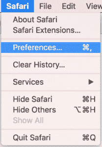

C.点击高级按钮(图中的 1)并启用显示开发选项(图中的 2)。

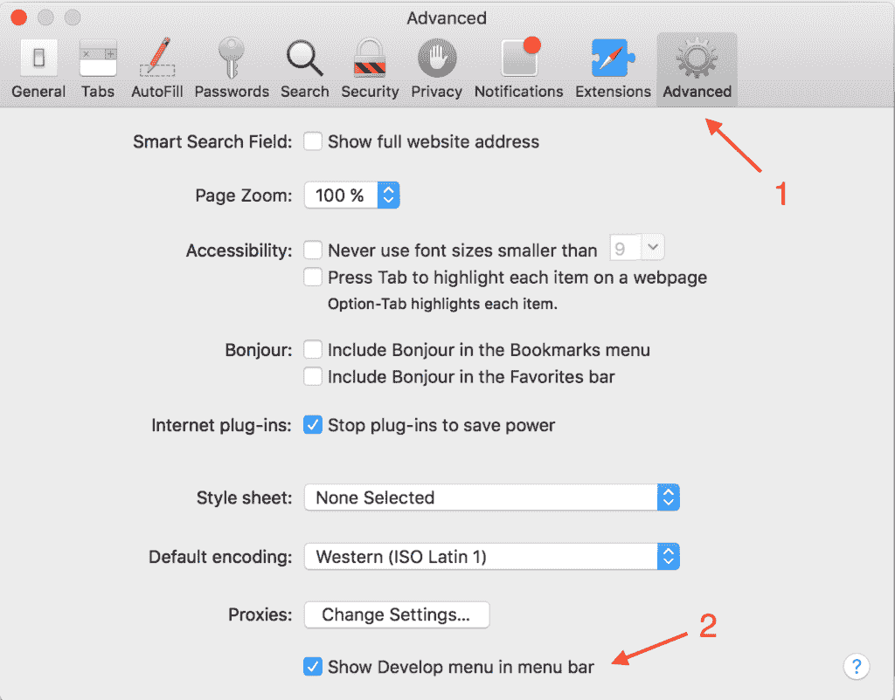

D.关闭窗口，检查名为“开发 : 的新菜单项

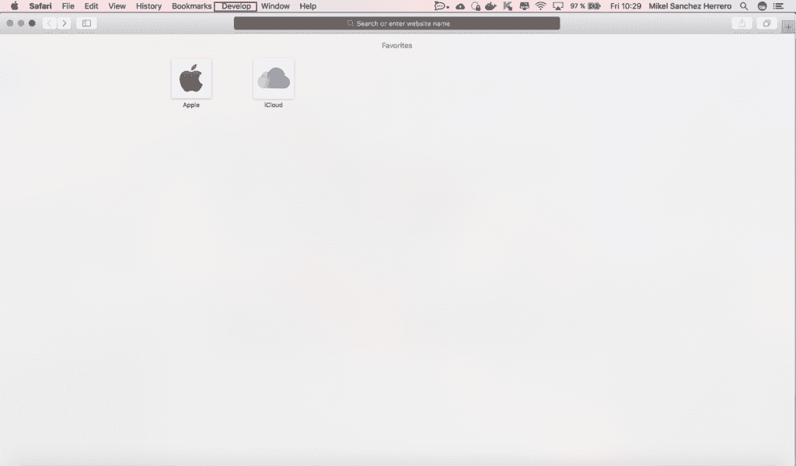

### 装置

要启用 de 调试，必须正确配置设备，只需遵循以下步骤:

1.点击设置，进入 Safari 部分。

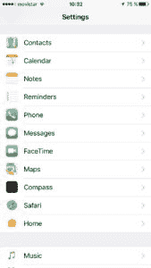

2.向下滚动，直到看到高级部分，点击它。

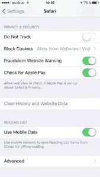

3.启用网络检查器开关。

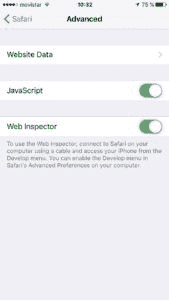

## 在设备上运行项目

一旦我们设置好了一切，下载了我们的应用程序源代码或在我们的本地计算机上，我们就可以在我们的设备上运行这个项目了。

1.用 USB 线连接设备，打开 XCode，在设备上运行项目:

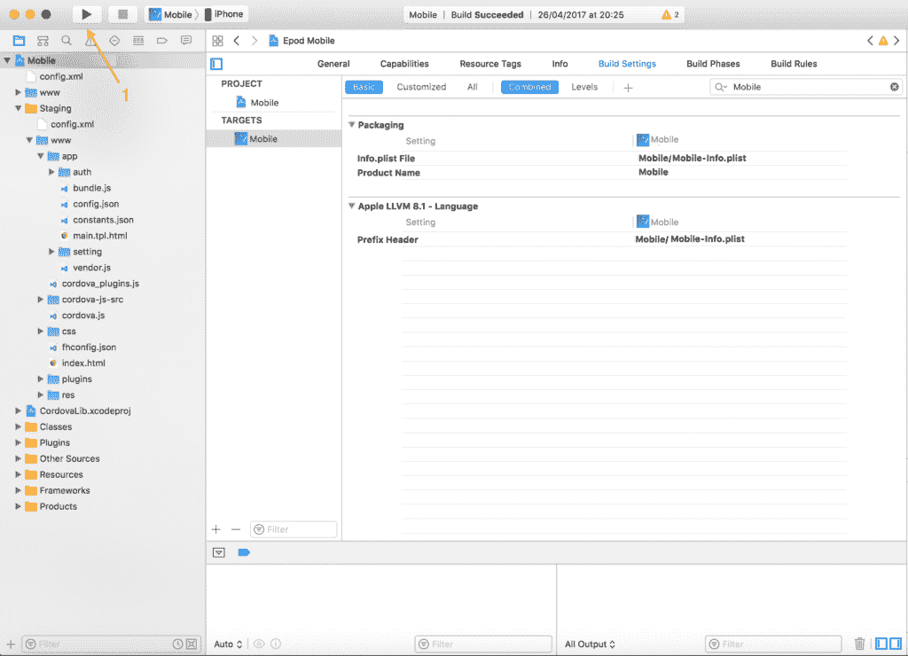

2.如果应用程序正确启动并在您的设备上打开，现在是时候调试应用程序了，打开 Safari 并点击顶栏中的“开发者”部分:

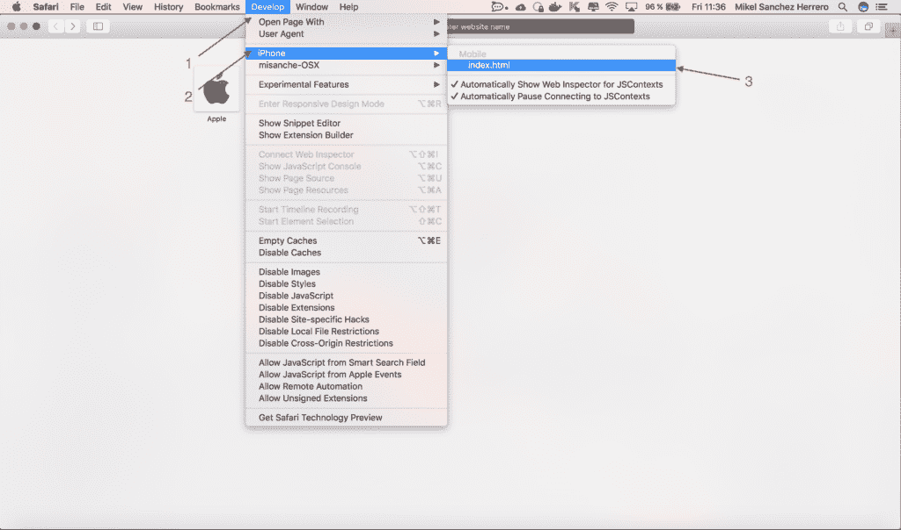

3.这将在开发者工具中打开一个新窗口。

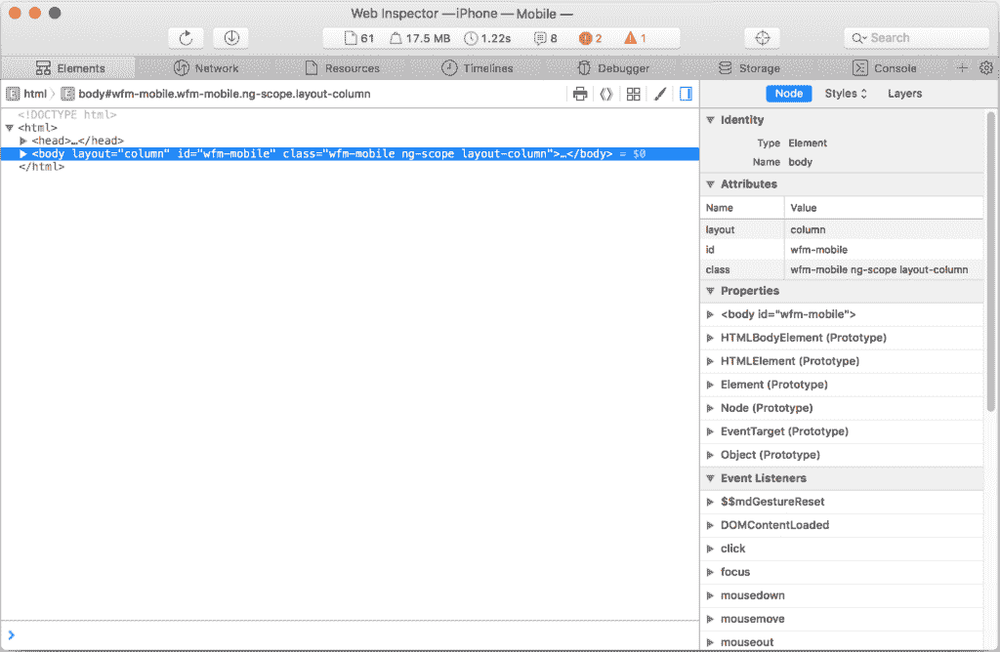

## 开发者工具说明

### 网络

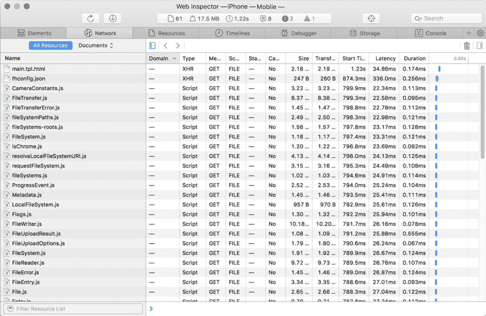

本节涵盖了所有网络通话。如果您想查看详细信息，请单击所需的已加载文件，详细信息就会显示出来。

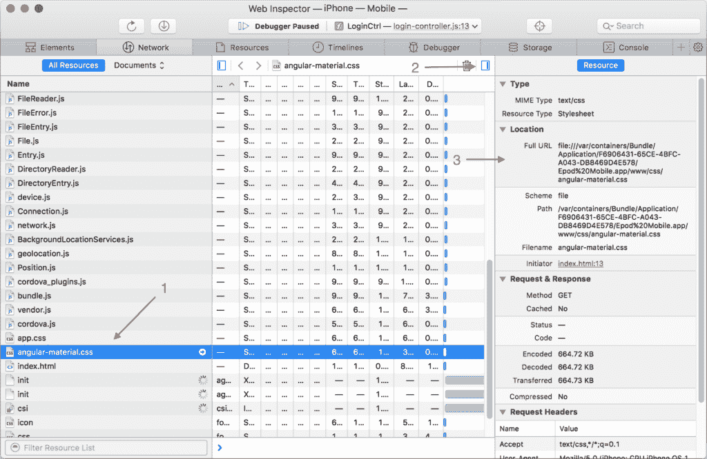

### 资源

此部分列出了应用中的所有资源，您可以浏览这些资源:

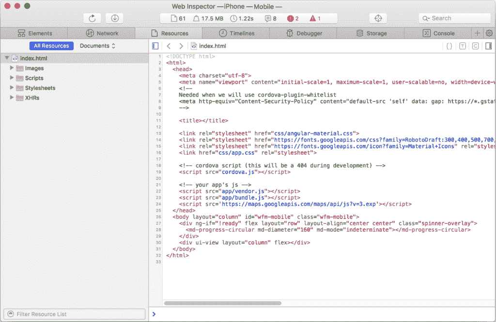

### 时间线

您可以查看载入应用程序、网络请求、布局渲染或 javascript 事件所需的时间。当您有高性能需求并且一切都需要尽可能快时，这非常有用。用这个来检测你的应用的弱点。

### 调试器

这一部分可能是最重要的一部分，就像你在 Chrome 开发者控制台中一样，这可以在 Safari 中完成，你可以添加断点，调试 javascript 并在运行时检查变量的值。

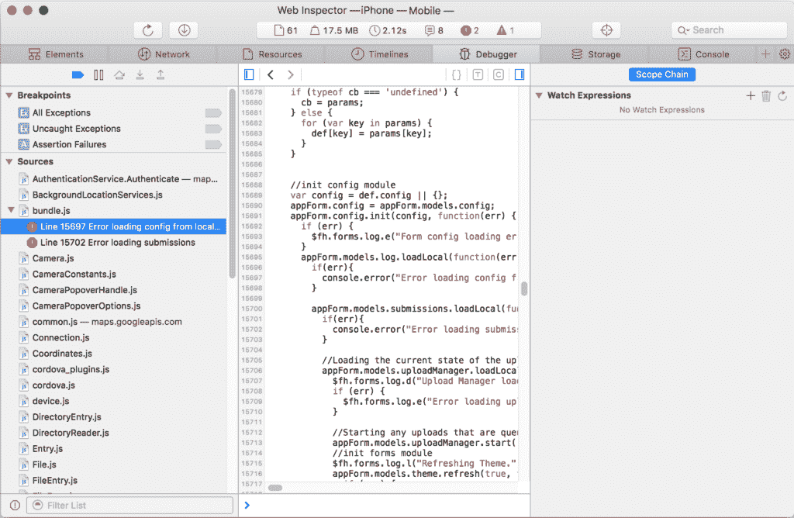

1.添加断点，重新加载 app。

2.一旦页面被重新加载，您执行所需的步骤，直到到达断点，您将得到类似如下的内容:

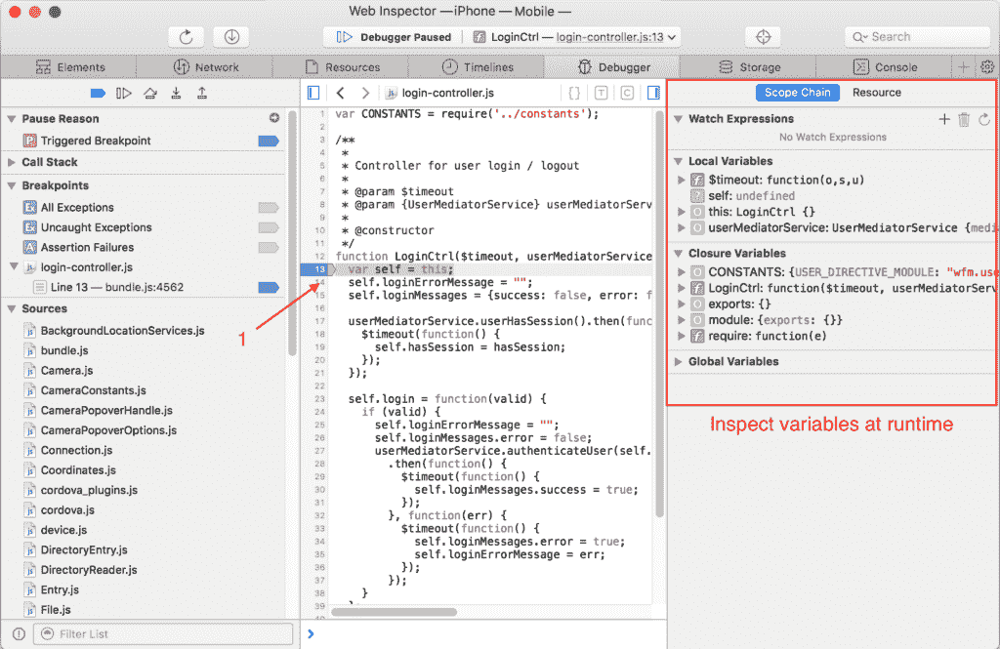

3.展开它们。

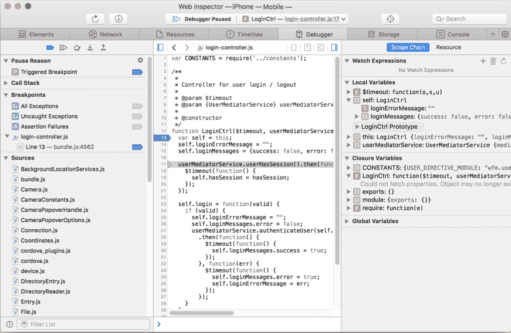

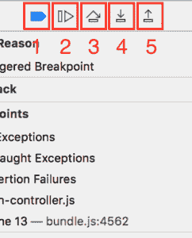

1.  禁用或启用断点
2.  继续脚本执行
3.  跨过
4.  步入
5.  步骤为

### 存储

保存在浏览器中的所有应用数据都可以在这里看到，只需点击本地存储或会话存储，保存在这里的所有这些信息都可以更改。

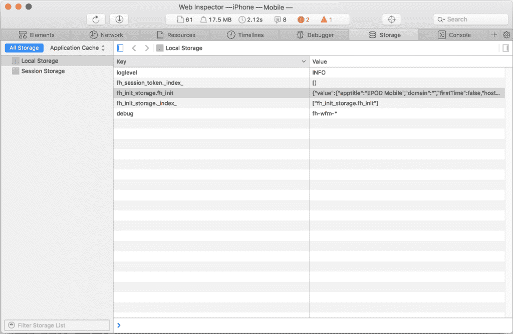

### 控制台

您可以看到所有的控制台错误或警告，并在此部分评估变量。

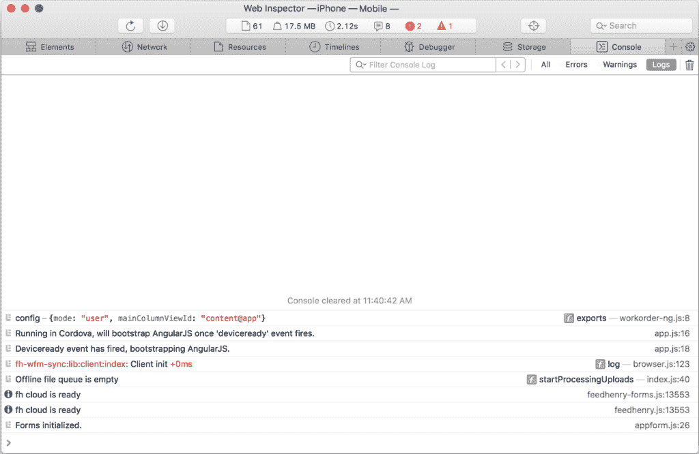

**相关** : [如何在设备上设置您的应用程序以本地为目标](https://developers.redhat.com/blog/2017/05/26/how-to-setup-your-apps-to-target-locally-on-device/)。

* * *

**红帽移动应用平台** [**下载**](https://developers.redhat.com/products/mobileplatform/download/) **，可在** [**红帽移动应用平台**](https://developers.redhat.com/products/mobileplatform/overview/) **了解更多。**

*Last updated: October 18, 2018*