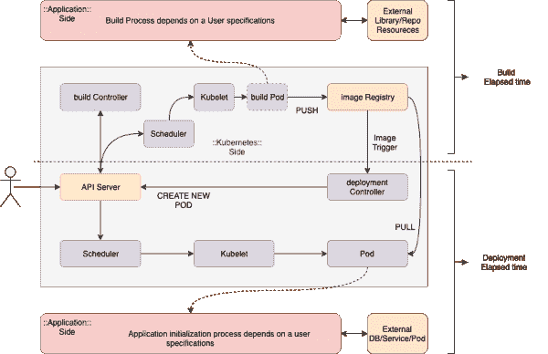
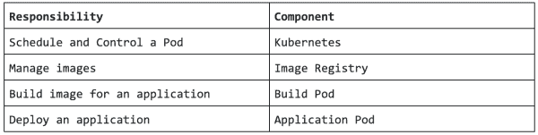
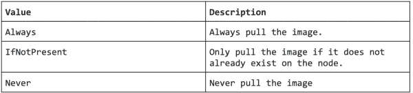
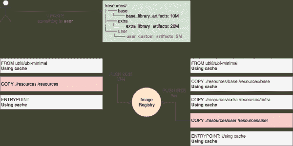

# 如何在 Red Hat OpenShift 上保持稳定的构建和部署性能

> 原文：<https://developers.redhat.com/blog/2020/01/23/how-to-maintain-stable-build-and-deployment-performance-on-red-hat-openshift>

在本文中，我将介绍在 [Red Hat OpenShift](https://developers.redhat.com/openshift/) 上管理可靠构建和部署的有用的通用技巧。如果您在 OpenShift 上遇到了构建和部署的突然性能下降，那么对您的集群进行故障诊断可能会有所帮助。我们将从回顾整个过程开始，从构建到部署，然后更详细地讨论每个方面。为此，我们将使用 Red Hat open shift 4.2(Kubernetes 1.14)。

## 从构建到部署的过程

当 CI/CD 流程或用户触发 pod 部署的构建时，流程将如图 1 所示进行，为了便于阅读，图 1 进行了简化:

[](/sites/default/files/blog/2019/12/build_deploy_performance.png)Figure 1: The process workflow from building to deploying a pod.">

如您所见，Kubernetes 并不控制所有这些过程，但是构建和部署的主要过程取决于用户的应用程序构建配置和对外部系统的依赖。我们可以拆分每个流程，由组件负责管理，如图 2 所示:

[](/sites/default/files/blog/2019/12/components_table.png)Figure 2: The build deployment process.">

### 库伯内特斯

在这个过程中，Kubernetes 基于`BuildConfig`和`DeploymentConfig`文件提供资源。通常，如果在处理资源时遇到任何问题，比如卷装载失败、调度挂起等等，构建和部署会在开始工作之前失败。您通常可以在事件日志中轻松找到这些失败的原因。

因此，如果构建和部署都是成功的——尽管花费了更长的时间——这就不是 Kubernetes 的调度和控制问题了。为了澄清性能问题，我们应该确保`BuildConfig`和`DeploymentConfig`配置了足够的资源请求，如下例所示。

这是该场景的一个快速示例`BuildConfig`:

```
apiVersion: v1
kind: BuildConfig
metadata:
  name: sample-build
spec:
  resources:
    requests:
      cpu: 500m
      memory: 256Mi

```

这是该场景的一个快速示例`DeploymentConfig`:

```
apiVersion: apps.openshift.io/v1
kind: DeploymentConfig
metadata:
  name: sample-deployment
spec:
  template:
    spec:
      containers:
      - image: test-image
        name: container1
        resources:
          requests:
            cpu: 100m
            memory: 200Mi

```

一般来说，您应该分配足够大的资源，以便在测试后可靠地构建和部署，记住这不是最小资源设置。例如，如果您设置了`resources.requests.cpu: 32m`，Kubernetes 将通过`cpu.shares`控制组参数分配更多的 CPU 时间，如下所示:

```
# oc describe pod test-1-abcde | grep -E 'Node:|Container ID:|cpu:'
Node:               worker-0.ocp.example.local/x.x.x.x
    Container ID:  cri-o://XXX... Container ID ...XXX
      cpu:        32m
# oc get pod test-5-8z5lq -o yaml | grep -E '^  uid:'
  uid: YYYYYYYY-YYYY-YYYY-YYYY-YYYYYYYYYYYY

worker-0 ~# cat \
/sys/fs/cgroup/cpu,cpuacct/kubepods.slice/kubepods-burstable.slice/kubepods-burstable-podYYYYYYYY_YYYY_YYYY_YYYY_YYYYYYYYYYYY.slice/crio-XXX... Container ID ...XXX.scope/cpu.shares
32

```

从 OpenShift 4.1 开始，您可以通过`Build`资源管理集群范围的构建默认值，包括上面的资源请求。更多详情请参考[构建配置资源](https://docs.openshift.com/container-platform/4.2/builds/build-configuration.html):

```
apiVersion: config.openshift.io/v1
kind: Build
metadata:
  name: cluster
spec:
  buildDefaults:
    defaultProxy:
      httpProxy: http://proxy.com
      httpsProxy: https://proxy.com
      noProxy: internal.com
    env:
    - name: envkey
      value: envvalue
    resources:
      limits:
        cpu: 100m
        memory: 50Mi
      requests:
        cpu: 10m
        memory: 10Mi
  buildOverrides:
    nodeSelector:
      selectorkey: selectorvalue
operator: Exists

```

此外，您应该添加`kube-reserved`和`system-reserved`来提供更可靠的调度，并最小化所有节点中的节点资源过量使用。参见[为 OpenShift 容器平台集群中的节点分配资源](https://docs.openshift.com/container-platform/4.2/nodes/nodes/nodes-nodes-resources-configuring.html)了解更多详情:

```
apiVersion: machineconfiguration.openshift.io/v1
kind: KubeletConfig
metadata:
  name: set-allocatable
spec:
  machineConfigPoolSelector:
    matchLabels:
      custom-kubelet: small-pods
  kubeletConfig:
    systemReserved:
      cpu: 500m
      memory: 512Mi
    kubeReserved:
      cpu: 500m
      memory: 512Mi

```

如果有超过 1000 个节点，可以考虑调优 [`percentageOfNodesToScore`](https://kubernetes.io/docs/concepts/scheduling/scheduler-perf-tuning/) 进行调度器性能调优。从 Kubernetes 1.14 (OpenShift 4.2)开始，这个特性的状态是 beta。

### 图像注册表

该组件处理构建和部署的映像推和拉任务。首先，您应该考虑采用适当的存储和网络资源来处理所需的 I/O 和流量，以实现您估计的最大并发映像拉和推。通常，建议使用对象存储，因为它是原子性的，意味着数据要么完全写入，要么根本不写入，即使写入过程中出现故障。对象存储还可以在读写多(RWX)模式下与其他复制注册表共享一个卷。更多信息可在[推荐的可配置存储技术](https://docs.openshift.com/container-platform/4.2/scalability_and_performance/optimizing-storage.html#recommended-configurable-storage-technology_persistent-storage)文档中找到。

也可以考虑`IfNotPresent` [`ImagePullPolicy`](https://docs.openshift.com/container-platform/4.2/openshift_images/managing-images/image-pull-policy.html) 来减少拉/推的工作量，如下:

[](/sites/default/files/blog/2019/12/image_policy_table.png)Figure 3: The image policy table.">

### 构建 pod

当一个构建 pod 被创建并开始构建一个应用程序时，所有的控制都传递给这个构建 pod，并且通过由一个`BuildConfig`定义的构建配置参数来配置工作。您选择如何创建您的应用程序并提供源内容来构建和操作它都会影响构建性能。

例如，如果您使用`maven`或`npm`构建 Java 或 Nodejs 应用程序，您可能会从它们各自的外部存储库中下载许多库。如果那时存储库或访问路径有性能问题，那么构建过程可能会失败或比平常延迟更多。这个因素意味着，如果您的构建依赖于外部服务或资源，那么无论您的本地系统状态如何，都很容易受到该设置的负面影响。因此，最好考虑创建一个本地存储库(`maven`、`npm`、`git`等等)，以确保您的构建具有可靠和稳定的性能。或者，您可以通过使用[源到映像(S2I)增量构建](https://docs.openshift.com/container-platform/4.2/builds/build-strategies.html#builds-strategy-s2i-incremental-builds_build-strategies)来重用以前下载的依赖项和以前构建的工件，如果您的映像注册表性能足以为每个增量构建提取以前构建的映像:

```
strategy:
  sourceStrategy:
    from:
      kind: "ImageStreamTag"
      name: "incremental-image:latest" 
    incremental: true

```

使用`Dockerfile`构建可以优化分层缓存，从而减少图像层的拉取和推送时间。在以下示例中，使用此方法减小了更新大小，因为分层是基于更改频率的。换句话说，任何未更改的层都会被缓存，如图 4 所示:

[](/sites/default/files/blog/2019/12/layer_cache.png)Figure 4: An example layer cache.">

让我们看一个例子。此图像具有较小的图层，但 35M 图层在构建图像时始终会更新:

```
# podman history 31952aa275b8
ID             CREATED          CREATED BY                                      SIZE      COMMENT
31952aa275b8   52 seconds ago   /bin/sh -c #(nop) ENTRYPOINT ["tail","-f",...   0B        
missing        57 seconds ago   /bin/sh -c #(nop) COPY resources /resources     35.7MB    
missing        5 weeks ago                                                      20.48kB   
missing        5 weeks ago  

# podman push docker-registry.default.svc:5000/openshift/test:latest
Getting image source signatures
Copying blob 3698255bccdb done
Copying blob a066f3d73913 skipped: already exists
Copying blob 26b543be03e2 skipped: already exists
Copying config 31952aa275 done
Writing manifest to image destination
Copying config 31952aa275 done
Writing manifest to image destination
Storing signatures

```

但是这张图片比上面的图片有更多的图层，5M 图层是唯一更新的图层。其他未更改的图层将被缓存:

```
# buildah bud --layers .
STEP 1: FROM registry.redhat.io/ubi8/ubi-minimal:latest
STEP 2: COPY resources/base /resources/base
--> Using cache da63ee05ff89cbec02e8a6ac89c287f550337121b8b401752e98c53b22e4fea7
STEP 3: COPY resources/extra /resources/extra
--> Using cache 9abc7eee3e705e4999a7f2ffed09d388798d21d1584a5f025153174f1fa161b3
STEP 4: COPY resources/user /resources/user
b9cef39450b5e373bd4da14f446b6522e0b46f2aabac2756ae9ce726d240e011
STEP 5: ENTRYPOINT ["tail","-f","/dev/null"]
STEP 6: COMMIT
72cc8f59b6cd546d8fb5c3c5d82321b6d14bf66b91367bc5ca403eb33cfcdb15

# podman tag 72cc8f59b6cd docker-registry.default.svc:5000/openshift/test:latest

# podman history 72cc8f59b6cd
ID             CREATED              CREATED BY                                      SIZE      COMMENT
72cc8f59b6cd   About a minute ago   /bin/sh -c #(nop) ENTRYPOINT ["tail","-f",...   0B        
missing        About a minute ago   /bin/sh -c #(nop) COPY resources/user /res...   5.245MB   
missing        2 minutes ago        /bin/sh -c #(nop) COPY resources/extra /re...   20.07MB   
missing        2 minutes ago        /bin/sh -c #(nop) COPY resources/base /res...   10.49MB   
missing        5 weeks ago                                                          20.48kB   
missing        5 weeks ago                                                          107.1MB   Imported from -

# podman push docker-registry.default.svc:5000/openshift/test:latest
Getting image source signatures
Copying blob aa6eb6fda701 done
Copying blob 26b543be03e2 skipped: already exists
Copying blob a066f3d73913 skipped: already exists
Copying blob 822ae69b69df skipped: already exists
Copying blob 7c5c2aefa536 skipped: already exists
Copying config 72cc8f59b6 done
Writing manifest to image destination
Copying config 72cc8f59b6 done
Writing manifest to image destination
Storing signatures

```

在对构建过程进行故障排除时，您应该检查您的构建日志，因为 Kubernetes 只能检测构建 pod 是否成功完成。

### 应用程序窗格

与“构建”窗格一样，一旦创建了“应用”窗格，所有的控制都会传递给“应用”窗格，因此，如果应用程序依赖外部服务和资源来初始化，如数据库连接池、KVS 和其他 API 连接，那么大部分工作都是通过应用程序实现来完成的。您还应该注意`Security Software`是否正在您的主机上运行。它通常会影响主机上的所有进程，而不仅仅是部署。

例如，如果使用连接池的数据库服务器出现性能问题，或者在应用程序窗格启动时达到最大连接数，则应用程序窗格初始化可能会比预期延迟更多。因此，如果您的应用程序有外部依赖项，您也应该检查它们是否运行良好。如果`Readiness Probes`和`Liveness Probes`是为你的应用程序容器配置的，你应该为你的应用程序容器设置足够大的`initialDelaySeconds`和`periodSeconds`来初始化。如果您的`initialDelaySeconds`和`periodSeconds`太短而无法检查应用程序状态，您的应用程序将会重复重启，并可能导致部署应用程序 pod 的延迟或失败(您可以在[监控容器健康](https://docs.openshift.com/container-platform/4.2/nodes/containers/nodes-containers-health.html)中找到关于此问题的更多信息):

```
apiVersion: v1
kind: Pod
metadata:
  labels:
    test: liveness
  name: liveness-http
spec:
  containers:
  - name: liveness-http
    image: k8s.gcr.io/liveness 
    args:
    - /server
    livenessProbe: 
      httpGet:   
        # host: my-host
        # scheme: HTTPS
        path: /healthz
        port: 8080
        httpHeaders:
        - name: X-Custom-Header
          value: Awesome
      initialDelaySeconds: 15  
      timeoutSeconds: 1   
    name: liveness

```

## 并行构建和部署

最后，我建议您将并发的构建和部署任务保持在一个周期中，作为抑制资源问题的适当数量。正如您在这里看到的，这些任务与其他任务链接在一起，并且它们将在其生命周期中自动迭代，因此会有比您预期更多的工作负载。通常，编译(构建)和应用程序初始化(部署)过程是 CPU 密集型任务，因此您可能需要评估可能有多少个并发构建和部署任务，以确保在调度新任务之前有一个稳定的集群。

## 结论

我们看了一下在构建和部署过程中每个部分是如何相互影响的。我只关注与构建和部署性能主题相关的配置和其他信息，希望这些信息能够帮助您理解 OpenShift 上应用程序的构建和部署阶段之间的交互。希望这些信息对你稳定的系统管理有所帮助。感谢您的阅读。

## 参考

您可能会发现有用的另外两个参考资料是[open shift Container Platform 4.2 文档-理解映像构建](https://docs.openshift.com/container-platform/4.2/builds/understanding-image-builds.html)和[调度器性能调优](https://kubernetes.io/docs/concepts/scheduling/scheduler-perf-tuning/)。

*Last updated: June 29, 2020*