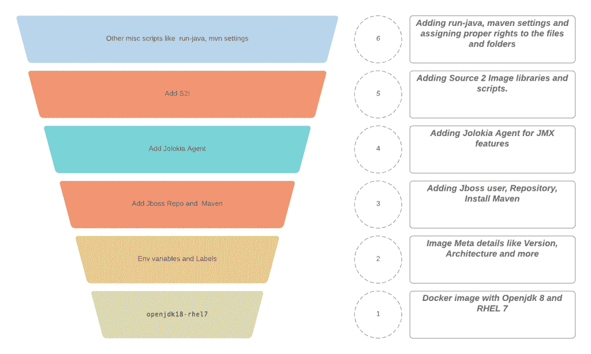

# 如何缩小红帽融合图像尺寸

> 原文：<https://developers.redhat.com/blog/2019/10/10/how-to-reduce-red-hat-fuse-image-size>

[Red Hat Fuse](https://www.redhat.com/en/technologies/jboss-middleware/fuse) 是领先的集成平台，能够用简单的企业集成模式([【EIP】](https://www.enterpriseintegrationpatterns.com/))解决任何给定的问题。随着时间的推移，[红帽引信](https://developers.redhat.com/products/fuse/overview)已经演变为迎合广泛的基础设施需求。

*   保险丝 on [Red Hat OpenShift](https://developers.redhat.com/openshift/)
*   独立保险丝
    *   [Spring Boot](https://developers.redhat.com/topics/spring-boot/)
    *   阿帕奇·卡拉夫
    *   [JBoss EAP](https://developers.redhat.com/products/eap/overview)

有关这些的更多信息，请查看 [Red Hat Fuse 文档](https://access.redhat.com/documentation/en-us/red_hat_fuse/7.4/)。Red Hat OpenShift 风格的 Fuse 使用一个 Fuse 映像，该映像将运行时组件打包在一个 Linux 容器映像中。本文将讨论如何缩小融合图像的尺寸。同样的原理可以用于其他图像。

## 深潜

在缩小尺寸之前，我们需要先了解 Red Hat 提供的 Fuse 容器图像的基础知识。

让我们深入到 Fuse 图像中，在较高的层次上理解它的层。下图显示了六个关键层。注意，为了简化起见，我将各层合并成一个逻辑层。例如，环境和标签显示为一层，提供元数据信息。

图 1:红帽融合图像的高层图像层。

当前版本的[红帽引信图像](https://access.redhat.com/containers/?tab=security#/registry.access.redhat.com/jboss-fuse-6/fis-java-openshift/images/2.0-55.1567588142)大小约为 171.8 MB。在图 1 中，我们可以看到几层。每一层都可以用不同的替代物来代替。这很好，但是我们怎么知道有什么选择呢？

我们举个例子。红帽在四月份发布了一个新的[通用基础图像](https://access.redhat.com/support/policy/updates/ubi)，它通常有两个版本:

1.  标准 Red Hat 基本映像—包含一组强大的软件功能，如 yum、utils 等。
2.  最小的红帽基本图像—这是一个精简的版本。提供了一些替代方法，比如用于软件安装的 microdnf。

最小版本大约是标准 Red Hat 基本图像的一半大小。这可以用来替换 Fuse 映像中的“openjdk18-rhel7”层。但是这个版本不能照原样使用，因为它不包含 JVM。

让我们用无头开放式 JDK 来保持 JRE 的光亮。图像文件将如下所示:

```
FROM registry.access.redhat.com/ubi7/ubi-minimal:7.7-98
MAINTAINER Pramod Padmamabhan[ppadmana@redhat.com]  #Adding env details
ENV FIS_JAVA_IMAGE_NAME="jboss-fuse/minimal-fuse-openshift" \
FIS_JAVA_IMAGE_VERSION="7.7-98" \
PATH=$PATH:"/usr/local/s2i" \
JAVA_DATA_DIR="/deployments/data" # BASE version information
LABEL name="$FIS_JAVA_IMAGE_NAME" \
version="$FIS_JAVA_IMAGE_VERSION" \
architecture="x86_64" \
summary="Platform for building and running plain Java applications (fat-jar and flat classpath)" \
com.redhat.component="jboss-fuse-x-fuse-java-openshift-container" \
io.fabric8.s2i.version.maven="3.3.3-1.el7" \
io.k8s.description="Platform for building and running plain Java applications (fat-jar and flat classpath)" \
io.k8s.display-name="Fuse Integration Services - Java" \
io.openshift.tags="builder,java" \
io.openshift.s2i.scripts-url="image:///usr/local/s2i" \
io.openshift.s2i.destination="/tmp" \
org.jboss.deployments-dir="/deployments" \
description="Fuse Base Image With minimal UBI" \ group="ubi-minimal"

USER root
ADD run-java/ /opt/run-java
ADD s2i/ /usr/local/s2i
ADD jolokia /opt/jolokia #install OpenJDK 1.8 / use only when getting ubi minimal image
RUN microdnf --enablerepo=rhel-7-server-rpms install java-1.8.0-openjdk-headless \
&& microdnf clean all \
&& echo securerandom.source=file:/dev/urandom >> /usr/lib/jvm/java-1.8.0-openjdk-1.8.0.212.b04-0.el7_6.x86_64/jre/lib/security/java.security \
&& useradd -r jboss \
&& usermod -g root -G jboss jboss \
&& chmod -R 755 /opt/run-java ; chmod -R 755 /usr/local/s2i \
&& mkdir -p /deployments/data \
&& chmod -R "g+rwX" /deployments \
&& chown -R jboss:root /deployments \
&& chmod 444 /opt/jolokia/jolokia.jar \
&& chmod 755 /opt/jolokia/jolokia-opts \
&& chmod 775 /opt/jolokia/etc \
&& chgrp root /opt/jolokia/etc  #fis user
USER 185
CMD [ "/usr/local/s2i/run" ]
```

有关 minimal-UBI 项目的完整源代码和库，请参考 [GitHub repo](https://github.com/pramodmax/ubi_utils) 。

构建上述内容将生成一个大约 130 MB 的 Fuse 映像。与 171.8 MB 的原始 Fuse 图像大小相比，我们将图像大小缩小了大约 40 MB。

## 下一步是什么？

尺寸减小是好的，但是每个定制的改变都有一些缺点。在这种情况下，我们需要管理 S2i、Jolokia 以及我们添加到 UBI 中的任何其他库或脚本。接下来，我将展示如何缩小最终的 S2i 图像尺寸。在那之前，开源快乐！

*Last updated: July 1, 2020*