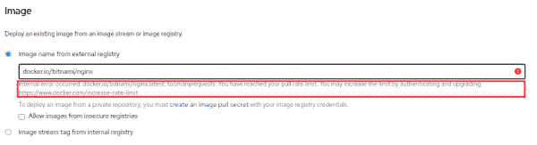
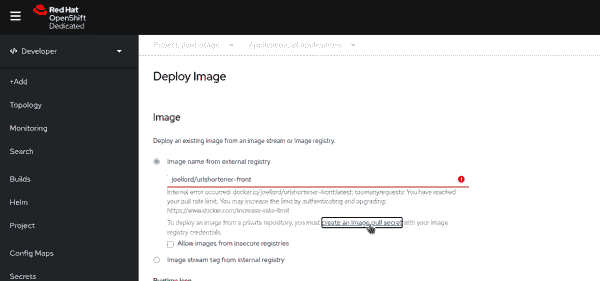

# 如何解决 Docker 在 Red Hat OpenShift 上的新下载速率限制

> 原文：<https://developers.redhat.com/blog/2021/02/18/how-to-work-around-dockers-new-download-rate-limit-on-red-hat-openshift>

你最近试过在[红帽 OpenShift](https://developers.redhat.com/products/openshift/getting-started) 上运行`oc new-app <docker-image>`并收到类似下面的错误信息吗？

```
W0216 12:21:52.014221  671649 dockerimagelookup.go:237] container image registry lookup failed: docker.io/username/image:latest: toomanyrequests: You have reached your pull rate limit. You may increase the limit by authenticating and upgrading: https://www.docker.com/increase-rate-limit

```

如果是这样，您**不需要将您的 Docker 帐户升级为付费帐户**。相反，你可以使用一个秘密作为一个经过认证的 Docker Hub 用户来提取你的图像。

## 码头工人的新费率限制

Docker 最近[改变了以匿名用户身份下载图片的政策](https://www.docker.com/increase-rate-limits)。该公司现在每六小时从一个 IP 地址下载 100 次。

如果您正在使用 [OpenShift 开发者沙箱](https://developers.redhat.com/developer-sandbox)来试验一个免费的 OpenShift 集群，就像我最近所做的那样，那么您可能会遇到如图 1 所示的错误消息。

[](/sites/default/files/blog/2021/02/2021-02-16_rate_limit.png)

Figure 1: The new rate limit error message from Docker.

在尝试使用`$ oc new-app`命令或从用户界面(UI)创建新应用程序后，您可能会收到此错误消息。问题是许多用户同时使用同一个集群。每当有人试图从 Docker 映像创建新的应用程序时，集群就会以匿名用户的身份下载映像，这将计入新的速率限制。最终，达到限制，并弹出错误消息。

幸运的是，解决方法很简单。

## 验证您的 Docker Hub 帐户

要避免 Docker 新的速率限制错误，您只需向您的 Docker Hub 帐户验证即可。在你对账户进行认证后，你将不会以匿名用户的身份，而是以认证用户的身份获取图片。映像下载将计入您的个人限制，即每六小时 200 次下载，而不是所有匿名群集用户共享的 100 次下载。

您可以使用以下命令进行身份验证:

```
$ oc create secret docker-registry docker --docker-server=docker.io --docker-username=<username> --docker-password=<password> --docker-email=<email>
$ oc secrets link default docker --for=pull
$ oc new-app <username>/<image> --source-secret=docker

```

注意，建议您[在这里使用访问令牌](https://docs.docker.com/docker-hub/access-tokens/)而不是您的实际密码。如果您在帐户上设置了双因素身份验证，使用访问令牌也是唯一的身份验证方式。

如果您像我一样喜欢使用 UI，请单击**创建图像拉取秘密**，如图 2 所示。

[](/sites/default/files/blog/2021/02/2021-02-16_pull_secret.png)

Figure 2: Adding a pull secret from the Docker UI.

无论哪种方式，您都可以快速创建一个图像提取秘密，验证您的 Docker Hub 帐户，然后回到 OpenShift 开发人员沙盒中进行试验。

## 结论

Docker 的新下载速率限制让我们中的一些人感到惊讶，但解决方法很简单。本文向您展示了作为一个经过身份验证的 Docker Hub 用户，如何使用一个秘密来提取您的图像。一旦你做到了这一点，你就可以下载图像而不会遇到速率限制错误。

*Last updated: February 17, 2021*