# 如何更新到较新的 Red Hat OpenShift 4 版本

> 原文：<https://developers.redhat.com/articles/2021/05/27/how-update-newer-red-hat-openshift-4-releases>

本文演示了两种常见的更新 [Red Hat OpenShift 4](/products/openshift) 的场景:更新到新的 z-stream 版本和更新的次要版本。我包括了大量从 4.5.4 到 4.5.17 再到 4.6.4 的实际更新的截图，所以当你自己做这些更新时，你知道会期待什么。

OpenShift 4 使更新过程变得简单，并提供了许多安全功能来最小化失败结果的风险。尽管如此，第一次更新 OpenShift 集群可能会令人害怕。本文逐步展示了两个如何执行典型的更新场景:

1.  在两个 z 流版本之间更新，从 4.y.z 到 4.y.z+d。请注意，您可以在更新期间跳过 z 流版本。
2.  在两个次要版本之间更新，从 4.y 到 4.y+1。请注意，您不能在更新期间跳过次要版本。

## 使用或不使用 web 控制台

更新过程，包括 web 控制台页面和怪癖，对于早期的次要版本来说基本相同，例如 OpenShift 4.4 的 z 流更新。OpenShift 4.6 对其 web 控制台进行了重大改进，解决了我在本文中演示的大部分问题。

您可以从命令行界面(CLI)执行整个集群更新过程，并使用 Ansible 行动手册、shell 脚本或您喜欢的任何东西来自动化它。如果您需要有关如何使用 CLI 执行集群更新的说明，请参考 OpenShift 知识库中的[Red Hat open shift Container Platform 产品文档](https://docs.openshift.com/container-platform/4.5/updating/updating-cluster-cli.html)和这篇[文章。](https://access.redhat.com/solutions/4606811)

如果您有一个测试集群，您曾经考虑过更新，但是由于担心结果，没有更新，那么您现在可以使用集群来遵循本文的说明。

**注意**:不要试图更新[Red Hat code ready Containers](/products/codeready-containers)(CRC)单节点集群。CodeReady Containers 禁用了成功更新所需的一些集群操作符，以减少其硬件需求，而且 OpenShift 更新过程也不是为单个管理节点设计的。 [OpenShift 容器平台](/courses/openshift/getting-started)的后续版本将支持单节点 OpenShift (SNO)集群，该集群遵循与 CodeReady 容器不同的设计和安装流程。SNO 集群将在正式发布时支持更新。

因为可用的更新和路径集会不时地发生变化，所以您可能无法完全按照本文中的说明进行操作。您可能从不同的版本开始，以不同的最终版本为目标，并且必须通过不同的中间版本。我希望为您提供足够的信息来推断您的具体情况。

## 我的 OpenShift 集群的当前版本是什么？

打开 OpenShift web 控制台，以集群管理员权限登录，选择**管理— >集群设置**。您应该会看到一个页面，显示您的集群的当前更新通道和 OpenShift 版本。我的使用的是有点旧的 4.5.4 版本，如图 1 所示。自从不久前首次安装测试集群以来，我还没有更新过它。

[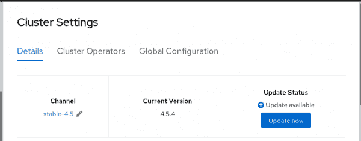](/sites/default/files/blog/2020/11/blog-1-version-4.5.4-2.png)

Figure 1: Viewing the current cluster settings.

如果我单击当前更新通道(stable-4.5)旁边的钢笔图标，web 控制台只允许我从同一个 OpenShift 版本的其他通道中进行选择(参见图 2)。这意味着我的当前版本不能立即更新到下一个次要版本——至少不能使用 web 控制台。

[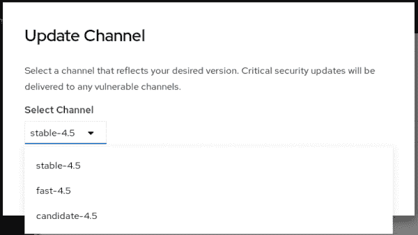](/sites/default/files/blog/2020/11/blog-2-no-4.5-channel.png)

Figure 2: Available channels for updates.

现在，不要改变更新频道。

## 为什么我看不到下一个次要 OpenShift 版本的频道？

或许可以从 CLI 直接更新到 OpenShift 4.6.x 版本，但在 OpenShift 4.5 之前，web 控制台附带了候选更新通道的硬编码列表。最初的 z-stream 只发布他们自己的更新通道的硬编码。后来的 z-stream 版本增加了下一个次要版本的频道。

OpenShift 4.6 改变了提供的内容，使可用的更新频道列表变得动态，并显示新版本中可用的频道。这意味着早期的 4.6.z 版本可能会通过 web 控制台更新到 4.7，而不需要经过中间的 4.6.z 版本。

由于我仍在使用 4.5，并且我希望遵循 web 控制台提供的简单用户界面(UI)，所以我必须首先更新到较新的 4.5.z 版本。我为离开我的集群这么久而没有错误修复和安全更新感到羞耻！这种情况即将得到纠正。

如果我急着更新到 OpenShift 4.6，或者可能更新到最近的 4.5.x 版本，例如为了修复一个影响我的生产用户的关键 bug，我可能必须切换到快速通道。OpenShift 4 的更新首先在快速通道中提供。只有在许多客户成功运行给定的版本而没有重大事故之后，更新才会添加到稳定的渠道中。

OpenShift 更新通道和升级路径包含了比我在本文中解释的更多的细微差别。有关 Red Hat 如何管理 OpenShift 更新通道和版本的更多信息，请参考[面向集群管理员的 OpenShift 版本和升级流程终极指南](https://www.openshift.com/blog/the-ultimate-guide-to-openshift-release-and-upgrade-process-for-cluster-administrators)。

## 更新到较新的 z-stream 版本

我的测试集群运行的是 4.5.4 版本，使用的是 stable-4.5 通道。如果我点击 **Update now** ，web 控制台会显示一个我可以更新的版本列表，最新的版本会显示在最前面(见图 3)。

[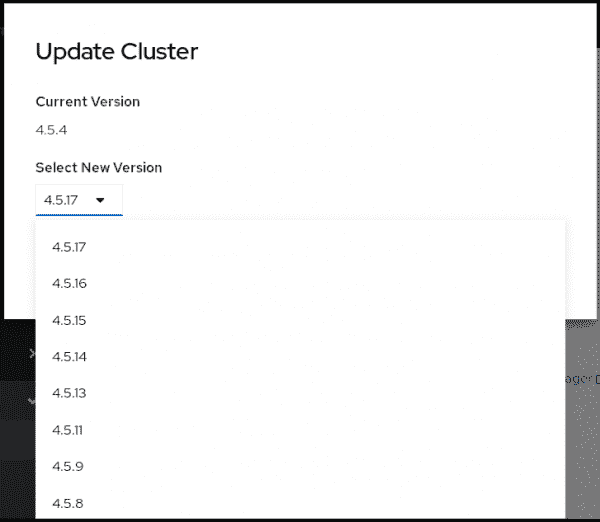](/sites/default/files/blog/2020/11/blog-3-update-to-4.5.17.png)

Figure 3: Selecting a version of OpenShift to update to after "Update now".

记住这个截图代表一个时间点，在这个例子中是 2020 年 11 月。您可能会看到更多(或更少！)发布，当你自己查看的时候。

该列表可能不包括您当前渠道的最新版本。它只包括从当前版本直接更新的版本。在您获得想要的版本或更新路径用完之前，可能会发生几个更新周期。

我选择了 4.5.17 版本，这是我写这篇文章时的最新版本，然后点击 **Update** 。片刻之后，web 控制台开始显示我的更新的状态，如图 4 所示。

[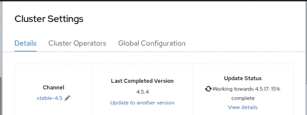](/sites/default/files/blog/2020/11/blog-4-working-to-4.5.17.png)

Figure 4: The update status.

更新时间取决于许多因素，例如您的互联网带宽、[Red Hat Enterprise Linux](/products/rhel )core OS 映像和集群操作员映像的大小、集群上的节点数量、应用程序数量、它们的中断预算以及许多其他因素。我的紧凑测试集群(只有三个节点)花费了大约 40 分钟。

## 更新时 Web 控制台异常

在更新过程中，我看到完成百分比指标向后移动了几次，例如从 70%移动到 25%。如果那发生在你身上，不要惊慌。我也看到了一些暂时的失败，它们在我没有采取行动的情况下消失了，我将在本文的后面解释这一点。上游[集群版本操作符(CVO)](https://github.com/openshift/cluster-version-operator) 文档解释了为什么会发生这种情况；这是故意的。

在更新期间的某个时间，您的 web 控制台会话可能会过期，因为更新过程会重新启动 web 控制台窗格以使用新的容器映像。您甚至可能从 OpenShift 路由器得到一个“服务器错误”。如果发生这种情况，请刷新您的 web 浏览器，再次登录(如果需要)，并导航回**管理— >集群设置**以继续监控集群更新的进度。

OpenShift 宣称的在更新期间 100%可用的目标并不意味着对 web 控制台和应用程序的所有 HTTP 请求都是成功的。在更新过程中，将重新启动节点，重新创建单元，停止容器，并启动新的容器。负载平衡器可能不会立即做出反应，可能会偶尔向不可用的容器或节点发送请求。下一个 HTTP 请求应该可以工作。

## 我的 OpenShift 更新完成了吗？

当更新完成时，web 控制台会显示新的当前版本，还可能会显示更多可用的更新(参见图 5)。

[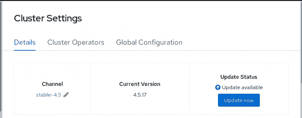](/sites/default/files/blog/2020/11/blog-5-version-4.5.17.png)

Figure 5: The Cluster Settings screen after a successful update.

在我的例子中，看起来我仍然无法获得任何 4.6 版本，但是我看到了一个我可以更新到的 4.5 版本(参见图 6)。

[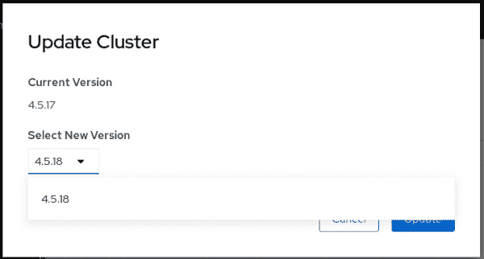](/sites/default/files/blog/2020/11/blog-6-update-to-4.5.18.png)

Figure 6: Checking for newer versions on the Update Cluster screen after an update.

因此，我将重复我在本文中展示的过程来更新到 4.5.18，以此类推，希望最终能够更新到 OpenShift 4.6。(我知道我不需要进一步的更新，稍后我会解释我是如何知道的。)

在再次更新到下一个 z-stream 版本之前，请刷新您的浏览器选项卡。您的 web 浏览器可能显示以前集群版本的陈旧数据。OpenShift 4.6 解决了这个特殊问题，不需要刷新浏览器。

## 我的 OpenShift 更新失败了吗？

我在同一个测试环境中做了一些集群更新，没有出现任何问题。但是我的一次尝试显示了一个可怕的红色惊叹号图标和一个“失败”状态，如图 7 所示。

[](/sites/default/files/blog/2020/11/blog-7-failing.png)

Figure 7: Status of "Failing".

冷静下来，注意状态是“失败- *ing* ，而不是“失败- *ed* ”更新过程仍在运行。 [Kubernetes](/topics/kubernetes) 集群、应用和运营商可以在大量场景下自我修复。有时，CVO 中的[超时](https://bugzilla.redhat.com/show_bug.cgi?id=1884334)过短会导致“失败”消息。如果是这种情况，邮件会自动修复，无需您采取任何措施。并且不会对您的群集和应用程序造成损害。

不要惊慌，但要给 OpenShift 一些时间来自我修复。在开始收集故障诊断信息和开具客户支持单之前，请耐心等待。

## 待定聚类运算符

如果您单击 **View details** ，如图 7 所示，web 控制台会向您显示每个集群操作符的详细状态信息:哪些已经完成更新，哪些仍在执行更新。图 8 显示了`openshift-apiserver`操作符被降级。

[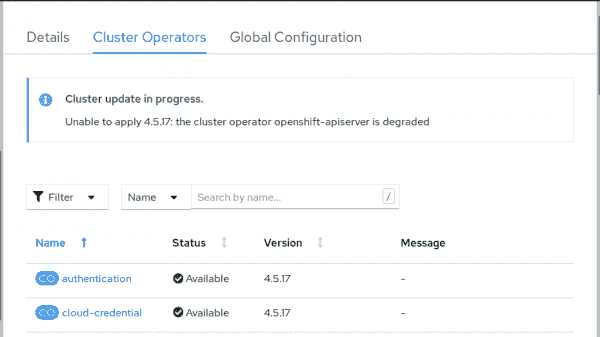](/sites/default/files/blog/2020/11/blog-8-degraded.png)

Figure 8: The cluster operators screen with a progress message showing a potential problem.

我希望消息“Cluster update *in progress* ”以及不那么令人担忧的蓝色信息图标能让您安心一些:OpenShift 仍在执行更新；它根本没有失败。

在更新期间，操作员可能会暂时降级，然后自行恢复。预计随着每个新的 OpenShift 版本的发布，集群操作员在报告他们的状态和报告更少的临时故障方面会变得更好。

向下滚动，我可以看到我的一个 API 服务器单元没有运行(参见图 9)。我知道当您更新 Kubernetes 部署时可能会发生这种情况，所以我决定给它一些时间来稳定下来。

[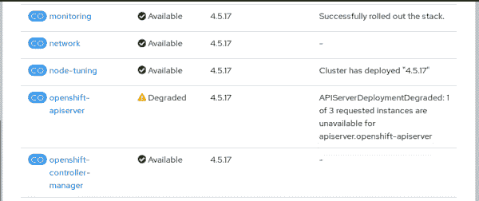](/sites/default/files/blog/2020/11/blog-9-api-server.png)

Figure 9: A degraded pod on the Cluster Operators screen.

如果我怀疑有什么地方出错了，可能是因为我看到其他操作符出错，我会检查操作符日志和集群事件，以找到真正不可恢复的错误的线索。

几分钟后，“失败”状态切换到“更新可用”，所需的群集版本 4.5.17 成为当前版本。我的更新成功完成，如图 10 所示。

[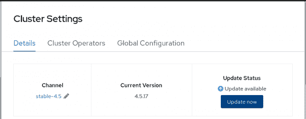](/sites/default/files/blog/2020/11/blog-10-update-avail.png)

Figure 10: The Cluster Settings screen showing the current version after an update.

“失败”状态也可以切换到新的完成百分比消息，就好像更新过程正在进行，没有发生任何失败。您甚至可能看到安装进入“失败”状态，然后几次回到“正在努力”状态。

最后，您注意到的变化取决于您在集群更新时对 web 控制台的关注程度。因为我知道更新需要时间，所以我通常会执行其他任务，而不是盯着 OpenShift web 控制台的**集群设置**页面。如果在我更新期间发生了非常糟糕的事情，我希望 OpenShift 集群监控能够提醒我。

## 更新到较新的次要版本

在 OpenShift 4.6 之前，您可能无法使用 web 控制台从当前的 4.y.z 版本更新到任何 4.y+1 版本。在 web 控制台显示下一个次要版本的频道之前，可能需要更新到较新的 4.y.z+d。您甚至可能需要执行多次 z 流更新。

在我的示例场景中，我必须从 OpenShift 4.5.3 更新到 4.5.17 才能切换到 stable-4.6 通道。随着我的集群更新到 4.5.17，并且在 web 浏览器页面刷新之后，web 控制台为我提供了一个稳定通道的选择，用于 OpenShift 的下一个次要版本(参见图 11)。

[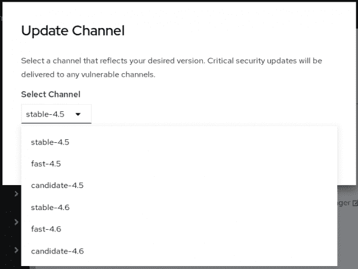](/sites/default/files/blog/2020/11/blog-11-update-4.6.png)

Figure 11: The Update Channel screen showing 4.6 releases.

要更新到下一个次要版本，请单击 **stable-4.6** 切换频道，单击**立即更新**，然后选择任何可用的 4.6.z 版本作为您的集群的新 OpenShift 版本。从现在开始的更新过程与 z 流更新相同。

## 更新是不是太早了？

我第一次尝试从 OpenShift 4.5 更新到 4.6 时，通过从 stable-4.5 切换到 stable-4.6 通道，我得到了令人失望的“版本未找到”状态，如图 12 所示。如果我没有停在 4.5.17，而是继续更新到 4.5.18 或者更高版本，也没有什么区别。

[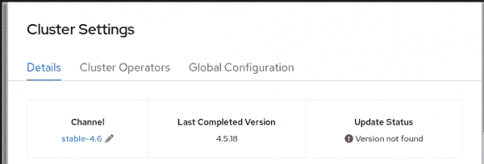](/sites/default/files/blog/2020/11/blog-12-update-not-found.png)

Figure 12: The update was not found.

该消息意味着 stable-4.6 频道不包括我的当前版本。当时，稳定的 4.6 版本不包括 4.5.18(也不包括 4.5.17)。

图 13 显示了一个完全更新的 OpenShift 4.5 集群，根据其当前发布的更新通道(stable-4.5)，因此您可以将它与前面的图进行比较。“最新”状态意味着频道只将我的当前版本列为更新路径的目的地，而不是任何路径的来源。所以目前没有可用的更新，但是将来可能会有可用的更新。

[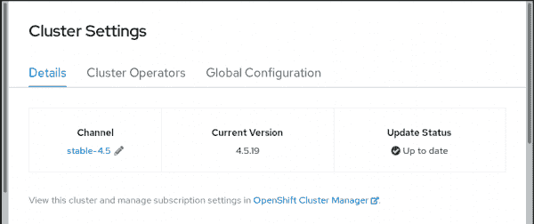](/sites/default/files/blog/2020/11/blog-13-up-to-date.png)

Figure 13: The Cluster Settings screen when the OpenShift version is up to date.

如果您发现自己处于类似的情况(即，您切换到下一个次要版本的稳定渠道，并发现没有可用的更新)，Red Hat 建议您切换回列出您当前版本的渠道，以便您不会错过错误修复和安全更新。在我的例子中，我会切换回 stable-4.5。事实上，几天后，该频道推出了 4.5.19 和 4.5.20。但是在我撰写本文时，这些版本都没有发布到 stable-4.6。

因为我在 OpenShift 4.6 的第一个正式发布(GA)几天后才尝试检查，所以所有更新路径很可能都在等待来自使用快速通道的集群的稳定性证明。

如果你发现自己也有同样的情况，你有两个选择:要么时不时地再检查一次 stable-4.6 通道，直到你在 stable-4.6 通道上看到一个 4.6.z 的发布更新，每次检查后又恢复到 stable-4.5；或者切换到快速通道，希望那里有更新路径。

## 使用快速通道

在我的例子中，在我切换到 fast-4.6 通道之后，我看到确实有可用的更新(参见图 14)。

[](/sites/default/files/blog/2020/11/blog-13-up-to-date.png)

Figure 14: The Cluster Settings screen for the fast-4.6 channel shows updates available.

我可以从 4.5.18 中选择两个版本进行更新:4.6.3(图 15 中没有显示)和 4.6.4。

[](/sites/default/files/blog/2020/11/blog-15-update-to-4.6.4.png)

Figure 15: Version 4.6.4 selected for update.

图 16 证明了我的测试集群使用快速通道完成了到 4.6.4 的更新。请注意 web 控制台外观的变化。OpenShift 4.7 发布后，我会用新截图写一篇新文章。

[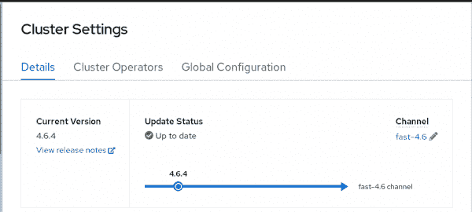](/sites/default/files/blog/2020/11/blog-16-version-4.6.4.png)

Figure 16: The Cluster Settings screen after version 4.6.4 is selected for update.

如果您现在需要更新，请不要害怕使用快速通道来更新您的集群。Red Hat 完全支持在生产环境中使用快速通道的所有版本。根据您对这些更新的需求以及等待更长时间更新的潜在影响，决定是切换还是等待。

## 如何找到可用的更新？

当没有可用的更新时，OpenShift web 控制台允许您切换到一个频道，您可能认为这并不直观。一旦你考虑到你选择了一个渠道来表明你想从这个渠道获取更新的意图，这是有意义的。如果你选择一个非常新的频道，就像我一样，可能会有很少的更新路径。那么一个给定的版本不在其中也就不足为奇了。

在发现是否可以更新到所需的 OpenShift 版本之前，必须切换频道并等待中间集群更新，这可能会令人沮丧。幸运的是，有多种方法可以检查可用的更新。OpenShift 4.6 允许您在执行更新之前找到它们。但是因为我还在 4.5 上，所以我必须在 web 控制台之外进行搜索。

一种方法是使用 [OpenShift 更新图](https://ctron.github.io/openshift-update-graph/#stable-4.6)。它显示了所选通道的所有可用更新路径的漂亮图形，尽管有时会令人困惑。例如，我在 2020 年 11 月中旬得到了如图 17 所示的结果。

[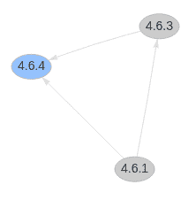](/sites/default/files/blog/2020/11/blog-17-graph-stable.png)

Figure 17: Limited versions were available in the OpenShift Update Graph.

在我生成图 17 时，稳定渠道中没有从任何 4.5.z 版本到 4.6 版本的更新路径。当我选择 fast-4.6 通道时，我得到了图 18 中更丰富的图形。

[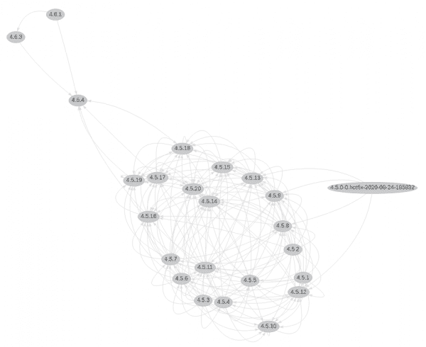](/sites/default/files/blog/2020/11/blog-18-graph-fast.png)

Figure 18: Numerous versions shown in the OpenShift Update Graph.

为了帮助您直观地看到在我捕获本文的截屏时该图的状态，我用指向任何 4.6.z 版本的箭头对所有 4.5.z 版本进行了着色，并进行放大，以便该图的这一部分更容易阅读(参见图 19)。

[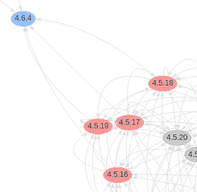](/sites/default/files/blog/2020/11/blog-19-zoom-fast.png)

Figure 19: Focusing on 4.5.z versions in the OpenShift Update Graph.

图 19 更容易看出我可以使用 fast-4.6 通道从 4.5.16、4.5.17、4.5.18 和 4.5.19 升级到 OpenShift 4.6 版本。

## 从 shell 中查找可用的更新

另一种从 OpenShift 4 更新通道列出更新路径的方式来自于[这篇文章](https://access.redhat.com/solutions/4583231)。以下示例列出了 stable-4.5 频道中 4.5.4 的所有可用更新。最后一个命令包括一个很长的`jq`过滤器。确保整个筛选器是一个 shell 参数。注意它周围的单引号。

```
$ export CURRENT_VERSION=4.5.4
$ export CHANNEL_NAME=stable-4.5
$ curl -sH 'Accept:application/json' "https://api.openshift.com/api/upgrades_info/v1/graph?channel=${CHANNEL_NAME}" | jq -r --arg CURRENT_VERSION "${CURRENT_VERSION}" '. as $graph | $graph.nodes | map(.version=='\"$CURRENT_VERSION\"') | index(true) as $orig | $graph.edges | map(select(.[0] == $orig)[1]) | map($graph.nodes[.].version) | sort_by(.)'
[
    "4.5.11",
    "4.5.13",
    "4.5.14",
    "4.5.15",
    "4.5.16",
    "4.5.17",
    "4.5.5",
    "4.5.6",
    "4.5.7",
    "4.5.8",
    "4.5.9",
]
```

所有这些管道符号(|)都属于`jq`过滤器。它们是`jq`命令的第五个参数的一部分。不要把它们误认为是壳管！还要注意的是，`jq`过滤器以一种有点误导的方式对其输出进行排序。它使用字符串排序，而不是语义版本排序。请注意，最新版本 4.5.17 出现在输出的中间。

编写这么长的`jq`过滤器的另一种方法是使用来自辛辛那提开发者的 [available-updates.sh](https://github.com/openshift/cincinnati/blob/master/hack/available-updates.sh) 脚本。CVO 使用辛辛那提协议来描述更新通道。

下载`available-updates.sh`脚本并使其可执行。然后设置`CHANNEL`环境变量，并将起始版本作为参数传递。以下示例列出了我使用 fast-4.6 通道更新到 4.5.17 后的选项:

```
$ export CHANNEL=fast-4.6
$ ./available-updates.sh 4.5.17
4.5.18 quay.io/openshift-release-dev/ocp-release@sha256:72e3..f366    https://access.redhat.com/errata/RHBA-2020:4425
4.6.4 quay.io/openshift-release-dev/ocp-release@sha256:6681..86fc    https://access.redhat.com/errata/RHBA-2020:4987
```

如果我尝试 stable-4.6 通道，我会得到一个空列表，即`[]`。

通过查看这些命令的输出，我能够计划从 4.5.4 开始的两次更新:首先到 4.4.17，然后使用快速通道到 4.6.4。

正如您可能猜到的，许多开发人员创建了自己的可视化工具和脚本来报告 OpenShift 集群更新。一个例子就是 [ocp4upc](https://github.com/pamoedom/ocp4upc) 。

## 结论

OpenShift 4 更新不一定要吓人。web 控制台使更新变得容易，CVO 提供的底层基础设施使更新过程非常可靠。

web 控制台处理 OpenShift 4.5 之前的更新的方式有些奇怪。好在 OpenShift 4.6 解决了大部分。

OpenShift 更新过程与 Kubernetes 的设计模式非常一致:您声明您的集群的期望状态，并让 Kubernetes 将当前状态收敛到期望状态。

有关 OpenShift CVO 和集群操作者如何处理集群更新的更多信息，请参见视频 [Red Hat OpenShift:集群升级和应用操作者更新](https://www.openshift.com/blog/red-hat-openshift-cluster-upgrades-and-application-operator-updates)以及来自官方 OpenShift 博客的精彩帖子:[集群管理员 OpenShift 发布和升级过程的终极指南](https://www.openshift.com/blog/the-ultimate-guide-to-openshift-release-and-upgrade-process-for-cluster-administrators)。

## 承认

感谢 Eric Rich 和 Mike Allmen 对本文草稿的评论。还要感谢 W. Trevor King 和 Scott Dodson，他们为改进本文中的技术信息提供了许多宝贵的意见。如果你在这篇文章中发现任何错误和不准确的地方，尽管他们尽了最大的努力，它们只是我的。

*Last updated: August 15, 2022*