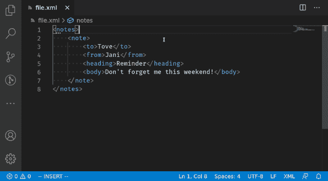
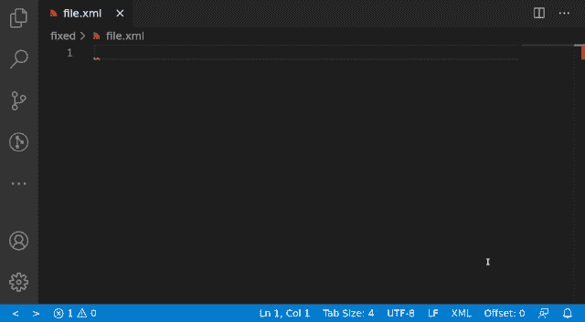
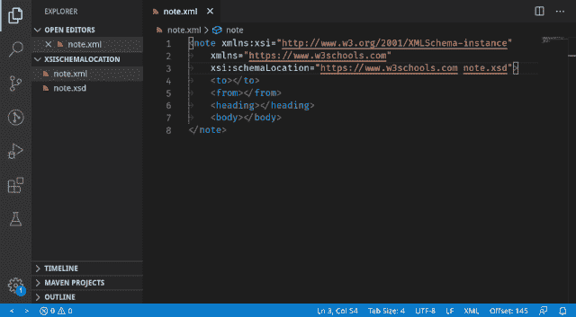
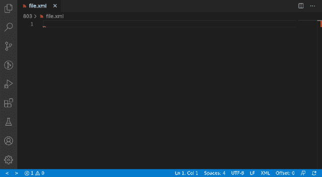
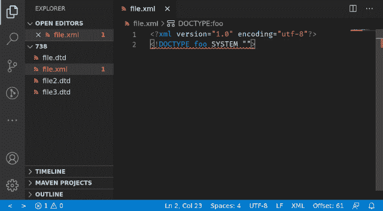

# 在 Red Hat VS Code XML extension 0.13.0 中改进了 XML 语法绑定和更多功能

> 原文：<https://developers.redhat.com/blog/2020/07/08/improved-xml-grammar-binding-and-more-in-red-hat-vs-code-xml-extension-0-13-0>

紧随[巨大的 0.12.0 更新](https://developers.redhat.com/blog/2020/07/02/improved-schema-binding-and-more-in-red-hat-xml-extension-for-vs-code-0-12-0-and-lemminx/)之后，新的[Red Hat XML extension for Visual Studio Code(VS Code)0 . 13 . 0 release](https://developers.redhat.com/products/vscode-extensions/overview)使得 VS 代码中的 XML 编辑更加出色。对于这个版本，我们致力于使从现有的 XML 文件绑定和生成新的 XML 模式定义(XSD)或文档类型定义(DTD)语法文件变得更加容易。其他亮点包括对`xsi:schemaLocation`的文档链接支持、XML 目录片段、对 XML 目录路径验证的支持以及对 DTD `SystemId`文件路径完成的支持。

本文提供了一个快速回顾，并展示了 Red Hat 的 XML extension version 0 . 13 . 0 for VS Code 中的新特性。有关变更的完整列表，请参见[变更日志](https://github.com/redhat-developer/vscode-xml/blob/master/CHANGELOG.md)。

**注意**:VS 代码的 XML 扩展，版本 0.13.0，使用 LemMinX XML 语言服务器，可在 [Visual Studio 代码市场](https://marketplace.visualstudio.com/items?itemName=redhat.vscode-xml)获得。

## 绑定和生成 XSD 和 DTD 语法

开发人员以前报告过用 XSD 或 DTD 语法正确绑定 XML 文件的问题。在 0.13.0 版本中，我们添加了代码片段和快速修复来简化绑定。VS 代码的 XML 扩展还可以从现有的 XML 文件生成 XSD 和 DTD 语法，这为新的 XML 文件提供了一个很好的入门设置。

新的代码片段和快速修复支持两种工作流。

### 为现有的 XML 文件创建并绑定语法

您有一个非空的 XML 文件，并且希望为它创建并绑定一个语法。现在，您可以使用快速修复将现有的 XML 文件绑定到将要生成的 XSD 或 DTD 语法文件，如图 1 所示。

[](/sites/default/files/blog/2020/06/xmlgen_2-640.gif)

Figure 1: Use a quick fix to bind and generate a new XSD grammar to an existing XML file.

### 从头开始创建 XML 文件

在这种情况下，您正在从头开始创建一个 XML 文件，并且希望为它创建并绑定一个语法文件。有了新的 XML 扩展更新，您可以使用代码片段来创建绑定到语法文件的 XML starter 模板，然后使用快速修复来生成语法文件本身。

在图 2 的演示中，我们使用`noNamespaceSchemaLocation`片段来插入 XML starter 模板，然后使用一个快速修复来创建带有生成的 XSD 语法的`demo.xsd`文件。

[](/sites/default/files/blog/2020/07/vscode-fig2-1.gif)Figure 2: Use a snippet to bind an XSD grammar to an XML template, then use a quick fix to generate the grammar.

Figure 2: Use a snippet to bind an XSD grammar, then use a quick fix to generate the grammar.

VS 代码的 XML 扩展现在包括以下代码片段前缀来帮助绑定语法:

| **片段前缀** | **片段内容** |
| `schemaLocation` | 用`xsi:schemaLocation`绑定到一个 XML 语法。 |
| `noNamespaceSchemaLocation` | 用`xsi:noNamespaceSchemaLocation`绑定到一个 XML 语法。 |
| `<!DOCTYPE` | 用`PUBLIC DOCTYPE`绑定到一个 DTD 语法。 |
| 用带有子集的`PUBLIC DOCTYPE`绑定到 DTD 语法。 |
| 用`SYSTEM DOCTYPE`绑定到一个 DTD 语法。 |
| 用带有子集的`SYSTEM DOCTYPE`绑定到 DTD 语法。 |

让我们仔细看看模式生成器以及它在各种场景中是如何工作的。

### 模式生成器的特征

当基于预先存在的 XML 内容生成 XSD 或 DTD 语法时，生成器会考虑元素和属性上下文。考虑下面的例子。

#### 必需属性:每个元素实例都包含一个特定的属性

如果 XML 内容在特定元素的每个实例中都包含某个属性，那么语法生成器会认为这个属性是必需的。

下面是初始的 XML 内容:

```
<root>
	<item attr="value" />
	<item attr="value" />
	<item attr="value" />
</root>
```

以下是生成的 XSD 属性:

```
<xs:attribute name="attr" use="required" />
```

下面是生成的 DTD 属性:

```
<!ATTLIST item attr NMTOKEN #REQUIRED>
```

#### 固定属性值:同一属性值出现五次或更多次

如果 XML 内容包含的属性的相同值出现了五次或更多次，语法生成器会将该值视为固定值。

以下是 XML 内容:

```
<root>
	<item attr="A" />
	<item attr="A" />
	<item attr="A" />
	<item attr="A" />
	<item attr="A" />
</root>

```

以下是生成的 XSD 属性:

```
<xs:attribute name="attr" use="required" fixed="A" />
```

下面是生成的 DTD 属性:

```
<!ATTLIST item attr NMTOKEN #FIXED "A">
```

#### ID 属性值:有 10 个或更多的唯一属性值

如果一个元素的每个实例都包含一个至少有 10 个唯一属性值的属性，那么语法生成器会将这个属性视为一个 ID 说明符。

以下是 XML 内容:

```
<root>
	<item attr="id1" />
	<item attr="id2" />
	<item attr="id3" />
	<item attr="id4" />
	<item attr="id5" />
	<item attr="id6" />
	<item attr="id7" />
	<item attr="id8" />
	<item attr="id9" />
	<item attr="id10" />
</root>

```

以下是生成的 XSD 属性:

```
<xs:attribute name="attr" type="xs:ID" use="required" />
```

下面是生成的 DTD 属性:

```
<!ATTLIST item attr ID #REQUIRED>
```

#### 属性枚举值:重复使用同一组属性值

如果重复使用同一组不同的属性值，语法生成器会将这些值视为枚举值，从而强制可能的值来自该组。仅当属性出现至少 10 次，并且出现次数除以不同值的数量大于或等于 3 时，才会生成枚举值。

以下是 XML 内容:

```
<root>
	<item attr="A" />
	<item attr="A" />
	<item attr="A" />
	<item attr="A" />
	<item attr="A" />
	<item attr="B" />
	<item attr="B" />
	<item attr="B" />
	<item attr="B" />
	<item attr="B" />
</root>
<!-- Attribute ‘attr’ occurs 10 times, with 2 distinct values -->
<!-- (10 / 2) = 5 >= 3 -->

```

以下是生成的 XSD 属性:

```
<xs:attribute name="attr" use="required">
  <xs:simpleType>
    <xs:restriction base="xs:string">
      <xs:enumeration value="A" />
      <xs:enumeration value="B" />
    </xs:restriction>
  </xs:simpleType>
</xs:attribute>
```

下面是生成的 DTD 属性:

```
<!ATTLIST item attr (A|B) #REQUIRED>
```

## 架构位置的文档链接

在`xsi:schemaLocation`中指定的 XML 模式文件现在是一个文档链接，这意味着您可以在文件名上按**Ctrl+单击**来在 VS 代码中快速打开它。图 3 中的演示展示了在`xsi:schemaLocation`文档链接上的这个操作。

[](/sites/default/files/blog/2020/07/vscode-fig3-1.gif)Figure 3: Ctrl+clicking on note.xsd opens the file in a new editor tab.

Figure 3: Ctrl+clicking on note.xsd opens the file in a new editor tab.

## XML 目录片段

我们添加了三个目录片段来帮助您从头开始创建新目录:

| **片段前缀** | **片段内容** |
| `<catalog` | 没有 XSD 或 DTD 的新目录。 |
| 用 XSD 装订的新目录。 |
| 使用 DTD 绑定的新目录。 |

图 4 中的演示展示了显示在一个空文件中的这些目录片段。

[](/sites/default/files/blog/2020/07/vscode-fig4.gif)Figure 4: The new catalog snippets displayed in an empty file.

Figure 4: The new catalog snippets displayed in an empty file.

## XML 目录路径验证

VS 代码的 XML 扩展现在验证在`xml.catalogs`设置中提供的路径是否指向一个现有的文件。如果一个或多个文件路径不存在，通知会列出无效路径。此时，您可以使用一个方便的按钮在设置编辑器中导航到`xml.catalogs`设置。(当设置编辑器未打开时，该按钮特别有用。)

在图 5 中，第一个条目是一个现有的文件，而第二个和第三个不是。XML 扩展为每个无效的文件路径发出错误通知。

[](/sites/default/files/blog/2020/07/vscode-fig5.gif)Figure 5: The XML extension issues error notifications for invalid file paths.

Figure 5: The XML extension issues error notifications for invalid file paths.

## DTD SystemId 文件路径完成

文件路径现在显示为 DTD `SystemId`属性中的完成选项。如图 6 所示，绝对路径和相对路径的完成选项都会出现。

[](/sites/default/files/blog/2020/07/vscode-fig6.gif)Figure 6: The XML extension completes a DTD SystemId file path.

## 走向

这总结了 Red Hat XML extension for VS Code 0 . 13 . 0 版本的亮点。对于未来的版本，我们计划为 XML 文档提供更加健壮和可配置的格式支持。一如既往，请随时提出 GitHub 问题或功能请求，并让我们知道在下一个版本中我们应该解决什么。感谢您的阅读，敬请关注更多特性和改进！

## 进一步的信息

*   VS 代码的 XML 扩展版本 0.13.0 现在可以在 [Visual Studio 代码市场](https://marketplace.visualstudio.com/items?itemName=redhat.vscode-xml)中获得。
*   探索 GitHub 上的 [vscode-xml 扩展](https://github.com/redhat-developer/vscode-xml)和底层 xml 语言服务器 [LemMinX](https://github.com/eclipse/lemminx) 。
*   访问 VS 代码变更日志的 [XML 扩展。](https://github.com/redhat-developer/vscode-xml/blob/master/CHANGELOG.md)
*   打开一个 [GitHub 问题](https://github.com/redhat-developer/vscode-xml/issues/new)让我们知道 bug 或新功能请求。

*Last updated: May 27, 2022*