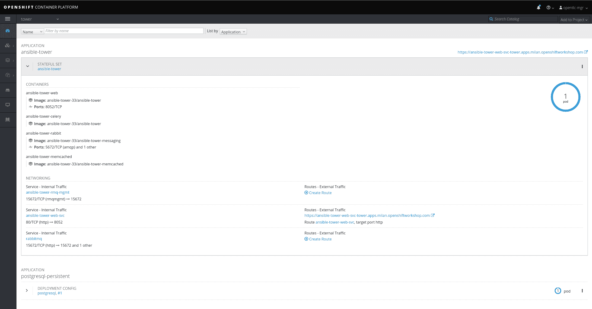
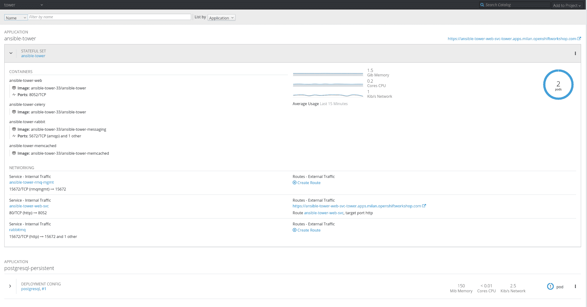

# 如何在红帽 OpenShift 上安装 Ansible Tower

> 原文：<https://developers.redhat.com/blog/2018/10/26/installing-and-managing-ansible-tower-on-red-hat-openshift-container-platform>

在本文中，我将展示如何在 [Red Hat OpenShift 容器平台](https://developers.redhat.com/products/openshift/)上安装和管理 [Red Hat Ansible Tower](https://www.redhat.com/en/technologies/management/ansible) 。Ansible Tower 可帮助您扩展 IT 自动化，管理复杂的部署，并提高工作效率。您可以通过可视化仪表板集中和控制您的 IT 基础架构，它提供基于角色的访问控制、作业调度、集成通知、图形化库存管理等。

您可能知道，Ansible Tower 3.3 是这个自动化平台的最新版本，它于几周前发布，并添加了新功能。从[发行说明](https://docs.ansible.com/ansible-tower/latest/html/release-notes/relnotes.html#ansible-tower-version-3-3-0)中，你会看到 Ansible Tower 3.3 在 OpenShift 上增加了对基于容器的安装的支持

在这篇博客中，我们将看到在 OpenShift 上设置 Ansible Tower 3.3 并让它作为一个[容器](https://developers.redhat.com/blog/category/containers/)在几分钟内运行是多么容易。

## 流程概述

我们将遵循以下步骤:

1.  登录现有的 OpenShift 安装。
2.  创建一个将安装 Ansible Tower 的专用项目。
3.  创建一个永久卷声明(PVC ),如果还没有，创建一个物理卷(PV)。
4.  开始安装过程。
5.  最后，使用 Ansible Tower 作为服务并执行横向扩展。

## 资源和需求

请参考以下资源:

*   [OpenShift 部署和配置](https://docs.ansible.com/ansible-tower/3.3.0/html/administration/openshift_configuration.html)
*   [下载 Ansible tower OpenShift 设置脚本](https://releases.ansible.com/ansible-tower/setup_openshift/)

[OpenShift 部署和配置](https://docs.ansible.com/ansible-tower/3.3.0/html/administration/openshift_configuration.html)中提到的对 OpenShift 上的 Ansible 塔的要求是:

*   红帽 OpenShift 3.6+版
*   每个 pod 的默认资源要求:
    *   6GB 内存
    *   3 个彩色 CPU
*   运行安装程序的机器上的 OpenShift 命令行工具(`oc`)
*   设置和运行 OpenShift 集群
*   运行 OpenShift 安装程序的帐户的管理员权限

## 程序

因此，让我们开始在 OpenShift 上创建 Ansible Tower 先决条件。首先，让我们登录:

```
$ oc login myamazingopenshiftcluster -u myuser -p mypassword
Username: myuser
Password:
Login successful.

You have access to the following projects and can switch between them with 'oc project <projectname>':

*default
kube-public
kube-service-catalog
kube-system
management-infra
ocp-workshop
openshift
openshift-ansible-service-broker
openshift-infra
openshift-logging
openshift-node
openshift-sdn
openshift-template-service-broker
openshift-web-console

Using project "default".

The server uses a certificate signed by an unknown authority.
You can bypass the certificate check, but any data you send to the server could be intercepted by others.
Use insecure connections? (y/n): y

Login successful.
```

让我们创建一个名为`tower`的新项目:

```
$ oc new-project tower

Now using project "tower" on server "https://myamazingopenshiftcluster :443".

You can add applications to this project with the 'new-app' command. For example, try:

$ oc new-app centos/ruby-22-centos7~https://github.com/openshift/ruby-ex.git

to build a new example application in Ruby.

```

作为额外的先决条件，Ansible Tower 要求 Postgres 数据库使用 PVC 来持久存储其数据。

在我们的示例中，我们将使用此 YAML 文件创建一个 10 GB 的 PVC:

```
$ cat postgres-nfs-pvc
apiVersion: v1
kind: PersistentVolumeClaim
metadata:
name: postgresql
spec:
accessModes:
- ReadWriteOnce
resources:
requests:
storage: 10Gi
```

现在我们可以要求 OpenShift 为我们创建 PVC:

```
$ oc create -f postgres-nfs-pvc

persistentvolumeclaim "postgresql" created
```

我们的 PVC 将绑定到与访问方法和大小相匹配的 PV。

如果您没有将被我们的 PVC 声明的 PV，您可以按照官方的 [OpenShift 文档](https://access.redhat.com/documentation/en-us/openshift_container_platform/3.11/html-single/developer_guide/#dev-guide-volumes)来创建它。

```
$ oc get pvc

NAME         STATUS VOLUME    CAPACITY ACCESS MODES   STORAGECLASS AGE
postgresql   Bound  vol118    10Gi     RWO,RWX        2s
```

最后，您必须[下载安装设置 tar 文件](https://releases.ansible.com/ansible-tower/setup_openshift/)，解压缩它，然后执行以下命令:

```
$ ./setup_openshift.sh -e openshift_host=https://myamazingopenshiftcluster:443 -e openshift_project=tower -e openshift_user=myuser -e openshift_password=mypassword -e admin_password=toweradminpwd-e secret_key=mysecret -e pg_username=postgresuser -e pg_password=postgrespwd -e rabbitmq_password=rabbitpwd -e rabbitmq_erlang_cookie=rabbiterlangpwd
```

`setup_openshift.sh`脚本将执行一些可翻译的剧本，这些剧本将通过创建您的 pod、服务和路线来为您管理整个安装。

仅此而已！几分钟后，Ansible Tower 将开始运行。

[](https://developers.redhat.com/blog/wp-content/uploads/2018/10/img_5bc098d45dc2b.png)

现在让我们研究一下 Ansible Tower 是如何安装的。您可能从 UI 中注意到，有一个由四个容器组成的 pod，通过一个`StatefulSet`来管理。

从 CLI 运行以下命令:

```
$ oc describe sts ansible-tower
Name: ansible-tower
Namespace: tower
CreationTimestamp: Tue, 09 Oct 2018 17:14:51 +0200
Selector: app=ansible-tower,name=ansible-tower-web-deploy,service=django
Labels: app=ansible-tower
name=ansible-tower-web-deploy
service=django
Annotations: kubectl.kubernetes.io/last-applied-configuration={"apiVersion":"apps/v1beta1","kind":"StatefulSet","metadata":{"annotations":{},"name":"ansible-tower","namespace":"tower"},"spec":{"replicas":1,"templa...
Replicas: 1 desired | 1 total
Pods Status: 1 Running / 0 Waiting / 0 Succeeded / 0 Failed
Pod Template:
Labels: app=ansible-tower
name=ansible-tower-web-deploy
service=django
Service Account: awx
Containers:

*output truncated*
```

正如您可能注意到的,`Replicas`值是 1，所以将运行一个 pod(即一个 Ansible Tower 实例)。

好的一面是，如果你可以增加你的副本数量，安斯比尔塔也会相应的增加！

您可以通过使用 UI 并编辑 YAML 文件或者使用`oc`来管理这一更改。

看看目前的状况:

```
$ oc get sts
NAME          DESIRED CURRENT AGE
ansible-tower 1       1       3d
```

以下是向上扩展的方法:

```
$ oc scale --replicas=2 sts ansible-tower
statefulset "ansible-tower" scaled
```

现在再次检查运行配置:

```
$ oc get sts
NAME          DESIRED CURRENT AGE
ansible-tower 2       2       3d
```

下面是 web 控制台现在显示的内容:

[](https://developers.redhat.com/blog/wp-content/uploads/2018/10/img_5bc0d47b8f34d.png)

仅此而已！如果你想看这个过程的简短演示，可以看看这个视频:

[https://www.youtube.com/embed/o-OrUq6FAe0?autoplay=0&start=0&rel=0](https://www.youtube.com/embed/o-OrUq6FAe0?autoplay=0&start=0&rel=0)

*Last updated: October 12, 2020*