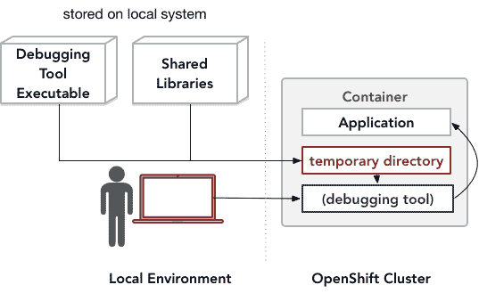

# 使用 oc-inject 将调试工具安装到 Red Hat OpenShift 容器中

> 原文：<https://developers.redhat.com/blog/2020/01/15/installing-debugging-tools-into-a-red-hat-openshift-container-with-oc-inject>

前一篇文章，[在 Red Hat OpenShift 容器中调试应用程序，](https://developers.redhat.com/blog/2020/01/09/debugging-applications-within-red-hat-openshift-containers/)概述了用于在 [Red Hat OpenShift](https://developers.redhat.com/openshift/) 容器中调试应用程序的工具，以及对它们的使用的现有限制。在那篇文章中讨论的一个限制是，一旦调试工具包被实例化，就不能将它安装到普通的无特权容器中。在这样的容器中，当构建容器映像时，必须包括调试工具包，因为一旦实例化了容器，使用包安装命令就需要提升特权，这对于普通容器用户是不可用的。

然而，在一些重要的情况下，需要将调试工具安装到已经实例化的容器中。特别是，如果问题的解决需要访问长时间运行的容器化应用程序的临时状态，那么通过重建容器映像并重启应用程序来向容器添加调试工具的常用方法将会破坏该临时状态。

为了提供一种向非特权容器添加调试工具的方法，我开发了一个名为`oc-inject`的实用程序，它可以临时将调试工具复制到容器中。`oc-inject`的实现不依赖于包管理或其他特权操作，而是基于现有的、得到良好支持的 OpenShift 操作`oc rsync`和`oc exec`，它们不需要任何提升的特权。

本文描述了`oc-inject`实用程序的当前功能，它可以通过 Fedora COPR 库在 GitHub 或[上](https://copr.fedorainfracloud.org/coprs/serhei/oc-inject/)[获得。`oc-inject`实用程序可以在任何 Linux 系统上工作，包括 Python 3、`ldd`实用程序和 Red Hat OpenShift 命令行工具`oc`。](https://github.com/serhei/oc-inject/)

## `oc-inject`如何工作

`oc-inject`是一个命令行实用程序，可以从任何本地 Linux 系统调用，该系统已经配置为通过`oc`命令行工具与 OpenShift 集群通信。`oc-inject`实用程序具有以下命令行语法:

```
oc-inject <pod_ID> <executable>

```

这里，`pod_ID`是 OpenShift 容器的名称，`executable`是本地系统上可执行文件的名称。

`oc-inject`实用程序将指定的可执行文件安装到容器中，然后运行它。由`oc-inject`安装的可执行文件可能是一个调试工具或另一个系统实用程序，否则在容器中是不可用的。

例如，使用`oc-inject`，我们可以安装并运行`htop`实用程序，以便可视化容器`myapp-rxxrw`中进程的 CPU 和内存使用情况(如图 1 所示):

```
$ oc-inject -it myapp-rxxrw htop

```

[](/sites/default/files/blog/2019/12/oc-inject-for-blog-final.png)Figure 1: The flow of an `oc-inject` operation.">

`oc-inject`实用程序的操作如下:

1.  首先，`oc-inject`使用 [`ldd`](http://man7.org/linux/man-pages/man1/ldd.1.html) 实用程序来识别可执行文件所需的共享库集合。
2.  其次，`oc-inject`调用 OpenShift [`oc rsync`](https://docs.openshift.com/container-platform/4.2/nodes/containers/nodes-containers-copying-files.html) 命令，将可执行文件和标识的共享库复制到容器内的临时目录中。
3.  最后，`oc-inject`调用 [`oc exec`](https://docs.openshift.com/container-platform/4.2/nodes/containers/nodes-containers-remote-commands.html) 命令运行可执行文件。为了让可执行文件使用临时目录中的共享库，`oc-inject`将可执行文件的`LD_LIBRARY_PATH`环境变量设置到这个目录中。

重要的是要记住，如果`oc-inject`安装的可执行文件依赖于共享库以外的文件，`oc-inject`不会将这些文件复制到容器中。这个限制缩小了可以用`oc-inject`安装的可执行文件的范围。但实际操作中，常用的调试工具如`gdbserver`、`strace`只需要共享库，使用`oc-inject`就可以成功安装运行。

下面的例子说明了如何安装和使用`gdbserver`和`strace`调试工具来观察容器化应用程序的行为。这些例子中的过程是在一个 OpenShift 4.2.8 集群上测试的，该集群由 [CodeReady Containers 1.2.0](https://github.com/code-ready/crc) 管理。

## 示例 1:使用`strace`跟踪 PostgreSQL 进程中的系统调用

1.  基于来自[software-collections.org](https://www.softwarecollections.org/)资源库的 [`rails-ex`](https://github.com/sclorg/rails-ex) 应用程序模板创建一个 OpenShift 应用程序:

```
$ git clone https://github.com/sclorg/rails-ex
$ oc new-app rails-ex/openshift/templates/rails-postgresql.json -p SOURCE_REPOSITORY_URL=https://github.com/sclorg/rails-ex

```

该模板创建了几个容器，包括一个带有 PostgreSQL 数据库的容器。

2.  运行`oc get pods`和`ps -ax`来识别 PostgreSQL 容器的名称和容器中进程的 PID:

```
$ oc get pods
NAME                                  READY   STATUS      RESTARTS   AGE
postgresql-1-deploy                   0/1     Completed   0          4m23s
postgresql-1-jfg52                    1/1     Running     0          4m8s
rails-postgresql-example-1-build      0/1     Completed   0          4m24s
rails-postgresql-example-1-deploy     0/1     Completed   0          72s
rails-postgresql-example-1-gg5hm      1/1     Running     0          26s
rails-postgresql-example-1-hook-pre   0/1     Completed   0          63s
$ oc exec -it postgresql-1-jfg52 -- ps -ax
    PID TTY      STAT   TIME COMMAND
      1 ?        Ss     0:00 postgres
     62 ?        Ss     0:00 postgres: logger process   
     64 ?        Ss     0:00 postgres: checkpointer process   
     65 ?        Ss     0:00 postgres: writer process   
     66 ?        Ss     0:00 postgres: wal writer process   
     67 ?        Ss     0:00 postgres: autovacuum launcher process   
     68 ?        Ss     0:00 postgres: stats collector process   
     69 ?        Ss     0:00 postgres: bgworker: logical replication launcher   
    391 ?        Ss     0:00 postgres: userY5Q root 10.128.0.190(39754) idle
    414 ?        Ss     0:00 postgres: userY5Q root 10.128.0.190(39882) idle
    481 pts/0    Rs+    0:00 ps -ax

```

3.  我们对跟踪 PostgreSQL 工作进程之一发出的系统调用感兴趣。`ps -ax`的输出列出了两个这样的过程，PID 为 391 和 414。对于这个例子，我们将使用 PID 414 来跟踪这个过程。我们调用`oc-inject`将一个`strace`可执行文件安装到容器中:

```
$ oc-inject -it postgresql-1-jfg52 -- strace -p 414
/tmp/oc-inject-af154698/strace: Process 414 attached
epoll_wait(3, [{EPOLLIN, {u32=34512144, u64=34512144}}], 1, -1) = 1
recvfrom(11, "Q\0\0\0\rSELECT 1\0", 8192, 0, NULL, NULL) = 14
sendto(10, "\2\0\0\0\230\0\0\0\1@\0\0\1\0\0\0\2\0\0\0\0\0\0\0\0\0\0\0\0\0\0\0"..., 152, 0, NULL, 0) = 152
sendto(11, "T\0\0\0!\0\1?column?\0\0\0\0\0\0\0\0\0\0\27\0\4\377\377\377\377"..., 66, 0, NULL, 0) = 66
recvfrom(11, "P\0\0\0+\0SELECT \"articles\".* FROM \""..., 8192, 0, NULL, NULL) = 81
lseek(15, 0, SEEK_END)                  = 8192
lseek(16, 0, SEEK_END)                  = 16384
lseek(15, 0, SEEK_END)                  = 8192
sendto(11, "1\0\0\0\0042\0\0\0\4T\0\0\0\204\0\5id\0\0\0@\24\0\1\0\0\0\27\0\4"..., 268, 0, NULL, 0) = 268
recvfrom(11, 0xcad700, 8192, 0, NULL, NULL) = -1 EAGAIN (Resource temporarily unavailable)
epoll_wait(3, [{EPOLLIN, {u32=34512144, u64=34512144}}], 1, -1) = 1
...
^C
/tmp/oc-inject-af154698/strace: Process 414 detached
 <detached ...>
command terminated with exit code 130

```

因此，我们获得了 PostgreSQL 进程和底层操作系统之间交互的痕迹。

## 示例 2:通过使用`gdbserver`附加到 SDT 标记来跟踪 PostgreSQL 的内部行为

在本例中，我们演示了如何从 PostgreSQL 进程中收集跟踪数据。为了做到这一点，我们使用静态定义的跟踪(SDT)标记，它标识流程中的各种高级事件。事件的 SDT 标记有一个参数列表，为调试工具提供有关事件的信息。

> **注意:**很多应用、库、运行时都提供了内置的 SDT 标记，可以被 GDB 追踪，包括 PostgreSQL、MySQL、MariaDB 数据库引擎；核心系统库如`glibc`；以及 Python、Ruby、Java 和 Node.js 的语言运行时。在 [SystemTap wiki](https://sourceware.org/systemtap/wiki/) 上维护了带有 SDT 标记的应用和库的更全面列表。除了[GDB 官方文档](https://sourceware.org/gdb/onlinedocs/gdb/Static-Probe-Points.html)之外，Sergio Durigan Junior ( [第 2 部分](https://blog.sergiodj.net/2012/10/27/gdb-and-systemtap-probes-part-2.html)、[第 3 部分](https://blog.sergiodj.net/2012/11/02/gdb-and-systemtap-probes-part-3.html))的一个更早的[博客系列](https://blog.sergiodj.net/2012/03/29/gdb-and-systemtap-probes-part-1.html)给出了更多关于 GDB 支持跟踪 SDT 标记的信息。

PostgreSQL 内置的 SDT 标记识别各种高级数据库事件。PostgreSQL 文档为[提供了可用标记](https://www.postgresql.org/docs/10/dynamic-trace.html)和相关参数的完整描述。

以下步骤说明了如何使用`gdbserver`收集 SDT 跟踪数据:

1.  按照示例 1 第一步中描述的相同过程启动一个容器化的 PostgreSQL 进程。
2.  在容器外启动 GDB 会话:

```
$ gdb
GNU gdb (GDB) Fedora 8.2-6.fc29
Copyright (C) 2018 Free Software Foundation, Inc.
License GPLv3+: GNU GPL version 3 or later <http://gnu.org/licenses/gpl.html>
This is free software: you are free to change and redistribute it.
There is NO WARRANTY, to the extent permitted by law.
Type "show copying" and "show warranty" for details.
(gdb)

```

3.  调用`oc-inject`在容器中安装并运行`gdbserver`，并指示 GDB 会话连接到`gdbserver`的标准输入和输出:

```
(gdb) target extended-remote | oc-inject -i postgresql-1-jfg52 -- gdbserver --multi -
Remote debugging using | oc-inject -i postgresql-1-jfg52 -- gdbserver --multi -
Remote debugging using stdio
(gdb)

```

4.  指示正在运行的`gdbserver`附加到所需的 PostgreSQL 工作进程(本例中为 PID 391):

```
(gdb) attach 391
Attaching to process 391
Attached; pid = 391
Reading /opt/rh/rh-postgresql10/root/usr/bin/postgres from remote target...
warning: File transfers from remote targets can be slow. Use "set sysroot" to access files locally instead.
Reading /opt/rh/rh-postgresql10/root/usr/bin/postgres from remote target...
Reading symbols from target:/opt/rh/rh-postgresql10/root/usr/bin/postgres...Reading /opt/rh/rh-postgresql10/root/usr/bin/postgres.debug from remote target...
Reading /opt/rh/rh-postgresql10/root/usr/bin/.debug/postgres.debug from remote target...
Missing separate debuginfo for target:/opt/rh/rh-postgresql10/root/usr/bin/postgres
Try: dnf --enablerepo='*debug*' install /usr/lib/debug/.build-id/14/1c5e620c9ea33d7e9214b6e4d5a4d4519e4a10.debug
Reading symbols from .gnu_debugdata for target:/opt/rh/rh-postgresql10/root/usr/bin/postgres...(no debugging symbols found)...done.
(no debugging symbols found)...done.
...
0x00007fee94155973 in __select_nocancel () from target:/lib64/libc.so.6

```

5.  在附加到进程之后，使用 GDB 的`info probes`命令获得可用 SDT 标记的列表:

```
(gdb) info probes
...
stap postgresql query__rewrite__start              0x00000000007189fd 0x0000000000cac470 target:/opt/rh/rh-postgresql10/root/usr/bin/postgres 
stap postgresql query__start                       0x0000000000718c45 0x0000000000cac464 target:/opt/rh/rh-postgresql10/root/usr/bin/postgres 
stap postgresql smgr__md__read__done               0x00000000007142c5 0x0000000000cac42a target:/opt/rh/rh-postgresql10/root/usr/bin/postgres 
...

```

6.  定义一个将在`query__start`标记上触发的跟踪点，该标记标识流程开始执行数据库查询的事件:

```
(gdb) trace -probe-stap query__start
Tracepoint 1 at 0x718c45

```

正如在 [PostgreSQL 文档](https://www.postgresql.org/docs/10/dynamic-trace.html)中所描述的，`query__start`标记通过类型`char *`的参数返回查询字符串。在 GDB 会话中，这个参数可以通过标识符`$_probe_arg0`引用。

7.  定义我们希望 GDB 在跟踪点触发时采取的操作。假设我们希望 GDB 收集`query__start` SDT 标记的查询字符串参数的值。为此，我们必须指示 GDB 收集参数的值以及该值所指向的内存位置:

```
(gdb) actions 1
>collect $_probe_arg0
>collect *(unsigned char *)$_probe_arg0@512
>end

```

8.  在程序继续运行时，使用 GDB 关于 [`tracepoints`](https://sourceware.org/gdb/onlinedocs/gdb/Tracepoints.html#Tracepoints) 的文档中描述的`tstart`命令收集跟踪数据；

```
(gdb) tstart
(gdb) continue &

```

9.  随着程序继续运行，GDB 将继续收集跟踪数据。要查看收集的数据，中断程序并使用`tfind`命令浏览收集的跟踪数据:

```
(gdb) interrupt
(gdb) tstatus
Trace is running on the target.
Collected 18 trace frames.
Trace buffer has 5229992 bytes of 5242880 bytes free (0% full).
Trace will stop if GDB disconnects.
Not looking at any trace frame.
Trace started at 7393.098048 secs, stopped -111.-534238 secs later.
(gdb) tstop
(gdb) tfind start
Found trace frame 0, tracepoint 1
#0  0x0000000000718c45 in exec_simple_query ()
(gdb) print/x $_probe_arg0
$1 = 0x1763358
(gdb) tdump
Data collected at tracepoint 1, trace frame 0:
$_probe_arg0 = 24523608
*(unsigned char *)$_probe_arg0@512 = "SELECT 1\000\000\000ticles\".* FROM \"articles\"\000\000\000\000CT indrelid, indkey, generate_subscripts(indkey, 1) idx\n", ' ' <repeats 11 times>, "FROM pg_index\n          WHERE indrelid = '\"articles\"'::regclass\n", ' ' <repeats 12 times>, "AND indisprimary\n"...
(gdb) while ($trace_frame != -1)
>tfind
>tdump
>end
...
Found trace frame 10, tracepoint 1
Data collected at tracepoint 1, trace frame 10:
$_probe_arg0 = 24523608
*(unsigned char *)$_probe_arg0@512 = "BEGIN\000\000\000\000\000\000\002\000\000\000\001\062\000\000\000\001\061\000\001\000\000\000         SELECT indrelid, indkey,     generate_subscripts(indkey, 1) idx\n", ' ' <repeats 11 times>, "FROM pg_index\n          WHERE indrelid = '\"comments\"'::regclass\n", ' ' <repeats 12 times>, "AND     indisprimary\n"...
Found trace frame 11, tracepoint 2
Data collected at tracepoint 2, trace frame 11:
Found trace frame 12, tracepoint 1
Data collected at tracepoint 1, trace frame 12:
$_probe_arg0 = 24523608
*(unsigned char *)$_probe_arg0@512 = "COMMIT\000\000\000\000\000\000\000\000\000\005\000\000\000\021This is a comment\000\000\000\vRead     me!\000\000\000\001\062\000\000\000\032\062\060\061\071-11-27 19:49:34.771435\000\000\000\032\062\060\061\071-11-27 19:49:34.771435\000\001\000\000\000ING \"id\"\000\000\005",     '\000' <repeats 21 times>, "ents\"'::regclass\n", ' ' <repeats 12 times>, "AND indisprimary\n"...

```

因此，我们使用 SDT 标记来提取 PostgreSQL 过程中的事件信息。在我们观察完这个 PostgreSQL 进程后，使用 GDB 的 [`monitor exit`](https://sourceware.org/gdb/onlinedocs/gdb/Connecting.html) 命令来停止容器内的`gdbserver`进程:

```
(gdb) detach
(gdb) monitor exit
(gdb) ^D

```

## 结论

本文中的例子说明了当前版本的`oc-inject`如何增加调试容器化应用程序的选项。

*Last updated: June 29, 2020*