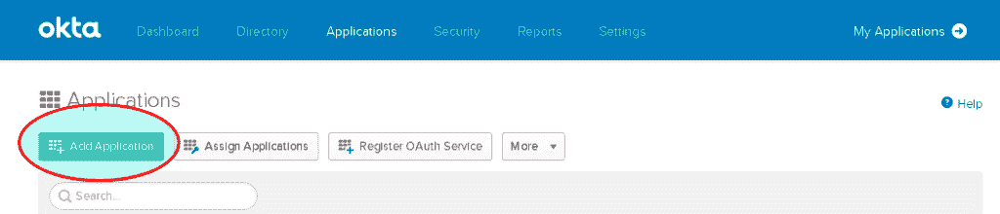
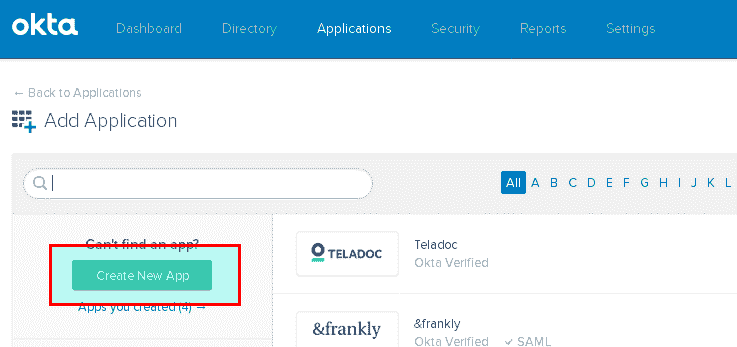
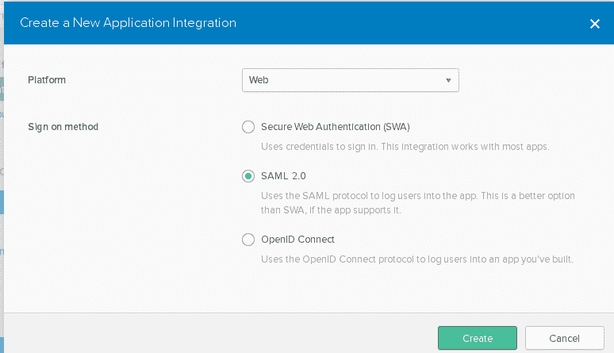
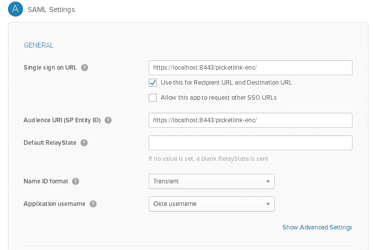
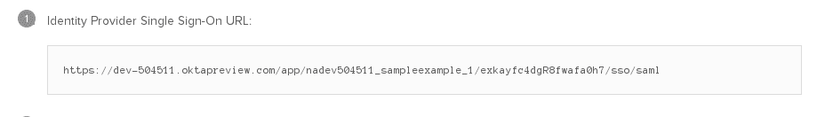
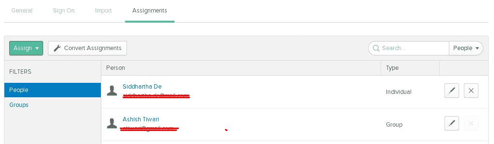

# 为基于 SAML 的单点登录集成 PicketLink 和 OKTA

> 原文：<https://developers.redhat.com/blog/2017/08/17/integrating-picketlink-with-okta-for-saml-based-sso>

JBoss 应用服务器附带了用于启用基于`SAML`的单点登录的`PicketLink`模块。`PicketLink`是一个开源模块，它被`SAML v2.0`投诉，要了解更多关于‘picket link’的信息，请访问 picketlink.org。

现在的要求是在 JBoss 应用服务器中启用基于 SAML 的 SSO，其中 IDP 是 [OKTA](http://developer.okta.com) 。

在我们开始实现这一点之前，我们应该有一个`OKTA`组织，一个自由开发者组织可以在这里[创建](http://developer.okta.com/signup)。

如果您已经有一个 OKTA 组织，您需要按照下面的步骤设置一个 SAML 应用程序。

1.  登录您的 OKTA 组织，点击“管理”。
    
2.  点击应用程序。
    
3.  添加新的应用程序。
    
4.  创建新的应用程序。
    
5.  保持平台为 web，选择签名方法为 SAML 2.0，然后单击创建。
    
6.  为您的应用程序命名，然后单击 next。
7.  在本节中，您需要进行 SAML 配置。
    
8.  **注意:**这里我们没有使用任何高级设置，如果您希望您的断言被签名和加密，您可以检查高级设置。
9.  完成后，单击完成。更多信息可以参考 [OKTA 文档](https://developer.okta.com/standards/SAML/setting_up_a_saml_application_in_okta)。
10.  到了 PicketLink 配置的部分，你必须知道你的 SP 和 IDP url，你可以通过下面的步骤从 OKTA 找到你的 IDP URL。
    *   导航至应用程序导航至您新创建的应用程序。
    *   导航到“登录”选项卡并单击“查看设置说明”，您将找到“身份提供商单点登录 URL”。
        
11.  在 JBoss 应用服务器端，您可以尝试使用这个[应用](https://github.com/jboss-developer/jboss-picketlink-quickstarts/tree/master/picketlink-federation-saml-sp-post-basic/)，这里您只需要更改`picketlink.xml`中的 IDP url 并使用您在上一步中收到的 OKTA URL，您还需要更改 SP URL(https://localhost:8443/picket link-enc/)。确保在`jboss-web.xml`中将`context-root`设置为“picketlink-enc”。
12.  要登录应用程序，您需要在 OKTA 中为您创建的应用程序分配用户。
    
13.  现在，您可以通过 OKTA 认证来访问您的应用程序(https://localhost:8443/picket link-enc/)。

* * *

**点击这里快速上手 JBoss**[**EAP**](https://developers.redhat.com/products/eap/download/?intcmp=7016000000124dvAAA)**下载。**