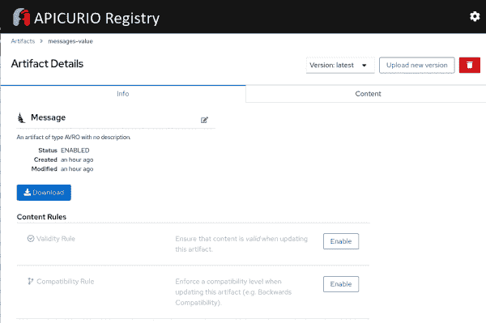

# 将 Spring Boot 与红帽集成服务注册中心集成

> 原文：<https://developers.redhat.com/blog/2021/02/15/integrating-spring-boot-with-red-hat-integration-service-registry>

大多数新的云原生应用和[微服务](https://developers.redhat.com/topics/microservices)设计都基于[事件驱动架构](https://developers.redhat.com/topics/event-driven/) (EDA)，通过发送和接收关于单个事件的信息来响应实时信息。这种架构依赖于事件生产者和消费者之间的异步、无阻塞通信，通过一个事件流主干，如运行在[红帽 OpenShift](https://developers.redhat.com/products/openshift/overview) 之上的[红帽 AMQ 流](https://developers.redhat.com/blog/2019/12/04/understanding-red-hat-amq-streams-components-for-openshift-and-kubernetes-part-1/)。在管理许多不同事件的场景中，定义一个将每个事件定义为 API 的治理模型是至关重要的。这样，生产者和消费者可以生产和消费经过检查和验证的事件。我们可以使用服务注册中心作为定义为 API 的事件的数据存储。

根据我与许多客户合作的现场经验，我发现最典型的架构由以下组件组成:

*   AMQ 流式部署 [Apache Kafka](https://developers.redhat.com/topics/kafka-kubernetes) 集群作为流式主干。
*   [Apicurio 注册表](https://www.apicur.io/registry/)用于将事件存储为 API。
*   [Red Hat OpenShift 容器平台](https://developers.redhat.com/courses/openshift/getting-started)部署并运行不同的组件。
*   [Spring Boot](https://developers.redhat.com/topics/spring-boot) 作为开发 [Java](https://developers.redhat.com/topics/enterprise-java) 客户端应用的框架。
*   Avro 作为数据序列化系统将模式声明为事件 API。

在本文中，您将了解如何轻松地将您的 Spring Boot 应用程序与基于开源的 [Apicurio Registry](https://github.com/apicurio/apicurio-registry) 的[Red Hat Integration Service Registry](https://developers.redhat.com/blog/2019/12/16/getting-started-with-red-hat-integration-service-registry/)集成。

## 红帽集成服务注册中心

Service Registry 是一个数据存储库，用于跨 API 和事件驱动架构共享标准事件模式和 API 设计。Service Registry 将您的数据结构从客户端应用程序中分离出来，以便您可以在运行时共享和管理您的数据类型和 API 描述。它还通过减少整体消息大小来降低成本，并通过在整个组织中增加模式和 API 设计的一致性重用来提高效率。

服务注册的一些最常见的用例是:

*   客户端应用程序在运行时向服务注册中心动态推送或从服务注册中心获取最新的模式更新，而无需重新部署。
*   开发人员团队在注册中心查询已经部署在生产环境中的服务所需的现有模式。
*   开发团队注册开发或生产中新服务所需的新模式。
*   用于序列化和反序列化消息的存储架构。客户端应用程序可以引用存储的模式，以确保它们发送和接收的消息与模式兼容。

服务注册中心提供以下主要功能:

*   支持标准事件模式和 API 规范的多种有效负载格式。
*   可插拔存储选项，包括 AMQ 流、嵌入式 Infinispan 内存数据网格和 PostgreSQL 数据库。
*   使用 web 控制台、REST API 命令、Maven 插件或 Java 客户端进行注册表内容管理。
*   管理注册中心内容如何发展的内容验证和版本兼容性规则。
*   支持 Apache Kafka 模式注册表，包括针对外部系统的 [Kafka Connect](https://developers.redhat.com/blog/2020/02/14/using-secrets-in-apache-kafka-connect-configuration/) 集成。
*   客户端串行化器/解串行化器( [SerDes](https://en.wikipedia.org/wiki/SerDes) )在运行时验证 Kafka 和其他消息类型。
*   一个云原生的 Quarkus Java 运行时,实现了低内存占用和快速部署。
*   与现有融合模式注册客户端应用程序的兼容性。
*   [基于操作员](https://developers.redhat.com/topics/kubernetes/operators)在 OpenShift 上安装。

## 客户端应用程序服务注册中心简介

向我们的体系结构引入新的服务注册中心的典型工作流程是:

1.  使用常见的数据格式声明事件模式，如 Apache Avro、JSON 模式、Google 协议缓冲区、OpenAPI、AsyncAPI、GraphQL、Kafka Connect 模式、WSDL 或 XML 模式(XSD)。
2.  使用 [Service Registry UI](https://developers.redhat.com/blog/2020/06/11/first-look-at-the-new-apicurio-registry-ui-and-operator/) 、REST API、Maven 插件或 Java 客户端将模式注册为服务注册中心中的工件。然后，客户端应用程序可以在运行时使用该模式来验证消息是否符合正确的数据结构。
3.  使用 Kafka producer 应用程序和序列化程序对符合特定事件模式的消息进行编码。
4.  使用 Kafka 消费应用程序和反序列化程序来验证消息已经使用基于特定模式 ID 的正确模式进行了序列化。

此工作流确保模式使用的一致性，并有助于防止运行时出现数据错误。

接下来的部分将使用 Spring Boot 应用程序在较高的层次上讨论这个工作流。参见本文的 GitHub 资源库，获取完整的示例应用程序源代码。

## 在服务注册表中注册 Avro 模式

Avro 提供了一个 [JSON 模式规范](https://avro.apache.org/docs/current/spec.html#schemas)来声明各种数据结构。这个简单的例子定义了一个消息事件:

```
{
  "name": "Message",
  "namespace": "com.rmarting.kafka.schema.avro",
  "type": "record",
  "doc": "Schema for a Message.",
  "fields": [
    {
      "name": "timestamp",
      "type": "long",
      "doc": "Message timestamp."
    },
    {
      "name": "content",
      "type": "string",
      "doc": "Message content."
    }
  ]
}
```

Avro 还提供了一个 [Maven 插件](https://avro.apache.org/docs/current/gettingstartedjava.html)来根据提供的模式定义自动生成 Java 类。avsc 文件)。

一旦我们有了一个模式，我们就可以在 Service Registry 中发布它。在注册表中发布模式可以让客户端应用程序在运行时使用它。 [Apicurio Registry Maven 插件](https://www.apicur.io/registry/docs/apicurio-registry/1.3.3.Final/getting-started/assembly-managing-registry-artifacts-maven.html)使得将我们的模式发布到 Service Registry 变得很容易。我们在`pom.xml`文件中添加了一个简单的定义:

```
<plugin>
   <groupId>io.apicurio</groupId>
   <artifactId>apicurio-registry-maven-plugin</artifactId>
   <version>${apicurio.version}</version>
   <executions>
      <execution>
         <phase>generate-sources</phase>
         <goals>
            <goal>register</goal>
         </goals>
         <configuration>
            <registryUrl>${apicurio.registry.url}</registryUrl>
            <artifactType>AVRO</artifactType>
            <artifacts>
               <!-- Schema definition for TopicIdStrategy strategy -->
               <messages-value>${project.basedir}/src/main/resources/schemas/message.avsc</messages-value>
            </artifacts>
         </configuration>
      </execution>
   </executions>
</plugin>
```

**注意**:通过 Apicurio Registry Maven 插件，我们可以使用 [Maven 构建生命周期](https://maven.apache.org/guides/introduction/introduction-to-the-lifecycle.html)来定义或扩展我们的应用生命周期管理和 [CI/CD](https://developers.redhat.com/topics/ci-cd) 管道。例如，我们可以扩展生命周期，以便在发布新版本时发布或更新模式。解释如何做到这一点不是本文的目的，但这是您可以探索的事情。

一旦我们将模式发布到 Service Registry，我们就可以从 Service Registry UI 中管理它，如图 1 所示。

[](/sites/default/files/blog/2020/09/img_5f58c2828d45e.png)

Figure 1: Manage your new schema in the Service Registry UI.

## 整合 Spring Boot，阿帕奇卡夫卡和 AMQ 流

Spring Boot 提供了 [Spring Kafka](https://spring.io/projects/spring-kafka) 项目，用于生成和使用来自 Apache Kafka 的消息。一旦我们在`pom.xml`文件中添加了以下依赖项，使用它就很简单了:

```
<dependency>
   <groupId>org.springframework.kafka</groupId>
   <artifactId>spring-kafka</artifactId>
</dependency>
```

将以下属性添加到您的`application.properties`文件中会将您的应用程序与 AMQ 流集群连接起来:

```
spring.kafka.bootstrap-servers = ${kafka.bootstrap-servers}
```

Service Registry 为 Kafka 生产者和消费者应用程序提供了 [Kafka 客户端序列化程序/反序列化程序](https://access.redhat.com/documentation/en-us/red_hat_integration/2020-q2/html-single/getting_started_with_service_registry/index#using-kafka-client-serdes)。包括以下依赖项，以便将它们添加到您的应用程序中:

```
<dependency>
   <groupId>io.apicurio</groupId>
   <artifactId>apicurio-registry-utils-serde</artifactId>
   <version>${apicurio.version}</version>
</dependency>
```

## 产生来自 Spring Boot 的信息

Spring Kafka 提供了一组属性和 beans 来声明 Kafka 生产者向 Apache Kafka 发送消息(这里是 Avro 模式实例)。两个最重要的属性是`spring.kafka.producer.key-serializer`，它标识序列化 Kafka 记录的键的序列化器类，以及`spring.kafka.producer.value-serializer`，它标识序列化 Kafka 记录的值的序列化器类。

我们必须在这些属性中添加特定的值，以便使用 Avro 模式的序列化过程可以在 Service Registry 中注册:

*   使用 Apicurio SerDe 类提供的 Avro 模式的序列化程序类:`io.apicurio.registry.utils.serde.AvroKafkaSerializer`。
*   用于验证模式的 Apicurio 服务注册表端点:`apicurio.registry.url`。
*   [Apicurio 服务策略](https://access.redhat.com/documentation/en-us/red_hat_integration/2020-q2/html-single/getting_started_with_service_registry/index#service-registry-concepts-strategy-service-registry)查找模式定义:`apicurio.registry.artifact-id`。

以下是生产者模板的配置示例:

```
# Spring Kafka Producer
spring.kafka.producer.key-serializer=org.apache.kafka.common.serialization.StringSerializer
spring.kafka.producer.value-serializer=io.apicurio.registry.utils.serde.AvroKafkaSerializer
spring.kafka.producer.properties.apicurio.registry.url = ${apicurio.registry.url}
spring.kafka.producer.properties.apicurio.registry.artifact-id = io.apicurio.registry.utils.serde.strategy.TopicIdStrategy
```

我们可以使用以下属性声明一个`KafkaTemplate`来发送消息(基于我们的`Message`模式):

```
@Bean
public ProducerFactory<String, Message> producerFactory(KafkaProperties kafkaProperties) {
    Map<String, Object> configProps = kafkaProperties.buildProducerProperties();

    return new DefaultKafkaProducerFactory<>(configProps);
}

@Bean
public KafkaTemplate<String, Message> kafkaTemplate(KafkaProperties kafkaProperties) {
    return new KafkaTemplate<>(producerFactory(kafkaProperties));
}
```

最后，我们可以向 Apache Kafka 发送消息(存储来自 Service Registry 的工件 ID ):

```
@Autowired
private KafkaTemplate<String, Message> kafkaTemplate;

SendResult<String, Message> record = kafkaTemplate.send(topicName, message).get();
```

消息将被序列化，添加与用于该记录的模式相关联的全局 ID。对于 Kafka 消费者应用程序来说，稍后消费全局 ID 是很重要的。

## 来自 Spring Boot 的消费信息

Spring Kafka 还提供了属性和 beans 来声明 Kafka 消费者使用来自 Apache Kafka 集群的消息(Avro 模式实例)。最重要的属性是`spring.kafka.consumer.key-deserializer`，它标识反序列化 Kafka 记录的键的反序列化器类，以及`spring.kafka.consumer.value-deserializer`，它标识反序列化 Kafka 记录的值的反序列化器类。

同样，我们必须添加特定的值—在这种情况下，允许使用在 Service Registry 中注册的 Avro 模式的反序列化过程:

*   使用 Avro 模式的反序列化器类，由 Apicurio SerDe 类提供:`io.apicurio.registry.utils.serde.AvroKafkaDeserializer`。
*   获取有效模式的第个 Apicurio 服务注册表端点:`apicurio.registry.url`。

下面是一个消费者模板的配置示例:

```
# Spring Kafka Consumer
spring.kafka.listener.ack-mode = manual
spring.kafka.consumer.group-id = spring-kafka-clients-sb-sample-group
spring.kafka.consumer.auto-offset-reset = earliest
spring.kafka.consumer.enable-auto-commit=false
spring.kafka.consumer.key-deserializer = org.apache.kafka.common.serialization.StringDeserializer
spring.kafka.consumer.value-deserializer = io.apicurio.registry.utils.serde.AvroKafkaDeserializer
spring.kafka.consumer.properties.apicurio.registry.url = ${apicurio.registry.url}
# Use Specific Avro classes instead of the GenericRecord class definition
spring.kafka.consumer.properties.apicurio.registry.use-specific-avro-reader = true
```

我们可以声明一个`KafkaListener`来消费消息(基于我们的`Message`模式)，如下所示:

```
@KafkaListener(topics = {"messages"})
public void handleMessages(@Payload Message message,
                           @Headers Map<String, Object> headers,
                           Acknowledgment acknowledgment) {
    LOGGER.info("Received record from Topic-Partition '{}-{}' with Offset '{}' -> Key: '{}' - Value '{}'",
            headers.get(KafkaHeaders.RECEIVED_TOPIC), headers.get(KafkaHeaders.RECEIVED_PARTITION_ID),
            headers.get(KafkaHeaders.OFFSET), headers.get(KafkaHeaders.MESSAGE_KEY),
            message.get("content"));

    // Commit message
    acknowledgment.acknowledge();
}
```

该模式由反序列化程序检索，反序列化程序使用写入正在使用的消息中的全局 ID。就这样，我们结束了！

## 摘要

在本文中，您已经看到了如何将 Spring Boot 应用程序与 Red Hat Integration Service Registry 和 AMQ 流集成，以构建您的事件驱动架构。将这些组件结合使用有以下好处:

*   客户端应用程序之间一致的模式使用。
*   帮助防止运行时出现数据错误。
*   数据模式中定义的治理模型(例如版本、规则和验证)。
*   易于与 Java 客户端应用程序和组件集成。

有关这些组件的更多信息，请参见 [Red Hat Integration](https://access.redhat.com/documentation/en-us/red_hat_integration/2020-q2/) 主页和[服务注册文档](https://access.redhat.com/documentation/en-us/red_hat_integration/2020-q2/html/getting_started_with_service_registry/index)。另外，请看 [*首先来看看新的 Apicurio 注册表 UI 和操作符*](https://developers.redhat.com/blog/2020/06/11/first-look-at-the-new-apicurio-registry-ui-and-operator/) ，了解更多关于在任何 [Kubernetes](https://developers.redhat.com/topics/kubernetes) 或 OpenShift 集群中使用服务注册表的信息。

*Last updated: February 12, 2021*