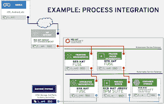

# 过程自动化的集成蓝图示例(第 7 部分)

> 原文：<https://developers.redhat.com/blog/2019/04/19/integration-blueprint-example-for-process-automation-part-7>

在本系列的[第 6 部分中，我们研究了决定您的集成如何成为转变客户体验的关键的细节。它从展示我如何通过研究成功的客户组合解决方案作为通用架构蓝图的基础来处理用例的过程开始。](https://developers.redhat.com/blog/2019/01/18/integration-of-storage-services-part-6/)

完成了对蓝图细节的讨论后，是时候看看几个具体的例子了。本文将带您浏览一个示例集成场景，展示扩展前面讨论的细节如何为您自己的集成场景提供蓝图。

### 蓝图场景

如前所述，这里涉及的架构细节基于使用开源技术的真实客户集成解决方案。这里展示的示例场景是在研究客户解决方案时发现的*通用通用蓝图*。我的意图是提供一个蓝图，提供指导，而不是深入的技术细节。

这一节涵盖了所呈现的视觉表现，但预计它们会随着时间的推移而发展。在这个建筑蓝图中，有许多方法来表示每个元素，但是我选择了图标、文本和颜色，我希望它们能让你更容易理解。欢迎在这篇文章的底部发表评论，或者[直接联系我](https://www.schabell.org/p/contact.html)提供您的反馈。

图 1:流程集成。

现在让我们来看看这个蓝图中的细节，并概述一下解决方案。

### 过程集成

图 1 中显示的示例蓝图概述了如何将自动化集成到您的架构中。在这个例子中，从顶部开始，使用一个移动设备通过 API 网关连接到您的服务。它利用一组微服务来提供*前端*功能，从推送通知、同步到前端应用程序服务其客户端所需的简单而复杂的活动。

这些*前端微服务*通过*集成微服务*从各种组织后端系统收集数据和信息。这里有意识地努力保持这个蓝图例子尽可能的简洁，因此各种潜在的*后端系统*的集成已经被简化到一个单独的代表框中。

当需要与流程自动化进行交互时，移动应用程序与*流程外观微服务*一起工作，这些微服务公开了*流程服务器*的任何功能，该流程服务器利用*容器本地存储*，突出了容器平台所特有的基于容器的存储选项。

### 第三方服务

图 2:与第三方服务的流程集成。

由于许多组织不得不在其架构中处理第三方遗留决策，因此展示开源集成技术提供的多功能性是有意义的。在开源集成解决方案中的开放标准为组织提供了瑞士军刀 的 [*多功能性，这很容易让人联想到隐喻。*](http://www.fundinguniverse.com/company-histories/victorinox-ag-history/)

图 2 所示的蓝图用一个第三方服务平台扩展了最初的流程集成用例。

在没有指定此*第三方服务平台*的情况下，很明显，利用*集成微服务*，组织可以从可能无法经受时间考验的传统技术选择中分离出来。

### 下一步是什么

本概述涵盖了全渠道客户体验用例流程集成的首个架构蓝图示例。

全渠道客户体验组合架构蓝图系列概述可在此处找到:

1.  [第 1 部分:整合如何成为客户体验的关键](https://developers.redhat.com/blog/2018/11/28/integration-is-key-to-customer-experience/)
2.  [第 2 部分:现代集成架构的通用架构元素](https://developers.redhat.com/blog/2018/11/30/common-architectural-elements-for-modern-integration-architectures/)
3.  [第三部分:外部应用细节的整合](https://developers.redhat.com/blog/2018/12/14/integration-of-external-application-details-part-3/)
4.  [第四部分:API 管理细节的整合](https://developers.redhat.com/blog/2018/12/20/integration-of-api-management-details-part-4/)
5.  [第五部分:集装箱平台要素集成](https://developers.redhat.com/blog/2019/01/04/integration-of-container-platform-essentials-part-5/)
6.  [第 6 部分:存储服务集成](https://developers.redhat.com/blog/2019/01/18/integration-of-storage-services-part-6/)
7.  第 7 部分:过程自动化的集成蓝图示例(本文)
8.  更多集成蓝图示例

通过上面的链接之一来补上你错过的任何文章。

在本系列的下一篇文章中，我们将开始研究更具体的集成架构蓝图，这些蓝图将我们作为全渠道客户体验架构中特定案例的一部分讨论的所有元素联系在一起。

*Last updated: May 13, 2021*