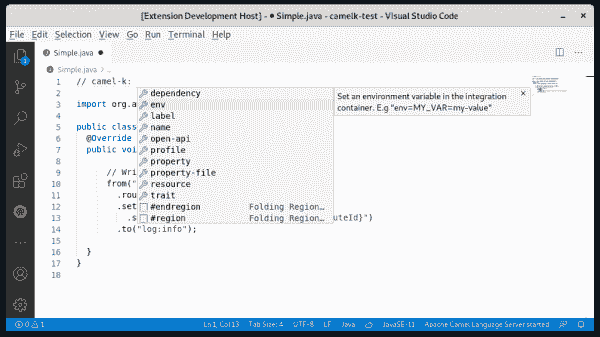
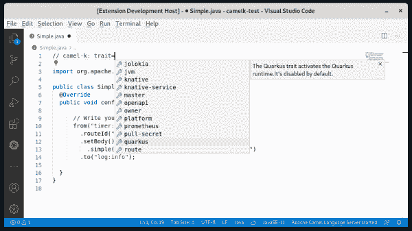
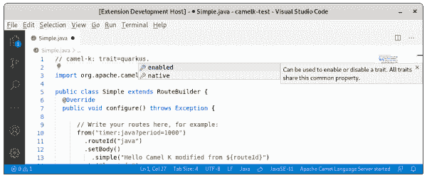
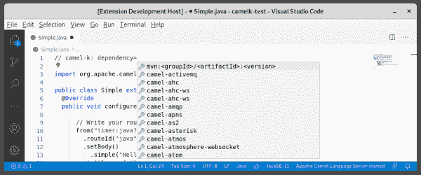
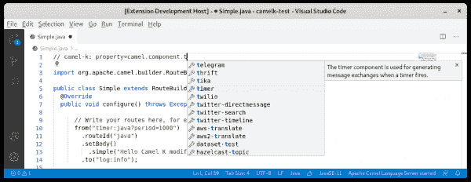
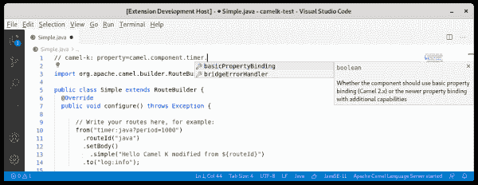

# 介绍对 Apache Camel K Modeline 的 IDE 支持

> 原文：<https://developers.redhat.com/blog/2020/08/31/introducing-ide-support-for-apache-camel-k-modeline>

Apache Camel K 是一个轻量级集成框架，构建在 [Apache Camel](https://camel.apache.org/) 之上，在 [Kubernetes](https://developers.redhat.com/topics/kubernetes) 上本地运行。Camel K 是专门为[无服务器](https://developers.redhat.com/topics/serverless-architecture)和[微服务](https://developers.redhat.com/topics/microservices)架构设计的，允许你在你的云上运行用 [Camel DSL](https://camel.apache.org/manual/latest/dsl.html) 编写的集成。

从 [Apache Camel K 1.0.0](https://camel.apache.org/blog/2020/06/camel-k-release-1.0.0/) 开始，可以使用 [Apache Camel K Modeline](https://camel.apache.org/camel-k/latest/cli/modeline.html) 指定用于启动集成路线的配置选项。只需在配置文件的顶部放置一个注释行`// camel-k:`。使用这种方法，您可以在单个文件中指定相对复杂的集成项目。

到目前为止，您只能通过命令行访问这些配置选项。在本文中，我将介绍对 Apache Camel K 的 Modeline 配置的新 IDE 支持。

## 对 Camel K Modeline 的 IDE 支持

多亏了[Apache Camel Language Server](https://github.com/camel-tooling/camel-language-server/)，你现在可以使用一个扩展来为[Visual Studio Code](https://code.visualstudio.com/)(VS Code)[Eclipse desktop IDEs](https://www.eclipse.org/ide/)和 [Eclipse Che](https://www.eclipse.org/che/) 添加 Camel K Modeline 支持。

[最有用的模型线选项](https://camel.apache.org/camel-k/latest/cli/modeline.html)可作为完井使用。如图 1 所示，您可以使用*悬停*特性来查看 VS 代码中这些特性的完成和文档。

[](/sites/default/files/blog/2020/07/Screenshot-from-2020-07-06-16-43-45.png)

Figure 1: Use the hover feature to view Modeline completions in your IDE.

让我们看一下 Modeline 配置中三个关键选项的完成和定义:trait、dependency 和 property。

### 特点

*特征*选项提出了特征定义名称和特征属性名称的完成。将鼠标悬停在一个特征名或属性名上可以显示它的文档。图 2 显示了所有特征完成选项以及其中一个选项的定义。

[](/sites/default/files/blog/2020/07/Screenshot-from-2020-07-06-16-44-17.png)

Figure 2: Trait completion options and a definition.

图 3 显示了完成选项和 trait 属性的定义。

[](/sites/default/files/blog/2020/07/Screenshot-from-2020-07-06-16-44-35.png)

Figure 3: Trait property completion options.

### 属国

*依赖项*选项为其他 Maven 指定的依赖项建议了 Camel 工件 id 和模板，如图 4 所示。

[](/sites/default/files/blog/2020/07/Screenshot-from-2020-07-06-16-44-52.png)

Figure 4: The completion options for Camel and Maven dependencies.

### 财产

*属性*选项提供 Camel 组件和属性的完成。您可以使用悬停功能来查看任何选定元素的文档。图 5 显示了 Camel 组件的完成选项。

[](/sites/default/files/blog/2020/07/Screenshot-from-2020-07-06-16-45-55.png)

Figure 5: Hover over a component to view its definition.

即使需要特定配置的集成也可以包含在一个文件中。

图 6 显示了 Camel 属性的完成选项。

[](/sites/default/files/blog/2020/07/Screenshot-from-2020-07-06-16-46-05.png)

Figure 6: Hover over a property to view its definition.

## 开发期间覆盖配置选项

Modeline 的配置包括生产配置，这是一个有用的特性。在开发过程中，您可以使用附加的或不同的参数。您可以使用附加参数从命令行手动启动集成。这样做可以避免修改源代码。

如果您想要多次启动同一个配置，或者与同事共享开发中的特定配置，您可以使用 VS 代码任务来实现这一目的。为此，在您的项目中创建一个名为`tasks.json`的文件，并将其放在一个`vscode`文件夹中。然后，您应该能够使用完成来访问特定于 Camel K 的 VS 代码任务。

这里有一个例子:

```
{
  "version": "2.0.0",
  "tasks": [
    {
    "label": "Start in dev mode Camel K integration opened in active editor",
    "type": "camel-k",
    "dev": true,
    "file": "${file}",
    "problemMatcher": []
    }
  ]
}

```

如果输入所需的 Camel K 选项，补全会提供可用的选项。当您调用“Start Apache Camel K integration”命令时，您可以设置“use predefined task”选项，以您需要的配置启动您的任务。

*Last updated: August 27, 2020*