# 低温恒温器介绍:集装箱用 JDK 飞行记录器

> 原文：<https://developers.redhat.com/blog/2021/01/25/introduction-to-containerjfr-jdk-flight-recorder-for-containers>

OpenJDK 长期以来一直是现实世界应用程序和工作负载的首选，因为它融合了性能、兼容性、可靠性和可观察性。多年来，JDK 飞行记录器(JFR)和 JDK 任务控制中心(JMC)为 OpenJDK 的成功做出了贡献。直到最近，这两个都是商业特性，但是，只适用于某些用户和工作负载。

**注**:本文已更新，以反映低温恒温器项目的名称从 ContainerJFR 更改为 Cryostat。

2018 年，JDK 任务控制和 JDK 飞行记录器被开源。JDK 飞行记录器现在内置于 Java 虚拟机(JVM)中，用于 OpenJDK 8 的后续版本以及 OpenJDK 11 以后的所有版本。开源这些工具为所有 JDK 用户带来了强大的功能——始终在线、几乎零开销的生产分析和监控、特定于应用的定制事件以及统一内核的 JDK 分析工具。不利的一面是，JDK 任务控制中心和 JDK 飞行记录器进入了一个迅速向集装箱化发展的世界，这不是它们的设计初衷。

仅限桌面的 JDK 任务控制应用程序要求开发人员和管理员访问本地磁盘上的飞行记录。否则，人们会求助于复杂且潜在不安全的设置，通过云中的 Java 管理扩展(JMX)直接连接到应用程序。类似地，以裸机为中心的 JDK 飞行记录器允许 JVM 将记录转储到本地文件系统中，但是当应用程序在容器中运行时就不行了。在这种情况下，文件系统不容易从外部访问，也不可能检索和分析记录。

本文介绍了[低温恒温器](https://github.com/cryostatio/cryostat)，一个正在成为红帽产品的年轻项目。Cryostat 试图在云中的 JDK 飞行记录器和终端用户工作站之间架起一座桥梁。

**关于 cryo stat**:cryo stat 以前被称为 ContainerJFR，是一个容器本地的 JVM 应用程序，它充当了到其他容器化 JVM 的 JMX 桥。Cryostat 公开了一个安全的 API，用于从云工作负载中生成、分析和检索 JDK 飞行记录器数据。

## 手动低温恒温器安装和设置

使用 [Quay.io](https://quay.io/repository/cryostat/cryostat) 上的可用图像，手动安装低温恒温器非常简单。运行以下程序进行基本安装和产品演示:

```
$ podman run -it --rm -p 8181 -e CRYOSTAT_WEB_HOST=0.0.0.0 [quay.io/cryostat/cryostat:latest](https://quay.io/cryostat/cryostat)
```

为了进行更全面的演示，您可以克隆低温恒温器储存库并运行它的`smoketest.sh`。以下内容在 Podman pod 中设置了几个容器，用于测试和演示:

```
$ git clone [https://github.com/cryostatio/cryostat](https://github.com/cryostatio/cryostat)

$ cd cryostat

$ sh smoketest.sh
```

在这种情况下，低温恒温器的证书是`smoketest:smoketest`。另一个应用程序的凭证是`admin:adminpass123`。

## 在 Red Hat OpenShift 上部署低温恒温器

如果您可以访问 [Red Hat OpenShift](/products/openshift) 或另一个 Kubernetes 集群，您可以使用[低温恒温器操作员](https://github.com/cryostatio/cryostat-operator)在您的集群上部署低温恒温器:

```
 $ git clone [https://github.com/cryostatio/cryostat-operator](https://github.com/cryostatio/cryostat-operator)

$ cd cryostat-operator

$ git checkout v1.0.0

$ oc login # ensure you are logged in to your running OpenShift cluster first

$ make cert_manager # cert-manager is used for SSL/TLS certificates to secure in-cluster traffic

$ make deploy # to directly deploy the Operator in your cluster along with a Cryostat CR, required ServiceAccount and Role/RoleBindings, etc.

$ make deploy_bundle # alternative to make deploy. This will deploy the Cryostat Operator Bundle to your cluster, allowing you to install the Operator from your Administrator view’s OperatorHub panel 

```

**注意**:如果你还没有访问 OpenShift 或 Kubernetes 集群的权限，试试[Red Hat code ready Containers](https://developers.redhat.com/products/codeready-containers/overview)。

图 1 显示了我们发出`$ make deploy_bundle`后 OpenShift OperatorHub 中的低温恒温器。

[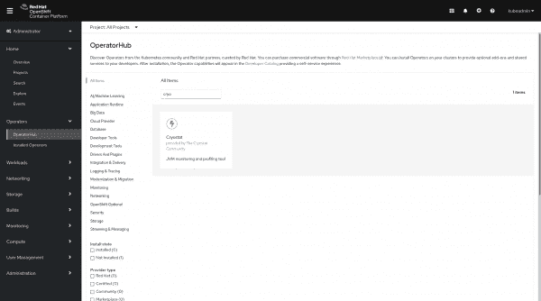](/sites/default/files/Screenshot%202021-07-28%20at%2010-49-18%20OperatorHub%20%C2%B7%20Red%20Hat%20OpenShift%20Container%20Platform.png)

Figure 1: Cryostat in the OpenShift OperatorHub.

图 2 显示了安装在默认名称空间中的 Cryostat 实例。

[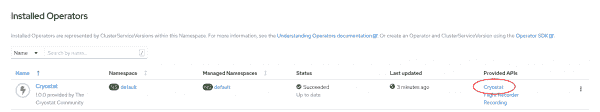](/sites/default/files/installed-operator-1.png)

Figure 2: Cryostat installed in a project namespace.

安装 Cryostat 后，为它创建一个定制资源，如图 3 所示。选择任何你喜欢的名字，暂时将**最小**设置为**假**。

[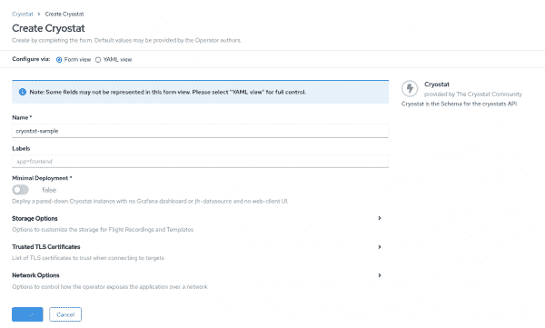](/sites/default/files/create-cryostat-cr.png)

Figure 3: Create and configure the Cryostat custom resource.

短时间后，低温恒温器操作员完成部署低温恒温器及其服务。您可以使用任何显示暴露路线 URL 的视图来查看 Cryostat web 客户端。图 4 显示了 OpenShift 拓扑视图中的低温恒温器。

[](/sites/default/files/topology-view.png)

Figure 4: Cryostat in the OpenShift Topology view.

接下来，我们将看看 Cryostat 的主要特性，我将向您展示如何为您的容器管理的 OpenJDK 应用程序配置它们。

## 低温恒温器的发现

Cryostat 是一个容器化的 JVM，它作为 OpenJDK 应用程序的“边车”运行。根据运行时环境，它会自动选择最佳策略来发现支持 JMX 的应用程序。对于使用`docker-compose`或`podman-compose`运行的应用程序，Cryostat 将使用 [Java 发现协议](https://docs.oracle.com/javase/10/management/java-discovery-protocol.htm)。对于运行在 Kubernetes 或 OpenShift 上的应用程序，它将使用端点。这些只是 Cryostat 目前提供的平台实施的例子。如果您需要对不同容器平台的定制支持，它很容易扩展。

### Java 管理扩展

确保您的应用程序启用了 JMX，并且 JMX 端口已发布，并且可由 Cryostat 访问。实际上，这意味着在启动应用程序时传递以下 JVM 标志:

```
 -Dcom.sun.management.jmxremote.port=9091 -Dcom.sun.management.jmxremote.rmi.port=9091 
```

然后，使用您的容器平台使用的任何机制来公开端口。在 OpenShift 或 Kubernetes 中，您将为您的部署创建一个服务，然后向该服务添加一个公开的端口。默认情况下，Cryostat 为 JMX 使用端口 9091，但是如果端口名为`jfr-jmx`，您可以使用任何端口号。

图 5 在 OpenShift 拓扑视图中显示了带有两个示例应用程序的 Cryostat。

[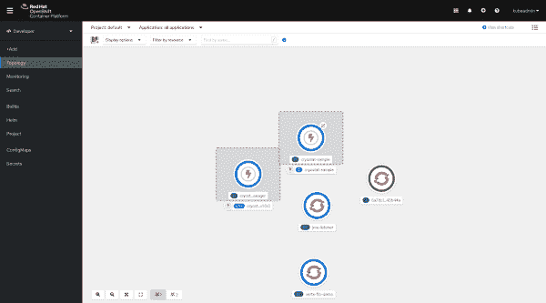](/sites/default/files/topology-with-apps.png)Cryostat with two sample applications in the topology view

Figure 5: Cryostat with two sample applications.

### Java 发现协议

如果您使用 Podman 或 Docker 运行，或者如果您直接在主机上运行本地 JVM 进程，您还应该启用 Java 发现协议:

```
 -Dcom.sun.management.jmxremote.autodiscovery=true 
```

## 低温恒温器中的事件模板

Cryostat 支持 JDK 飞行记录器事件模板，该模板预先设置要支持的事件类型和配置属性。使用事件模板简化了为应用程序捕获有意义数据的任务。Cryostat 还包括一个视图，该视图显示目标 JVM 的 JDK 飞行记录器框架中注册的所有事件类型。此视图在创建或修改您自己的事件模板时非常有用。

图 6 中的 Event Templates 视图显示了预设的事件模板，您可以将这些模板下载到本地机器上进行检查或修改。修改模板后，您可以上传它以供重复使用。您也可以从模板创建录像。

[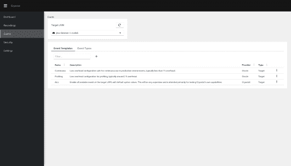](/sites/default/files/event-templates.png)The Templates view lists preset event templates that can be downloaded to your local machine and examined or modified. Modified templates can be uploaded for re-use. Recordings can be created from templates.

Figure 6: Event templates in Cryostat.

图 7 中的 Event Types 视图显示了向所选目标 JVM 注册的所有事件类型。您可以使用此视图按类别、关键词或提供商搜索事件。

[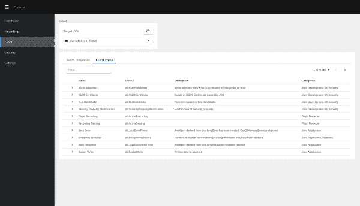](/sites/default/files/event-types.png)The Event Types view displays all of the event types registered with the selected target JVM and can be used to search for events by category, keyword, and provider.

Figure 7: Event types in Cryostat.

### 编辑模板

您可以使用 Cryostat 将模板从目标 JVM 下载到您的本地机器，然后用您喜欢的文本编辑器打开并检查模板 XML 文档。您甚至可以使用 JDK Mission Control 导入和编辑模板。图 8 显示了下载事件模板的对话框。

[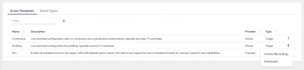](/sites/default/files/event-template-download.png)Figure 8: Download an event template to your local disk.

### 自定义模板

创建自定义模板或修改现有模板后，您可以将其重新上传至 Cryostat，该模板将被保留以备将来使用。每当您跨 JVM 应用程序创建新的记录时，您将能够应用该模板。

您可以使用任何纯文本编辑器打开和编辑事件模板。另一个选择是使用 JDK 任务控制的图形模板编辑器来导入、编辑和导出模板。图 9 显示了一个纯文本编辑器中的事件模板。

[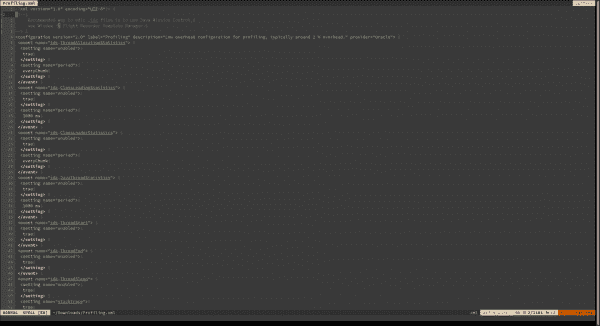](/sites/default/files/blog/2020/10/template-in-editor.png)Templates can be opened and edited with any plaintext editor, or imported/edited/exported using JDK Mission Control's graphical template editor

Figure 9: Use any editor to modify an event template in XML format.

当您上传一个新的或修改过的模板时，Cryostat 会验证它，如图 10 所示。

[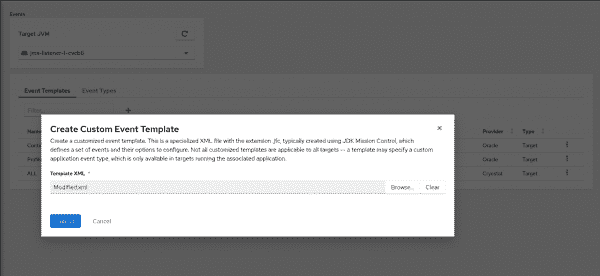](/sites/default/files/template-to-upload.png)Templates are validated when received by the server

Figure 10: Templates are validated when the server receives them.

图 11 显示了低温恒温器实例的所有可用模板。

[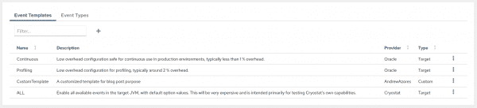](/sites/default/files/template-uploaded.png)If the template is valid, it will be added to the list of available templates and available for later use

Figure 11: A list of templates available for later use.

所有这些功能也与 JDK 飞行记录器的自定义事件 API 一起工作。您可以在开发应用程序时创建特定于应用程序的事件类型，然后创建包含这些事件的自定义事件模板，并定制您自己的连续生产记录。

## 低温恒温器中的记录

Cryostat 提供了多种捕获和保存记录的方法，包括自定义记录、快照和存档。

### 定制录像

图 12 显示了当您设置一个新的定制记录时要定义的配置属性。

[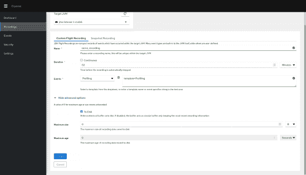](/sites/default/files/create-custom-recording.png)Creation of a customized recording

Figure 12: Creating a custom recording.

首先是记录的名称，Cryostat 使用它来强制每个目标的唯一性。您还将配置录制自动停止之前的持续时间，或者是否应该连续运行，直到手动停止。您需要为希望记录捕获的事件配置事件说明符字符串或模板。高级属性包括“到磁盘”、“最大大小”和“最长时间”请参阅 JDK 飞行记录器文档以了解有关这些属性的更多信息。

### 快照

图 13 显示了创建新快照记录的对话框。*快照*是由其他记录捕获的所有信息的概述。

[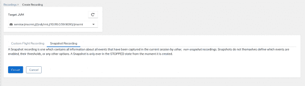](/sites/default/files/blog/2020/10/snapshot-recording.png)Creating a snapshot recording is a one-click operation

Figure 13: Create a snapshot recording with one click.

如果您同时在一个目标中运行多个自定义记录，您可以使用快照在该时间点创建一个新的记录文件。快照包含所有其他录像的合并数据。快照对于保存特定时间点的单个连续记录的数据也很有用。

### 数据流

当您创建一个记录时，您要求 Cryostat 向您的目标 JVM 发送指令来开始飞行记录。此时，没有数据传输到应用程序之外，只有名称、状态和录制的开始时间，以及其他基本元数据。记录只存在于目标应用程序的内存中，在它的容器中。图 14 显示了目标 JVM 中的记录。

[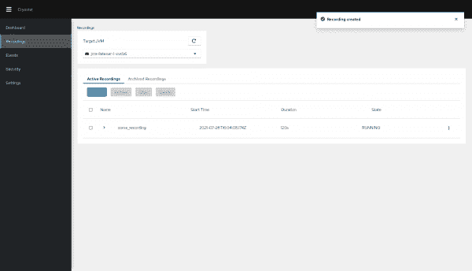](/sites/default/files/recording-list.png)The Active list displays the recordings present in the selected target JVM

Figure 14: Cryostat displays all of the recordings present in a selected target JVM.

### 档案

*归档*将记录的快照从您的应用程序传输到 Cryostat。Cryostat 立即将快照写入其本地磁盘(或 OpenShift 或 Kubernetes 中的持久卷),并将其从内存中删除。即使您的应用程序被缩减或消失，您仍然可以访问记录进行分析。如果您不小心删除了一个`.jfr`文件，您可以将它从工作站的本地磁盘重新上传到存档中。如果您从集群中移除 Cryostat 并稍后重新安装它，这也是可行的。

图 15 中的存档记录列表显示了保存到 Cryostat 的持久存储中的所有记录，这在所有目标 JVM 中都是通用的。

[](/sites/default/files/archived-list.png)The Archived recording list displays the recordings which are saved to ContainerJFR's persistent storage, which is common across all target JVMs

Figure 15: Recordings saved to Cryostat's persistent storage.

## 使用低温恒温器进行自动分析

Cryostat 允许您在云部署中对飞行记录进行自动分析，而无需将数据传输到本地机器或集群之外。您可以使用此功能从连接速度较慢的酒店或机场检查应用程序的健康状况，只需使用您的手机或平板电脑。

展开图 16 中的活动和归档记录列表，可以看到集群中生成的自动分析。

[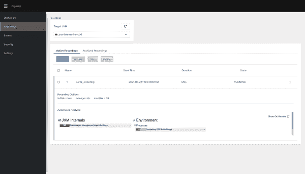](/sites/default/files/automated-report.png)Active and Archived recording list items can be expanded to reveal an automated analysis generated within the cluster

Figure 16: An automated analysis report for active and archived recordings.

当您扩展记录时，Cryostat 使用其 JDK 任务控制后端生成自动分析报告，提醒您应用中任何明显或可能的问题。您还可以将报告保存为 HTML 格式，以供将来参考。

### 使用 Grafana 进行分析

如果自动分析报告没有为您提供足够的信息，或者如果它指出了一个您想要更仔细检查的问题，您可以将记录发送到低温恒温箱内的 [jfr-datasource](https://github.com/cryostatio/jfr-datasource) 导出器。从那里，您可以使用 [Grafana](https://grafana.com) 查看数据。图 17 显示了 recording list item action 菜单，您可以使用它向 Grafana 仪表板发送记录。

[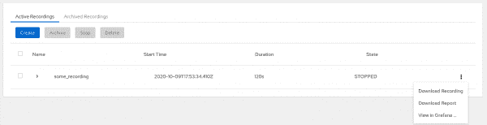](/sites/default/files/blog/2020/10/view-in-grafana.png)The recording list item action menu can be used to send a recording to the Grafana dashboard

Figure 17: Send a recording to the Grafana dashboard for further analysis.

Cryostat 提供了一个预配置的仪表板，其中包含时间序列数据，但是我们鼓励您创建自己的仪表板，其中包含对您来说重要的指标。请再次注意，没有任何数据离开集群。提供从`.jfr`文件到 Grafana 指标的转换的`jfr-datasource`隐藏在 Cryostat pod 中，Grafana 仪表板实例在暴露给外界之前用生成的凭证(存储在 OpenShift 或 Kubernetes secret 中)进行保护。使用以下命令可以很容易地检索这些生成的凭据:

```
 $ oc get secret cryostat-grafana-basic -o json | jq -crM .data.GF_SECURITY_ADMIN_USER | base64 -d
$ oc get secret cryostat-grafana-basic -o json | jq -crM .data.GF_SECURITY_ADMIN_PASSWORD | base64 -d 
```

一旦您有了凭证，您就可以将它们插入 Grafana 仪表板的登录页面，并开始查看您的指标，如图 18 所示。

[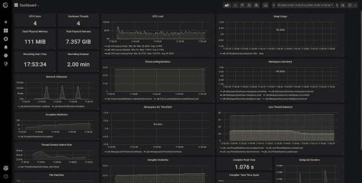](/sites/default/files/blog/2020/10/grafana-dashboard-1.png)The preconfigured Grafana dashboard gives more detailed insights into your application's performance, batteries included and installed

Figure 18: The preconfigured Grafana dashboard gives more detailed insights into your application's performance (batteries included and installed).

### 使用 JDK 任务控制进行分析

最后，如果你需要更多的细节，你可以从 Cryostat 下载一个记录文件到你的本地磁盘，然后用全功能的离线 JDK 任务控制桌面应用程序打开它。这是您的录制实际上离开群集的唯一情况。图 19 显示了在 JDK 任务控制桌面应用程序中打开的记录文件。

[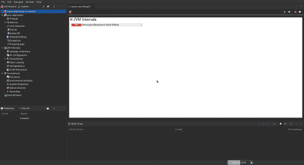](/sites/default/files/blog/2020/10/jmc.png)The JDK Mission Control desktop application can be used for a deep-dive into all of the data collected from your cloud applications

Figure 19: Use the JDK Mission Control desktop application for a deep-dive into the data collected from your cloud applications.

JDK 任务控制桌面应用程序提供了丰富的特性和功能，但是我将在另一篇文章中讨论这个问题。

## 使用低温恒温器进行安全认证

JDK 飞行记录器捕捉大量的数据，没有重大的运行时间开销。保持数据安全并确保其完整性至关重要。如图 20 所示，Cryostat 不要求您的应用程序向外界开放其 JMX 连接——只要求来自 OpenShift 名称空间或 Docker 或 Podman 网络内部的连接。

[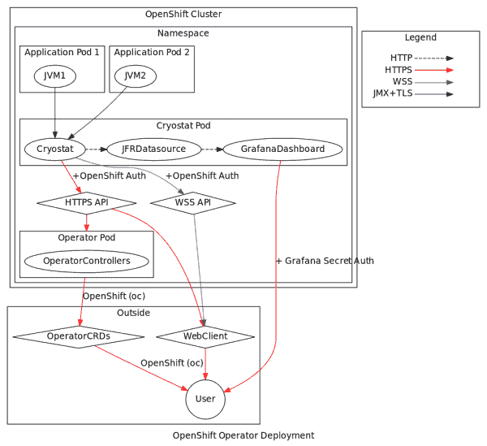](/sites/default/files/graph.png)

Figure 20: Overview of a secure Cryostat deployment.

一旦 Cryostat 收到您的 JDK 飞行记录器数据的副本(只有在您的指示下才会这样做)，该数据只能通过安全的 API 请求来访问。安全 API 请求支持 JMX 认证以连接到您的应用程序，并支持另一个认证层以连接到 Cryostat。

当在 OpenShift 中运行时，所有敏感的 API 请求都需要一个用户帐户令牌进行身份验证，如图 21 所示。请注意，通过 HTTP 或 WebSocket 从客户端向 Cryostat 发出的请求以及通过 JMX 从 Cryostat 向目标发出的请求都默认支持并启用安全套接字层或传输层安全(SSL/TLS)协议。

[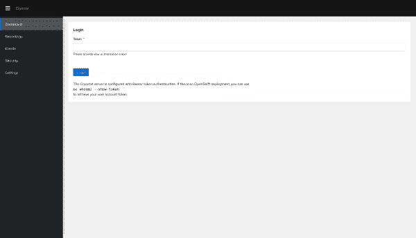](/sites/default/files/cryostat-login.png)Cryostat detects that it is running in OpenShift and uses the OpenShift cluster's authentication server to authenticate users for all sensitive API requests.

Figure 21: Cryostat uses the OpenShift cluster's authentication server for user authentication.

## 低温恒温器的未来计划

低温恒温器仍然是一个年轻的项目，容器和监控的世界总是在扩大，所以我们有很多东西要做。未来，我们希望对低温恒温器进行以下更改和改进:

*   为 Cryostat 实施更好、更灵活的方法来识别、分组和标记目标应用。一个例子是检查 OpenShift 或 Kubernetes 标签和注释的能力。
*   添加对批处理操作的支持，用于通过单个请求管理一组目标的记录。
*   添加触发功能，允许在发生预定义事件时，在一个目标或一组目标上自动开始和停止记录。例如，当新目标出现时，自动使用预定义的模板开始录制。
*   将 Grafana 视图和其他可视化内容直接嵌入低温恒温器网络客户端。
*   提供桌面 JDK 任务控制应用程序的集成或深度链接。

请访问[低温恒温器储存库](https://github.com/cryostatio/cryostat)了解未来更新。

*Last updated: October 7, 2022*