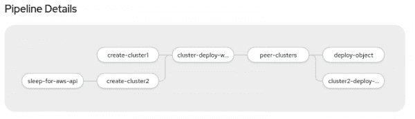
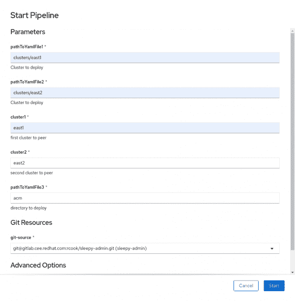

# 用于多集群开发的 Tekton 和 Argo CD 简介

> 原文：<https://developers.redhat.com/blog/2020/09/03/introduction-to-tekton-and-argo-cd-for-multicluster-development>

在过去的两年里，我和我的同事一直致力于为 [Kubernetes](https://developers.redhat.com/topics/kubernetes) 和 [Red Hat OpenShift](https://developers.redhat.com/products/openshift/overview) 开发多集群项目。我们需要一种方法来高效地部署应用程序，监督访问和授权，并管理跨集群的应用程序放置。这种需求导致我们开发了 [Argo CD 和 GitOps](https://developers.redhat.com/blog/2020/08/17/openshift-joins-the-argo-cd-community-kubecon-europe-2020/) 。

最近，我转到了另一个团队，该团队也专注于多集群开发。在我的面试中，我承诺帮助创建我们项目的目录，并开发一个快速部署它们的流程。总的来说，目录和过程将允许团队只做一些事情，而不是试图找出如何使它们可操作。然而，我很快就碰壁了。使用 Argo CD，我无法控制集群对象何时以及以何种顺序部署到新的或现有的集群上。最终，我发现了 [Tekton](https://www.openshift.com/blog/openshift-pipelines-tech-preview-blog) ，这是我开发工具集的强大补充。

在本文中，我简要描述了我开发目录和过程工具的过程。我将介绍相关的组件，解释一下 [Tekton Pipelines](https://developers.redhat.com/blog/2020/04/30/creating-pipelines-with-openshift-4-4s-new-pipeline-builder-and-tekton-pipelines/) 是如何工作的，并留给您一个可以与您的组织和团队共享的工具。

## 阿尔戈 CD 和泰克顿

[Argo CD](https://argoproj.github.io/argo-cd/) 监视存储在 Git 存储库中的集群对象，并管理存储库中对象的创建、更新和删除(CRUD)过程。Tekton 是一个 [CI/CD](https://developers.redhat.com/topics/ci-cd) 工具，处理开发生命周期的所有部分，从构建映像到部署集群对象。

Tekton 运行一个或多个任务，这些任务启动适当的容器并执行一组特定的命令。用户可以组合一系列任务来形成 Tekton 流水线。例如，在构建容器映像的管道中，开发人员将代码推送到存储库。Tekton 看到了这一变化，并启动了一个管道，该管道构建代码，创建一个容器映像，并将其推送到映像注册中心。

## 开发目录项目

对于目录项目，我需要部署两个集群，并使用亚马逊 Web 服务(AWS)虚拟专用云(VPC)对等连接它们。然后，我需要将对象部署到两个集群。首先，我为 [Hive](https://www.openshift.com/blog/openshift-hive-cluster-as-a-service) 和 [Argo CD](https://demo.openshift.com/en/dev/argocd/) 安装了 OpenShift 操作符。我将我的 Hive 集群部署存储在 Git 存储库中，然后让 Argo CD 监视存储库来部署集群。

问题是我无法将集群导入 Argo CD 并以编程方式创建 Argo CD YAML 文件，我需要这些文件来从 Git 存储库中部署 Kubernetes 对象。为了解决这个问题，我使用了 Tekton。图 1 中的图表显示了我如何使用 Tekton pipelines 来精确地定义何时应该将每个项目应用到新创建的集群。

[](/sites/default/files/blog/2020/09/img_5f4e588337272.png)

Figure 1: The Tekton pipeline for importing into Argo CD and programmatically creating the Argo CD YAML files.

### 入门指南

我建立了 [tekton-argocd 项目库](https://github.com/cooktheryan/tekton-argocd.git)来帮助指导你完成这个工作流程。在开始之前，分叉存储库。您将把集群添加到`/clusters`目录。在 Argo CD 中修改存储库并创建应用程序:

```
$ cd ~/git/tekton-argocd

$ sed -i ‘s/cooktheryan/YOURUSERNAME/g’ argo-app/*.yaml

$ oc create -f argo-app

```

这些命令在 Hive 名称空间中创建了大量的任务和管道，所有这些都由 Argo CD 管理。

### 运行管道

登录 OpenShift 控制台，从可用组件列表中选择项目**配置单元**和**管道**菜单。您将在那里找到新创建的管道。将集群添加到 Git 存储库之后，指定所需的变量，如下所示:

| 田 | 价值 |
| pathToYamlFile1 | `clusters/east1` |
| pathToYamlFile2 | `clusters/east2` |
| 集群 1 | `east1` |
| 集群 2 | `clusters/east2` |
| pathToYamlFile3 | `acm` |
| git 源 | 创建管道资源 |

一旦对话框完成(见图 2)，运行管道。

[](/sites/default/files/blog/2020/09/img_5f4e58332fe53.png)

Figure 2: Specify the required variables, and run the pipeline in the OpenShift console.

现在，您有了一个可重复的过程来部署两个集群，将它们对等在一起，并将应用程序部署到每个集群。这个操作是可能的，因为 Hive 将新创建的集群的`kubeconfig`保存为一个秘密。然后，它创建一个名为`remote-cluster-apply`的任务，该任务使用这个秘密并针对 Hive 创建的集群发布`kubectl create -f`命令。

在存储库中，您会注意到额外的 Tekton 管道。您可以使用这些管道来创建单个群集，并远程将一个或多个对象应用到该群集。我在存储库清理中包含了管道，以帮助管理集群生命周期。

## 将 Tekton 用于 CI，将 Argo 用于 CD

可以把管道看作是一双额外的手，以确保不会忘记任何请求或工作流过程。结合 Argo CD 和 Tekton 创建了更安全和可重复的过程，这使得团队中的每个人都能成功。观看此视频，了解有关结合 Argo CD 和 Tekton 的更多信息: [GitOps Continued:将 Tekton 用于 CI，将 Argo 用于 CD](https://youtu.be/pVZ-3LEIHc8) 。

## 结论

没有完美的工具可以完成所有事情。通过这个项目，我找到了一种将特定工具配对的方法，来创建一致的、可重复的体验。由 Argo CD 分发的在您的组织之间共享 Tekton 任务，允许团队协作，并在开发和操作生命周期中提高团队效率。

*Last updated: April 7, 2022*