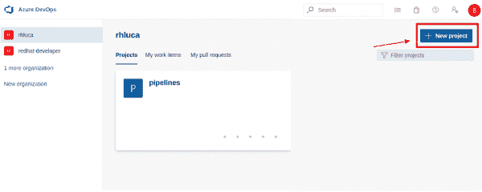
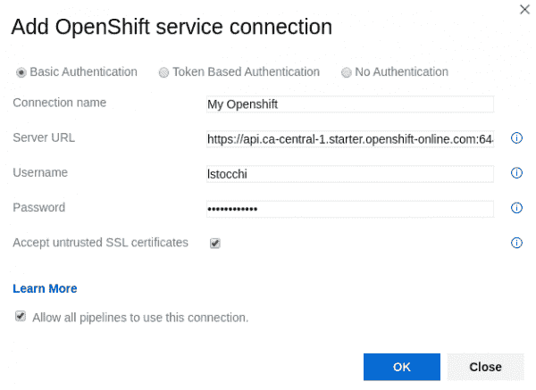
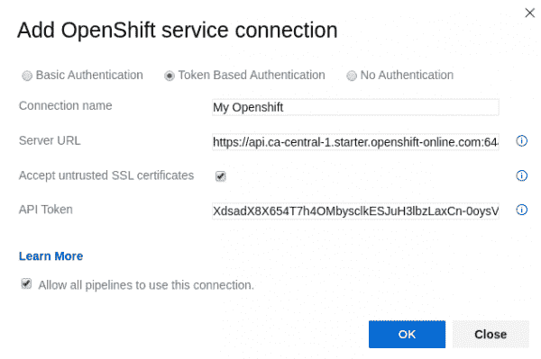
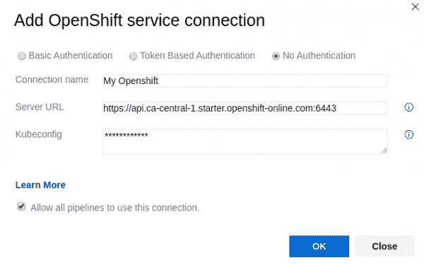
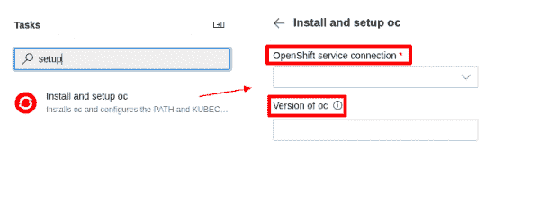
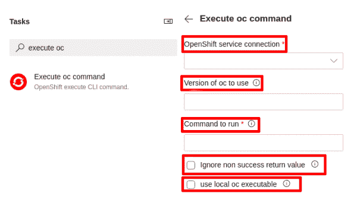
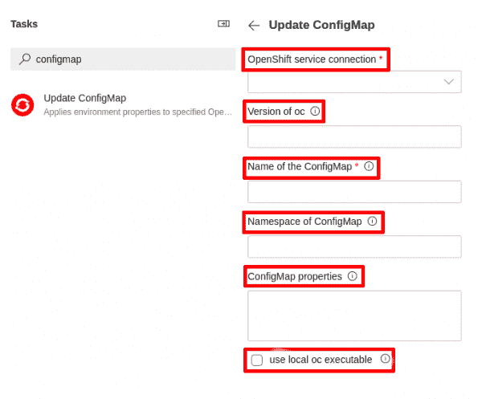

# Microsoft Azure DevOps 的 Red Hat OpenShift 部署扩展简介

> 原文：<https://developers.redhat.com/blog/2019/12/05/introduction-to-the-red-hat-openshift-deployment-extension-for-microsoft-azure-devops>

我们非常高兴为微软 Azure DevOps 推出新版本的 [Red Hat OpenShift](https://developers.redhat.com/openshift/) 部署扩展(OpenShift VSTS) 1.4.0。该扩展使用户能够直接从他们的 Microsoft Azure DevOps 帐户将他们的应用程序部署到任何 OpenShift 集群。在本文中，我们将研究如何安装和使用这个扩展，作为 YAML 定义的管道的一部分，包括微软托管的和自托管的代理。

**注意:**open shift VSTS 扩展可以通过[链接](https://marketplace.visualstudio.com/items?itemName=redhat.openshift-vsts)直接从市场下载。

本文提供了一个演示，我们在其中解释了设置一切并开始使用该扩展是多么容易。查看[自述文件](https://github.com/redhat-developer/openshift-vsts/blob/master/docs/getting-started.md)了解更多安装和使用信息。

[https://www.youtube.com/embed/RBwpedmkvow?autoplay=0&start=0&rel=0](https://www.youtube.com/embed/RBwpedmkvow?autoplay=0&start=0&rel=0)

## 好处

新的 OpenShift VSTS 1.4.0 扩展有三大优势:

1.  它允许用户在使用本地代理时使用已经安装在其机器上的`oc` CLI。
2.  它支持并自动下载大于 4 的`oc`版本。
3.  它改变了`oc` CLI 的下载方式:GitHub REST API 不再出现“超出 API 速率限制”的错误。

## 安装 OpenShift VSTS 扩展

在开始使用 OpenShift VSTS 扩展之前，您首先需要一个正在运行的 OpenShift 实例。在我们的演示视频中，我们使用 OpenShift Online，它由 Red Hat 托管和管理。你可以[在这里](https://www.openshift.com/trial/)注册，开始在云中免费使用 OpenShift。

您还需要一个 Microsoft Azure DevOps 帐户。登录该帐户后，您应该会在左侧看到您的组织列表，在右侧看到与您的组织相关的所有项目。如果你没有任何项目，是时候添加一个新的了。为此，请按照下列步骤操作:

1.  点击*新建项目*，填写必填字段，如图 1 所示:

[](/sites/default/files/blog/2019/11/azure-devops-home.png)Figure 1: Creating a new Microsoft Azure DevOps project.">

2.  去 https://marketplace.visualstudio.com/items?itemName = red hat . open shift-vsts。
3.  点击*获得免费。*
4.  选择您的 Azure DevOps 组织，然后单击*安装*。一旦此过程完成，OpenShift VSTS 扩展安装就完成了，您可以开始设置您的帐户。

## 连接到您的 OpenShift 集群

现在，您需要配置 OpenShift 服务连接，它将 Microsoft Azure DevOps 连接到您的 OpenShift 集群:

1.  登录到您的 Azure DevOps 项目。
2.  点击页面左下角的*项目设置*(齿轮图标)。
3.  选择*服务连接*。
4.  点击*新服务连接*并搜索 OpenShift。
5.  选择您想要使用的验证方法(基本、令牌或`kubeconfig`)。请在接下来的几节中查看每个选项的详细信息。
6.  插入您自己的 OpenShift 集群数据。

恭喜你！您已将您的 Azure DevOps 帐户连接到您的 OpenShift 群集。

现在，让我们看看如何设置每种身份验证方法。

### 基本认证

选择*基本认证*时，使用以下信息填写对话框:

*   **连接名称:**您将用来引用此服务连接的名称。
*   **服务器 URL:**open shift 集群的 URL。
*   **用户名:**该实例的 OpenShift 用户名。
*   **密码:**指定用户的密码。
*   **接受不可信的 SSL 证书:**是否可以接受自签名(不可信)证书。
*   **允许所有管道使用此连接:**允许 YAML 定义的管道使用我们的服务连接(它们不会自动获得服务连接授权)。

结果应该类似于图 2:

[](/sites/default/files/blog/2019/11/basic-authentication-form.png)Figure 2: Using basic authentication with an OpenShift service connection.">

### 令牌认证

当您选择*基于令牌的认证*时，使用以下信息填写对话框:

*   **连接名称:**您将用来引用此服务连接的名称。
*   **服务器 URL:**open shift 集群的 URL。
*   **接受不可信的 SSL 证书:**是否可以接受自签名(不可信)证书。
*   **API 令牌:**用于认证的 API 令牌。
*   **允许所有管道使用此连接:**允许 YAML 定义的管道使用我们的服务连接(它们不会自动获得服务连接授权)。

结果应该类似于图 3:

[](/sites/default/files/blog/2019/11/token-authetication-form.png)Figure 3: Using token authentication with an OpenShift service connection.">

### 忽必烈忽必烈忽必烈忽必烈忽必烈忽必烈忽必烈忽必烈忽必烈忽必烈忽必烈忽必烈忽必烈忽必烈忽必烈忽必烈

要使用基于`kubeconfig`的认证，选择*无认证*，并使用以下信息填写对话框:

*   **连接名称:**您将用来引用此服务连接的名称。
*   **服务器 URL:**open shift 集群的 URL。
*   **kube config:**`kubectl`配置文件的内容。
*   **允许所有管道使用此连接:**允许 YAML 定义的管道使用我们的服务连接(它们不会自动获得服务连接授权)。

结果应该类似于图 4:

[](/sites/default/files/blog/2019/11/kubectl-authentication-form.png)Figure 4: Using kubeconfig authentication with an OpenShift service connection.">

## 探索扩展

一旦扩展可以认证到 Red Hat OpenShift 集群，您就可以创建自己的 YAML 管道，然后通过直接从 Azure DevOps 执行`oc`命令来执行 OpenShift 中的操作。

**注意:**该扩展使用`oc` OpenShift 客户端工具与 OpenShift 集群进行交互，因此需要对该 OpenShift CLI 工具有一点了解。

该扩展提供了三个不同的任务:安装和设置`oc`，执行单个`oc`命令，以及更新`ConfigMap`。

### 安装和设置`oc`

该任务允许您安装特定版本的 OpenShift CLI ( `oc`)，将其添加到您的`PATH`，并创建一个`kubeconfig`文件，用于通过 OpenShift 集群进行身份验证。首先，我们下载并设置`oc`，然后通过脚本执行`oc`命令:

```
jobs:
- job: myjob
  displayName: MyJob
  pool:
    vmImage: 'windows-latest'
  steps:
  # Install oc so that it can be used within a 'script' or bash 'task'
  - task: oc-setup@2
    inputs:
      openshiftService: 'My Openshift'
      version: '3.11.154'
# A script task making use of 'oc'
  - script: |
      oc new-project my-project
      oc apply -f ${SYSTEM_DEFAULTWORKINGDIRECTORY}/openshift/config.yaml -n my-project
```

安装的`oc`二进制文件将与您代理的操作系统相匹配。

**注意:**可以使用代理中定义的变量。如本例所示，要引用`artefact _my_sources`中的文件，您可以使用:

```
${SYSTEM_DEFAULTWORKINGDIRECTORY}/_my_sources/my-openshift-config.yaml
```

您可以在 GUI 中使用此任务，如下所示:

1.  在*任务*中，点击*安装设置 oc* 。该操作将打开如图 5 所示的对话框:

[](/sites/default/files/blog/2019/11/install-oc-task.png)Figure 5: Installing and setting up oc.">

2.  在 *OpenShift 服务连接*下拉框中，选择您刚刚创建的服务连接，它将用于执行该命令。
3.  在要使用的 oc 的*版本*文本框中，添加您想要使用的`oc`版本(例如 3.11.154)或一个指向`oc`发布包的直接 URL。(如果留空，则使用最新的稳定 oc 版本。)

### 执行单个`oc`命令

此任务允许您直接从 Azure DevOps 执行单个`oc`命令:

```
jobs: 
- job: myjob 
  displayName: MyJob 
  pool: 
    name: 'Default' 
  steps: 
  - task: oc-cmd@2 
    inputs: 
      openshiftService: 'My Openshift' 
      version: '4.1' 
      cmd: 'oc new-app https://github.com/lstocchi/nodejs-ex -l name=demoapp' 
      uselocalOc: true
```

**注意:**`oc-cmd`和`config-map`任务都不需要在设置任务后强制运行。如果扩展在执行`oc`命令期间没有找到有效的`oc` CLI，它首先下载一个新的`oc`的副本，然后执行命令。

要在 GUI 中使用此任务，请执行以下操作:

1.  在*任务中，*选择*执行 oc 命令*，弹出如图 6 所示的对话框:

[](/sites/default/files/blog/2019/11/execute-oc-task.png)Figure 6: Fill out this dialog to execute an oc command.">

2.  在 *OpenShift 服务连接*下拉框中，选择您刚刚创建的服务连接，它将用于执行该命令。
3.  在要使用的 oc 的*版本*文本框中，添加您想要使用的`oc`版本(例如 3.11.154)或一个指向`oc`发布包的直接 URL。(如果留空，则使用最新的稳定 oc 版本。)
4.  在运行的*命令文本框中，输入要运行的实际`oc`命令。*

**注意:**您可以省略输入中的`oc`直接键入`oc`子命令(如`rollout latest dc/my-app -n production`)。

5.  选中或取消选中*忽略未成功返回值*复选框，该复选框指定是否必须忽略`oc`命令的未成功返回值(例如，如果带有命令`oc create`或`oc delete`的任务因资源已被创建或删除而失败，管道将继续执行)。
6.  选中或取消选中*使用本地 oc 可执行文件*复选框，该复选框指定是否强制扩展使用在包含代理的机器上找到的`oc` CLI(如果存在)。*如果没有指定版本*，扩展使用本地的`oc` CLI，不管它的版本是什么。*如果指定了版本*，则扩展检查安装的`oc` CLI 是否与用户请求的版本相同(如果不是，将下载正确的`oc` CLI)。

### 更新一个`ConfigMap`

此任务允许您使用网格更新给定`ConfigMap`的属性:

```
  jobs:
- job: myjob
  displayName: MyJob
  pool:
    name: 'Default'
- task: config-map@2
     inputs:
       openshiftService: 'my_openshift_connection'
       configMapName: 'my-config'
       namespace: 'my-project'
       properties: '-my-key1 my-value1 -my-key2 my-value2'
```

它包括六个配置选项，您可以在 GUI 中填写:

1.  在*任务*中，选择*更新配置图*进入如图 7 所示的对话框:

[](/sites/default/files/blog/2019/11/config-map-task.png)Figure 7: Updating a ConfigMap.">

2.  在 *OpenShift 服务连接*下拉框中，选择您刚刚创建的服务连接，它将用于执行该命令。
3.  在 oc 的*版本文本框中，添加您想要使用的`oc`版本(例如 3.11.154)或一个指向`oc`发布包的直接 URL。(如果留空，则使用最新的稳定 oc 版本。)*
4.  在配置图文本框的*名称中，输入要更新的`ConfigMap`的名称。(此字段为必填字段。)*
5.  在 ConfigMap 的*名称空间文本框中，输入在其中查找`ConfigMap`的名称空间。如果没有指定名称空间，则使用当前名称空间。*
6.  在*配置图属性*文本框中，输入要设置或更新的属性。只需要列出需要创建或更新的属性。空格分隔的值需要用引号(")括起来。
7.  选中或取消选中*使用本地 oc 可执行文件*复选框，该复选框指定是否强制扩展使用在包含代理的机器上找到的`oc` CLI(如果存在)。*如果没有指定版本*，扩展使用本地的`oc` CLI，不管它的版本是什么。*如果指定了版本*，则扩展检查安装的`oc` CLI 是否与用户请求的版本相同(如果不是，将下载正确的`oc` CLI)。

### 使用 OpenShift

终于到了使用 OpenShift VSTS 扩展创建 YAML 管道的时候了。在我们的例子中，应用程序`nodejs-ex`已经在 OpenShift 集群上运行，我们的目标是创建一个管道，每当我们的 GitHub 主分支更新时，就推送新版本的应用程序。我们的任务是:

```
jobs:
- job: demo
  displayName: MyDemo
  pool:
    name: 'Default'
  steps:
  - task: oc-cmd@2
    inputs:
      openshiftService: 'My Openshift'
      cmd: 'oc start-build nodejs-ex --follow'
      uselocalOc: true
  - task: oc-cmd@2
    inputs:
      openshiftService: 'My Openshift'
      cmd: 'oc status'
      uselocalOc: true
```

每当管道被触发时，一个新的构建就开始了，我们的应用程序最终被推送到集群。需要注意的是，因为我们使用本地代理来运行这个管道(它位于已经安装了`oc` CLI 的机器上)，所以我们将标志`uselocalOc`设置为`true`，并且没有指定任何版本。扩展将使用安装在机器上的`oc` CLI，无论它的版本是什么。

接下来，我们检查集群的状态，看看是否有任何配置错误的组件(服务、部署配置、构建配置或活动部署)。

**注意:**如果你想使用某个特定的`oc`版本，一定要输入正确，否则会使用最新的版本(比如你输入`v3.5`作为你的版本输入，扩展会下载版本 3.5.5，因为 3.5 在我们的回购中不存在。查看[自述文件](https://github.com/redhat-developer/openshift-vsts/blob/master/README.md)了解更多信息)。

## 包扎

此时，您应该能够设置您的 OpenShift VSTS 扩展，并使用它来创建您自己的 YAML 定义的管道，然后从 Azure DevOps 将您的应用程序部署到您的 OpenShift 集群。OpenShift VSTS 是一个开源项目，我们欢迎贡献和建议。如果您有任何进一步部署的请求、改进扩展的想法、问题或遇到任何问题，请联系我们。联系我们很简单:[开一个新问题](https://github.com/redhat-developer/openshift-vsts)。

*Last updated: July 1, 2020*