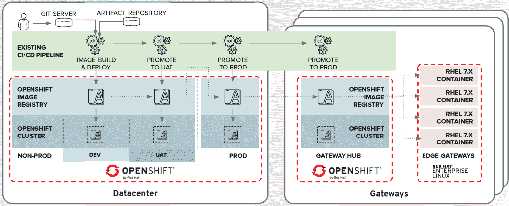
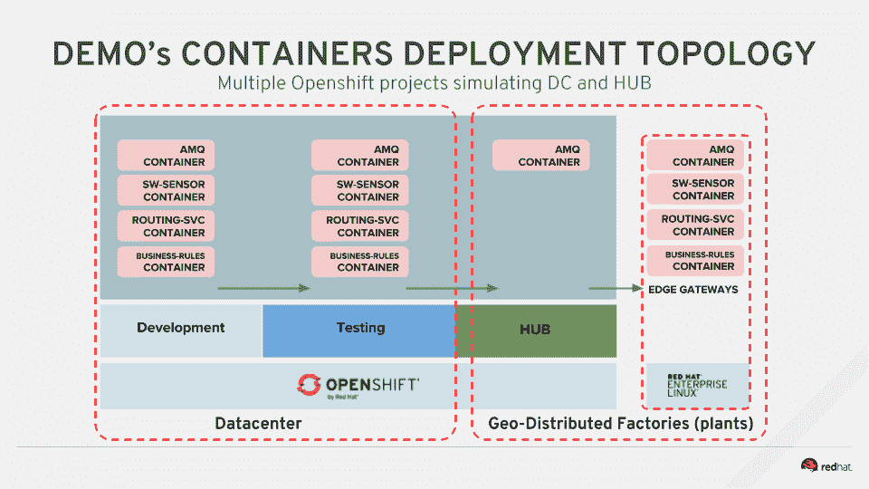
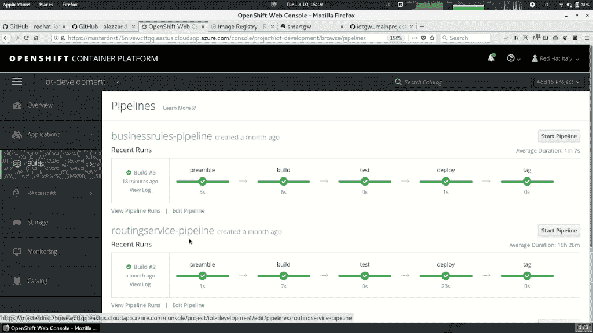
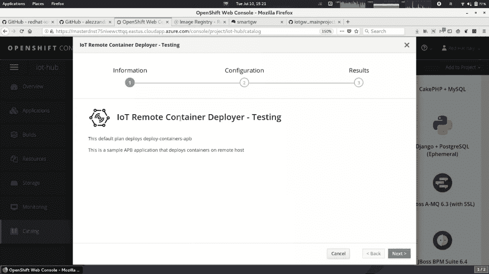

# 通过 OpenShift 使用容器进行物联网边缘开发和部署:第 1 部分

> 原文：<https://developers.redhat.com/blog/2019/01/31/iot-edge-development-and-deployment-with-containers-through-openshift-part-1>

通常，我们认为物联网应用是为能力有限的低功耗设备特别打造的。由于这个原因，我们倾向于使用完全不同的技术来开发物联网应用程序，而不是我们用来创建数据中心服务的技术。

本文是两部分系列文章的第 1 部分。在这篇文章中，我们将探索一些技术，这些技术可能会让您有机会使用[容器](https://developers.redhat.com/blog/category/containers/)作为应用程序构建的媒介——这些技术支持容器在不同环境中的可移植性。通过这些技术，您可以直接使用数据中心中使用的相同语言、框架或工具，甚至使用不同的 CPU 架构！

我们通常使用“边缘”来指位于企业“边缘”的物联网设备网络中计算节点的地理分布。“边缘”可以是一个远程数据中心，也可以是多个地理上分散的工厂、船只、石油工厂等等。

在本文中，我们将讨论一个非常常见的主题——容器的创建和分发——但是我们的目标环境将是 x86_64 edge 网关。

众所周知， [OpenShift](http://openshift.com/) 是一个非常棒的应用开发平台。它配备了一个 [Kubernetes](https://developers.redhat.com/blog/category/kubernetes/) orchestrator，丰富了完全集成和容器化的 Jenkins、本地“构建”资源和非常强大的 web 界面。

考虑以下真实的用例场景，其中客户要求在平台即服务(PaaS)环境中创建和测试容器，以便在边缘进行部署。

我们使用现有的独立物联网演示应用程序，将其拆分为不同的项目，以创建真正独立的容器。

您将在这里找到初始演示项目[，在这里](https://github.com/redhat-iot/Virtual_IoT_Gateway)找到主占位符容器项目[。](https://github.com/alezzandro/iotgw_mainproject)

项目主页还包含在您的平台上重新创建演示环境的说明。

正如你将从项目页面中看到的，由于使用了[红帽 AMQ](https://developers.redhat.com/products/amq/overview/) 消息队列，容器化过程并不困难。

我们创建了三个容器，分别用于独立应用程序演示的每个软件模块，然后我们在 OpenShift 中创建了各自的 Jenkins 管道，如下面的屏幕截图所示。由于这种容器化，每个软件都可以继承一个完整的、独立的开发环境，并拥有独立的测试活动。

创建的管道和独立项目的一个好处是，我们还可以利用项目隔离和复制的 OpenShift/Kubernetes 特性，在不同的环境中测试我们全新的容器。

由于容器的可移植性，最后一步是将容器推到网关集线器上，这是远程工厂中的第二个 [Red Hat OpenShift 容器平台](https://developers.redhat.com/products/openshift/overview/)设置，用于将开发的应用程序部署到边缘网关上。

我打赌你在猜测最终部署在边缘，对不对？

最终部署将由中央 OpenShift 平台或远程平台(在物联网中心，“远程工厂”)处理，这要归功于 [Red Hat Ansible Automation](https://www.redhat.com/en/technologies/management/ansible) 套件。

OpenShift 有一个特殊的特性，叫做 OpenShift Ansible Service Broker。它遵循 Open Service Broker API，并允许您使用通用的 Ansible Playbook 来调用内部服务(Kubernetes/OpenShift)或外部服务，例如，虚拟机或远程网关。

出于这个原因，我们可以利用这个特性来调用一个定制的 Ansible 剧本，该剧本是为在远程系统上部署独立容器而创建的，以便对它们进行测试。

一旦我们测试了一个或多个部署，我们就可以使用我们通过 OpenShift Ansible Service Broker 开发和测试的相同 Ansible Playbook，通过 Red Hat Ansible Tower 横向扩展容器分发。

我们用于远程容器部署的 Ansible Playbook 的第一个版本利用 Docker 守护进程来执行它们。然后，我们通过用独立的容器执行替换守护进程(单点故障)来增强它，这要感谢 Podman 及其`systemd`集成。(阅读更多关于 Red Hat Enterprise Linux 中的[pod man](https://developers.redhat.com/blog/2018/08/29/intro-to-podman/)和[管理容器化系统服务](https://developers.redhat.com/blog/2018/11/29/managing-containerized-system-services-with-podman/)。)

这个例子的主要目的是展示在 Kubernetes(最好的和事实上的容器编排器)之上创建的完整 PaaS 环境的强大功能，该环境用于为物联网边缘应用创建和测试容器。

你想看现场演示吗？请看这段 OpenShift 常见简报录音，我在其中现场展示了解决方案:

https://www.youtube.com/watch?v=bNipu5OA1o4

当然，这只是一个例子，每个用例都可能不同，例如，引入对除 x86_64 之外的容器架构的需求。

在本系列的[第二部分也是最后一部分，我们将回顾在 Red Hat OpenShift 容器平台上多架构容器的创建、执行和测试。敬请期待！](https://developers.redhat.com/blog/2019/02/05/iot-edge-development-and-deployment-with-containers-through-openshift-part-2)

## 额外资源

*   [Podman:在本地容器运行时管理 pod 和容器](https://developers.redhat.com/blog/2019/01/15/podman-managing-containers-pods/)
*   [使用 Podman 管理集装箱化系统服务](https://developers.redhat.com/blog/2018/11/29/managing-containerized-system-services-with-podman/)
*   没有守护进程的容器:RHEL 7.6 和 RHEL 8 测试版中的 Podman 和 Buildah
*   [pod man——下一代 Linux 容器工具](https://developers.redhat.com/articles/podman-next-generation-linux-container-tools/)
*   [pod man 简介(Red Hat Enterprise Linux 7.6 中的新功能)](https://developers.redhat.com/blog/2018/08/29/intro-to-podman/)
*   [定制 OpenShift Ansible 剧本包](https://developers.redhat.com/blog/2018/05/23/customizing-an-openshift-ansible-playbook-bundle/)

## 关于亚历山德罗

Alessandro Arrichiello 是 Red Hat Inc .的解决方案架构师，他从 14 岁开始就对 GNU/Linux 系统充满热情，这种热情一直持续到今天。他使用过自动化企业 IT 的工具:配置管理和通过虚拟平台的持续集成。他现在致力于分布式云环境，涉及 PaaS (OpenShift)、IaaS (OpenStack)和流程管理(CloudForms)、容器构建、实例创建、HA 服务管理和工作流构建。

*Last updated: February 24, 2022*