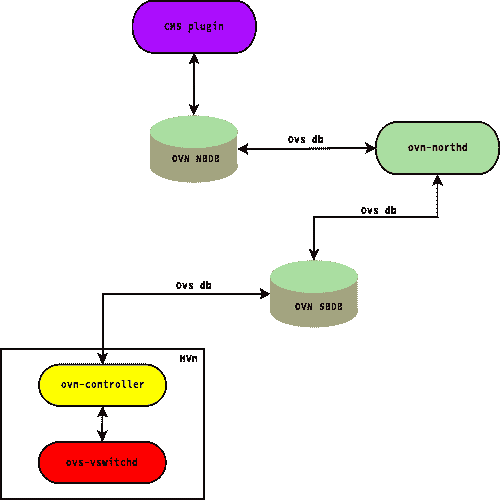
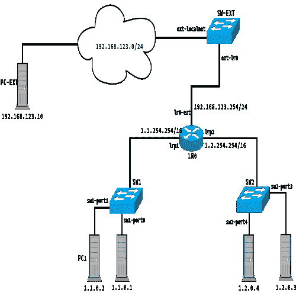

# OVN 的 IP 包缓冲

> 原文：<https://developers.redhat.com/blog/2018/12/07/ip-packet-buffering-in-ovn>

*Open Virtual Network (OVN)* 是 [Open vSwitch (OVS)](http://www.openvswitch.org/) 的子项目，是一种高性能、可编程、多平台的虚拟交换机。OVN 通过引入虚拟网络抽象，如虚拟交换机和路由器，为 OVS 现有功能增加了对覆盖网络的支持。此外，OVN 为设置访问控制列表(ACL)和网络服务(如 DHCP)提供了本地方法。很多红帽产品，比如红帽 OpenStack 平台，红帽虚拟化，现在都在用 OVN，[红帽 OpenShift 容器平台](https://developers.redhat.com/products/openshift/overview/)也快用 OVN 了。

在这篇文章中，我将介绍 OVN ARP/ND _ NS 操作如何工作，当前实现中的主要限制，以及如何克服这些限制。首先，为了便于讨论，我将简要介绍一下 OVN 的建筑:

## OVN 建筑

OVN 部署由几个组件组成:

*   OVN/CMS 插件(例如，Neutron)是 OVN 的 CMS 接口组件。该插件的主要目的是将 CMS 的逻辑网络配置的概念转换成由逻辑交换机和路由器组成的中间表示，可以被 OVN 解释。
*   OVN 北向数据库(NBDB)是一个 OVSDB 实例，负责存储从 CMS 插件接收的网络表示。OVN 北向数据库只有两个客户端:OVN/CMS 插件和`ovn−northd`守护进程。
*   `ovn−northd`守护进程连接到 OVN 北向数据库和 OVN 南向数据库。它将取自 OVN 北向数据库的传统网络概念方面的逻辑网络配置转换成 OVN 南向数据库中的逻辑数据路径流
*   OVN 南行数据库(SBDB)也是一个 OVSDB 数据库，但是它的特征在于与北行数据库完全不同的模式。特别是，南向数据库根据称为*逻辑流*的匹配动作规则集合来定义网络，而不是熟悉的网络概念。逻辑流虽然在概念上类似于 OpenFlow 流，但是利用了逻辑概念，例如虚拟机实例，而不是物理概念，例如物理以太网端口。特别地，南行数据库包括三种数据类型:
    *   物理网络数据，如虚拟机的 IP 地址和隧道封装格式
    *   逻辑网络数据，如数据包转发模式
    *   物理网络和逻辑网络之间的绑定关系

[](https://developers.redhat.com/blog/wp-content/uploads/2018/11/architecture.png)

## L2 解决分辨率问题

典型的 OVN 部署如下所示，其中覆盖网络通过 *localnet* 端口(在本例中为`ext-localnet`)连接到外部网络:

[](https://developers.redhat.com/blog/wp-content/uploads/2018/11/ovn_ip_buff_diagram-e1542277877943.png)

下图显示了相关的 OVN NBDB 网络配置:

```
switch 35b34afe-ee16-469b-9893-80b024510f33 (sw2)  
        port sw2-port4  
             addresses: ["00:00:02:00:00:04 1.2.0.4 2001:db8:2::14 "]  
        port sw2-port3  
             addresses: ["00:00:02:00:00:03 1.2.0.3 2001:db8:2::13 "]  
        port sw2-portr0  
             type: router  
             addresses: ["00:00:02:ff:00:02"]  
             router-port: lrp2  
switch c16e344a-c3fe-4884-9121-d1d3a2a9d9b1 (sw1)  
        port sw1-port1  
             addresses: ["00:00:01:00:00:01 1.1.0.1 2001:db8:1::11 "]  
        port sw1-portr0  
             type: router  
             addresses: ["00:00:01:ff:00:01"]  
             router-port: lrp1  
        port sw1-port2  
             addresses: ["00:00:01:00:00:02 1.1.0.2 2001:db8:1::12 "]  
switch ee2b44de-7d2b-4ffa-8c4c-2e1ac7997639 (sw-ext)  
        port ext-localnet  
                 type: localnet  
                 addresses: ["unknown"]  
        port ext-lr0  
                 type: router  
                 addresses: ["02:0a:7f:00:01:29"]  
                 router-port: lr0-ext  
router 681dfe85-6f90-44e3-9dfe-f1c81f4cfa32 (lr0)  
        port lrp2  
                 mac: "00:00:02:ff:00:02"  
                 networks: ["1.2.254.254/16", "2001:db8:2::1/64"]  
        port lr0-ext  
                 mac: "02:0a:7f:00:01:29"  
                 networks: ["192.168.123.254/24", "2001:db8:f0f0::1/64"]  
        port lrp1  
                 mac: "00:00:01:ff:00:01"  
                 networks: ["1.1.254.254/16", "2001:db8:1::1/64"]  

```

每当属于覆盖网络的设备(例如 PC1)试图访问外部设备(例如 PC-EXT)时，它会将数据包转发到 OVN 逻辑路由器(LR0)。如果 LR0 尚未解析 PC-EXT 的 L2/L3 地址对应，它将为 PC-EXT 发送一个 ARP 帧(或 IPv6 流量的邻居发现)。当前的 OVN 实现采用 *ARP 动作*来执行 L2 地址解析。换句话说，每当 OVS 需要向未知的 L2 目的地转发 IP 数据包时，OVN 就会指示它执行“数据包入站”操作。ARP 操作将正在处理的 IPv4 数据包替换为在外部网络上转发的 ARP 帧，以解析 PC-EXT MAC 地址。下面显示了与该处理相对应的 IPv4/IPv6 OVN SBDB 规则:

```
table=10(lr_in_arp_request  ), priority=100  , match=(eth.dst == 00:00:00:00:00:00), action=(arp { eth.dst = ff:ff:ff:ff:ff:ff; arp.spa = reg1; arp.tpa = reg0; arp.op = 1; output; };)
table=10(lr_in_arp_request  ), priority=100  , match=(eth.dst == 00:00:00:00:00:00), action=(nd_ns { nd.target = xxreg0; output; };)

```

由所描述的处理引入的主要缺点是连接的第一个分组的丢失(如下面的 ICMP 业务所示),这在与不属于覆盖网络的设备建立的 TCP 连接中引入了延迟:

```
PING 192.168.123.10 (192.168.123.10) 56(84) bytes of data.
64 bytes from 192.168.123.10: icmp_seq=2 ttl=63 time=0.649 ms
64 bytes from 192.168.123.10: icmp_seq=3 ttl=63 time=0.321 ms
64 bytes from 192.168.123.10: icmp_seq=4 ttl=63 time=0.331 ms
64 bytes from 192.168.123.10: icmp_seq=5 ttl=63 time=0.137 ms
64 bytes from 192.168.123.10: icmp_seq=6 ttl=63 time=0.125 ms
64 bytes from 192.168.123.10: icmp_seq=7 ttl=63 time=0.200 ms
64 bytes from 192.168.123.10: icmp_seq=8 ttl=63 time=0.244 ms
64 bytes from 192.168.123.10: icmp_seq=9 ttl=63 time=0.224 ms
64 bytes from 192.168.123.10: icmp_seq=10 ttl=63 time=0.271 ms
--- 192.168.123.10 ping statistics ---
10 packets transmitted, 9 received, 10% packet loss, time 9214ms

```

## 建议的解决方案:为 IP 数据包添加缓冲支持

为了克服这种限制，已经提出了用于增加对 IP 分组的缓冲支持的[解决方案](https://github.com/openvswitch/ovs/commit/d7abfe39cfd234227bb6174b7f959a16dc803b83)，通过该解决方案，还没有对应的 L2 地址的输入 IP 帧被排队，并且一旦邻居发现过程完成，将被重新注入到`ovs-vswitchd`。

重复上述测试证明，即使第一个 ICMP 回应请求也能被 PC-EXT 接收到:

```
PING 192.168.123.10 (192.168.123.10) 56(84) bytes of data.
64 bytes from 192.168.123.10: icmp_seq=1 ttl=63 time=1.92 ms
64 bytes from 192.168.123.10: icmp_seq=2 ttl=63 time=0.177 ms
64 bytes from 192.168.123.10: icmp_seq=3 ttl=63 time=0.277 ms
64 bytes from 192.168.123.10: icmp_seq=4 ttl=63 time=0.139 ms
64 bytes from 192.168.123.10: icmp_seq=5 ttl=63 time=0.281 ms
64 bytes from 192.168.123.10: icmp_seq=6 ttl=63 time=0.247 ms
64 bytes from 192.168.123.10: icmp_seq=7 ttl=63 time=0.211 ms
64 bytes from 192.168.123.10: icmp_seq=8 ttl=63 time=0.187 ms
64 bytes from 192.168.123.10: icmp_seq=9 ttl=63 time=0.439 ms
64 bytes from 192.168.123.10: icmp_seq=10 ttl=63 time=0.253 ms
--- 192.168.123.10 ping statistics ---
10 packets transmitted, 10 received, 0% packet loss, time 9208ms

```

## 未来的发展

对所描述的方法的可能的未来增强可以是使用开发的 IP 缓冲基础设施来排队等待给定事件的分组，然后一旦接收到请求的消息就将它们发送回`ovs-vswitchd`。例如，我们可以依靠 IP 缓冲基础设施对指定给尚未完成引导阶段的 OpenShift pod 的数据包进行排队。敬请期待:)

## 额外资源

以下是其他一些与 OVN 和 OVS 相关的文章:

*   [如何创建一个开放的虚拟网络分布式网关路由器](https://developers.redhat.com/blog/2018/11/08/how-to-create-an-open-virtual-network-distributed-gateway-router/)
*   [开放虚拟网络中的动态 IP 地址管理(OVN):第一部分](https://developers.redhat.com/blog/2018/09/03/ovn-dynamic-ip-address-management/)
*   [开放虚拟网络中的动态 IP 地址管理(OVN):第二部分](https://developers.redhat.com/blog/2018/09/27/dynamic-ip-address-management-in-open-virtual-network-ovn-part-two/)
*   [RHEL 无根开放式虚拟交换机](https://developers.redhat.com/blog/2018/03/23/non-root-open-vswitch-rhel/)
*   [打开 vSwitch-DPDK:多少 Hugepage 内存？](https://developers.redhat.com/blog/2018/03/16/ovs-dpdk-hugepage-memory/)
*   [打开 vSwitch: QinQ 性能](https://developers.redhat.com/blog/2017/06/27/open-vswitch-qinq-performance/)

*Last updated: June 17, 2022*