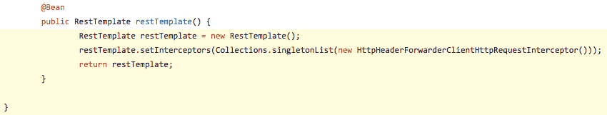
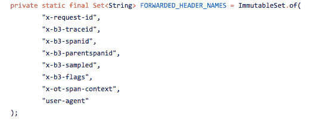
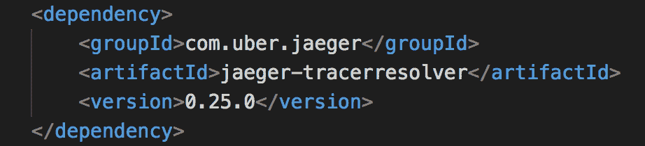
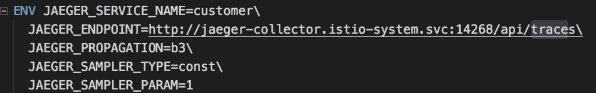
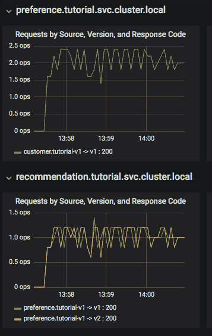
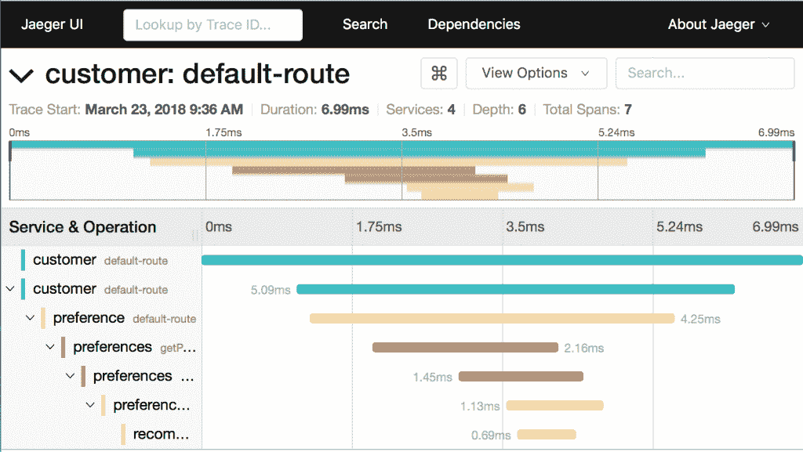
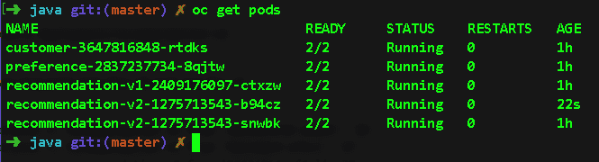
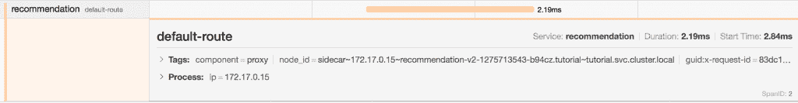
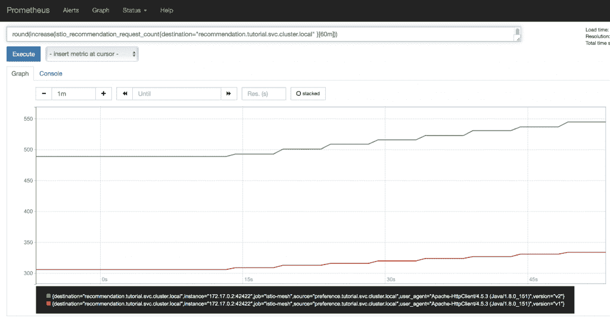

# Istio 跟踪与监控:你在哪里，你的速度有多快？

> 原文：<https://developers.redhat.com/blog/2018/04/03/istio-tracing-monitoring>

[海森堡测不准原理](https://en.wikipedia.org/wiki/Uncertainty_principle)指出你不能同时测量一个物体的位置和速度。如果它在移动，它就不在某个位置。如果它在一个位置，那么它没有速度。

由于一些令人敬畏的开源软件，我们在[红帽 OpenShift](https://developers.redhat.com/products/openshift/overview/) (使用 [Kubernetes](https://developers.redhat.com/topics/kubernetes/) )中运行的[微服务](https://developers.redhat.com/topics/microservices/)可以报告它们的性能和健康状况。当然，它们不能违反不确定性原则，但是它们可以帮助为您的云原生应用程序带来确定性。Istio 不费吹灰之力就为您的系统带来了跟踪和监控功能，帮助您保持正常运行。

【这是我十周**[Istio 服务网系列](https://developers.redhat.com/topics/service-mesh/)** 介绍的第五部分。我之前的文章是[第四部分:Istio 断路器:当失败是一种选择](https://developers.redhat.com/blog/2018/03/27/istio-circuit-breaker-when-failure-is-an-option/)。]

## 让我们达成协议

首先，让我们就一些基本术语达成一致。

*跟踪*是指系统活动的记录。这听起来很宽泛，但事实上，跟踪的基本规则之一是数据被转储到跟踪数据存储中，而不考虑格式。数据的消费者负责查找和解析相关数据。对于 Istio 来说，Jaeger 是使用的追踪系统；它遵循 [OpenTracing](https://github.com/opentracing/specification/blob/master/specification.md) 数据模型。

*Traces* 是构成请求或工作单元的端到端数据。例如，从用户点击网页上的按钮开始，直到数据返回，以及中间的所有微服务。一条轨迹代表(或模拟)该往返行程。在 Jaeger 用户界面中，轨迹以时间轴显示。一个类比可能是由单个链接组成的整个链。轨迹由一个或多个跨度组成。

*跨度*是由一个工作单元的开始到结束所代表的时间片。使用我们的链类比，每个跨度代表链中的一个环节。跨度可以有零个、一个或多个子跨度。在根级别，初始 span 的运行时间将等于拥有它的跟踪的运行时间。

*监控*是通过用户界面和/或自动化来监视您的系统的行为。跟踪数据推动监控。Istio 中的监控由 Prometheus 提供，包括一个 UI。Prometheus 通过警报和警报管理器支持自动监控。

## 扔面包屑

为了实现跟踪，应用程序需要创建一个“范围”集合。这些“跨度”将被导出到 Jaeger，因此它可以创建可视化的跟踪。“跨度”在其他数据中标记了操作名称、开始时间戳、结束时间戳。“Span”的传播是通过将 Jaeger 特定的 HTTP 请求报头从入站请求转发到出站请求来完成的。根据您的开发语言和/或方法，这可能需要对您的源代码进行小的修改。以下 Java(使用 Spring Boot)代码给出了一个在 Spring configuration 类中向您的请求添加 B3 (Zipkin-style)头的示例:

以下是使用的标题设置:

如果您使用 Java，有一种无代码的方法，只需要在 Maven POM 文件中添加几行代码，并设置一些环境变量。这些行添加到您的 POM。XML 文件将注入 Jaeger Tracer 解析器:

在 docker 构建配置文件(Dockerfile)中，设置了环境变量:

现在一切都连接好了，我们的微服务将开始发送跟踪数据。

## 仪表板旁的天堂:精简版

您的 Istio 安装中包含一个使用 Grafana 构建的简单仪表板。在我们的 Red Hat OpenShift PaaS 中，一切都已启动并运行(在这篇博文中，我使用 minishift 来运行 Red Hat OpenShift 和 Kubernetes ),我们可以通过运行以下命令来打开仪表板:

`open "$(minishift openshift service grafana -u)/d/1/istio-dashboard?refresh=5&ordId=1"`

Grafana Istio 仪表盘可让您快速了解系统的运行情况。以下是仪表板一小部分的屏幕截图:

我们可以看到“客户”微服务正在调用“偏好”版本 1，偏好正在调用“推荐”的版本 1 和版本 2。Grafana 仪表板上的可用信息包括一个具有高级指标(例如，全局请求量、成功率、4xx 错误)的仪表板行，一个具有每个服务图表的服务器网状视图，以及一个具有每个服务的每个容器的详细信息的服务行。

## 在井里再挖深一点

有了适当的跟踪，Istio 的开箱即用体验使我们能够更深入地了解系统的性能。使用 Jaeger UI，我们可以查看跟踪，了解跟踪的深度和广度，并了解性能落后的地方。同样，使用 minishift 运行 Red Hat OpenShift，我能够使用以下命令来查看 Jaeger UI:

`minishift openshift service jaeger-query --in-browser`

检查这个痕迹，我们可以看到:

*   七跨。
*   总耗时 6.99 毫秒
*   链中的最后一个服务“推荐”用了. 69ms。

这种类型的图表让你清楚地了解一个表现不佳的服务链是如何阻碍你的整个系统的。

当您运行一个微服务的多个实例时，事情变得非常有趣。我运行命令`oc scale --replicas=2 deployment/recommendation-v2`来运行两个“推荐:v2”微服务。以下是我发出命令后的豆荚:

回到 Jaeger UI，如果我展开“推荐”范围，我可以看到要路由到的确切 pod。如果某个 pod 表现不佳，这是您想要了解的信息。注意这个面板中的`node_id`:

## 大家都去哪了？

最后，使用 Prometheus UI，我可以看到我所期望的:三分之二的请求被路由到推荐 pods 的 v2；在这一点上，他们比 v1 多 2:1，所以这是有意义的。随着窗格的放大和缩小，此图表将显示结果。当您执行 Canary 部署时，该图将特别有帮助(三周后将在本博客中讨论)。

## 我们才刚刚开始

这只是(如他们所说的)触及表面。耶格、格拉法纳和普罗米修斯的信息深度可以写满一本书。这篇博文只是想让你朝着正确的方向前进，并让你知道使用 Istio 的可能性。

记住:所有这些都是 Istio 内置的。根据您的语言(例如 Java)和框架(Spring Boot ),您可以在不修改源代码的情况下实现所有这些。其他语言(我看你，Nodejs，C#)可能需要一些小的代码改动。但是由于跟踪是健壮的云原生系统的一个要求，所以无论是否使用 Istio，您都要进行这些更改。为什么不利用你的努力呢？免费的。

然后你会知道你在哪里，你走得有多快。

确定无疑。

* * *

### “Istio 简介”系列的所有文章:

*   第一部分:[Istio 介绍；它制造了一个网状的东西](https://developers.redhat.com/topics/service-mesh/)
*   第 2 部分: [Istio 路线规则:告知服务请求去哪里](https://developers.redhat.com/blog/2018/03/13/istio-route-rules-service-requests/)
*   第 3 部分: [Istio 断路器:如何处理(池)弹出](https://developers.redhat.com/blog/2018/03/20/istio-circuit-breaker-pool-ejection/)
*   第 4 部分: [Istio 断路器:当出现故障时](https://developers.redhat.com/blog/2018/03/27/istio-circuit-breaker-when-failure-is-an-option/)
*   第 5 部分:Istio tracking&监控:你在哪里？进展得有多快？
*   第 6 部分: [Istio 混沌工程:我打算这么做](https://developers.redhat.com/blog/2018/04/10/istio-chaos-engineering/)
*   第七部: [Istio 黑暗发射:特勤局](https://developers.redhat.com/blog/2018/04/17/istio-dark-launch-secret-services/)
*   第 8 部分: [Istio 智能金丝雀发布:投产](https://developers.redhat.com/blog/2018/04/24/istio-smart-canary-launch/)
*   第 9 部分: [Istio 出口:通过礼品店出口](https://developers.redhat.com/blog/2018/05/01/istio-egress-exit-through-the-gift-shop/)
*   第十部分: [Istio 服务网格博客系列回顾](https://developers.redhat.com/blog/2018/05/07/istio-service-mesh-blog-series-recap/)

*Last updated: February 24, 2022*