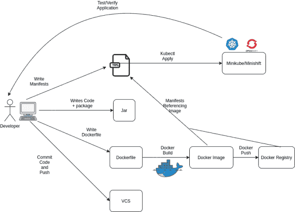
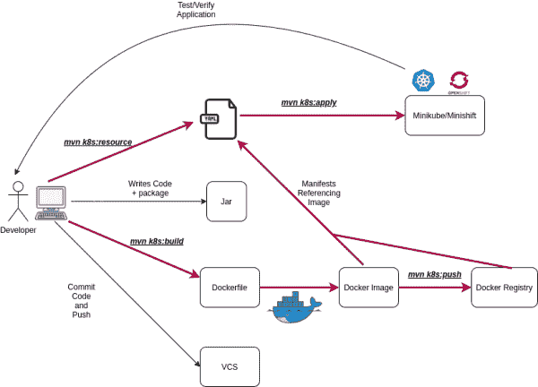
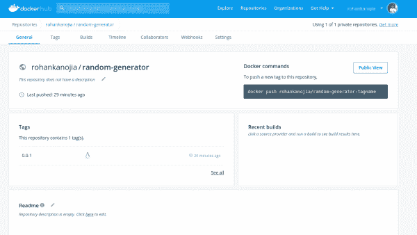

# 使用 Eclipse JKube 在 Kubernetes 之上开发 Java

> 原文：<https://developers.redhat.com/blog/2020/08/24/java-development-on-top-of-kubernetes-using-eclipse-jkube>

[](https://github.com/eclipse/jkube)

自从开发人员开始采用 Java 技术并将其作为核心应用程序堆栈的一部分以来，已经有 25 年了。如今，许多 Java 开发人员和基于 Java 的商店正在或打算将他们的基础设施迁移到 Kubernetes 或相关发行版，如 T2 的 Red Hat OpenShift 和 T4 的亚马逊 EKS T5。

然而，Kubernetes 有一个陡峭的学习曲线，它为熟悉的 Java 开发工作流增加了一个额外的操作层。在本文中，我将介绍[Eclipse jbue](https://github.com/eclipse/jkube)，并向您展示如何使用它来简化 Kubernetes 工作流。正如您将看到的，Eclipse JKube 提供了到 Kubernetes 的迁移途径，同时让您留在熟悉的 Java 生态系统中。我还将快速展示如何使用 OpenShift Maven 插件将 Java 应用程序部署到 OpenShift。

## 传统的 Java 开发工作流程

在传统的 [Java](https://developers.redhat.com/topics/enterprise-java/) 工作流中，如图 1 所示，Java 开发人员编写代码，以 JAR 或 WAR 文件的形式创建部署单元，并在 web 服务器或应用服务器中部署和运行这些文件。开发人员大多从命令行使用 Maven，或者使用 IntelliJ 或 Eclipse 等 IDE 来编码和打包他们的应用程序。开发人员习惯于在将代码提交给版本控制系统之前对代码进行更改和尝试。

[")](/sites/default/files/blog/2020/06/Traditional-Java-Development-1.png)Traditional Java Developer's workflow

Figure 1: The traditional Java development workflow.

## 云原生 Java 开发工作流

当我们开始编写云原生应用时，Kubernetes 和[容器](https://developers.redhat.com/topics/containers/)出现了。作为开发人员，我们被期望将 Java 应用程序打包成图像，并编写引用这些图像的 Kubernetes 清单。清单然后被应用到运行 Kubernetes 的生产服务器上。Kubernetes 从图像注册中心提取图像，并根据我们在清单中提供的配置部署应用程序，清单通常是 YAML 文件。

图 2 展示了传统的 Java 开发工作流在云原生环境中是如何变化的。

[](/sites/default/files/blog/2020/06/Cloud-Native-Java-Workflow.png)Cloud Native Java Developer's workflow

Figure 2: A cloud-native Java development workflow.

## Eclipse JKube

采用 Kubernetes 给整个工作流增加了一个新的操作层，这对许多开发人员来说是个麻烦。我们希望关注应用程序的逻辑，而不是应用程序是如何部署的。这里是 [Eclipse JKube](https://github.com/eclipse/jkube) 进入画面的点。作为一名开发人员，您可以使用 JKube 的库和插件——[JKube Kit](https://github.com/eclipse/jkube/tree/master/jkube-kit)以及 [Kubernetes Maven 插件](https://github.com/eclipse/jkube/tree/master/kubernetes-maven-plugin)或 [OpenShift Maven 插件](https://github.com/eclipse/jkube/tree/master/openshift-maven-plugin)——轻松处理图 2 中概述的 Kubernetes 和容器操作。

在本文的其余部分，您将学习如何使用 Eclipse JKube 和 Kubernetes Maven 插件来简化基于 Kubernetes 的 Java 开发工作流。

### 云原生开发工作流中的 Eclipse JKube

让我们考虑图 2 中的云原生 Java 开发工作流的修改版本。图 3 显示了集成了 Eclipse JKube 和 Kubernetes Maven 插件后的工作流程。

[](/sites/default/files/blog/2020/06/Cloud-Native-Java-Workflow-Using-Eclipse-JKube.png)Cloud Native Java Workflow simplified with Eclipse JKube

Figure 3: The cloud-native Java workflow simplified with Eclipse JKube.

在这个工作流中，所有需要使用 Kubernetes 或容器(用红色突出显示)的操作都被默认的 Eclipse JKube 目标所取代。表 1 提供了这些目标的详细情况。

Table 1: Default Eclipse JKube goals.

| **目标** | **阶段** | **描述** |
| [k8s:build](https://www.eclipse.org/jkube/docs/kubernetes-maven-plugin#jkube:build) | 预集成测试 | 构建 docker 图像。 |
| [k8s:推](https://www.eclipse.org/jkube/docs/kubernetes-maven-plugin#jkube:push) | 安装 | 将 docker 图像推送到注册表。 |
| [k8s:资源](https://www.eclipse.org/jkube/docs/kubernetes-maven-plugin#jkube:resource) | 流程 _ 资源 | 生成 K8s 清单。 |
| [k8s:应用](https://www.eclipse.org/jkube/docs/kubernetes-maven-plugin#jkube:apply) | 编制 | 将生成的清单应用到 K8s。 |
| [k8s:取消部署](https://www.eclipse.org/jkube/docs/kubernetes-maven-plugin#jkube:undeploy) | 取消部署 | 删除通过`k8s:apply`和`k8s:deploy`部署的 K8s 资源。 |

**注意**:如果您不想要固执己见的默认设置，那么您可以手动配置 Eclipse JKube，它提供了 [XML 配置](https://www.eclipse.org/jkube/docs/kubernetes-maven-plugin#_xml_configuration)和[资源配置](https://www.eclipse.org/jkube/docs/kubernetes-maven-plugin#_resource_fragments)选项。

现在，我们准备探索一个带有 Eclipse JKube 和 Kubernetes Maven 插件的应用程序示例。

## 使用 Eclipse JKube 在 Kubernetes 上部署 Java 应用程序

在这个例子中，我们将使用 Eclipse JKube 在一个 [Minikube](https://kubernetes.io/docs/setup/learning-environment/minikube/) 集群上部署一个简单的 Java 应用程序。使用 Kubernetes Maven 插件，我们可以在不提供任何配置的情况下设置部署。

对于我们的示例应用程序，我们将使用一个简单的随机数生成应用程序。该应用程序在`/random`端点上打印 JSON 输出，如下所示:

```
~/work/repos/eclipse-jkube-demo-project : $ curl localhost:8080/random | jq .
  % Total    % Received % Xferd  Average Speed   Time    Time     Time  Current
                                 Dload  Upload   Total   Spent    Left  Speed
100    45    0    45    0     0    818      0 --:--:-- --:--:-- --:--:--   818
{
  "id": "e80a4d10-c79b-4b9a-aaac-7c286cb37f3c"
}

```

### 步骤 1:获取 Kubernetes Maven 插件

Kubernetes Maven 插件可以从 [Maven 中央存储库](https://search.maven.org/search?q=g:org.eclipse.jkube%20AND%20a:kubernetes-maven-plugin)获得。要开始使用 Eclipse JKube，您需要将 Kubernetes Maven 插件作为依赖项添加到您的`pom.xml`中，如下所示:

```
<plugin>
     <groupId>org.eclipse.jkube</groupId>
     <artifactId>kubernetes-maven-plugin</artifactId>
     <version>${jkube.version}</version>
 </plugin>

```

如果您运行的是 Kubernetes 的 OpenShift 版本，您将按如下方式更新您的`pom.xml`:

```
<plugin>
     <groupId>org.eclipse.jkube</groupId>
     <artifactId>openshift-maven-plugin</artifactId>
     <version>${jkube.version}</version>
 </plugin>

```

### 步骤 2:构建 docker 映像

您可以使用`mvn package`命令构建应用程序 JAR，然后使用`mvn k8s:build`目标构建应用程序的 docker 映像。请注意，我通过这个属性覆盖了默认的图像名称:

```
<jkube.generator.name>docker.io/rohankanojia/random-generator:${project.version}</jkube.generator.name>

```

在构建映像之前，您需要确保您已经正确地公开了 docker 守护进程。公开 docker 守护程序的命令是:

```
$ eval $(minikube docker-env)

```

接下来，你输入目标，`mvn k8s:build`。下面是使用 Eclipse JKube 构建目标构建 docker 映像的输出:

```
~/work/repos/eclipse-jkube-demo-project : $ mvn k8s:build
[INFO] Scanning for projects...
[INFO] 
[INFO] ----------------------< meetup:random-generator >-----------------------
[INFO] Building random-generator 0.0.1
[INFO] --------------------------------[ jar ]---------------------------------
[INFO] 
[INFO] --- kubernetes-maven-plugin:1.0.0:build (default-cli) @ random-generator ---
[INFO] k8s: Running in Kubernetes mode
[INFO] k8s: Building Docker image in Kubernetes mode
[INFO] k8s: Running generator spring-boot
[INFO] k8s: spring-boot: Using Docker image quay.io/jkube/jkube-java-binary-s2i:0.0.7 as base / builder
[INFO] k8s: [docker.io/rohankanojia/random-generator:0.0.1] "spring-boot": Created docker-build.tar in 251 milliseconds
[INFO] k8s: [docker.io/rohankanojia/random-generator:0.0.1] "spring-boot": Built image sha256:a20e5
[INFO] ------------------------------------------------------------------------
[INFO] BUILD SUCCESS
[INFO] ------------------------------------------------------------------------
[INFO] Total time:  5.053 s
[INFO] Finished at: 2020-08-10T11:28:23+05:30
[INFO] ------------------------------------------------------------------------
~/work/repos/eclipse-jkube-demo-project : $
```

### 第 3 步:将图像推送到 docker 注册表中

一旦您用配置好的 push registry(在我的例子中是`docker.io`)构建了 docker 映像，您就可以将映像推送到 registry。下面是进入 Eclipse JKube 推送目标后的输出，`mvn k8s:push`:

```
~/work/repos/eclipse-jkube-demo-project : $ mvn k8s:push
[INFO] Scanning for projects...
[INFO] 
[INFO] ----------------------< meetup:random-generator >-----------------------
[INFO] Building random-generator 0.0.1
[INFO] --------------------------------[ jar ]---------------------------------
[INFO] 
[INFO] --- kubernetes-maven-plugin:1.0.0:push (default-cli) @ random-generator ---
[INFO] k8s: Running in Kubernetes mode
[INFO] k8s: Building Docker image in Kubernetes mode
[INFO] k8s: Running generator spring-boot
[INFO] k8s: spring-boot: Using Docker image quay.io/jkube/jkube-java-binary-s2i:0.0.7 as base / builder
[INFO] k8s: The push refers to repository [docker.io/rohankanojia/random-generator]
5dcd9556710f: Layer already exists 
b7139ad07aa8: Layer already exists 
b6f081e4b2b6: Layer already exists 
d8e1f35641ac: Layer already exists 
[INFO] k8s: 0.0.1: digest: sha256:9f9eda2a13b8cab1d2c9e474248500145fc09e2922fe3735692f9bda4c76002d size: 1162
[INFO] k8s: Pushed docker.io/rohankanojia/random-generator:0.0.1 in 7 seconds 
[INFO] ------------------------------------------------------------------------
[INFO] BUILD SUCCESS
[INFO] ------------------------------------------------------------------------
[INFO] Total time:  11.222 s
[INFO] Finished at: 2020-08-10T11:35:37+05:30
[INFO] ------------------------------------------------------------------------
~/work/repos/eclipse-jkube-demo-project : $ 
```

推送映像后，您可以确认它已被推送至指定的映像注册表。在我的例子中，我能够在 Docker Hub 上看到我推送的图像，如图 4 所示。

[](/sites/default/files/blog/2020/06/Screenshot-from-2020-06-15-19-28-53.png)Docker Hub Updated after k8s:push goal

Figure 4: The pushed image is available on Docker Hub.

### 步骤 4:为您的应用程序生成 Kubernetes 资源清单

构建完应用程序映像之后，接下来要做的事情是编写 Kubernetes 清单。Eclipse JKube 提供了一个基于底层 Java 框架生成自以为是的资源清单的目标，该框架可以是 [Spring Boot](https://developers.redhat.com/topics/spring-boot) 、[夸尔库斯](https://developers.redhat.com/products/quarkus/getting-started)、Vert.x 或其他一些框架。另一种选择是使用 XML 配置文件配置清单，并在应用程序的`src/main/jkube`文件夹中提供原始片段(所需资源清单的一部分)。然后，您的配置将被合并到生成的清单中。

对于这个应用程序，我们将让 Eclipse JKube 为默认部署和类型为`ClusterIP`的服务生成一个清单。接下来，我们将为类型为`NodePort`的`Service`定制服务清单。设置以下属性会覆盖默认行为:

```
<jkube.enricher.jkube-service.type>NodePort</jkube.enricher.jkube-service.type>

```

下面是输入 Eclipse JKube 资源目标`mvn k8s:resource`的输出。

```
~/work/repos/eclipse-jkube-demo-project : $ mvn k8s:resource
[INFO] Scanning for projects...
[INFO] 
[INFO] ----------------------< meetup:random-generator >-----------------------
[INFO] Building random-generator 0.0.1
[INFO] --------------------------------[ jar ]---------------------------------
[INFO] 
[INFO] --- kubernetes-maven-plugin:1.0.0:resource (default-cli) @ random-generator ---
[INFO] k8s: Running generator spring-boot
[INFO] k8s: spring-boot: Using Docker image quay.io/jkube/jkube-java-binary-s2i:0.0.7 as base / builder
[INFO] k8s: jkube-controller: Adding a default Deployment
[INFO] k8s: jkube-service: Adding a default service 'random-generator' with ports [8080]
[INFO] k8s: jkube-healthcheck-spring-boot: Adding readiness probe on port 8080, path='/actuator/health', scheme='HTTP', with initial delay 10 seconds
[INFO] k8s: jkube-healthcheck-spring-boot: Adding liveness probe on port 8080, path='/actuator/health', scheme='HTTP', with initial delay 180 seconds
[INFO] k8s: jkube-revision-history: Adding revision history limit to 2
[INFO] ------------------------------------------------------------------------
[INFO] BUILD SUCCESS
[INFO] ------------------------------------------------------------------------
[INFO] Total time:  3.344 s
[INFO] Finished at: 2020-08-10T11:38:11+05:30
[INFO] ------------------------------------------------------------------------
~/work/repos/eclipse-jkube-demo-project : $ ls target/classes/META-INF/jkube/kubernetes
random-generator-deployment.yml  random-generator-service.yml
~/work/repos/eclipse-jkube-demo-project : $ cat target/classes/META-INF/jkube/kubernetes/random-generator-deployment.yml | head -n10
---
apiVersion: apps/v1
kind: Deployment
metadata:
 annotations:
 jkube.io/git-url: git@github.com:rohanKanojia/eclipse-jkube-demo-project.git
 jkube.io/git-commit: 1ef9ef2ef7a6fcbf8eb64c293f26f9c42d026512
 jkube.io/git-branch: master
 jkube.io/scm-url: https://github.com/spring-projects/spring-boot/spring-boot-starter-parent/random-generator
 jkube.io/scm-tag: HEAD
~/work/repos/eclipse-jkube-demo-project : $
```

### 步骤 5:在 Kubernetes 集群中部署您的应用程序

现在已经为示例应用程序做好了一切准备。我们能够为应用程序生成图像，然后自动生成资源清单。现在，我们只需要将这些工件应用到 Kubernetes 集群上。您可以使用`kubectl apply -f`来部署应用程序；然而，插件也会为您处理这些。下面是进入 Eclipse JKube 应用目标后的输出，`mvn k8s:apply`:

```
~/work/repos/eclipse-jkube-demo-project : $ mvn k8s:apply
[INFO] Scanning for projects...
[INFO] 
[INFO] ----------------------< meetup:random-generator >-----------------------
[INFO] Building random-generator 0.0.1
[INFO] --------------------------------[ jar ]---------------------------------
[INFO] 
[INFO] --- kubernetes-maven-plugin:1.0.0:apply (default-cli) @ random-generator ---
[INFO] k8s: Using Kubernetes at https://192.168.39.145:8443/ in namespace default with manifest /home/rohaan/work/repos/eclipse-jkube-demo-project/target/classes/META-INF/jkube/kubernetes.yml 
[INFO] k8s: Using namespace: default
[INFO] k8s: Creating a Service from kubernetes.yml namespace default name random-generator
[INFO] k8s: Created Service: target/jkube/applyJson/default/service-random-generator.json
[INFO] k8s: Creating a Deployment from kubernetes.yml namespace default name random-generator
[INFO] k8s: Created Deployment: target/jkube/applyJson/default/deployment-random-generator.json
[INFO] k8s: HINT: Use the command `kubectl get pods -w` to watch your pods start up
[INFO] ------------------------------------------------------------------------
[INFO] BUILD SUCCESS
[INFO] ------------------------------------------------------------------------
[INFO] Total time:  7.306 s
[INFO] Finished at: 2020-08-10T11:40:57+05:30
[INFO] ------------------------------------------------------------------------
~/work/repos/eclipse-jkube-demo-project : $ kubectl get pods -w
NAME                                                     READY   STATUS             RESTARTS   AGE
random-generator-58b7847d7f-9m9df                        0/1     Running            0          7s
random-generator-58b7847d7f-9m9df                        1/1     Running            0          17s
^C~/work/repos/eclipse-jkube-demo-project : $ kubectl get svc
NAME                                    TYPE        CLUSTER-IP      EXTERNAL-IP   PORT(S)           AGE
io-openliberty-sample-getting-started   NodePort    10.110.4.104    <none>        9080:30570/TCP    44h
kubernetes                              ClusterIP   10.96.0.1       <none>        443/TCP           18d
random-generator                        NodePort    10.97.172.147   <none>        8080:32186/TCP    22s
~/work/repos/eclipse-jkube-demo-project : $ curl `minikube ip`:32186/random | jq .
 % Total    % Received % Xferd  Average Speed   Time    Time     Time  Current
 Dload  Upload   Total   Spent    Left  Speed
100    45    0    45    0     0   1800      0 --:--:-- --:--:-- --:--:--  1875
{
 "id": "42e5571f-a20f-44b3-8184-370356581d10"
}
```

### 步骤 6:从 Kubernetes 集群中取消部署应用程序

`undeploy`目标与`apply`目标相反。它只是删除了在`apply`阶段应用的所有资源。下面是启动 Eclipse JKube 取消部署目标后的输出，`mvn k8s:undeploy`:

```
~/work/repos/eclipse-jkube-demo-project : $ kubectl get all
NAME                                    READY   STATUS    RESTARTS   AGE
pod/random-generator-58b7847d7f-9m9df   1/1     Running   0          5m21s

NAME                       TYPE        CLUSTER-IP      EXTERNAL-IP   PORT(S)          AGE
service/kubernetes         ClusterIP   10.96.0.1       <none>        443/TCP          18d
service/random-generator   NodePort    10.97.172.147   <none>        8080:32186/TCP   5m21s

NAME                               READY   UP-TO-DATE   AVAILABLE   AGE
deployment.apps/random-generator   1/1     1            1           5m21s

NAME                                          DESIRED   CURRENT   READY   AGE
replicaset.apps/random-generator-58b7847d7f   1         1         1       5m21s
~/work/repos/eclipse-jkube-demo-project : $ mvn k8s:undeploy
[INFO] Scanning for projects...
[INFO] 
[INFO] ----------------------< meetup:random-generator >-----------------------
[INFO] Building random-generator 0.0.1
[INFO] --------------------------------[ jar ]---------------------------------
[INFO] 
[INFO] --- kubernetes-maven-plugin:1.0.0:undeploy (default-cli) @ random-generator ---
[INFO] k8s: Using Kubernetes at https://192.168.39.145:8443/ in namespace default with manifest /home/rohaan/work/repos/eclipse-jkube-demo-project/target/classes/META-INF/jkube/kubernetes.yml 
[INFO] k8s: Using namespace: default
[INFO] k8s: Deleting resource Deployment default/random-generator
[INFO] k8s: Deleting resource Service default/random-generator
[INFO] k8s: HINT: Use the command `kubectl get pods -w` to watch your pods start up
[INFO] ------------------------------------------------------------------------
[INFO] BUILD SUCCESS
[INFO] ------------------------------------------------------------------------
[INFO] Total time:  3.412 s
[INFO] Finished at: 2020-08-10T11:46:22+05:30
[INFO] ------------------------------------------------------------------------
~/work/repos/eclipse-jkube-demo-project : $ kubectl get pods -w
^C~/work/repos/eclipse-jkube-demo-project : $ kubectl get all
NAME                 TYPE        CLUSTER-IP   EXTERNAL-IP   PORT(S)   AGE
service/kubernetes   ClusterIP   10.96.0.1    <none>        443/TCP   18d
~/work/repos/eclipse-jkube-demo-project : $
```

## 使用 Eclipse JKube 做更多事情

我们已经讨论了 Eclipse JKube 和 Kubernetes Maven 插件提供的核心目标。您可以使用这些目标来简化 Kubernetes 之上的 Java 应用程序开发工作流。如果您不喜欢重复输入目标，您可以通过在插件配置中添加指定的执行来简化，如下所示:

```
<plugin>
     <groupId>org.eclipse.jkube</groupId>
     <artifactId>kubernetes-maven-plugin</artifactId>
     <version>${project.version}</version>
     <executions>
         <execution>
             <goals>
                  <goal>build</goal>
                  <goal>resource</goal>
                  <goal>apply</goal>
             </goals>
         </execution>
     </executions>
</plugin>

```

我还没有涵盖 Eclipse JKube 和 Kubernetes Maven 插件提供的所有目标。表 2 显示了额外的目标，您可以自己探索。

Table 2: Additional Eclipse JKube goals.

| **目标** | **阶段** | **描述** |
| [k8s:log](https://www.eclipse.org/jkube/docs/kubernetes-maven-plugin#jkube:log) | 使生效 | 从 Kubernetes 内部运行的应用程序中获取日志。 |
| [k8s:调试](https://www.eclipse.org/jkube/docs/kubernetes-maven-plugin#jkube:debug) | 包裹 | 打开调试端口，这样就可以从 ide 中调试 Kubernetes 内部运行的应用程序。 |
| [k8s:展开](https://www.eclipse.org/jkube/docs/kubernetes-maven-plugin#jkube:deploy) | 安装 | 派生 Install 目标，并将生成的清单应用到 Kubernetes 集群上，就像 apply 目标一样。 |
| [k8s:手表](https://www.eclipse.org/jkube/docs/kubernetes-maven-plugin#jkube:watch) | 包裹 | 通过观察应用程序工作区，对应用程序进行自动热部署。 |

## 使用 OpenShift Maven 插件将 Java 应用程序部署到 Red Hat OpenShift

您可以使用 [OpenShift Maven 插件](https://www.eclipse.org/jkube/docs/openshift-maven-plugin)在 Red Hat OpenShift 上部署相同的应用程序。唯一的区别是`k8s`目标前缀将被`oc`目标前缀所取代。Kubernetes Maven 插件默认进行 [docker](https://www.docker.com/get-started) 构建，OpenShift Maven 插件默认进行 [S2I](https://docs.openshift.com/enterprise/3.0/using_images/s2i_images/index.html) 构建。除了移除属性`jkube.generator.name`之外，我没有对我的项目做任何修改，因为我不需要它来推送(OpenShift 在构建阶段将图像推送到它的内部注册表)。下面是一个示例，但我不是单独运行一个目标，而是一次部署所有资源和目标:

```
~/work/repos/eclipse-jkube-demo-project : $ mvn oc:build oc:resource oc:apply
[INFO] Scanning for projects...
[INFO] 
[INFO] ----------------------< meetup:random-generator >-----------------------
[INFO] Building random-generator 0.0.1
[INFO] --------------------------------[ jar ]---------------------------------
[INFO] 
[INFO] --- openshift-maven-plugin:1.0.0:build (default-cli) @ random-generator ---
[INFO] oc: Using OpenShift build with strategy S2I
[INFO] oc: Running in OpenShift mode
[INFO] oc: Running generator spring-boot
[INFO] oc: spring-boot: Using Docker image quay.io/jkube/jkube-java-binary-s2i:0.0.7 as base / builder
[INFO] oc: [random-generator:0.0.1] "spring-boot": Created docker source tar /home/rohaan/work/repos/eclipse-jkube-demo-project/target/docker/random-generator/0.0.1/tmp/docker-build.tar
[INFO] oc: Adding to Secret pullsecret-jkube
[INFO] oc: Using Secret pullsecret-jkube
[INFO] oc: Creating BuildServiceConfig random-generator-s2i for Source build
[INFO] oc: Creating ImageStream random-generator
[INFO] oc: Starting Build random-generator-s2i
[INFO] oc: Waiting for build random-generator-s2i-1 to complete...
[INFO] oc: Caching blobs under "/var/cache/blobs".
[INFO] oc: Getting image source signatures
[INFO] oc: Copying blob sha256:cf0f3ebe9f536c782ab3835049cfbd9a663761ded9370791ef6ea3965c823aad
[INFO] oc: Copying blob sha256:57de4da701b511cba33bbdc424757f7f3b408bea741ca714ace265da9b59191a
[INFO] oc: Copying blob sha256:f320f94d91a064281f5127d5f49954b481062c7d56cce3b09910e471cf849050
[INFO] oc: Copying config sha256:52d6788fcfdd39595264d34a3959464a5dabc1d4ef0ae188802b20fc2d6a857b
[INFO] oc: Writing manifest to image destination
[INFO] oc: Storing signatures
[INFO] oc: Generating dockerfile with builder image quay.io/jkube/jkube-java-binary-s2i:0.0.7
[INFO] oc: STEP 1: FROM quay.io/jkube/jkube-java-binary-s2i:0.0.7
[INFO] oc: STEP 2: LABEL "io.openshift.build.source-location"="/tmp/build/inputs"       "io.openshift.build.image"="quay.io/jkube/jkube-java-binary-s2i:0.0.7"
[INFO] oc: STEP 3: ENV JAVA_APP_DIR="/deployments"     OPENSHIFT_BUILD_NAME="random-generator-s2i-1"     OPENSHIFT_BUILD_NAMESPACE="default"
[INFO] oc: STEP 4: USER root
[INFO] oc: STEP 5: COPY upload/src /tmp/src
[INFO] oc: STEP 6: RUN chown -R 1000:0 /tmp/src
[INFO] oc: STEP 7: USER 1000
[INFO] oc: STEP 8: RUN /usr/local/s2i/assemble
[INFO] oc: INFO S2I source build with plain binaries detected
[INFO] oc: INFO S2I binary build from fabric8-maven-plugin detected
[INFO] oc: INFO Copying binaries from /tmp/src/deployments to /deployments ...
[INFO] oc: random-generator-0.0.1.jar
[INFO] oc: INFO Copying deployments from deployments to /deployments...
[INFO] oc: '/tmp/src/deployments/random-generator-0.0.1.jar' -> '/deployments/random-generator-0.0.1.jar'
[INFO] oc: STEP 9: CMD /usr/local/s2i/run
[INFO] oc: STEP 10: COMMIT temp.builder.openshift.io/default/random-generator-s2i-1:48795e41
[INFO] oc: time="2020-08-10T06:37:49Z" level=info msg="Image operating system mismatch: image uses \"\", expecting \"linux\""
[INFO] oc: time="2020-08-10T06:37:49Z" level=info msg="Image architecture mismatch: image uses \"\", expecting \"amd64\""
[INFO] oc: Getting image source signatures
[INFO] oc: Copying blob sha256:d8e1f35641acb80b562f70cf49911341dfbe8c86f4d522b18efbf3732aa74223
[INFO] oc: Copying blob sha256:b6f081e4b2b6de8be4b1dec132043d14c121e968384dd624fb69c2c07b482edb
[INFO] oc: Copying blob sha256:b7139ad07aa8ce4ed5a132f7c5cc9f1de0f5099b5e155027a23d57f7fbe78b16
[INFO] oc: Copying blob sha256:98972fc90a1108315cc5b05b2c691a0849a149727a7b81e76bc847ac2c6d9714
[INFO] oc: Copying config sha256:27aaadaf28e24856a66db962b88118b8222b61d79163dceeeed869f7289bc230
[INFO] oc: Writing manifest to image destination
[INFO] oc: Storing signatures
[INFO] oc: --> 27aaadaf28e
[INFO] oc: 27aaadaf28e24856a66db962b88118b8222b61d79163dceeeed869f7289bc230
[INFO] oc: Getting image source signatures
[INFO] oc: 
[INFO] oc: Pushing image image-registry.openshift-image-registry.svc:5000/default/random-generator:0.0.1 ...
[INFO] oc: Copying blob sha256:f320f94d91a064281f5127d5f49954b481062c7d56cce3b09910e471cf849050
[INFO] oc: Copying blob sha256:cf0f3ebe9f536c782ab3835049cfbd9a663761ded9370791ef6ea3965c823aad
[INFO] oc: Copying blob sha256:57de4da701b511cba33bbdc424757f7f3b408bea741ca714ace265da9b59191a
[INFO] oc: Copying blob sha256:98972fc90a1108315cc5b05b2c691a0849a149727a7b81e76bc847ac2c6d9714
[INFO] oc: Copying config sha256:27aaadaf28e24856a66db962b88118b8222b61d79163dceeeed869f7289bc230
[INFO] oc: Writing manifest to image destination
[INFO] oc: Storing signatures
[INFO] oc: Successfully pushed image-registry.openshift-image-registry.svc:5000/default/random-generator@sha256:aa9e1a380c04ef9174ba56459c13d44420ebe653ebf32884d60fe4306b17306d
[INFO] oc: Push successful
[INFO] oc: Build random-generator-s2i-1 in status Complete
[INFO] oc: Found tag on ImageStream random-generator tag: sha256:aa9e1a380c04ef9174ba56459c13d44420ebe653ebf32884d60fe4306b17306d
[INFO] oc: ImageStream random-generator written to /home/rohaan/work/repos/eclipse-jkube-demo-project/target/random-generator-is.yml
[INFO] 
[INFO] --- openshift-maven-plugin:1.0.0:resource (default-cli) @ random-generator ---
[INFO] oc: Using docker image name of namespace: default
[INFO] oc: Running generator spring-boot
[INFO] oc: spring-boot: Using Docker image quay.io/jkube/jkube-java-binary-s2i:0.0.7 as base / builder
[INFO] oc: jkube-controller: Adding a default DeploymentConfig
[INFO] oc: jkube-service: Adding a default service 'random-generator' with ports [8080]
[INFO] oc: jkube-healthcheck-spring-boot: Adding readiness probe on port 8080, path='/actuator/health', scheme='HTTP', with initial delay 10 seconds
[INFO] oc: jkube-healthcheck-spring-boot: Adding liveness probe on port 8080, path='/actuator/health', scheme='HTTP', with initial delay 180 seconds
[INFO] oc: jkube-revision-history: Adding revision history limit to 2
[INFO] 
[INFO] --- openshift-maven-plugin:1.0.0:apply (default-cli) @ random-generator ---
[INFO] oc: Using OpenShift at https://api.crc.testing:6443/ in namespace default with manifest /home/rohaan/work/repos/eclipse-jkube-demo-project/target/classes/META-INF/jkube/openshift.yml 
[INFO] oc: OpenShift platform detected
[INFO] oc: Using project: default
[INFO] oc: Creating a Service from openshift.yml namespace default name random-generator
[INFO] oc: Created Service: target/jkube/applyJson/default/service-random-generator.json
[INFO] oc: Creating a DeploymentConfig from openshift.yml namespace default name random-generator
[INFO] oc: Created DeploymentConfig: target/jkube/applyJson/default/deploymentconfig-random-generator.json
[INFO] oc: Creating Route default:random-generator host: null
[INFO] oc: HINT: Use the command `oc get pods -w` to watch your pods start up
[INFO] ------------------------------------------------------------------------
[INFO] BUILD SUCCESS
[INFO] ------------------------------------------------------------------------
[INFO] Total time:  01:07 min
[INFO] Finished at: 2020-08-10T12:08:00+05:30
[INFO] ------------------------------------------------------------------------
~/work/repos/eclipse-jkube-demo-project : $ oc get pods -w
NAME                           READY     STATUS      RESTARTS   AGE
random-generator-1-deploy      1/1       Running     0          14s
random-generator-1-vnrm9       0/1       Running     0          11s
random-generator-s2i-1-build   0/1       Completed   0          1m
random-generator-1-vnrm9   1/1       Running   0         24s
random-generator-1-deploy   0/1       Completed   0         28s
~/work/repos/eclipse-jkube-demo-project : $ oc get routes
NAME                HOST/PORT                                    PATH      SERVICES            PORT      TERMINATION   WILDCARD
random-generator    random-generator-default.apps-crc.testing              random-generator    8080                    None
~/work/repos/eclipse-jkube-demo-project : $ curl random-generator-default.apps-crc.testing/random 
 % Total    % Received % Xferd  Average Speed   Time    Time     Time  Current
 Dload  Upload   Total   Spent    Left  Speed
100    45    0    45    0     0   1666      0 --:--:-- --:--:-- --:--:--  1730
{
 "id": "d80052d9-2f92-43cb-b9eb-d7cffb879798"
}
~/work/repos/eclipse-jkube-demo-project : $
```

## 观看视频演示

要了解更多关于使用 Eclipse JKube 简化 Kubernetes 开发的信息，请观看这个演示视频。您将了解如何在 Minikube 上快速部署一个简单的 Spring Boot 应用程序:

[https://www.youtube.com/embed/z1-EX-G3bpc?autoplay=0&start=0&rel=0](https://www.youtube.com/embed/z1-EX-G3bpc?autoplay=0&start=0&rel=0)

## 结论

在本文中，我向您展示了如何使用 Eclipse JKube 来简化 Kubernetes 工作负载。您可以访问 Eclipse JKube [项目网站](https://www.eclipse.org/jkube/)来了解关于这个集合的更多信息。如果你喜欢 Eclipse JKube，请通过在 [Twitter](https://twitter.com/jkubeio) 上传播消息来支持我们。你也可以[在 GitHub](https://github.com/eclipse/jkube) 上观看和启动 Eclipse JKube 项目。

*Last updated: January 10, 2022*