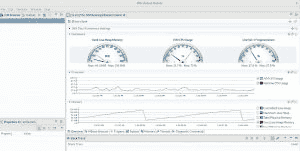

# 用 OpenJDK 的 Red Hat Build 设置 JDK 任务控制

> 原文：<https://developers.redhat.com/blog/2019/03/15/jdk-mission-control-red-hat-build-openjdk>

JDK 任务控制中心现在是红帽软件集合的最新成员。 [JDK 任务控制](https://github.com/JDKMissionControl)是一个强大的热点 Java 虚拟机(JVM)分析器，拥有一套先进的工具，可以对 JDK 飞行记录器收集的大量数据进行高效而详细的分析。该工具链使开发人员和管理员能够使用 OpenJDK 11 从本地运行或部署在生产环境中的 [Java 应用](https://developers.redhat.com/topics/enterprise-java/)中收集和分析数据。

在本文中，我将通过一个主要的例子来设置 JDK 任务控制。对于 [Linux](https://developers.redhat.com/topics/linux/) ，JDK 任务控制是 RHSCL 的一部分，对于 Windows，它是作为[红帽客户门户](https://access.redhat.com/)上的 [OpenJDK](https://developers.redhat.com/products/openjdk/overview/) zip 发行版的一部分。对于 Linux，这些说明假设已经安装了 OpenJDK 11 的 Red Hat Build。我将展示如何设置系统来安装来自 RHSCL 的软件，RHS cl 为 [Red Hat Enterprise Linux](https://developers.redhat.com/topics/linux/) 提供了最新的开发技术。然后，我将安装 JDK 任务控制并运行一个简单的示例应用程序。完成整个教程不到 10 分钟。

## **安装任务控制**

### **对于微软视窗系统**

对于微软视窗系统，可通过红帽客户门户获得的 OpenJDK zip 现在包含 JDK 任务控制和 JDK 飞行记录器。一旦取消归档，可以在`bin`目录中找到 JMC 二进制文件。

### **对于红帽企业版 Linux**

您可以 root 用户身份使用 subscription-manager 工具从命令行添加或删除软件存储库。使用`--list`选项查看可用的软件存储库，并验证您有权访问 RHSCL:

```
$ su -
# subscription-manager repos --list | egrep rhscl
```

根据所使用的变体(例如，服务器或工作站)，您可以使用以下命令启用 repo:

```
# subscription-manager repos --enable  rhel-variant-rhscl-7-rpms
```

使用以下命令安装 JMC:

```
$ yum install rh-jmc
```

我们现在已经安装了 JMC。你可以通过键入`JMC`或前往应用程序菜单来启动它。

如果您像我一样运行多个版本的 Java，并且想从命令行启动 JMC，使用以下选项启动 JMC，路径为 OpenJDK 的 Red Hat Build。

```
$ scl enable rh-jmc bash
$ jmc -vm /usr/lib/jvm/java-11-openjdk-11.0.2.7-0.el7_6.i386/bin
```

### **实时监控**

JMC 允许您对 JVM 进行实时监控。为此，从文件菜单创建一个新连接，选择您的 JVM，并启动 JMX 控制台。结果应该给你一个概述页面，包括处理器、内存消耗、Java 堆使用、JVM CPU 使用等。



现在我们已经设置了 JMC，让我们试着运行一个例子，看看它是如何工作的。

下面是一个读取几个文件的简单例子。事实上，可能有我们没有考虑到的问题。在下面的例子中，我有两个文件:一个简单的 HTML 文件和一个大约 1 GB 的文本文件。

```
import java.io.BufferedReader;
import java.io.File;
import java.io.FileReader;
import java.io.IOException;

public class TextFileReader {

private File textFilePath = null;

public TextFileReader(String textFilePath) {
    if (textFilePath == null)
        throw new IllegalArgumentException();
    this.textFilePath = new File(textFilePath);
}

public void readFile() throws IOException {
    FileReader fileReader = new FileReader(textFilePath);
    BufferedReader bufferedreader = new BufferedReader(fileReader);
    StringBuffer sb = new StringBuffer();
    String strLine;
    while ((strLine = bufferedreader.readLine()) != null) {
        sb.append(strLine);
        sb.append("\n");
    }

    fileReader.close();
    System.out.println(sb.toString());
}

public static void main(String[] args) throws IOException{

    new TextFileReader("index.html").readFile();
    new TextFileReader("test.txt").readFile();

}

}
```

让我们执行下面的命令来编译和运行这个例子。

```
$ javac TextFileReader.java

$ java -XX:+FlightRecorder -XX:StartFlightRecording=dumponexit=true,filename=filereader.jfr TextFileReader
```

在上面的 Java 命令中，参数`-XX:StartFlightRecording`会将结果转储到`filereader.jfr`中。

让我们通过在 JMC 打开这个文件来看看结果。


JMC 报道了全程的深入细节；例如，JVM 内部显示 GC 正在停止。此外，对于没有太多内存的大文件，这是一个问题，因此我们可以通过降低`-XX:InitiatingHeapOccupancyPercent`的值来解决这个问题，甚至可以确保有足够的内存(例如，Xms1024m -Xmx4096m)。

另一个很好的例子是 Red Hat 的软件工程师康杰，他展示了方法剖析是如何工作的，帮助优化原始代码。

JMC 对于理解应用程序行为非常有用，比如内存泄漏、死锁等等。试试 OpenJDK 11 的[红帽版本](https://developers.redhat.com/products/openjdk/overview)

*Last updated: September 3, 2019*