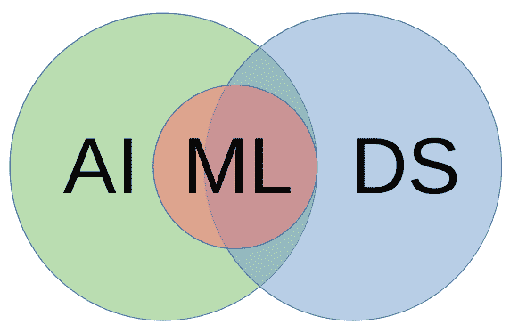
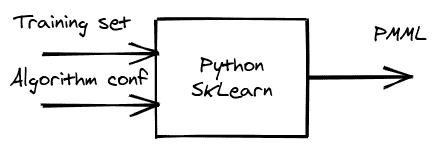

# 知识与机器学习相结合，实现更明智的决策，第 1 部分

> 原文：<https://developers.redhat.com/blog/2021/01/14/knowledge-meets-machine-learning-for-smarter-decisions-part-1>

Drools 是一个流行的开源项目，以其强大的规则引擎而闻名。很少有用户意识到它也可以成为通向[人工智能](https://developers.redhat.com/topics/ai-ml)的惊人可能性的大门。这篇由两部分组成的文章向您介绍了如何使用[红帽决策管理器](https://developers.redhat.com/products/red-hat-decision-manager/overview)及其基于 Drools 的规则引擎将[机器学习](https://developers.redhat.com/blog/category/machine-learning/)预测与确定性推理结合起来。在第 1 部分，我们将准备我们的机器学习逻辑。在第 2 部分中，您将学习如何从知识服务中使用机器学习模型。

**注意**:本文中的例子基于 Red Hat Decision Manager，但是所有使用的技术都是开源的。

## 机器学习遇上知识工程

很少有 Red Hat Decision Manager 用户知道它的根源是人工智能(AI)，具体来说是知识工程的 AI 分支(也称为知识表示和推理)。这个分支旨在解决如何组织人类知识以便计算机可以处理的问题。知识工程使用*业务规则*，这意味着一组主题专家可以轻松理解和使用的知识隐喻。

[决策模型和符号](https://www.omg.org/dmn/) (DMN)标准最近为主题专家发布了一个新的模型和符号。经过多年使用不同的方法和工具，我们终于有了一个共享知识表示的共同语言。DMN 的一个隐藏的宝藏是，它使处理机器学习算法变得更容易。connecting link 是数据科学中另一个众所周知的标准:[预测模型标记语言](http://dmg.org/pmml/v4-1/GeneralStructure.html)，或 PMML。

使用这些工具来连接知识工程和机器学习可以增强这两个领域，因此整体大于其部分之和。它开辟了广泛的用例，在这些用例中，结合确定性知识和数据科学预测可以做出更明智的决策。

## 合作的用例

算法可以从大量数据中学习，并理解我们人类看不到的模式，这一想法非常有趣。然而，对机器学习技术的过度自信导致我们低估了人类知识的价值。

让我们从我们的日常经验中举一个例子:我们都习惯于使用我们的互联网浏览历史来向我们显示我们已经购买的产品的广告的算法。这是因为很难训练一个机器学习算法来排除以前购买的产品的广告。

对于机器学习来说很难的问题，对于知识工程来说很容易解决。另一方面，对搜索到的单词和建议的产品之间所有可能的关系进行编码是极其繁琐的。在这个领域，机器学习补充了知识工程。

人工智能有很多分支——机器学习、知识工程、搜索优化、自然语言处理等等。为什么不使用多种技术来实现更智能的行为呢？

## 人工智能、机器学习和数据科学

人工智能、机器学习和数据科学经常互换使用。实际上，它们是不同但重叠的领域。正如我已经提到的，人工智能比机器学习的范围更广。机器学习只是人工智能的一个方面。类似地，一些人认为数据科学是人工智能的一个方面。其他人则持相反意见，认为数据科学包括人工智能。

在这个领域，数据科学家和人工智能专家提供不同种类的专业知识，有些重叠。数据科学使用了很多机器学习算法，但不是全部。图 1 中的维恩图显示了人工智能、机器学习和数据科学重叠的空间。

[](/sites/default/files/blog/2020/11/img_5fa25e53ede08.png)

Figure 1: The overlaps between artificial intelligence, machine learning, and data science.

**注**:参见[数据科学与机器学习和人工智能](https://www.mygreatlearning.com/blog/difference-data-science-machine-learning-ai/)了解更多关于这些技术领域及其交汇的空间。

## 打造你自己的机器学习模型

数据科学家负责在精心准备后定义机器学习模型。本节将探讨数据科学家用来选择和调整机器学习算法的一些技术。目标是理解工作流，并学习如何创建一个可以处理预测问题的模型。

**注**:要了解更多关于数据科学方法和流程的信息，请参见维基百科的[数据挖掘跨行业标准流程](https://en.m.wikipedia.org/wiki/Cross-industry_standard_process_for_data_mining) (CRISP-DM)页面。

### 准备和训练一个机器学习算法

准备和训练机器学习算法的第一步是收集、分析和清理我们将使用的数据。数据准备是一个重要的阶段，对最终结果的质量有很大的影响。数据科学家在这个阶段使用数学和统计学。

为简单起见，假设我们有一个可靠的数据集，该数据集基于经理在订单履行流程中的历史决策。经理收到以下信息:产品类型(例如电话、打印机等)、价格、紧急程度和类别。有两类:*基本*，用于当产品是员工必需的装备时，*可选*，用于当产品不是角色必需的时候。

两个决策结果是*批准*或*拒绝*。自动化这一决策将使经理从重复的任务中解脱出来，并加快整个订单履行过程。

作为第一次尝试，我们可以按原样获取数据来训练模型。相反，让我们介绍一点上下文相关的知识。在我们虚构的组织中，采购部门有一个价格参考表，其中定义了所有产品类型的目标价格。我们可以利用这些信息来提高数据的质量。我们不是训练我们的算法专注于产品类型，而是训练它考虑目标价格。这样，当参考价目表发生变化时，我们就不需要重新训练模型。

### 选择机器学习算法

我们现在有一个典型的分类问题:给定输入数据，算法必须为这些数据找到一个类。换句话说，它必须标记每个数据项*被批准*或*被拒绝*。因为我们有经理收集的回答，所以我们可以使用监督学习方法。我们只需要选择正确的算法。主要的机器学习算法有:

*   线性回归
*   逻辑回归
*   k-最近邻
*   支持向量机
*   决策树和随机森林
*   神经网络

**注**:关于这些算法的更多信息，请参见
[用浅显英语解释的 9 种关键机器学习算法](https://www.freecodecamp.org/news/a-no-code-intro-to-the-9-most-important-machine-learning-algorithms-today/)。

除了线性回归，我们可以将这些算法中的任何一种应用于我们的分类问题。对于这个用例，我们将使用逻辑回归模型。幸运的是，我们不需要了解算法的实现细节。我们可以依靠现有的工具来实施。

### Python 和 scikit-学习

我们将使用 Python 和 [scikit-learn 库](https://scikit-learn.org/)来训练我们的逻辑回归模型。我们选择 Python，是因为它简洁，容易理解和学习。也是数据科学家事实上的标准。许多专门为数据科学设计的库都是用 Python 编写的。

## 示例项目

在我们继续之前，请在这里下载[项目源代码](https://github.com/dmarrazzo/rhdm-dmn-pmml-order)。打开`python`文件夹，找到机器训练代码(`ml-training.py`)和我们用来训练算法的 CSV 文件。

即使没有 Python 和机器学习的经验，代码也很容易理解和适应。该程序的逻辑步骤是:

1.  初始化算法进行训练。
2.  从 CSV 文件中读取可用数据。
3.  随机拆分训练和测试数据集(40%用于测试)。
4.  训练模型。
5.  根据测试数据集测试模型。
6.  打印测试结果。
7.  在 PMML 保存训练好的模型。

`scikit-learn`库的一个很好的特性是它的机器学习算法公开了几乎所有相同的 API。您可以通过更改一行代码在可用的算法之间切换。这意味着您可以轻松地测试不同算法的准确性，并决定哪一个最适合您的用例。这种类型的基准测试很常见，因为通常很难预先知道哪种算法对于一个用例会执行得更好。

### 运行程序

如果您运行 Python 程序，您应该会看到类似于下面的结果，但并不完全相同。训练和测试数据是随机选择的，因此每次的结果都不同。关键是要验证算法在多次执行中的一致性。

```
Results for model LogisticRegression

Correct: 1522

Incorrect: 78

Accuracy: 95.12%

True Positive Rate: 93.35%

True Negative Rate: 97.10%

```

结果相当准确，达到 95%。更重要的是，真阴性率(测量特异性)非常高，为 97.1%。一般来说，在测量灵敏度的真阴性率和真阳性率之间有一个权衡。直观地说，你可以把预测灵敏度比作汽车报警器:如果我们提高报警器的灵敏度，它更有可能被误触发，从而增加误报的数量。假阳性的增加降低了特异性。

### 调整算法

在这个批准或拒绝产品订单的特殊用例中，我们会拒绝订单。人工批准比有太多的误报要好，误报会导致错误批准订单。为了改善我们的结果，我们可以调整逻辑回归来降低预测灵敏度。

预测机器学习模型也被称为*分类*算法，因为它们将输入数据集放在特定的类别中。在我们的例子中，我们有两个类:

*   “true”表示批准订单。
*   “假”来拒绝它。

为了降低误报的可能性，我们可以调整“真实”的类权重(注意，1 是默认值):

```
model = LogisticRegression(class_weight ={
   "true" : .6,
   "false" : 1
})

```

### 将模型存储在 PMML 文件中

Python 便于分析，但我们可能更喜欢另一种语言或产品来在生产中运行机器学习模型。原因包括更好的性能和与企业生态系统的集成。

我们需要的是一种在不同软件之间交换机器学习模型定义的方法。PMML 格式通常用于此目的。DMN 规范包括了对 PMML 模型的直接引用，这使得该选项变得简单明了。

在将 PMML 文件导入 DMN 编辑器之前，您应该对其进行一些修改。首先，您可能需要将 Python PMML 版本标记更改为 4.3，这是决策管理器 7.7 支持的版本(撰写本文时的当前版本):

```
<PMML version="4.3"  xmlns:xsi="http://www.w3.org/2001/XMLSchema-instance">

```

接下来，您希望能够从 DMN 建模器中轻松识别预测模型。使用`modelName`属性来命名您的模型:

```
<RegressionModel modelName="approvalRegression" functionName="classification" normalizationMethod="logit">

```

图 2 中的图表显示了我们目前在这个项目中所处的位置。

[](/sites/default/files/blog/2020/11/img_5fa25ef15607b.png)

Figure 2: A usage block diagram for scikit-learn.

## 结论

到目前为止，您已经看到了如何创建机器学习模型并将其存储在 PMML 文件中。在本文的后半部分，您将了解更多关于使用 PMML 存储和传输机器学习模型的内容。您还将发现如何使用 DMN 从确定性决策中使用预测模型。最后，我们将回顾在确定性世界和预测性世界之间建立更多合作的优势。

*Last updated: January 13, 2021*