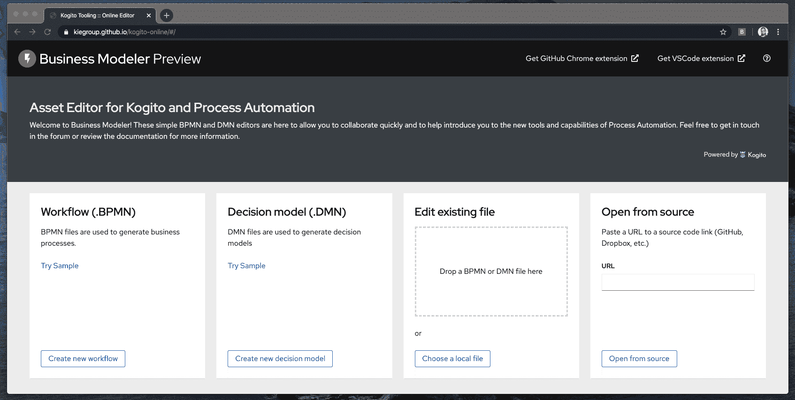
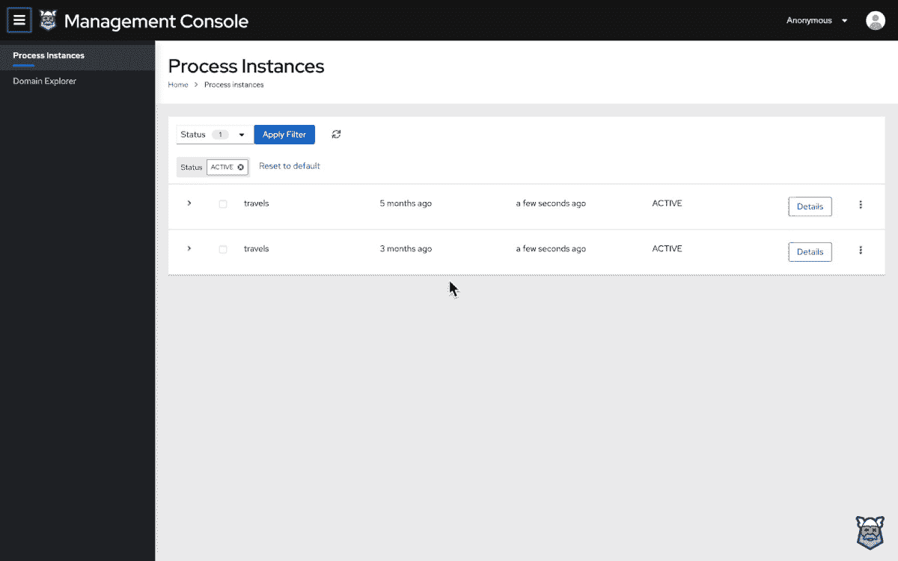
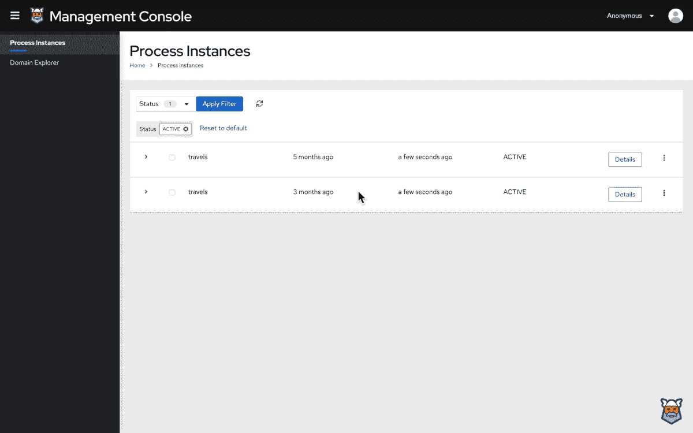

# Kogito 0.8.0 具有在线编辑器和云原生业务自动化功能

> 原文：<https://developers.redhat.com/blog/2020/03/20/kogito-0-8-0-features-online-editors-and-cloud-native-business-automation>

[Kogito](http://kogito.kie.org/) 是一个云原生业务自动化解决方案，提供强大的、开发人员友好的体验。基于经过生产测试的开源项目 Drools 和 jBPM，Kogito 拥有精确到科学的业务规则和流程。Kogito 还支持流行的轻量级运行时，如 [Quarkus](https://developers.redhat.com/blog/2019/08/29/kogito-for-quarkus-intelligent-applications/) 和 [Spring Boot](https://developers.redhat.com/blog/2019/08/29/create-your-first-application-with-kogito/) ，以支持开发人员构建业务驱动的应用程序。

本文是对 2020 年 3 月 10 日发布的 Kogito 0.8.0 新增强的概述。

## Kogito 运行时和 Kogito 工具

Kogito 是一项正在快速发展的年轻技术。在这个版本中，开发人员针对 Kogito 运行时和 Kogito 工具进行了更新和特性增强。Kogito Runtimes 使应用程序能够执行业务流程和决策。它的组件有助于在基于 Kubernetes 的容器平台 Red Hat OpenShift 中部署业务应用程序。同时，Kogito Tooling 提供了支持业务驱动应用程序生命周期的创作工具和环境。


## 亮点和新功能

Kogito 0.8.0 版本包括超过 25 个新特性请求、35 个增强功能和超过 40 个针对 Kogito 运行时的错误修复。Kogito 工具的更新也很强大，包括对 VS 代码编辑器的错误修复和增强，业务流程模型和符号(BPMN)和决策模型和符号(DMN)的 Chrome 扩展，以及新的在线编辑器。

本节涵盖了 Kogito 运行时和 Kogito 工具中的亮点和新特性。参见 [Kogito Google Group](https://groups.google.com/forum/?utm_medium=email&utm_source=footer#!msg/kogito-development/hx9LkWj6Dyc/LIEFbUBqAgAJ) 和 [Kogito Tooling GitHub 页面](https://github.com/kiegroup/kogito-tooling/releases)获取更新和增强的完整列表。

### 在线创作工具

Kogito 的目标之一是提高业务自动化专家的生产率，而实现这一目标的一个可靠方法是支持业务经理在云中创作可执行的业务逻辑。在这次发布中，我们很自豪地为 BPMN 和 DMN 推出 [Kogito 在线编辑器。这些随时可用的在线工具不需要任何本地设置。](https://kiegroup.github.io/kogito-online/)

任何人都可以使用这些新的编辑器来绘制基于 BPMN 的业务流程图或基于 DMN 规范的业务决策。图 1 展示了 DMN 在线编辑器，由 [Alex Porcelli](https://porcelli.me/announcement/tooling/online/bpmn/dmn/2020/03/12/online-new-editors.html) 提供。(如果此图像没有动画效果，请单击它观看演示。)

[](/sites/default/files/blog/2020/03/try-sample.gif)

Figure 1: Kogito's DMN online editor (source: ).

在这个版本中，我们还集成了谷歌的[。新域名计划](https://www.techradar.com/news/google-brings-its-new-tld-to-the-rest-of-the-internet)。您可以试用支持。位于 [bpmn.new](http://bpmn.new) 和 [dmn.new](http://dmn.new) 的新域名。

### Kogito 管理控制台

新的 Kogito 管理控制台采用了一种全新的方法来查看和管理流程实例(参见图 2，如果此图没有动画，请单击它来观看演示)。)在 Kogito 数据索引的支持下，新的管理控制台支持从流程实例的角度和基于域的角度进行可视化和管理。作为开发人员，这意味着您将获得正在运行的流程实例的详细视图，以及变量、相关的子流程和任务执行。

[](/sites/default/files/blog/2020/03/monitoring-process-instances-080-1280.gif)

Figure 2: View and manage process instances (source: ).

开发人员还可以使用 Kogito 域浏览器来导航所选域中的业务数据。例如，图 3 显示了跟踪客户旅行和旅行签证的旅行社域的可视化。(如果此图像没有动画效果，请单击它观看演示。)

[](/sites/default/files/blog/2020/03/monitoring-domain-explorer-080-1280.gif)

Figure 3: Navigate business data within a domain (source: ).

### 有意义的进程 id

Kogito 0.8.0 中添加的有意义的流程 id 简化了新流程与现有业务信息的关联。虽然您仍然可以使用自动生成的流程 id，但是您现在可以选择基于业务关键字创建唯一的引用。

您可以通过发出名为`businessKey`的查询参数以及启动新流程实例的请求来创建一个惟一的引用。例如，如果您想要启动一个与业务关键字 ORDER-0001 相关的订单流程，您可以发出如下请求:

```
POST /orders?businessKey=ORDER-0001

```

然后，您将能够使用新的引用 ID 来检索新的流程实例:

```
GET /orders/ORD-0001

```

您还可以通过发送具有相同引用 ID 的 HTTP delete 请求来删除流程实例:

```
DELETE /orders/ORD-0001

```

### 过程变量标记

Kogito 运行时现在提供了对流程变量标记的支持。该特性允许开发人员提供关于流程变量的元数据，甚至可以根据他们的需要对流程进行分组。您可以使用此功能对重要的业务 KPI 进行分组和分类；过程输入和输出；并将变量标记为必需的、内部的或只读的。请参见 [KOGITO-19](https://issues.redhat.com/browse/KOGITO-19) 了解更多关于此增强功能的信息。

### Kogito 运算符和 Kogito CLI

Kogito Operator 和 Kogito CLI 都是现有的工具，都增加了新的功能。基于流行的 [Red Hat OpenShift 容器平台](https://developers.redhat.com/products/openshift/overview)，Kogito Operator 支持直接从项目源代码部署 Kogito 运行时。作为开发人员，您可以从 Kogito CLI 与 Kogito Operator 进行交互。

Kogito CLI 中的一个新参数是`-enable-istio`。创建新的 Kogito 应用程序时设置该参数，指示 Kogito 操作员启用 [Istio 服务网格边车](https://istio.io/docs/concepts/what-is-istio/)。启用后，边车会自动将追踪、安全、可观察性和监控功能整合到您的 Kogito 吊舱中。

### 科吉托就业服务

新的 [Kogito 作业服务](https://github.com/kiegroup/kogito-runtimes/wiki/Jobs-Service)为作业调度提供了一个专用的轻量级解决方案。该服务目前能够安排两种类型的作业。在给定的时间点，*时间调度作业*仅执行一次，而*周期性调度作业*在给定的时间点开始并执行预定次数。

### 决策和流程集成

Kogito 允许您将决策驱动的服务建模为独立的决策服务或具有决策任务的智能工作流。无论您是使用 Drools 规则、DMN 还是电子表格中的决策表来实现业务决策，Kogito 都会自动为您生成 REST 端点。

在 Kogito 0.8.0 中，我们增强了这一特性，允许 DMN 模型与 BPMN 流程的集成，这样[业务流程可以由智能决策节点](http://blog.athico.com/2020/03/kogito-ergo-rules-from-knowledge-to.html)驱动。

## 加入 Kogito 社区

Kogito 是一个由 KIE 集团支持的开源项目。KIE 集团还支持 jBPM、Drools 和 OptaPlanner 等项目，这些项目已经在不同领域大规模运行了 10 多年。你可以成为 Kogito 社区的一员！加入 [Kogito 开发小组](https://groups.google.com/forum/?utm_medium=email&utm_source=footer#!forum/kogito-development)，提出问题并接收关于 Kogito 进展的更新。我们在推特上也很活跃: [@kogito_kie](https://twitter.com/kogito_kie) 。

*Last updated: June 29, 2020*