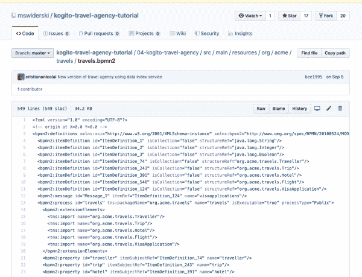
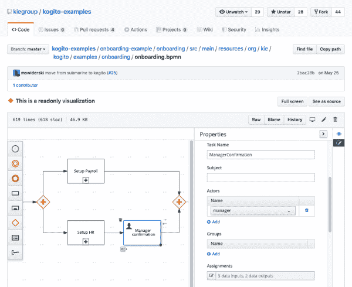
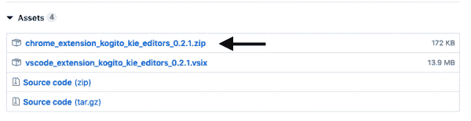
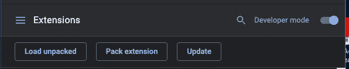
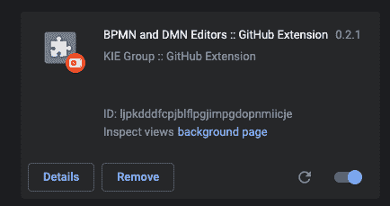

# 用于 GitHub 上友好的 DMN 和 BPMN 可视化的 Kogito 工具

> 原文：<https://developers.redhat.com/blog/2019/11/25/kogito-tooling-for-friendly-dmn-and-bpmn-visualization-on-github>

业务自动化高度依赖于业务流程和规则的开发，这些流程和规则很容易被参与项目的任何人理解。为了实现这个目标， [KIE 和科吉托](https://kogito.kie.org/)团队选择采用由 [OMG](https://en.wikipedia.org/wiki/Object_Management_Group) 定义的模式作为流程管理的三重王冠:

*   **DMN** —决策模型与符号
*   **BPMN** —业务流程模型和符号
*   CMMN —案例管理模型和符号

有了这个新的 [BPMN 和 DMN Chrome 扩展](https://medium.com/kie-foundation/bpmn-chrome-extension-released-alpha-abe89676d76)，你终于可以直接在 GitHub 上看到业务流程和规则了。

如果您从事业务自动化项目，您可能对这些标准很熟悉。此外，当您试图查看 GitHub 上的最新变化或检查业务资产时，可能会因为面对巨大的 XML 文件而感到沮丧。如果是这样，你可能会喜欢这个 Chrome 扩展:它允许用户直接在 GitHub 网页上看到 BPMN 和 DMN 版本的业务流程和业务规则。

## 这有什么帮助

如果您对这个扩展及其帮助很感兴趣，请参见图 1 中默认情况下 BPMN 文件在 GitHub 中的显示，然后参见图 2 中同样的文件在 BPMN 和 DMN Chrome 扩展中的显示。如果你想自己尝试这个扩展，请继续阅读。

Figure 1: A BPMN file is displayed in GitHub, without the extension.">Figure 2: A BPMN file displayed with the BPMN and DMN Chrome extension.">

## 如何安装

这款工具在 Chrome 商店中仍然不可用，但你已经可以试用它并利用它的好处了。要让这个扩展在你的 Chrome 浏览器上工作，请遵循以下简单步骤:

1.  访问 [Kogito 工具发布页面](https://github.com/kiegroup/kogito-tooling/releases)。
2.  查找最新版本并单击链接，然后向下滚动到发行说明的末尾。
3.  点击*资产*展开菜单，查看可用选项，如图 3 所示:

Figure 3: Open the Assets menu to find the Chrome extension.">

4.  下载并解压缩可用的 zip 文件。
5.  在 Chrome 中，转到右上角，然后访问并激活开发者模式，如图 4 所示:

Figure 4: Turn on Developer mode.">

6.  点击 *Load unpacked* 按钮，选择刚刚解压的目录，如图 5 所示:

Figure 5: Open the new directory.">

就是这样。现在，您应该可以看到 BPMN 和 DMN 扩展可供使用。如果您想尝试一下，可以访问 GitHub 上的一个业务资产(例如，[this](https://github.com/kiegroup/kogito-examples/blob/master/onboarding-example/onboarding/src/main/resources/org/kie/kogito/examples/onboarding/onboarding.bpmn))。

我们希望你喜欢这个由 KIE 小组开发的插件。要了解更多关于 [Kogito](https://kogito.kie.org) 的信息，请查看以下相关文章:

*   [用于 Quarkus 智能应用的 Kogito](https://developers.redhat.com/blog/2019/08/29/kogito-for-quarkus-intelligent-applications/)
*   [使用 Kogito 创建您的第一个应用程序](https://developers.redhat.com/blog/2019/08/29/create-your-first-application-with-kogito/)
*   [由云原生 Java 支持的事件驱动的业务自动化](https://developers.redhat.com/blog/2019/09/23/devnation-live-event-driven-business-automation-powered-by-cloud-native-java/)
*   [开发现场:介绍 Kogito](https://developers.redhat.com/blog/2019/07/23/devnation-live-introducing-kogito/)

*Last updated: July 1, 2020*