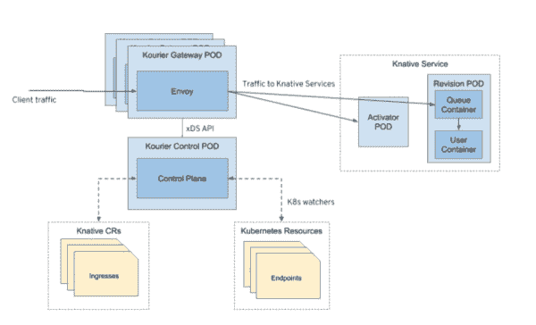

# Kourier:一个轻量级的 Knative 服务入口

> 原文：<https://developers.redhat.com/blog/2020/06/30/kourier-a-lightweight-knative-serving-ingress>

直到最近， [Knative Serving](https://knative.dev/docs/serving/) 还使用 [Istio](https://developers.redhat.com/topics/service-mesh/) 作为其默认的网络组件，用于处理外部集群流量和服务对服务的通信。Istio 是一个很好的服务网格解决方案，但是如果您不需要它，它会增加您的集群不必要的复杂性和资源使用。

这就是我们创造 [Kourier](https://github.com/knative/net-kourier) 的原因:简化被动服务的入口端。Knative 最近收养了 Kourier，所以它现在是 Knative 家族的一员了！本文介绍了 Kourier，并让您开始使用它作为一种更简单、更轻量级的方式向外部网络公开 Knative 应用程序。

让我们先简要概述一下技巧性发球和技巧性发球。

## 什么是 Knative？

Knative 是一个基于 [Kubernetes](https://developers.redhat.com/topics/kubernetes/) 的平台，用于部署和管理无服务器工作负载。它分为两个项目:

*   [Knative Serving](https://knative.dev/docs/serving/) 专注于使用 HTTP 流量触发容器。
*   [Knative Eventing](https://knative.dev/docs/eventing/) 关注使用事件触发容器。

本文介绍了 Kourier 如何使用 Knative Serving。

### 美味的服务

被动服务提供了以下特性:部署、自动伸缩和资源节约。说到部署，Knative Serving 简化了我们将应用程序部署到 Kubernetes 的方式，并添加了*修订*的概念。修订版是,是在创建或修改服务时采用的不可变的服务配置。此功能允许您快速回滚更改，并提供 Knative 高级流量管理，如蓝绿色部署和镜像流量。

对于*自动伸缩*， Knative Serving 根据为该服务定义的最大并发请求自动伸缩您的容器。例如，如果期望的最大并发数设置为 1，那么 Kubernetes pod 将为每个新请求旋转。

当谈到*资源保护*时，Knative Serving 确保休眠的应用程序被缩减为零，并为下一个请求做好准备。

下面是一个使用 Knative Serving 的简单应用程序部署示例:

```
apiVersion: serving.knative.dev/v1
kind: Service
metadata:
  name: helloworld-go
  namespace: default
spec:
  template:
    spec:
      containers:
        - image: docker.io/jmprusi/helloworld-go
          env:
            - name: TARGET
              value: "Go Sample v1"

```

如您所见，这是一个“Hello，world”应用程序。我们只需要定义容器映像和所需的环境变量。我们不需要定义服务、部署或选择器。更多细节见 [Knative API 规范](https://github.com/knative/docs/blob/master/docs/serving/spec/knative-api-specification-1.0.md)。

## Kourier 是什么？

像 Istio 一样，Kourier 是一个基于 Envoy 网关的轻量级入口，没有额外的自定义资源定义(CRD)。它由两部分组成:

*   Kourier 网关是一个特使，使用连接回 Kourier 控制平面的基本引导配置运行。
*   Kourier 控制平面处理无效的入口对象，并保持特使配置最新。

### Kourier 如何工作

Kourier 执行以下操作:

*   读取由主动服务创建的入口对象。
*   将这些对象转换为特使配置。
*   向它管理的代理公开配置。

图 1 更详细地展示了 Kourier 如何使用 Knative Serving 向网络公开 Knative 应用程序。

[](/sites/default/files/blog/2020/06/Kourier_diagram.png)

Figure 1\. Kourier in the Knative Serving workflow.

当一个新的服务被部署到 Knative Serving 中时，它会创建一个`Ingress`对象，该对象包含关于应该如何公开服务的信息。入口对象包括以下元素:

*   **主机、路径和头**:这些元素与传入请求中包含的相同元素相匹配。当存在匹配时，我们知道请求应该被代理到与入口对象相关联的 Knative 服务。
*   **Splits** :我们使用 *splits* 在已部署服务的不同版本之间划分传入流量。
*   **可见性**:定义服务应该从集群内部还是外部访问。
*   **传输层安全(TLS)** :指定 [Red Hat OpenShift](https://developers.redhat.com/openshift) secret，包含向 HTTPS 公开服务所需的证书和密钥。

Kourier 订阅由 Knative Serving 管理的入口的变化。每次创建、删除或修改入口时，Kourier 都会得到通知。当发生这种情况时，Kourier 分析入口中的信息，并将信息转换为特使配置中的对象。特使配置可能很复杂，但集群和路由是其中包括的两个对象。*集群*是属于同一服务的互联网协议地址(IP)的集合。*路由*包含用于匹配给定请求的所有信息:主机、路径、报头等等。当存在匹配时，路由还可以指定请求应该到达哪个集群代理。

在入口被转换成代理配置中的对象后，我们可以使用[代理 xDS API](https://www.envoyproxy.io/docs/envoy/v1.14.1/api-docs/xds_protocol#)向集群中的代理公开该配置。Kourier 管理集群。

当 Knative 增加服务中的 pod 数量时，Kourier 会自动选择最新的 pod 的 IP，并开始向其代理流量。类似地，当 pod 数量减少时，Kourier 会收到通知，并停止向计划删除的 pod 发送请求。

值得注意的是，在所有这些过程中，Kourier 不会创建任何只有它自己能够理解的定制资源。相反，Kourier 只处理由 Knative Serving 管理的对象(入口)和由 Kubernetes 管理的对象——如端点、秘密(包括 TLS 配置的那些)等等。这就是为什么我们说 Kourier 是一个“Knative-native”入口。

## Kourier 与 Knative 的整合

除了是 Knative-native，Kourier 还是一个符合 Knative-conform 的入口。也就是说，我们的意思是 Knative Serving 的所有特性在使用 Kourier 时都能很好地工作。其中包括服务不同版本之间的流量分流、TLS、超时、重试、服务扩展时的自动端点发现等等。

为了确保 Kourier 是一致的，并且它支持添加到 Knative Serving 的每个新功能，我们已经配置了一个运行 [Knative Serving 一致性测试套件](https://testgrid.knative.dev/net-kourier)的[持续集成(CI)](https://developers.redhat.com/topics/ci-cd/) 系统。正如你从[测试网格](https://testgrid.knative.dev/net-kourier#continuous)中看到的，Kourier 是少数几个一贯通过套件中所有测试的 Knative ingress 实现之一。

### 将 envoy 外部授权过滤器与傅立叶一起使用

可以配置 Kourier 使用 [Envoy 外部授权过滤器](https://www.envoyproxy.io/docs/envoy/v1.14.1/intro/arch_overview/security/ext_authz_filter.html)进行流量授权。对于每个传入的请求，Kourier 将联系一个外部服务来检查该请求是否应该被授权。如果获得授权，Kourier 将把请求代理给适当的服务。如果不是，它将向调用者返回一个错误。使用这个特性的一种方法是基于[开放策略代理(OPA)框架](https://www.openpolicyagent.org/)构建一个服务。OPA 支持 Envoy 的外部授权协议，并允许我们使用专门为编写授权策略而设计的高级语言来定义授权规则。

## 从 Kourier 开始

如果您正在使用 OpenShift，您可以在您的操作员目录中找到 Red Hat OpenShift 无服务器操作员。无服务器操作员自动安装 Kourier。(有关安装详情，请参见[安装 OpenShift 无服务器操作器](https://docs.openshift.com/container-platform/4.4/serverless/installing_serverless/installing-openshift-serverless.html)。)

或者，您可以在已经运行 Knative Serving 的集群中安装 Kourier。在这种情况下，只需输入:

```
$ kubectl apply --filename https://github.com/knative/net-kourier/releases/download/v0.15.0/kourier.yaml
```

**注意**:将版本号(在本例中为 v0.15.0)替换为您想要安装的版本。

下面是配置 Knative 以使用 Kourier 的代码:

```
kubectl patch configmap/config-network \
  --namespace knative-serving \
  --type merge \
  --patch '{"data":{"ingress.class":"kourier.ingress.networking.knative.dev"}}'

```

这应该足够开始了。对于更复杂的安装，请参见 Knative 文档中的安装说明。

## 结论

正如我们在本文开头提到的，Knative 最近被 Kourier 采用，所以它是 Knative 服务当前支持的实现之一。查看 Knative 项目下 Kourier 的 GitHub 库。

*Last updated: January 5, 2022*