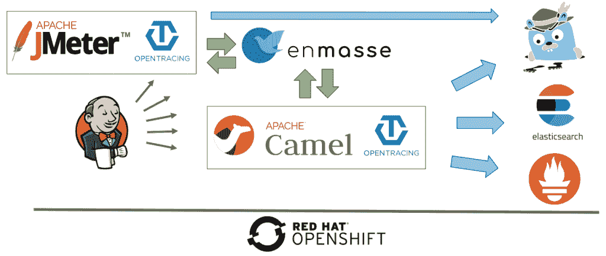
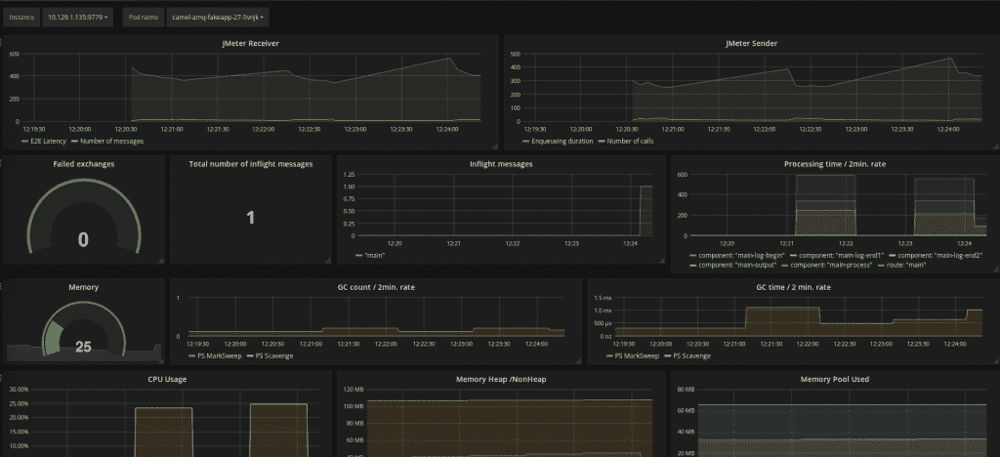
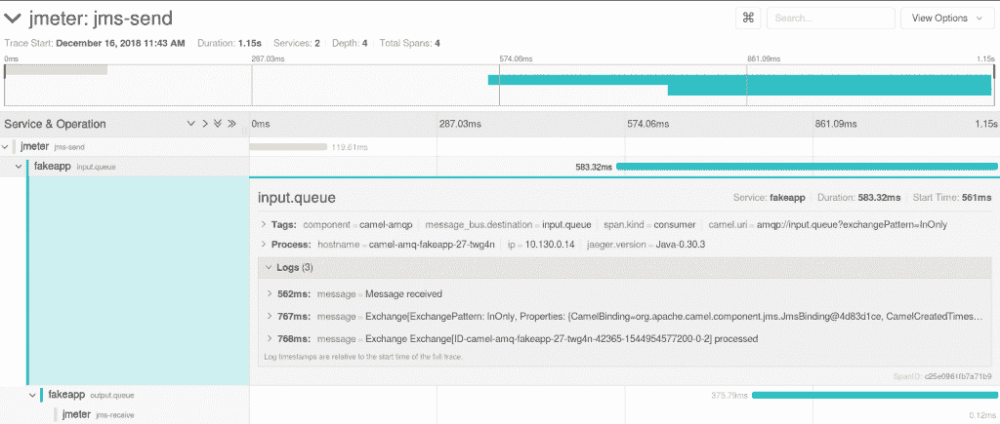

# 为 Kubernetes 和 OpenShift 上的自动化性能测试构建可观测性栈(第 2 部分)

> 原文：<https://developers.redhat.com/blog/2019/01/03/leveraging-openshift-or-kubernetes-for-automated-performance-tests-part-2>

这是基于我在 at Red Hat Tech Exchange 举行的一次会议的三篇文章系列的第二篇。在[的第一篇文章](https://developers.redhat.com/blog/2018/11/22/automated-performance-testing-kubernetes-openshift/)中，我介绍了利用 [Red Hat OpenShift](https://www.openshift.com) 或 [Kubernetes](https://developers.redhat.com/topics/kubernetes/) 进行自动化性能测试的基本原理和方法，并且概述了设置。

在本文中，我们将着眼于构建一个可观测性堆栈。在生产中，可观察性堆栈可以帮助验证系统是否正常工作和运行良好。还可以在性能测试期间利用它来深入了解应用程序在负载下的表现。

在我的 [GitHub 库](https://github.com/fgiloux/auto-perf-test/)中有一个本文描述的例子。

## 设置概述

[](https://developers.redhat.com/blog/wp-content/uploads/2018/11/img_5bdc69ff84eb6.png)

## 应用指标

### 普罗米修斯和格拉夫纳装置

在 OpenShift 3.10 之前，Ansible 剧本可用于安装 Prometheus 和 Grafana。它们与`openshift-ansible`包一起安装，可从以下网址获得:

*   `/usr/share/ansible/openshift-ansible/playbooks/openshift-prometheus`
*   `/usr/share/ansible/openshift-ansible/playbooks/openshift-grafana`

在 OpenShift 3.11 中，Red Hat 为[提供了一个操作符](https://docs.openshift.com/container-platform/3.11/install_config/prometheus_cluster_monitoring.html)，除了执行安装之外，还允许你管理 Prometheus 和 Grafana 的生命周期(例如，应用更新)。但是，需要注意的是，Red Hat 仅支持 operator 以及相关的 Prometheus 和 Grafana 在此时监控集群。然而，如果我们自己能够轻松地管理它们，没有什么可以阻止我们利用运营商来安装单独的实例。

Prometheus 操作器也可用于上游 Kubernetes 顶部的安装。

### 应用 JMX/乔洛基亚和普罗米修斯端点

Fuse 等公司使用的 Fabric8 S2I Java 映像附带了向 Prometheus 导出指标的支持。其中，它有一个 Prometheus exporter 代理，该代理由应用程序启动，并公开要收集的指标。Java 进程从`-javaagent:/opt/prometheus/jmx_prometheus_javaagent.jar=9779:/opt/prometheus/prometheus-config.yml`开始，其中 prometheus-config.yml 已经包含了所有的 Camel 指标。您可以使用映像的 [S2I 功能](https://github.com/openshift/source-to-image)来添加您自己的指标。更多信息请点击[这里](https://access.redhat.com/documentation/en-us/red_hat_fuse/7.0/html/managing_fuse/prometheus#configuring_prometheus)。

大多数 Java 应用程序使用 JMX 来公开 JVM、框架和应用程序自定义指标。像 Fabric8 S2I Java 映像一样，任何 Java 应用程序都可以利用 [JMX 导出代理](https://github.com/prometheus/jmx_exporter)使 JMX 指标可以通过 Prometheus 访问。

### 度量信息搜集

一旦应用程序使 Prometheus 端点可用，下一步就是告诉 Prometheus 从它那里收集指标。因此，需要创建一个使用特殊注释公开 Prometheus 端口(9779)的服务。这里有一个例子:

```
apiVersion: v1
kind: Service
metadata:
  annotations:
    prometheus.io/port: '9779'
    prometheus.io/scheme: http
    prometheus.io/scrape: 'true'
[...]
```

最后，Ansible playbook 在安装到`openshift-metrics`项目期间创建的 Prometheus ConfigMap 需要用几行代码进行修改，其中`perftest`是部署我的应用程序的项目名称空间。 [Kubernetes SD 配置](https://prometheus.io/docs/prometheus/latest/configuration/configuration/#kubernetes_sd_config)允许从 Kubernetes 的 REST API 中检索 scrape 目标，并与集群状态保持同步。`endpoints`角色从列出的服务端点中发现目标。对于每个端点地址，每个端口发现一个目标。

```
- job_name: 'myapps-job'
  kubernetes_sd_configs:
  - role: endpoints
    namespaces:
      names:
      - perftest
```

使用`relabel`，我们可以将度量限制在应用程序的服务名上，这里是`camel-amq-fakeapp`，以及名为`prometheus`的端口。

```
relabel_configs:
- source_labels: [__meta_kubernetes_service_name]
  action: keep
  regex: camel-amq-fakeapp
- source_labels: [__meta_kubernetes_pod_container_port_name]
  action: keep
  regex: prometheus
```

### 仪表盘

Grafana 是通常用于数据可视化的工具。第一件事是配置一个指向我们的 Prometheus 安装的数据源。需要提供以下信息:

*   名:自明；我在演示中使用了`DS_PROMETHEUS`
*   类型:普罗米修斯
*   URL: `https://prometheus-openshift-metrics.apps.sandbox.com/`(这将用普罗米修斯路线填充)
*   访问:服务器/代理(根据 Grafana 版本的不同而命名不同)
*   跳过 TLS 验证(不安全):如果我们没有配置 CA
*   令牌(在“普罗米修斯设置”下):设置为`$ oc serviceaccounts get-token prometheus-reader -n openshift-metrics`的结果

一旦配置好数据源，我们就可以利用它创建一个仪表板，并显示收集到的指标。普罗米修斯默认每 30 秒刮一次。[这里的](https://github.com/fgiloux/auto-perf-test/blob/master/observability/grafana/overview.json)是一个创建下面仪表板的例子。它可以通过以下步骤上传:

1.  点击左上方的 Grafana 图标菜单，选择**仪表盘**。
2.  点击**新建仪表板**。
3.  点击**导入仪表板**按钮。
4.  点击**上传。json 文件**按钮。
5.  选择 JSON 文件。

[](https://developers.redhat.com/blog/wp-content/uploads/2018/12/img_5c16876f642bf.png)

注意，这个仪表板还包含 JMeter 指标(顶行的两个图表)。它们将在本系列的第三篇也是最后一篇文章中讨论。

仪表板是上下文相关的:需要在左上角选择 pod 和实例的名称。这些下拉列表会自动填充从 OpenShift 中检索到的数据。

Grafana 仪表板的好处是，您可以在一个页面上显示来自不同来源和领域的多个图表。这有助于识别相关性。

*   第二行包含 Camel 公开的指标:负载、失败和处理时间
*   第三和第四行显示了资源消耗:内存、CPU 和垃圾收集

如果您不熟悉概念、度量类型、函数和正在使用的操作符，我建议您查看每个图表背后的查询，并参考 Prometheus 文档。它可能会为您提供构建自己的仪表板的想法，并且可能会提供对所提供的查询功能的实用介绍。

## 应用性能管理

因为本文是关于性能测试的，所以应用程序性能管理具有很高的相关性。演示依赖于 OpenTracing 和 Jaeger。仪器分为几个部分:

*   收集器，充当数据接收器
*   负责向接收器发送应用程序指标的代理
*   用于从接收器查询数据的前端

值得一提的是，enMasse/ [ActiveMQ Artemis](https://issues.apache.org/jira/browse/ARTEMIS-2028) 正在致力于添加 OpenTracing 支持。

### 收藏者

部署内存中的 Jaeger 收集器可以通过一个命令来完成。生产安装需要使用 Cassandra 或 Elasticsearch 进行数据存储。信息可在 [jaeger-openshift 知识库](https://github.com/jaegertracing/jaeger-openshift)中获得。

```
$ oc process -f https://raw.githubusercontent.com/jaegertracing/jaeger-openshift/master/all-in-one/jaeger-all-in-one-template.yml | oc create -f -
```

### 代理人

代理可以作为边车容器部署。这很方便，因为不管应用程序是用什么语言编写的，这种设置都可以工作。与应用程序一起部署的库将使用 UDP 向本地主机发送跟踪。因此，需要将以下内容添加到`containers`部分下的应用程序部署配置中:

```
- image: jaegertracing/jaeger-agent
        name: jaeger-agent
        ports:
        - containerPort: 5775
          protocol: UDP
        - containerPort: 5778
        - containerPort: 6831
          protocol: UDP
        - containerPort: 6832
          protocol: UDP
        args:
          - '--collector.host-port=jaeger-collector.perftest.svc:14267'
```

使用`jaeger-java-client`库，我们向应用程序`pom.xml`文件添加了以下内容。

```
<!-- 0.30 matches the dependency in Camel opentracing starter -->
<jaeger.version>0.30.1</jaeger.version>

<!-- Opentracing -->
<dependency>
  <groupId>org.apache.camel</groupId>
  <artifactId>camel-opentracing-starter</artifactId>
</dependency>
<dependency>
  <groupId>io.jaegertracing</groupId>
  <artifactId>jaeger-client</artifactId>
  <version>${jaeger.version}</version>
</dependency>
```

下一步是通过用`@CamelOpenTracing`注释`Application`类来告诉应用程序发送跟踪，剩下的工作由`Camel OpenTracing`实现完成。事件(跨度)是针对发送到 Camel 或从 Camel 发出的传入和传出消息捕获的。当用户范围扩大时，还会发送日志并可以看到日志。

最后，可以通过部署配置中设置的环境变量来配置代理。

```
- name: JAEGER_SERVICE_NAME
  value: fakeapp
- name: JAEGER_SAMPLER_PARAM
  value: '1.0'
- name: JAEGER_PROPAGATION
  value: 'jaeger,b3'
```

服务名在跟踪中标识应用程序组件提供的服务。默认情况下，Jaeger 将为 1000 个调用中的一个发送跟踪信息，以减轻应用程序的负担。为了验证设置，我们可能希望告诉 Jaeger 对每个调用都这样做，如上面的代码片段所示。不同的格式可用于轨迹传播。这里配置了耶格和 b3。

### 前端

Jaeger UI 已经与收集器一起安装，并且已经创建了到达收集器的路线。它可用于检索和显示轨迹和跨度。这是一个跨度的例子。这也包括 JMeter 生产者和消费者。我们将在本系列的第三篇文章中看到如何添加它们。

[](https://developers.redhat.com/blog/wp-content/uploads/2018/12/img_5c1682c1ebf5f.png)

## 日志

如果在容器中运行的应用程序将它们的日志写到标准输出中，它们会被 OpenShift 自动聚合到 Elasticsearch 中，并在 Kibana 中进行查询和报告。最好是以结构化的方式编写它们，以添加新的查询和报告功能。你可以在我的前一篇文章中找到更多关于如何做到这一点的信息。

## 经纪人和外部服务

在我的 GitHub 存储库中的演示中没有涉及对代理的监控。然而，我假设在我们的性能测试中，代理不是限制因素。最好确保这是真的。

EnMasse 可以使用 Prometheus 和 Grafana 进行监控。此处提供了[的说明。此外，重用 Prometheus 和 Grafana 实例来监控应用程序也是有意义的。看起来度量标准被添加到暴露的信息中；见](http://enmasse.io/documentation/master/openshift/#monitoring-messaging)[本](https://github.com/EnMasseProject/enmasse/tree/master/metrics-api)。

## JMeter

关于 JMeter，我在本系列的第一篇文章中做了一些假设。最好是验证 JMeter 可用的资源不是一个限制因素。让它在 OpenShift 上运行的好处是，它很容易纵向或横向扩展。

虽然我的 GitHub 存储库中没有介绍，但是使用 Prometheus 监控 JMeter 并确保 JMeter 实例在测试期间不会过热是有意义的。因为 JMeter 实例可能在测试启动和终止时来来去去(这对释放资源来说是件好事)，所以可以使用 Prometheus [pushgateway](https://github.com/prometheus/pushgateway) 来收集指标。

## 时间分析和诊断

作为应用程序性能管理的补充， [Java 飞行记录器](https://dzone.com/articles/using-java-flight-recorder-with-openjdk-11-1)和 [Java 任务控制](https://wiki.openjdk.java.net/display/jmc/Main)最近已经开源，当注意到性能问题或降级时，它们可能是有价值的工具。在已经通过 JMX 公开的指标之上，JMC 提供了正确分析信息的能力:每个线程分配的对象、每个线程花费的时间、调用树、每个级别花费的时间等等。

这里没有介绍演示，但它可能是后续文章的主题。

## 结论

感谢阅读。我希望你对第二篇文章感兴趣。第三篇也是最后一篇文章将展示如何利用运行在 OpenShift 上的 JMeter 和 Jenkins 来自动化和编排我们的性能测试。

## “利用 OpenShift 或 Kubernetes 进行自动化性能测试”系列中的所有文章

*   [第 1 部分:基本原理和方法](https://developers.redhat.com/blog/2018/11/22/automated-performance-testing-kubernetes-openshift/)
*   第 2 部分:构建一个可观察性堆栈(本文)
*   [第 3 部分:自动化测试和指标收集](https://developers.redhat.com/blog/2019/01/16/openshift-kubernetes-automated-performance-tests-part-3)

*Last updated: January 19, 2022*