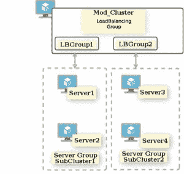
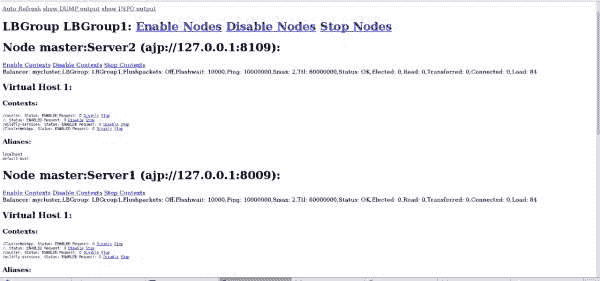
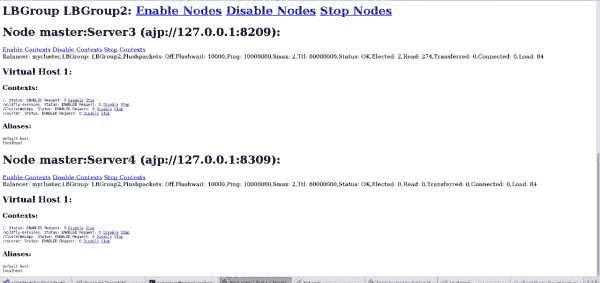

# 使用 mod_cluster 实现 Red Hat JBoss 企业应用平台子集群的负载平衡

> 原文：<https://developers.redhat.com/blog/2020/07/15/load-balancing-red-hat-jboss-enterprise-application-platform-subclusters-with-mod_cluster>

本文介绍了在[Red Hat JBoss Enterprise Application Platform(JBoss EAP)](https://developers.redhat.com/products/eap/download)的域模式安装中使用子集群构建和管理集群环境的方法。我假设读者熟悉 JBoss EAP 和 Apache HTTP Server (HTTPD) `mod_cluster`模块。我将介绍该模块的负载平衡组配置。

## 在没有负载平衡组的子集群中使用 mod_cluster

考虑有两个子集群:一个子集群主机`server1`和`server2`，另一个子集群主机`server3`和`server4`。假设第一个请求由`server1`提供服务。如果`server1`失败，那么请求将使用`bybusyness (bydefault)`的`mod_cluster`负载平衡算法转移到另一个节点。该算法试图智能地确定给定请求的最佳可用节点。

如果`mod_cluster`算法确定`server3`是传送请求的最佳节点，那么请求将传送到`server3`。即使`server2`节点可用(启动并运行),请求也会发送到第二子集群中的`server3/server4`节点，并且由于在`server1`和`server3/server4,`之间没有会话复制，因此会创建一个新的会话，并且现有会话会注销。

在下一节中，我将向您介绍如何通过在 JBoss EAP 级别插入一个负载平衡组来克服这个问题。将`mod_cluster`配置为通过负载平衡组发送请求，可以确保请求在被发送到另一个子集群之前被发送到给定子集群中的下一个节点。

## 在带有负载平衡组的子集群中使用 mod_cluster

在这个场景中，`mod_cluster`被配置为通过负载平衡组发送请求。图 1 显示了两个子集群，`server1`和`server2`在一个子集群中，`server3`和`server4`在另一个子集群中。假设请求由`server1`服务。如果请求得到了很好的服务，但是由于某种原因`server1`失败了，那么相同的请求将被转移到`server2`。不同的是`mod_cluster`模块通过负载均衡组知道子集群成员。



图 1:一个示例配置，其中 mod_cluster 通过负载平衡组将请求定向到两个不同的服务器组。

## JBoss EAP 级别的子集群示例

考虑一个示例设置，其中我们有两个子集群，每个子集群有两个节点。我们开始建立一个有四台服务器的域。第一台服务器是域控制器，其他三台是普通主机。每个子集群由一个服务器组代表，由两个服务器组构建，即`SubCluster1`和`SubCluster2`。稍后，我们编辑节点上的`host.xml`，并向每个组添加服务器。在启动 JBoss EAP 时，我们观察到一个异常:所有三台服务器都互相复制。此外，该集群不可扩展，但比我们需要的更加可用。我们可以使用子集群来纠正这种异常。

## 使用子集群进行负载平衡

默认情况下，`modcluster`子系统级别的多播值为所有子集群的所有节点，这些节点将被 Apache HTTPD `mod_cluster`模块看到。这意味着`mod_cluster`将管理负载平衡。`mod_cluster`寻找部署了相同应用程序的所有节点。它假设可以在所有子集群的所有节点上执行故障转移和所有其他功能。

### 配置模块集群子系统

为了使用子集群构建和管理 JBoss EAP 集群环境，我们需要配置 JBoss EAP 服务器的`modcluster`子系统，使每个子集群位于不同的负载平衡组中。我们可以通过在所需的配置文件中添加`domain.xml`来实现这一点:

```
<subsystem >
    <proxy name="default" advertise-socket="modcluster" listener="ajp" load-balancing-group="${mycluster.modcluster.lbgroup:StdLBGroup}" proxies="proxy1">
        <dynamic-load-provider>
            <load-metric type="cpu"/>
        </dynamic-load-provider>
    </proxy>
</subsystem>
```

### 设置服务器组属性

接下来，我们创建两个服务器组，在`domain.xml` — `LBGroup1`和`LBGroup2`中有两个不同的负载平衡组。现在，由我们决定在不同的版本中使用相同的概要文件或套接字绑定组，这意味着我们必须首先设置服务器组的属性。设置属性非常简单，不言自明:

```
<server-group name="SubCluster1" profile="ha">
    <socket-binding-group ref="ha-sockets"/>
    <system-properties>
        <property name="jboss.default.multicast.address" value="230.0.0.7"/>
        <property name="mycluster.modcluster.lbgroup" value="LBGroup1"/>
    </system-properties>
</server-group>
<server-group name="SubCluster2" profile="ha">
    <socket-binding-group ref="ha-sockets"/>
    <system-properties>
        <property name="jboss.default.multicast.address" value="230.0.0.8"/>
        <property name="mycluster.modcluster.lbgroup" value="LBGroup2"/>
    </system-properties>
</server-group>
```

### 在 host.xml 中创建服务器

接下来，我们在`host.xml`中创建服务器:`SubCluster1`服务器组中的`Server1`和`Server2`，在`SubCluster2`服务器组中创建`Server3`和`Server4`:

```
    <server name="Server1" group="SubCluster1" auto-start="true">
         <socket-bindings socket-binding-group="ha-sockets"/>
    </server>
    <server name="Server2" group="SubCluster1" auto-start="true">
         <socket-bindings socket-binding-group="ha-sockets" port-offset="100"/>
    </server>
    <server name="Server3" group="SubCluster2" auto-start="true">
         <socket-bindings socket-binding-group="ha-sockets" port-offset="200"/>
    </server>
    <server name="Server4" group="SubCluster2" auto-start="true">
         <socket-bindings socket-binding-group="ha-sockets" port-offset="300"/>
    </server>
```

### 检查结果

如果我们已经按照描述配置了`domain.xml`和`host.xml`，那么 **mod_cluster** 页面现在应该看起来像图 2 和图 3 中的截图。

[](/sites/default/files/blog/2020/06/subcluster2.jpeg)

Figure 2: The LBGroup1 subcluster has server1 and server2.

[](/sites/default/files/blog/2020/06/subcluster1.jpeg)

Figure 3: The LBGroup2 subcluster has server3 and server4.

## 结论

创建服务器时，请确保子集群中的所有服务器都在同一个负载平衡组中。此外，在实现我描述的更改之前，确保您有一个工作的`mod_cluster`模块。

*Last updated: July 13, 2020*