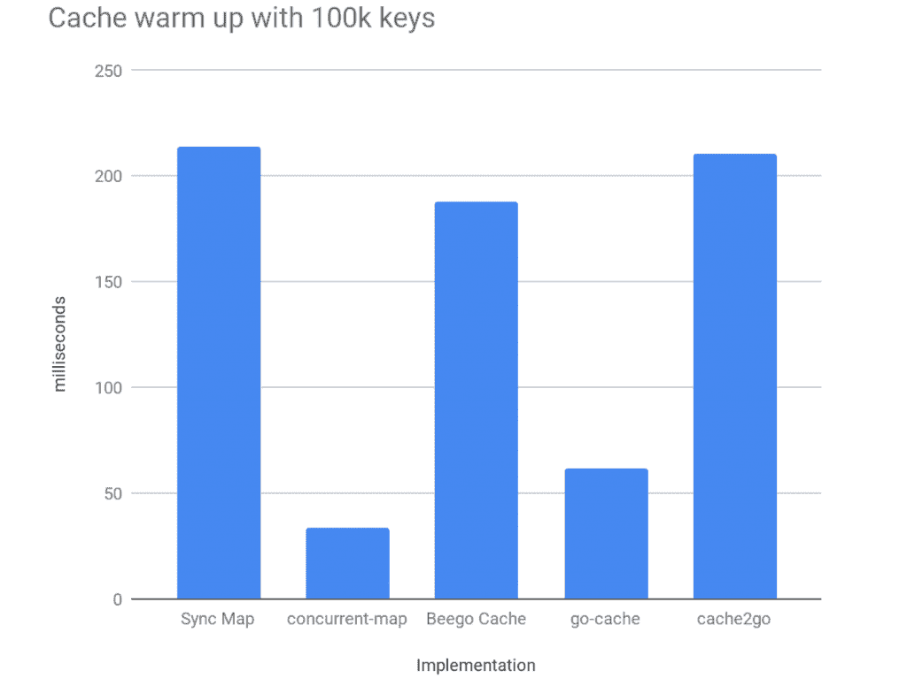
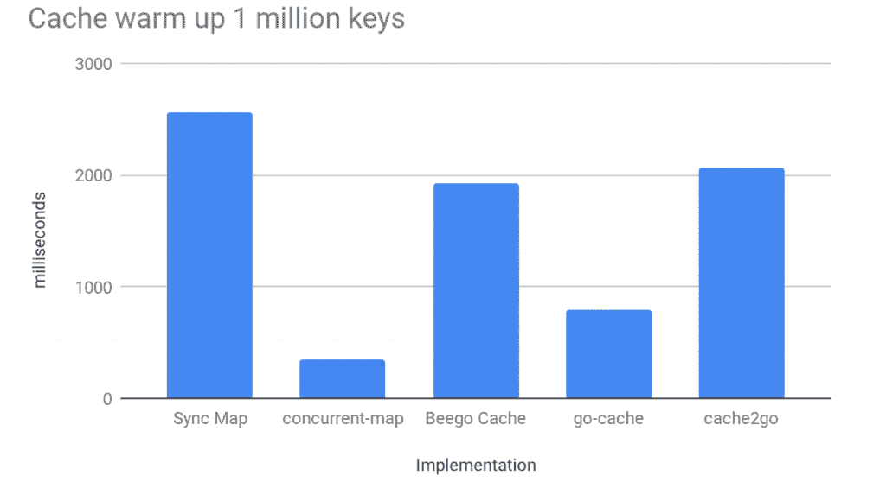
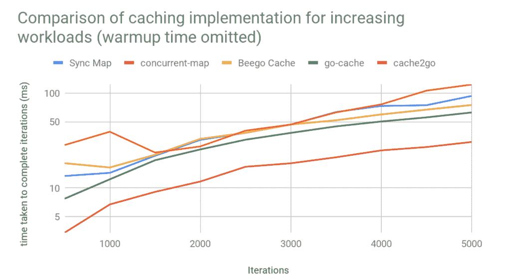

# 在 3scale Istio 适配器中查找用于缓存的哈希表库

> 原文：<https://developers.redhat.com/blog/2019/05/08/looking-up-a-hash-table-library-for-caching-in-the-3scale-istio-adapter>

您可能已经听说过服务网格的概念及其主要实现之一， [Istio](https://istio.io) 。在 Red Hat 的 3scale 工程团队中，我们正在开发一个组件，通过 3scale 平台集成一些 [API 管理](https://www.redhat.com/en/technologies/jboss-middleware/3scale)功能来扩展 Istio(以及 Red Hat 的发行版， [Maistra](https://maistra.io) )的功能。在本文中，我将描述这项工作以及在此过程中做出的一些决定。

[3scale](https://developers.redhat.com/products/3scale/overview) 提供一系列身份验证模式、访问控制和速率限制功能和分析。3scale Istio 适配器为新老 3cale 用户提供了一种将 Istio 中运行的服务与此功能快速集成的方式。

Istio 提供了一种构建定制后端的机制，混合器组件调用该机制来决定或处理流经网格的流量。这些定制后端被称为“适配器”，采用 gRPC 服务器的形式，通常用 Go 编写，利用 Istio 提供的代码生成实用程序和集成测试框架。

最终用户在其 Kubernetes 或 Red Hat OpenShift 集群内创建一些自定义资源，这通知 Istio 对特定服务的请求应由 3scale 管理和授权。

当流量流经网状网络时，标记为 API 管理的服务会将其请求转发到 3scale Istio 适配器，该适配器进而调用 3scale (SaaS 或内部)，以确定是接受还是拒绝该请求。

## 提高性能

如您所见，这给我们的适配器带来了成为服务网格中流量瓶颈的风险。我们在适配器和 3scale 之间增加了一个额外的网络跃点，可能会有相对较大的延迟，具体取决于 3scale 的部署位置。

为了减轻这种情况，我们认为这是一个很好的缓存用例。缓存来自 3 个规模授权端点(身份验证和速率限制检查)的响应将使我们能够在适配器内做出授权决策，从而减少网络跳跃和相关的延迟。

实现这种内部缓存的一个副作用是，它作为一种提供背压的方法，使 3scale 平台本身受益。请求可以在适当的时间间隔内批量递增和发送，从而减少网络 I/O 和 3scale 上的负载。

当然，与软件中的任何架构决策一样，也有权衡。有了缓存，我们可以提高性能，但代价是可能会允许一些超出速率限制的请求进入上游服务。

在给定时刻突然出现大量请求可能会导致这种不一致性。然而，这并不是一个典型的用例，过去的经验告诉我们，客户愿意承受这方面的损失，并乐于接受这些短期不一致带来的性能提升。

## 履行

为了实现这一愿景，我们需要某种类型的数据结构，能够通过键存储数据，支持并发访问，并执行快速查找。这就是(并发)哈希表(也称为哈希映射、字典或查找表)的用途。

从 Golang 1.9 开始，标准库引入了一个可用于此目的的并发安全映射。然而，我们也想看看一些第三方的软件包，并评估它们是否有性能更好的，或者在实现这一特性时展示可能对我们有益的其他 API。

### 确定候选人

评估前的选择标准如下:

1.  带有可接受许可的开源软件。
2.  支持内存数据存储。
3.  最小依赖——这个包应该有很少的第三方依赖，或者理想情况下没有第三方依赖，因为每个第三方依赖本身都可以被看作是一种技术债务。
4.  广泛使用——应该合理地部署该包。这样的包更有可能将性能问题和漏洞报告给项目维护人员。
5.  维护良好—任何第三方软件包都必须既稳定又活跃。

一旦我们选择了一些潜在的候选者，我们就开始开发一些针对我们用例的基准来测量和比较各种包的性能。这将是最终的决定因素，与有用的功能相比，小的性能劣势以及前面确定的后两个标准可能会影响决策。

在对公共存储库代码和社区进行尽职调查之前，通过 GoDoc 搜索功能确定了一个入围名单，以减少符合上述标准的热门包的选择范围。

选择了以下五个软件包:

*   内置的[同步。地图](https://golang.org/pkg/sync/#Map)
*   [并发映射](https://github.com/orcaman/concurrent-map)
*   【T0 毕比高速缓存】T1
*   [go-cache](https://github.com/patrickmn/go-cache)
*   [cache2go](https://github.com/muesli/cache2go)

## 标杆管理

golang 测试包提供了一个基准测试工具，这使得任何以前用该语言的内置结构编写过单元测试的人都觉得编写基准测试非常熟悉。

使用[表驱动测试](https://github.com/golang/go/wiki/TableDrivenTests)创建一组基准测试与我们在这里试图实现的目标非常吻合，因为它允许我们插入一个接口(各种缓存实现)和一组工作负载(模拟缓存上的负载)。

关于模拟真实世界的用例，我们预计我们的缓存最初会受到许多写入的影响，然后变得最终稳定，从那时起，主要接收读取和更新，很少删除和进一步添加。因此，这是我们将重点介绍的用法。

此外，为了清楚起见，我们对每个包的速度或优化程度并不感兴趣。我们只是想直观地看到他们如何相互竞争，并衡量相对性能。对于各种基准测试，我们将向每个实现传递一个定义的工作负载，并收集完成该工作负载所需时间的结果。每个工作量将由大量操作组成。

以下部分中的基准和图表是在运行 2.5 GHz i7 处理器和 16GB RAM 的 macOS X 机器上运行和制作的。为了验证，在 AWS 中的 m5a.xlarge 实例上运行了相同的基准。

### 基准测试缓存预热

首先，我们希望了解对于不同数量的客户端，每个实施在缓存预热(仅写入)期间的表现。一个数据结构在预热阶段表现良好，但在其生命周期的其余时间表现不佳，这可能会使结果毫无理由地偏向于它自己。

首先，我们模拟了一个包含 100，000 个唯一键的缓存预热。密钥和内容都是通用的大小和类型。因此，在这个实例中，工作负载是并发向数据结构写入 100，000 个数据。完成此工作负载所需时间的结果以毫秒为单位。

我们可以看到，对于这个工作负载，一些数据结构明显优于其他数据结构。为了直观显示附加到数据结构的影响并了解它如何扩展，对一百万个条目运行了相同的基准测试:

与其他实现相比，标准库中的并发映射开始表现不佳。这并不奇怪，因为文档明确指出了这一点:

*"映射类型针对两种常见的使用情况进行了优化:(1)当给定关键字的条目只被写入一次但被读取多次时，如在只增长的缓存中，或者(2)当多个 goroutines 读取、写入和覆盖不相交的关键字集的条目时。在这两种情况下，与与单独的互斥体或 RWMutex 配对的 Go map 相比，使用 Map 可以显著减少锁争用。*

这个描述恰好非常符合我们之前描述的用例，所以基于这些结果不应该排除这个实现。

### 工作量基准测试

下一组基准旨在建立在前一组的基础上，并模拟数据结构上的一些实际负载。一旦初始缓存预热像以前一样完成，有 100，000 个键，我们将为每个实现提供数量不断增加的工作负载迭代(500、1000、1500、2000、2500、3000、3500、4000、4500、5000)。

对于每次迭代，我们将开始总共 18 个 Go 例程。其中，10 个是只读的，6 个负责编辑现有键的值，最后两个在将键和值再次添加回缓存之前删除它们。

这项工作将同时进行。当总迭代值的所有工作都完成时，这被标记为单个操作，并测量完成该操作所花费的时间。

为了通过减轻噪声和外部因素对结果的影响来获得尽可能准确的结果，每个实现在每次迭代中总共运行 10 次，并对每个工作负载取 10 次运行的平均结果并绘图。

从图中，我们可以看到其中两个实现的性能明显优于其他实现。在这一点上，我们开始讨论和衡量“go-cache”实现所提供的特性的好处，而不是使用更原始但性能更好的“并发映射”实现。

这是一个在这个阶段进行有根据的猜测的问题，因为，为了完全准确，我们需要对最终的实现进行基准测试，我们设想，围绕“并发映射”而不是“go-cache”。这显然是不可能的事情没有建立在这一点上。

在我们进入太多的详细讨论之前，我们想使用我们到目前为止收集的数据来可视化一个额外的场景。

### 外推稳态性能

我们想确定一个运行可靠并获得了大量正常运行时间的适配器如何与各种缓存一起运行。

我们已经确定了为每个实现预热缓存需要多长时间，以及它们在不同负载下随着时间的推移如何进行比较。最后，我们想要比较初始预热后缓存之间的堆叠情况。我们可以通过从第二个基准测试中减去第一个基准测试中获得的平均值来获得(至少粗略地)这个数据。结果(对数标度)如下:

该图向我们展示了，从长远来看，只有一种实现会明显优于其他实现。不考虑预热，其他实现倾向于紧密结合。

## 结论

最后，我们选择使用“并发映射”实现，并围绕这个映射使用我们自己的缓存结构。在我们提供的用例中，它始终在每个领域都优于其他产品。

这个实现提供的额外特性很少，但是这可能是我们所需要的，通过包装器提供一些额外的好处。它被广泛使用，有很多贡献者，有一个简单的 API。

我们希望，在完成后，我们可以将完成的模块与其他实现进行对比，看看这个决定是否正确，并分析和学习我们自己开发的成本，包括花费的时间和性能，而不是使用现成的东西。

### 其他要点

*   我们 gRPC 适配器的代码是完全开源的，可以在 GitHub 上获得——参见 [3scale-istio-adapter](https://github.com/3scale/3scale-istio-adapter/tree/benchmarks) 。
*   基准已被推送到[基准分支](https://github.com/3scale/3scale-istio-adapter/tree/benchmarks)。

*Last updated: May 7, 2019*