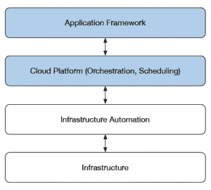
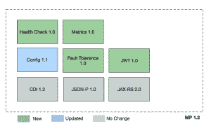
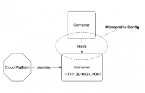
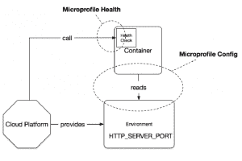
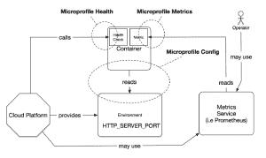
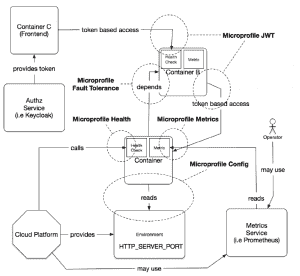
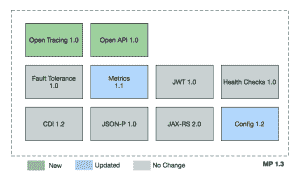
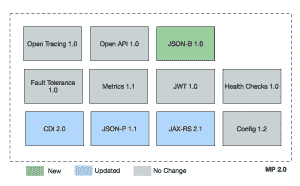

# 使用 Microprofile 1.2 进行云原生开发

> 原文：<https://developers.redhat.com/blog/2018/01/29/microprofile-1-2-cloud-native-development>

这篇博文的目的是提供 Eclipse Microprofile 1.2 版本中 API 和规范的概述。特别是，我将尝试把这些规范和 API 与它们的架构目的联系起来。它们适合哪里，为什么？如果您正在考虑将 Java 应用程序迁移到云中，那么这篇文章可能适合您。

## 云原生应用

对不同的人来说，云本族有不同的含义。让我们退后一步，建立一个有用的定义来框定这场讨论。在本文中，我们将依靠云本地计算基金会提供的描述。根据他们的术语，云本地计算定义了一个软件堆栈:

*   **容器化** :每个部分(应用程序、流程等)都被打包在自己的容器中。这有助于再现性、透明性和资源隔离。
*   **动态编排** :容器被主动调度和管理，以优化资源利用。
*   **面向微服务的** :应用被分割成[微服务](https://developers.redhat.com/topics/microservices/)。这显著提高了应用程序的整体灵活性和可维护性

第一件值得注意的事情是提到了“软件堆栈”。该堆栈超越了应用程序级别，包括基础架构、自动化方法以及在这些层之上编排和调度计算节点的服务。

与我们的讨论相关的是应用程序和云平台之间的契约(即编程模型)、常见的云平台概念及其对应用程序的影响，以及总体架构问题，尤其是面向服务架构的思想。

## Eclipse micro profile 1.2

Microprofile 项目旨在为微服务架构优化 Java。在这里，云原生计算是一个首要概念，因此该社区中开发的大多数规范和 API 都围绕这些领域。版本 1.2 是最近发布的版本之一，解决了配置、健康检查、指标、容错和基于令牌的安全概念。这是对 CDI、JSON-P 和 JAX-RS 的补充，它们构成了构建微文件标准的基础。

让我们更详细地看一下这些规范，解释它们在云原生计算平台上的整体应用架构中的位置。

### **应用程序配置**

顾名思义，微配置文件配置规范解决了与配置相关的问题。配置 API 提供了一种统一的方式来检索 Java 代码中的配置值，而不考虑配置的实际来源。它支持重新配置应用程序的方法，而不需要重新打包整个应用程序二进制文件。您可以将默认配置与应用程序捆绑在一起，但是 API 允许从外部覆盖。该规范规定了常识性的配置源(即属性文件、系统属性或环境变量)。这些将被提供给所有的实现，并包括带来我们自己的源代码的能力。支持动态和静态配置值，以涵盖广泛的用例(即服务重载和刷新)。

在云原生应用中，配置与应用分离并由云平台维护是常见且可取的。配置 API 的一个常见用例是在容器(托管您的应用程序)和云平台提供的配置之间建立桥梁。

例如，在这种情况下，配置值在启动时被注入容器(通常是环境变量),并由应用程序通过微配置文件配置 API 使用。

### **健康检查**

健康检查确定计算节点(即容器内的应用)是否存活并准备好执行工作。准备就绪的概念在容器启动或翻转(即重新部署)时使用。在此期间，云平台需要确保在它准备好之前没有网络流量被路由到该实例。活性描述了正在运行的容器的状态。它还能响应请求吗？它被卡住了还是进程最终死亡了？如果检测到这些状态中的任何一个，计算节点将被丢弃(终止和关闭)并最终被另一个健康的实例取代。

运行状况检查是与云平台的编排框架和调度程序之间的一个重要契约。检查过程由应用程序提供(即，您决定如何响应活动和就绪检查)，平台利用它来持续确保容器的可用性。

### **指标**

指标用于服务监控。Microprofile metrics 规范提供了公开应用程序或运行时数据的契约，这些数据可用于长期和持续的服务性能监控。您可以使用它来为容量规划和主动发现问题提供长期趋势数据。它包括一个定义指标的一致模型、一个提供应用程序级测量的 API、一组合理的运行时现成指标(即相关的 JVM 数据)和一个从监控代理检索数据的 REST 接口。

一般来说，指标确实提供了与监控和分析系统的集成。这些指标可能会指导云平台的调度决策(即副本数量和容量)，支持应用程序的操作方面，或者跨部署对功能进行 A/B 测试。

### **容错**

现在我们来看分布式系统有趣的部分。现在是 2018 年，网络仍然不可靠(延迟、分区等)。但是，转移到有效利用云平台的面向服务的架构意味着您正在构建一个具有大量网络通信的分布式系统。我们可以通过在应用程序中引入故障检测和处理功能来解决这个问题。微文件容错规范开始允许在应用程序级别实现这一点。它提供了一组故障处理原语，您可以使用这些原语来增强应用程序中和分布式服务之间的故障处理。

在一个或多个服务彼此远程交互的情况下，Microprofile 容错规范有助于处理意外错误和计划内不可用(即在部署翻转时)。它提供了保护您的应用程序免受系统错误影响的方法。API 包含插入超时和重试逻辑的构造，以及更复杂的模式，如断路器和隔板。

### **基于令牌的安全性**

利用基于令牌的安全性的想法和微概要 JSON Web 令牌(JWT)规范的动机源于在面向服务的架构中认证、授权和验证身份的需要。在这些环境中，安全性成为客户端到服务和服务到服务交互中的一个问题。描述基于令牌的安全方法的一个简单方法是考虑一个权威机构，它证明声明和身份(即附加了角色的用户 ID)，并发布一个有时间限制的票证，授予对特定服务的访问权限。当您请求服务并且票证有效时，将会授予对该服务的访问权限。所有这一切都不需要返回到身份管理系统，完全基于票证的内容和有效性。一旦票证失效，进一步的访问将被拒绝，您将被重定向到身份管理系统以申请新票证。

微概要 JWT 规范所支持的基于令牌的安全性允许您保护无状态服务架构。它基于由身份管理系统发布的独立令牌，如 Keycloak。它通常与 OpenID Connect (OIDC)认证一起使用，并在底层利用 JSON Web 令牌。

## 未来微文件规范

Microprofile 社区不断创新，不断增加规范，以进一步增强云原生应用的需求。在 1.3 中，我们可以期待解决分布式跟踪和服务契约描述的规范。

另一方面，Microprofile 2.0 将专注于集成最新的 Java EE 8 API，以增强其他 Microprofile APIs 的基础。这些变化包括对 CDI、JAX-RS 和 JSON-P API 的更新，以及包含 JSON-B，这是一个用于将 Java 对象与 JSON 消息相互转换的标准绑定层。

## 贡献和协作

Microprofile 是一个开放且充满活力的社区，由 Eclipse foundation 托管。这一点，再加上将未来的 Java EE 规范工作转移到 Eclipse foundation 下的决定，为提供反馈、贡献和协作提供了一个极好的机会。

### Eclipse Microprofile 和 EE4J 项目

*   [https://projects.eclipse.org/proposals/eclipse-microprofile](https://projects.eclipse.org/proposals/eclipse-microprofile)
*   [https://projects.eclipse.org/projects/ee4j/](https://projects.eclipse.org/projects/ee4j/)

### **Microprofile 1.2 规范**

*   [BOM 和 Maven 坐标](https://github.com/eclipse/microprofile-bom/releases/download/1.2/microprofile-spec-1.2.pdf)
*   [https://github.com/eclipse/microprofile-metrics](https://github.com/eclipse/microprofile-metrics)
*   [https://github.com/eclipse/microprofile-health](https://github.com/eclipse/microprofile-health)
*   [https://github.com/eclipse/microprofile-jwt-auth](https://github.com/eclipse/microprofile-jwt-auth)
*   [https://github.com/eclipse/microprofile-config](https://github.com/eclipse/microprofile-config)

### **讨论组和邮件列表**

*   [https://groups.google.com/forum/#!forum/microprofile](https://groups.google.com/forum/#!forum/microprofile)

* * *

**要开始实现微文件应用和微服务，请尝试 [Red Hat OpenShift 应用运行时](https://developers.redhat.com/products/rhoar/overview/)中的 [WildFly Swarm](http://wildfly-swarm.io/) 运行时。使用 developers.redhat.com/launch[的启动服务](http://developers.redhat.com/launch)你可以获得完整的、可构建的代码，在 Red Hat OpenShift Online 上的云中运行，实现微服务模式，如健康检查、断路器和外部化配置。**

*Last updated: October 17, 2018*