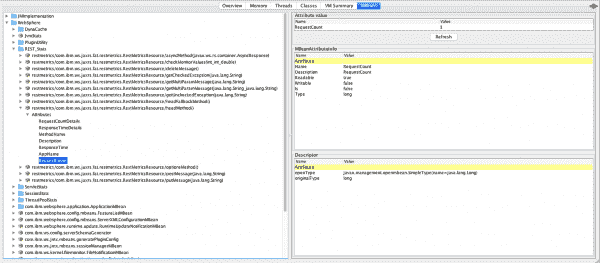
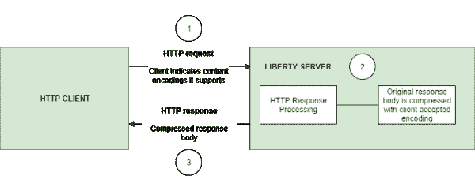

# MicroProfile 3.3 现在可以在 Open Liberty 20.0.0.4 上获得，它带来了更新的特性，yum/apt-get 支持，模式跟踪

> 原文：<https://developers.redhat.com/blog/2020/04/24/microprofile-3-3-now-available-on-open-liberty-20-0-0-4-brings-updated-features-yum-apt-get-support-pattern-tracking>

开放自由 20.0.0.4 提供对 MicroProfile 3.3 的支持，包括对 MicroProfile Rest 客户端、容错、度量、健康和配置的更新。对 yum/apt-get 安装的支持以及使用 JAX-RS 2.1 跟踪使用模式的能力也改善了开发人员的体验。

20.0.0.4[开放自由](https://openliberty.io/about)的更新包括:

*   [微文件 3.3](#mp3)
    *   [轻松确定传出请求的 HTTP 头(MicroProfile Rest 客户端 1.4)](#mpr)
    *   [监控微服务应用(MicroProfile Metrics 2.3)](#mra)
    *   [提供健康检查程序(MicroProfile Health 2.2)](#hcp)
    *   [监控微服务中的故障(微文件容错 2.1)](#mfm)
    *   [在外部配置](#conf) [您的微服务](#conf) [(微配置文件配置 1.4)](#conf)
*   [跟踪服务的使用模式和性能(JAX-RS 2.1)](#jax)
*   [支持 yum/apt-get 安装](#yum)
*   [自动压缩 HTTP 响应](#acr)
*   [在 grafana.com 开放 Liberty Grafana 仪表盘](#gra)
*   [支持 OpenShift 服务账户凭证认证](#os)

查看[20.0.0.4](https://github.com/OpenLiberty/open-liberty/issues?q=label%3Arelease%3A20004+label%3A%22release+bug%22+)中修复的 bug 列表。

## 使用 20.0.0.4 运行您的应用程序

如果你用的是 [Maven](https://openliberty.io//guides/maven-intro.html) ，这里是坐标:

```
<dependency>
    <groupId>io.openliberty</groupId>
    <artifactId>openliberty-runtime</artifactId>
    <version>20.0.0.4</version>
    <type>zip</type>
</dependency>
```

或者对于 [Gradle](https://openliberty.io//guides/gradle-intro.html) :

```
dependencies {
    libertyRuntime group: 'io.openliberty', name: 'openliberty-runtime', version: '[20.0.0.4,)'
}
```

或者如果你正在建立一个形象:

```
FROM open-liberty
```

## MicroProfile 3.3 支持

MicroProfile 3.3 通过对 Rest 客户端、容错、度量、健康和配置特性的更新，改善了开发人员的体验。

### 确定传出请求的 HTTP 头(MicroProfile Rest 客户端 1.4)

MicroProfile Rest 客户端 1.4 增加了对`ClientHeadersFactory`实例的注入。当在 JAX-RS 请求中执行 Rest 客户端时，从 JAX-RS 请求的上下文或 CDI 中提取数据以确定在传出请求中发送哪些 HTTP 头会很有用。有了 MicroProfile Rest Client 1.4，这就成为可能。

要启用 MicroProfile Rest 客户端 1.4，请将这个特性添加到您的`server.xml`:

```
mpRestClient-1.4
```

CDI 和 JAX-RS 注入到你的`ClientHeadersFactory`中有助于你做这样的事情:

```
>@ApplicationScoped
public class MyCustomClientHeadersFactory implements ClientHeadersFactory {

    @Context
    private UriInfo uriInfo;

    @Inject
    private Foo foo;

    @Override
    public MultivaluedMap <String, String> update(MultivaluedMap<String, String> incomingHeaders MultivaluedMap<String, String> clientOutgoingHeaders) {
        MultivaluedMap<String, String> myHeaders = new MultivaluedHashMap<>();
        myHeaders.putSingle("X-HEADER_FROM_CUSTOM_CLIENTHEADERSFACTORY", "456");

        URI uri = uriInfo.getAbsolutePath();
        myHeaders.putSingle("X-INJECTED_URI_INFO", uri == null ? "null" : uri.toString());

        myHeaders.putSingle("X-INJECTED_FOO", foo.getWord());

        return myHeaders;
    }
}
```

[点击](https://openliberty.io/guides/microprofile-rest-client.html)了解更多关于 MicroProfile Rest 客户端的信息。

### 使用简单的计时器度量和运行时间跟踪 REST 资源使用(MicroProfile Metrics 2.3)

MicroProfile Metrics 2.3 引入了一种新的度量类型，称为简单计时器(用`@SimplyTimed`标注)，运行时提供的度量跟踪微服务应用 REST 资源方法的使用，并由新的简单计时器度量支持。Simple Timer 是现有 Timer 指标的轻量级替代，它只跟踪总的计时持续时间，并计算它被调用的次数。另一方面，计时器度量是性能密集型的，它不断地计算持续时间统计信息和吞吐量统计信息，产生 14 个值。

新的 REST stat 度量是从 REST 资源方法使用中收集的(例如，`GET`、`POST`、`PUT`、`DELETE`、`OPTIONS`、`PATCH`和`HEAD`)。简单计时器度量跟踪总持续时间和总调用计数。当与`jaxrs-2.1`功能结合使用时，该功能被正确启用。所有 REST stat 指标都将使用`REST.request`指标名称，并用它们完全合格的类名和方法签名进行标记。

要启用该功能，请在`server.xml`中包含以下内容。

```
mpMetrics-2.3
```

`monitor-1.0`功能将被`mpMetrics-2.3`功能激活。因此，由于`monitor-1.0`的激活，供应商指标将被启用。要过滤掉这些数据，您可以在 server.xml 中配置以下内容，以选择您想要查看的统计信息:

```
<monitor filter="JVM,ThreadPool,WebContainer,Session,ConnectionPool,REST"/>
```

或者，禁用所有`monitor-1.0`统计:

```
<monitor filter=“ ”/> <!-- space required -->
```

要以编程方式使用新的`SimpleTimer`指标:

```
>@Inject
MetricRegistry metricRegistry;

//create metric
Metadata metadata= Metadata.builder().withName("sampleSimpleTimer").build();
SimpleTimer simpleTimer = metricRegistry.simpleTimer(metadata);

//retrieve simple timer context (will start timing)
SimpleTimer.Context simpleTimerContext = simpleTimer.time()

doLogic();
//stops the simple timer from timing
simpleTimerContext.close();
```

要使用带注释的`SimpleTimer`度量:

```
>@SimplyTimed(name=“sampleSimpleTimer”)
public void doSomething() {
    doLogic();
}
```

以下是最终的 OpenMetrics 输出:

```
# TYPE application_sampleSimpleTimer_total counter
application_sampleSimpleTimer_total 12
# TYPE application_sampleSimpleTimer_elapsedTime_seconds gauge
application_sampleSimpleTimer_elapsedTime_seconds 12.3200000
```

通过使用以下 REST 资源，您可以使用`mpMetrics-2.3`特性来启用 REST stat 指标:

```
>package org.eclipse.microprofile.metrics.demo;

@ApplicationScoped
public class RestDemo {

  @POST
  public void postMethod(String... s, Object o){
      ...
  }
}
```

关于 REST stat 指标，`OpenMetrics`格式的 REST 指标应该是:

```
# TYPE base_REST_request_total counter
base_REST_request_total{class="org.eclipse.microprofile.metrics.demo.RestDemo",method="postMethod_java.lang.String[]_java.lang.Object"} 1
# TYPE base_REST_request_elapsedTime_seconds gauge
base_REST_request_elapsedTime_seconds{class="org.eclipse.microprofile.metrics.demo.RestDemo",method="postMethod_java.lang.String[]_java.lang.Object"} 1.000
```

### 提供您自己的健康检查程序(MicroProfile Health 2.2)

MicroProfile Health Check 2.2 允许您提供自己的健康检查过程，Open Liberty 调用这些过程来验证您的微服务的健康状况。在`mpHealth-2.2`特性中，所有受支持的限定符(活性和就绪性)现在都在规范中添加了注释文字。这简化了对限定符内联实例化的编程查找和支持，而这在以前的版本中是不支持的。

此外，为了更好地与第三方框架集成——如 MicroProfile Rest 客户端——`HealthCheckResponse`类声明从抽象类更改为具体类，构造函数允许在消费端直接实例化。要启用该功能，请在`server.xml`中包含以下内容:

```
<feature>mpHealth-2.2</feature>
```

应用程序应该通过实现带有`@Liveness`或`@Readiness`注释的`HealthCheck`接口来提供健康检查程序。Open Liberty 分别使用这些注释来验证应用程序的活性或就绪性。通过使用来自 API 的简单的`up()` / `down()`方法，在`call()`方法中添加健康检查并返回`HealthCheckResponse`对象:

```
>*Liveness Check*
@Liveness
@ApplicationScoped
public class AppLiveCheck implements HealthCheck {
...
    @Override
     public HealthCheckResponse call() {
       ...
       HealthCheckResponse.up("myCheck");
       ...
     }
}
```

要查看每个健康检查的状态，请访问`http://:/health/live`或`http://:/health/ready`端点。

### 监控微服务中的故障(微文件容错 2.1)

微概要文件容错允许开发人员轻松地应用策略来减少代码失败。它提供了注释，开发者可以将注释添加到使用[隔板](https://download.eclipse.org/microprofile/microprofile-fault-tolerance-2.1/apidocs/org/eclipse/microprofile/faulttolerance/Bulkhead.html)、[断路器](https://download.eclipse.org/microprofile/microprofile-fault-tolerance-2.1/apidocs/org/eclipse/microprofile/faulttolerance/CircuitBreaker.html)、[重试](https://download.eclipse.org/microprofile/microprofile-fault-tolerance-2.1/apidocs/org/eclipse/microprofile/faulttolerance/Retry.html)、[超时](https://download.eclipse.org/microprofile/microprofile-fault-tolerance-2.1/apidocs/org/eclipse/microprofile/faulttolerance/Timeout.html)和[回退策略](https://download.eclipse.org/microprofile/microprofile-fault-tolerance-2.1/apidocs/org/eclipse/microprofile/faulttolerance/Fallback.html)的方法中。此外，微概要文件容错提供了一个注释，使得一个方法异步运行。

微轮廓容错 2.1:

*   将新的参数`applyOn`和`skipOn`添加到`@Fallback`中，并将`skipOn`添加到`@CircuitBreaker`中，以使用户能够更好地控制哪些异常应该触发这些策略。例如:

```
>@Fallback(applyOn=IOException.class, skipOn=FileNotFoundException.class, fallbackMethod="fallbackForService")
public String readTheFile() {
    ...
}
```

*   确保 CDI 请求上下文在用`@Asynchronous`标注的方法执行期间是活动的。
*   在 Javadoc 中增加了更多的细节，并对规范做了一些小的澄清。

有关微配置文件容错的更多信息:

*   获取微文件容错简介:
    *   [快速失败并从错误中恢复](https://openliberty.io/guides/retry-timeout.html)。
    *   [防止对微服务的重复失败调用](https://openliberty.io/guides/circuit-breaker.html)。
*   [参考 Javadoc](https://download.eclipse.org/microprofile/microprofile-fault-tolerance-2.1/apidocs/) 。
*   [参考完整规范](https://download.eclipse.org/microprofile/microprofile-fault-tolerance-2.1/microprofile-fault-tolerance-spec.html)，包括 [2.1 版本说明](https://download.eclipse.org/microprofile/microprofile-fault-tolerance-2.1/microprofile-fault-tolerance-spec.html#release_notes_21)。
*   [报告 Github 上的任何问题](https://github.com/OpenLiberty/open-liberty)。

### 使用更新的转换器在外部配置您的微服务(微配置文件配置 1.4)

MicroProfile Config 1.4 特性提供了 Eclipse micro profile Config 1.4 API 的实现，它主要对内置和隐式转换器进行了更改。Open Liberty 实现已经支持`byte` / `Byte`和`short` / `Short`，但是现在又增加了`char` / `Character`。

如果我们在`ConfigSource`中有以下可用属性:

```
byte1=128
short1=5
char1=\u00F6
```

您可以将这些属性注入到您的应用程序中，或者作为原语，或者作为它们的装箱等价物:

```
>@Dependent
public class MyBean {

    @Inject
    @ConfigProperty(name = "byte1")
    private Byte property1;

    @Inject
    @ConfigProperty(name = "byte1")
    private byte property2;

    @Inject
    @ConfigProperty(name = "short1")
    private Short property3;

    @Inject
    @ConfigProperty(name = "short1")
    private short property4;

    @Inject
    @ConfigProperty(name = "char1")
    private Character property5;

    @Inject
    @ConfigProperty(name = "char1")
    private char property6;
}
```

要启用该功能，请在`server.xml`中包含以下内容:

```
<feature>mpConfig-1.4</feature>
```

以前，在 MicroProfile Config 1.3 中，`String`构造函数会被用来做隐式转换。在 1.4 版本中，改为使用`parse(CharSequence)`方法。注意解析`method`使用了一个简单的缓存。如果同一个 raw `String` ( `String`扩展`CharSequence`)被转换两次，那么将返回同一个`MyType`实例。使用`String`构造函数不可能得到这个结果。

我们还对 Open Liberty 实现进行了显著的内部更改。在 1.4 之前的版本中，我们的实现包括一个后台更新线程，它频繁地扫描可用的`ConfigSources`并缓存结果。这种行为非常快速地调用了`Config API`。然而，因为用户提供的`ConfigSources`的大小和复杂性是未知的，这个过程在后台进行可能是一件昂贵的事情。

后台更新线程已被到期进程所取代。这意味着对属性的第一次请求可能会慢一点，因为它可能需要遍历所有可用的`ConfigSources`来找到一个值。一旦找到，这个值就被缓存，并且启动一个定时器使缓存过期。如果在缓存过期之前第二次请求该属性，则使用缓存的值并快速返回。

为了保持与先前版本相同的动态特性，到期时间仅设置为 500 毫秒。这个值可以通过设置`microprofile.config.refresh.rate`系统属性来增加。500 毫秒的设置是允许的最短过期时间，但是如果该属性设置为零或更小，则缓存被禁用。

有关更多信息，请参见自 1.3 以来对 API 的[更改。](https://github.com/eclipse/microprofile-config/milestone/7?closed=1)

## 跟踪使用模式和服务绩效(JAX-RS 2.1)

每当在`server.xml`中指定`jaxrs-2.0`(或`jaxrs-2.1`)功能以及`monitor-1.0`功能时，JAX-RS 2.1 自动功能启用。这个自动特性引入了收集与应用程序的 RESTful 资源方法的执行相关的统计数据的能力(特别是调用次数和累计执行时间)。这些数据对于设计、调试和监控非常有用。

RESTful 指标可以通过结合使用`monitor-1.0`特性和`mpMetrics-2.3`特性来访问。这些信息也可以通过 JMX(例如 JConsole)获得。在用于 JMX/PMI 访问的 server.xml 中包括以下内容:

```
<feature>jaxrs-2.0</feature> (or jaxrs-2.1)
<feature>monitor-1.0</feature>
```

收集的 JMX/PMI 数据是基于每个方法的，并被聚合到类和 web 模块级别。例如，假设一个服务器有两个 web 模块，每个模块都有包含两个资源方法的同名类。Jconsole 中 REST_Stats 的结果如图 1 所示。

[](/sites/default/files/blog/2020/04/JAXRS-Monitor-JConsole.png)Figure 1: Examine your RESTful metrics with JAX-RS 2.1.Figure 1: Examine your RESTful metrics with JAX-RS 2.1.">

## 用 yum/apt-get 安装 OpenLiberty

Open Liberty 现在以原生 Linux `.deb`或`.rpm`包的形式提供，因此您现在可以使用原生操作系统工具(`yum` / `apt`)来管理您的 Open Liberty 安装。要访问 Open Liberty `rpms` / `debs`，你必须配置你的机器使用 Open Liberty 库。

### 配置您的机器

在 Ubuntu 系统上:

1.  将下面一行添加到`file /etc/apt/sources.list`:

```
$ deb https://public.dhe.ibm.com/ibmdl/export/pub/software/openliberty/runtime/os-native-packages/deb/ /
```

2.  使用以下命令添加存储库的公钥:

```
$ wget -O http://public.dhe.ibm.com/ibmdl/export/pub/software/openliberty/runtime/os-native-packages/public.key | sudo apt-key add -
```

3.  运行命令:

```
$ sudo apt-get update
```

4.  通过运行以下命令，从存储库中安装最新版本的 Open Liberty:

```
$ sudo apt-get install openliberty
```

在 Red Hat 系统上，创建一个名为`/etc/yum.repos.d/openliberty.repo`的文件，其中包含:

```
[olrepo]
name=olrepo
baseurl=http://public.dhe.ibm.com/ibmdl/export/pub/software/openliberty/runtime/os-native-packages/rpm/
enabled=1
gpgcheck=1
repo_gpgcheck=1
gpgkey=https://public.dhe.ibm.com/ibmdl/export/pub/software/openliberty/runtime/os-native-packages/public.key
```

然后，安装最新版本的 Open Liberty，包括:

```
$ sudo yum update
$ sudo yum install openliberty
```

### 使用 OpenLiberty

无论你是 Ubuntu 还是 Red Hat 系统，在安装了`openliberty.rpm`或`openliberty.deb`之后，空的`defaultServer`被创建并配置为作为服务运行。以下是详细情况:

*   Open Liberty services 将以用户`openliberty`的身份运行。
*   服务器位于`/var/lib/openliberty/usr/servers/defaultServer`。
*   日志将存储在`/var/log/openliberty/defaultServer`中。
*   服务器的 PID 在`/var/run/openliberty/defaultServer.pid`中。

这个过程完成后，您可以使用以下标准 Linux 服务命令:

*   `systemctl status openliberty@defaultServer.service`
*   `systemctl start openliberty@defaultServer.service`
*   `systemctl restart openliberty@defaultServer.service`
*   `systemctl stop openliberty@defaultServer.service`

## 自动压缩 HTTP 响应

您现在可以尝试 HTTP 响应压缩。在这个特性之前，Open Liberty 只考虑通过使用`$WSZIP`私有头进行压缩。客户无法配置响应消息的压缩。现在的支持主要包括结合使用`Accept-Encoding`头和`Content-Type`头，这决定了响应消息是否可以被压缩。

这种行为允许 Liberty 服务器在可能的情况下压缩响应消息，这使得开发人员可以使用压缩特性来减少网络流量，从而减少带宽和客户端与 Liberty 服务器之间的交换时间。现在，`httpEndPoint`中有一个新元素`compression`，用户可以选择加入并使用压缩支持。

可选的`types`属性允许用户配置逗号分隔的内容类型列表，这些内容类型应该或不应该考虑进行压缩。此列表支持使用加号(+)和减号(-)字符向默认列表添加(或从中删除)内容类型。每种内容类型都包含由斜杠(/)字符分隔的类型和子类型。通配符(*)可用作子类型，表示特定类型的所有子类型。

类型可选属性的默认值是`text/*, application/javascript`。

当配置可选的`serverPreferredAlgorithm`属性时，根据“Accept-Encoding”头值验证配置的值。如果客户端接受配置的值，这将被设置为要使用的压缩算法。如果客户端不接受配置的值，或者如果配置的值设置为“无”，则默认选择客户端首选的压缩算法:

```
<httpEndpoint  id="defaultHttpEndpoint"
        httpPort="9080"
        httpsPort="9443">
    <compression types=“+application/pdf, -text/html” serverPreferredAlgorithm=“gzip”/></httpEndpoint>
```

Open Liberty 支持以下压缩算法:`gzip`、`x-gzip`、`deflate`、`zlib`、`identity`(无压缩)。

`Http Response Compression`功能是根据以下[开放自由史诗:#7502](https://github.com/OpenLiberty/open-liberty/issues/7502) 设计的。这个设计在 Epic 中有概述，以供更详细的阅读。设计的基本流程如图 2 所示。

[](/sites/default/files/blog/2020/04/ResponseCompression.png)Figure 2: The initial design for Http Response Compression functionality.

Figure 2: The initial design for Http Response Compression functionality.

### 开放自由格拉夫纳仪表板现已在 grafana.com

Grafana 仪表板提供了广泛的微配置文件度量数据时间序列可视化，如 CPU、Servlet、连接池和垃圾收集度量。该仪表板由 Prometheus datasource 提供支持，该 datasource 配置为从一个或多个 Liberty servers 的`/metrics`端点接收数据，使我们能够在 Grafana 中近乎实时地查看结果。

这个新的仪表盘可以和[红帽 OpenShift](https://developers.redhat.com/products/openshift) 之外的 Liberty 实例一起工作。对于运行在 OpenShift 容器平台上的 Liberty 服务器，使用这里发布的 [Grafana 仪表板](https://github.com/OpenLiberty/open-liberty-operator/tree/master/deploy/dashboards/metrics)。新的 Grafana 仪表板是为没有在 OCP 上运行的 Open Liberty 服务器设计的。

在 Open Liberty 中运行应用程序时，您可以使用这个仪表板来发现性能问题。例如，servlet 响应时间、CPU 或堆使用量等指标，当在 Grafana 上被视为时间序列时，可以指示潜在的性能问题或内存泄漏。

要配置仪表板，首先添加`mpMetrics-2.3`功能。这将自动启用`monitor-1.0`功能:

```
<featureManager>
    <feature>mpMetrics-2.3</feature>
</featureManager>

<mpMetrics authentication="false" />
```

使用以下命令运行服务器:

```
$ ./server run DashboardTest
```

然后，下载[普罗米修斯](https://prometheus.io/download/)。一旦解包，它应该包含一个名为`prometheus`的启动脚本和一个配置文件:`prometheus.yml`。在`prometheus.yml`中，根据您处理的是安全端点还是不安全端点，向`scrape_configs`添加以下作业之一。

对于不安全端点上的`mpMetrics`:

```
- job_name: 'liberty'
    scrape_interval: 5s
    static_configs:
      - targets: ['localhost:9080']
```

对于安全端点上的`mpMetrics`:

```
- job_name: 'liberty-secure'
    scrape_interval: 5s
    static_configs:
      - targets: ['localhost:9443']
    basic_auth:
      username: "<your-username>"
      password: "<your-password>"
    tls_config:
       insecure_skip_verify: true
    scheme: "https"
```

启动`prometheus`脚本并访问`http://localhost:9090/targets`，您应该看到您的 Open Liberty 服务器被列为目标之一，如图 3 所示。

[")](/sites/default/files/blog/2020/04/20004-prometheus-1-1.png)Figure 3: The prometheus script can show you all of your targets.">

然后，下载 [Grafana](https://grafana.com/docs/grafana/latest/installation/) ，一旦完成，访问`https://localhost:3000`。导航到 Grafana 后，点击齿轮图标并选择**数据源**。添加一个 URL 为`http://localhost:9090`的新的 Prometheus 数据源，然后点击**保存&测试**。

要导入仪表板:

1.  单击加号图标。
2.  选择**导入**。
3.  粘贴仪表板 ID 11706。
4.  当下拉菜单中出现提示时，将其链接到您刚刚创建的新数据源。

[")](/sites/default/files/blog/2020/04/20004-grafana-1.png)Figure:Figure 4: Your new MicroProfile Metrics dashboard now appears in Open Liberty.">

如需了解更多信息，请查看 Grafana 网站上的[仪表盘](https://grafana.com/grafana/dashboards/11706)和[使用 Prometheus 创建您自己的定制可视化](https://prometheus.io/docs/prometheus/latest/querying/basics/)。

### 支持 Red Hat OpenShift 服务帐户认证凭证

`socialLogin-1.0`特性现在可以配置为使用 [Red Hat OpenShift](http://developers.redhat.com/openshift/) 服务帐户来验证和授权受保护的资源请求。例如，此选项允许服务器管理员保护可能产生敏感信息但需要自动化流程或非人类实体重复访问的监控和度量端点。新的行为允许服务帐户通过在请求中提供在 OpenShift 集群中创建的服务帐户令牌来验证自己。

现在提供了一个新的配置元素来支持这种行为。必须启用`socialLogin-1.0`功能才能访问这个新元素。最低配置只要求在`server xml`中指定一个元素:

```
<server>

<!-- Enable features -->
<featureManager>
  <feature>appSecurity-3.0</feature>
  <feature>socialLogin-1.0</feature>
</featureManager>

<okdServiceLogin />

</server>
```

最低配置假设 Liberty 服务器打包并部署在 OpenShift 集群中。默认情况下，该元素将用于认证 Liberty 服务器接收到的所有受保护的资源请求。

对受保护资源的传入请求必须包括服务帐户令牌。令牌必须在请求的`Authorization`头中指定为无记名令牌。Liberty 服务器将使用服务帐户令牌从 OpenShift 集群中查询相关服务帐户的信息。在做出授权决定时，服务帐户所在的 OpenShift 项目将被用作服务帐户的组。OpenShift 项目名称与服务帐户的名称连接在一起，以创建用户名。

如果 Liberty 服务器没有部署在 OpenShift 集群中，那么应该配置`userValidationApi`属性，并将其设置为 OpenShift 集群中适当的用户 API 端点的值:

```
<okdServiceLogin userValidationApi="https://cluster.domain.example.com/apis/user.openshift.io/v1/users/~" />
```

只要每个元素都指定了唯一的`id`属性，就可以配置多个元素。在这些情况下，还应该配置身份验证过滤器，以确保适当的端点受到唯一实例的保护。

关于 OpenShift 服务帐户的更多信息可以在 OpenShift 文档中找到，以便[理解和创建服务帐户。](https://docs.openshift.com/container-platform/4.3/authentication/understanding-and-creating-service-accounts.html)

## 马上联系自由 20.0.0.4

开放自由 20.0.0.4 可以通过 Maven、Gradle、Docker 获得，也可以下载存档。

## 现在尝试在红帽运行时打开自由 20.0.0.4

Open Liberty 是 Red Hat Runtimes 产品的一部分，可供 [Red Hat Runtimes 用户](https://access.redhat.com/products/red-hat-runtimes)使用。要了解更多关于将 Open Liberty 应用部署到 OpenShift 的信息，请查看我们的 [Open Liberty 指南:将微服务部署到 OpenShift](https://openliberty.io/guides/cloud-openshift.html) 。

*Last updated: June 29, 2020*