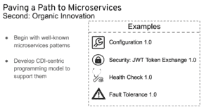

# MicroProfile:为微服务架构优化企业 Java

> 原文：<https://developers.redhat.com/blog/2017/07/07/microprofile-optimizing-enterprise-java-for-a-microservices-architecture>

Java EE 发布的步伐一直在放缓，已经无法适应微服务的快速崛起。创建 MicroProfile 是为了在一个开放的论坛中与供应商、个人和组织(如 Java 用户组)进行协作，从而将微服务快速带给传统的 Java EE 开发人员。我们将该项目转移到 Eclipse Foundation，并正式将其重命名为 Eclipse MicroProfile。Red Hat 正在通过 WildFly Swarm 实现 MicroProfile 规范，并对其进行优化以用于 OpenShift。

我在今年的红帽峰会上召开了一次会议，介绍了 MicroProfile:为微服务架构优化 Java EE 和 ，然后讨论了它当前的技术和社区状态，包括围绕企业 Java 微服务的合作努力。

*   我们强调了利用相关 Java EE 技术的重要性。
    *   我们在开始时挑选了一组核心技术，这组技术将随着 Java EE 的发展而慢慢增长(例如:用于 JSON 绑定的 Java API)。
    *   客户可以利用现有的知识和专业技能。
    *   促进客户、供应商和合作伙伴的采用。

*   用一些新功能扩展基本的 Java EE 技术。

*   我们如何围绕这一点进行开源合作。
    *   建立一个强大的社区
    *   在规范上合作
    *   鼓励多种实现方式
    *   准备就绪时标准化技术

我们已经为日历年的剩余时间制定了路线图，我们希望在这些版本和以后的版本中解决许多微服务相关的技术，并确定 WildFly Swarm 为我们的微档案交付工具。

最大的收获是:MicroProfile 并不与 Java EE 竞争，而是扩展了 Java EE 的功能，以更好地处理微服务。因为这是一个社区项目，我们正在寻找参与帮助我们的人，所以来加入我们吧！

* * *

**无论你是容器新手还是有经验的人，下载这个** [**备忘单**](https://developers.redhat.com/promotions/docker-cheatsheet/) **可以在遇到你最近没有完成的任务时帮助你。**

*Last updated: June 30, 2017*