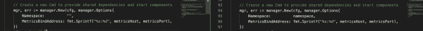
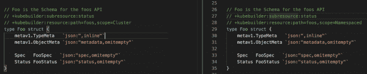
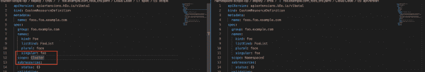
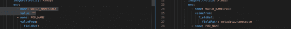

# 将命名空间范围的运算符迁移到集群范围的运算符

> 原文：<https://developers.redhat.com/blog/2020/06/26/migrating-a-namespace-scoped-operator-to-a-cluster-scoped-operator>

在 Kubernetes 的上下文中，名称空间允许划分资源、策略、授权和集群对象的边界。在本文中，我们将讨论两种不同类型的操作符:命名空间范围的和集群范围的。然后，我们通过一个例子来说明如何从一个迁移到另一个，这说明了两者之间的区别。

## 命名空间范围和集群范围

命名空间范围的操作符是在命名空间的边界内定义的，可以灵活地处理升级而不影响其他操作符。它监视该名称空间中的对象，并为访问资源的基于角色的访问控制(RBAC)策略维护`Role`和`RoleBinding`。

同时，集群范围的操作符提高了可重用性，并管理集群中定义的资源。它监视集群中的所有名称空间，并为授权集群对象的 RBAC 策略维护`ClusterRole`和`ClusterRoleBinding`。集群范围操作符的两个例子是 [istio-operator](https://github.com/istio/operator) 和 [cert-manager](https://github.com/jetstack/cert-manager) 。istio-operator 可以部署为集群范围的，以管理整个集群的服务网格，而 cert-manager 用于为整个集群颁发证书。

根据您的要求，这两种类型的操作器支持两种类型的安装。对于集群范围的操作符，与升级命名空间范围的操作符相比，升级操作符版本会影响操作符在整个集群中管理的资源，命名空间范围的操作符更容易升级，因为它只影响其范围内的资源。

## 迁移指南:命名空间范围到集群范围

让我们用`operator-sdk` *:* 生成两个操作符:`namespace-scope-op`和`cluster-scope-op`

```
$ operator-sdk new namespace-scope-op
$ operator-sdk new cluster-scope-op
```

默认情况下，这两个运算符都是命名空间范围的。让我们将`kind`类型`Foo`添加到这两个运算符中:

```
$ operator-sdk add api --api-version=foo.example.com/v1alpha1 --kind=Foo
```

我现在将对 cluster-scope 操作符进行修改，以展示它与 namespace-scope 操作符的不同之处。

### **步骤 1:观察所有的名称空间**

我们需要在`cluster-scope-op`操作符中做的第一个改变是将名称空间选项设置为空。要查看所有的名称空间，请运行:

```
$ cluster-scope-op/cmd/manager/main.go
```

图 1 显示了左边的集群范围和右边的名称空间范围的结果之间的差异。

[](/sites/default/files/blog/2020/06/cluster-namescape-scoped-operator.png)

Figure 1: Comparison: Watching all of the namespaces.

### 步骤 2:更新添加的 API 模式的范围

接下来，我们需要更新我们的 API 类型:`*_types.go` *。*如果要设置名称空间范围，可以使用:

```
// +kubebuilder:resource:path=foos,scope=Namespaced
```

要设置集群范围，请使用:

```
// +kubebuilder:resource:path=foos,scope=Cluster
```

图 2 显示了左边的集群范围和右边的名称空间范围的结果之间的差异。

[](/sites/default/files/blog/2020/06/cluster-namescape-scoped-operator-2.png)

Figure 2: Updating the added API schema's scope.

### **步骤 3:为聚类范围操作符生成 CRDs】**

现在是时候为集群范围操作符生成定制资源定义(CRD)了:

```
cluster-scope-op-:$ operator-sdk generate crds
INFO[0000] Running CRD generator.
INFO[0000] CRD generation complete.
```

图 3 显示了在`*crd*.yaml`中为集群范围操作符(左边)更新了生成的 CRD。

[](/sites/default/files/blog/2020/06/cluster-namescape-scoped-operator-3.png)

Figure 3: Generating the CRDs for cluster-scope.

### 步骤 4:更新种类类型

此时，我们将`Role` / `RoleBinding`的`kind`类型更新为`ClusterRole` / `ClusterRoleBinding`。首先，将`role.yaml`中的`kind`类型从`Role`更新为`ClusterRole`:

```
kind: ClusterRole
```

然后将`role_binding.yaml`中的`kind`类型`RoleBinding`更新为`ClusterRoleBinding`，种类`roleRef`更新为`ClusterRole`:

> ```
> kind: ClusterRoleBinding
> apiVersion: rbac.authorization.k8s.io/v1
> metadata:
>   name: cluster-scope-op
> subjects:
> - kind: ServiceAccount
>   name: cluster-scope-op
>   namespace: ${NAMESPACE}
> roleRef:
>   kind: ClusterRole
>   name: cluster-scope-op
>   apiGroup: rbac.authorization.k8s.io
> ```

**注意**:所需的确切资源/动词应该在集群角色中指定。定义群集角色时，出于安全考虑，请避免使用通配符(*)权限。

集群范围的操作符将部署在一个名称空间下，但是该操作符用于管理集群范围内的资源。相比之下，命名空间范围的操作符部署在命名空间下，但只管理该命名空间下的资源。

### 步骤 5:更新 WATCH_NAMESPACE

最后，我们可以通过将`WATCH_NAMESPACE`更新为`operator.yaml`中的空字符串来添加控制器:

```
$ operator-sdk add controller --api-version=cache.example.com/v1alpha1 --kind=Foo
```

图 4 显示了集群范围操作符(左侧)与右侧名称空间范围操作符的对比。

[](/sites/default/files/blog/2020/06/cluster-namescape-scoped-operator-4.png)

Figure 4: Updating the WATCH_NAMESPACE.

请记住，您需要有权观察集群中的对象的观察器，这些观察器是默认情况下为主对象生成的。

### 运营商生命周期管理器

如果要使用 Operator Lifecycle Manager (OLM)来部署操作员，可以使用以下命令生成 CSV:

```
$ operator-sdk generate csv --csv-version 0.0.1
```

你可以支持`installModes`，因为你在这个 CSV 中看到了[。默认情况下，此 CSV 支持所有安装模式:](https://github.com/akoserwal/ex-cluster-vs-namespace-operator/blob/master/cluster-scope-op/deploy/olm-catalog/cluster-scope-op/0.0.1/cluster-scope-op.v0.0.1.clusterserviceversion.yaml#L143)

> ```
> installModes:- supported: true
> type: OwnNamespace- supported: true
> type: SingleNamespace- supported: false
> type: MultiNamespace- supported: true
> type: AllNamespaces
> ```

您还可以定义一个操作员组。`OperatorGroup`是一种 OLM 资源，为安装了 OLM 的操作员提供多租户配置:

> ```
> apiVersion: operators.coreos.com/v1
> kind: OperatorGroup
> metadata:
>   name: my-group
>   namespace: my-namespace
> spec:
>   targetNamespaces:
>   - my-namespace
>   - my-other-namespace
>   - my-other-other-namespace
> ```

## 结论

为了使您的名称空间操作符成为一个集群范围的操作符，您只需要知道这些。两个操作员示例[均可在本报告](https://github.com/akoserwal/ex-cluster-vs-namespace-operator)中找到。

*Last updated: June 25, 2020*