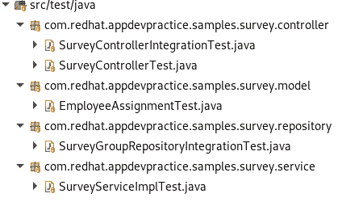

# 将 spring boot 测试迁移到 quartus

> 原文：<https://developers.redhat.com/blog/2020/07/17/migrating-spring-boot-tests-to-quarkus>

作为开发人员，当我们考虑采用新的框架时，我们并不总是考虑测试迁移。然而，测试是重要的，因为它们确保我们的代码满足它的需求，并按预期工作，特别是当我们添加新的特性和功能时。

测试迁移是迁移到新的应用程序开发框架的重要部分。这篇文章是为那些将 Spring Boot 应用程序迁移到 T2 应用程序的开发者而写的。我将使用三个样本测试来演示从 Spring Boot 到 Quarkus 的测试迁移。虽然 Quarkus 与 Spring Boot 网站兼容，但并不是 Spring Boot 的所有测试功能都能映射到 Quarkus。我将向您介绍在这些情况下可以使用的其他测试依赖项和 Quarkus 功能。

什么是夸尔库斯？ Quarkus 是一个全栈、[Kubernetes](https://developers.redhat.com/topics/kubernetes)-native[Java](https://developers.redhat.com/topics/enterprise-java)框架，专为 Java 虚拟机和原生编译打造。Spring Boot 为[容器](https://developers.redhat.com/topics/containers)优化 Java，使其成为[无服务器](https://developers.redhat.com/topics/serverless-architecture)、和 Kubernetes 环境的有效平台。

## 开始测试迁移

Quarkus 社区站点包含了详细的[文档](https://quarkus.io/guides/getting-started-testing)，关于为 Quarkus 应用编写测试的不同方法。我使用该文档作为将 Spring Boot 示例应用程序迁移到 Quarkus 的基础。我还使用了来自 Quarkus GitHub 库的[测试示例](https://github.com/quarkusio/quarkus/tree/master/integration-tests)。

## 示例应用程序

我们的 Spring Boot 示例应用程序允许员工完成调查，在调查中他们对分配到同一个项目的其他员工的技能进行评估。我们的任务是将应用程序测试从 Spring Boot 迁移到 Quarkus。首先，查看一下 [Spring Boot 应用程序](https://github.com/redhat-appdev-practice/spring-rest-surveygroups)和 [Quarkus 应用程序](https://github.com/redhat-appdev-practice/survey-quarkus-spring-service)的源代码。

**注意**:对于示例，我假设您已经开始了将 Spring Boot 应用程序迁移到 Quarkus 的过程。我不会提供任何一个框架的更多细节。本文的重点是测试迁移。

### 测试依赖关系

对于这次迁移，我们将使用 [JUnit 5](https://junit.org/junit5) 和[放心](http://rest-assured.io)测试依赖项，如下面的 Maven `pom.xml`所示:

```
<dependency>
    <groupId>io.quarkus</groupId>
    <artifactId>quarkus-junit5</artifactId>
    <scope>test</scope>
</dependency>
<dependency>
    <groupId>io.rest-assured</groupId>
    <artifactId>rest-assured</artifactId>
    <scope>test</scope>
</dependency>

```

### 测试文件夹结构

图 1 显示了测试的当前结构:

[](/sites/default/files/blog/2020/07/Screenshot-from-2020-06-09-23-49-49.png)

Figure 1: Structure of the Spring Boot tests in a Project directory.

## 例子 1:SurveyControllerIntegrationTest.java

对于我们的每一个 Spring Boot 测试，我们都需要修改注释以与 Quarkus 兼容。注意我们第一个例子中的注释，`SurveyControllerIntegrationTest.java`:

```
@SpringBootTest
@AutoConfigureMockMvc
@ActiveProfiles(“test”)
public class SurveyControllerIntegrationTest {
    @Autowired
    private MockMvc mockMvc;

    @Autowired
    private ObjectMapper mapper;      

    @Autowired
    private SurveyGroupRepository surveyGroupRepository;
…

```

Quarkus 不需要`@SpringBootTest`注释，也不支持`@AutoConfiguremockMvc`。相反，Quarkus 中的测试用`@QuarkusTest`标注。与数据库交互的测试用`@Transactional`标注。在下面的例子中，我们删除了`@Autowired MockMvc` MVC 注释。还要注意，Quarkus 没有在存储库上使用 Spring Boot 的`@Autowired`，而是使用了`@Inject`:

```
@Transactional
@QuarkusTest
public class SurveyControllerIntegrationTest {
    @Autowired
    private ObjectMapper mapper;

    @Inject
    private SurveyGroupRepository surveyGroupRepository;
…

```

### 从 MockMvc 迁移到放心

正如我提到的，Quarkus 不支持`MockMvc`。虽然它确实有其他的[模仿功能](https://quarkus.io/guides/getting-started-testing#mock-support)，但是最好使用放心来测试 Quarkus 中的控制器。放心是一个 Java 库，它允许您使用特定于领域的语言(DSL)来测试 API。

在第一个例子中，您可以看到 Spring Boot 如何使用`MockMvc`来测试一个`POST`调查小组请求:

```
@Test
public void shouldPersistASurveyGroup() throws Exception {

MvcResult result = mockMvc.perform(post(“/surveygroups”)
    .contentType(MediaType.APPLICATION_JSON)
    .content(mapper.writeValueAsString(ResourceHelper.getDefaultSurveyGroupResource())))
    .andExpect(status().isCreated())
    .andReturn();

    String locationHeader = result.getResponse().getHeader(“location”);

    List<SurveyGroup> surveyGroups = surveyGroupRepository.findAll();
    SurveyGroup surveyGroup = surveyGroups.get(0);

    assertTrue(surveyGroups.size() == 1);
    assertTrue(locationHeader.contains(surveyGroup.getGuid()));
}
```

下面是如何在 Quarkus 中使用放心来编写一个类似的测试:

```
@Test
public void shouldPersistASurveyGroup() throws Exception {
    String location = RestAssured.given().accept(ContentType.JSON).request()
   .contentType(ContentType.JSON)
   .body(ResourceHelper.getDefaultSurveyGroupResource())
   .when().post(“/surveygroups”).then()
   .statusCode(201).extract().header(“Location”);

   String guid = location.toString().replace(“http://localhost:8081/surveygroups/”, “”);

   assertTrue(repository.findByGuid(guid).isPersistent());
}

```

因此，`SurveyControllerTest.java`在使用 Quarkus 时是不必要的，因为它的测试可以放心覆盖。

## 例子 2:SurveyGroupRepositoryIntegrationTest.java

我们还需要更改这个 Spring Boot 测试的注释:

```
@DataJpaTest
@ActiveProfiles(“test”)
public class SurveyGroupRepositoryIntegrationTest {

    @Autowired
    private SurveyGroupRepository surveyGroupRepository;

…

```

我们再次使用了`@Inject`注释，而不是`@Autowired`:

```
@Transactional
@QuarkusTest
public class SurveyGroupRepositoryIntegrationTest {

    @Inject
    private SurveyGroupRepository surveyGroupRepository;

…

```

### 将存储库测试迁移到 Quarkus

下面是这个示例的一个 Spring Boot 存储库测试:

```
@Test
public void shouldPersistSurveyGroup() {

    SurveyGroup surveyGroup = new SurveyGroup();
    surveyGroup.setGuid(“guid123”);

    surveyGroup = this.surveyGroupRepository.saveAndFlush(surveyGroup);
    assertNotNull(surveyGroup.getId());
    assertTrue(surveyGroup.getGuid().equals(“guid123”));
}

```

注意，Spring Boot 应用程序使用了 Java 持久性 API (JPA)存储库。为了优化 Quarkus 的测试，我们将把存储库改为 [Panache](https://quarkus.io/guides/hibernate-orm-panache) ，一个实现 JPA 的 Hibernate ORM(对象关系映射器)。我们还必须改变 Spring Boot 测试中的一些方法。例如，我们现在必须使用`surveyGroupRepository.persistAndFlush()`而不是`surveyGroupRepository.saveAndFlush()`。除了这些小的变化，大多数存储库测试保持不变:

```
@Test
public void shouldPersistSurveyGroup() {

    SurveyGroup surveyGroup = new SurveyGroup();
    surveyGroup.setGuid(“guid1234”);
    this.surveyGroupRepository.persistAndFlush(surveyGroup);
    SurveyGroup sg = surveyGroupRepository.findByGuid(“guid1234”);
    assertTrue(sg.getGuid().equals(“guid1234”));
}

```

## 例子 3:SurveyServiceImpl.java

在这个例子中，我们可以看到 Spring Boot 测试使用了 Mockito，它也注入了 mocks:

```
@ExtendWith(MockitoExtension.class)
public class SurveyServiceImplTest {

    @Mock
    private SurveyGroupRepository repository;

    @InjectMocks
    private SurveyServiceImpl surveyService;
…

```

Quarkus 不支持`MockitoExtension`，虽然 Quarkus 有模仿功能，但我们可以在没有模仿的情况下测试`SurveyService`。为了将这个测试迁移到 Quarkus，我们注入存储库和服务，以及一个测试资源:

```
@QuarkusTest
@Transactional
@QuarkusTestResource(H2DatabaseTestResource.class)
public class SurveyServiceImplTest {

    @Inject
    private SurveyGroupRepository repository;

    @Inject
    private SurveyServiceImpl surveyService;
…

```

### 不再嘲笑

注意，这个 Spring Boot 测试使用嘲讽来查看是否创建了一个`surveyGroup`:

```
@Test
public void shouldCreateSurveyGroup() {

        SurveyGroup surveyGroup = new SurveyGroup();
        when(this.repository.saveAndFlush(surveyGroup)).thenReturn(surveyGroup);
        this.surveyService.createSurveyGroup(surveyGroup);
        verify(this.repository).saveAndFlush(surveyGroup);
    }

```

对于我们的迁移，我们移除了嘲讽，而是注入了存储库和服务。因此，我们可以简单地创建一个`surveyGroup`的新实例，并直接调用它的服务方法，以测试它的功能:

```
@Test
public void shouldCreateSurveyGroup() {

    SurveyGroup surveyGroup = new SurveyGroup();
    this.surveyService.createSurveyGroup(surveyGroup);
    assertTrue(repository.listAll() != null);
}

```

## 结论

我希望本文中的三个测试迁移示例为将 Spring Boot 测试迁移到 Quarkus 提供了有帮助的概述。我没有涵盖所提供的示例应用程序中的所有测试，所以请随意参考 [Spring Boot GitHub 库](https://github.com/spring-projects/spring-boot/tree/master/spring-boot-tests)来查看更多的测试迁移示例。我还希望您能浏览我在整篇文章中提供的 Quarkus 测试文档链接，以及更多示例的 [Quarkus 测试 GitHub 库](https://github.com/quarkusio/quarkus/tree/master/integration-tests)。

## 额外资源

*   [*针对 Spring 开发者的 Quarkus*](https://quarkus.io/blog/quarkus-for-spring-developers/)对于考虑 quark us 的 Spring 开发者来说是一个很好的资源。
*   面向 Spring Boot 开发者的 Quarkus 是一个针对 Spring 和 Spring Boot 开发者迁移到 Quarkus 的自定进度教程。
*   [dev nation Tech Talk:Kubernetes-Quarkus 上的原生 Spring apps](https://developers.redhat.com/blog/2020/01/02/kubernetes-native-spring-apps-on-quarkus/)是一个使用流行 Spring 特性的 quar kus 应用程序的现场编码演示。
*   有关将 Spring Boot 应用迁移到 Quarkus 的更多信息，请参见 [*将 Spring Boot 微服务应用迁移到 Quarkus*](https://developers.redhat.com/blog/2020/04/10/migrating-a-spring-boot-microservices-application-to-quarkus/) 。

*Last updated: July 16, 2020*