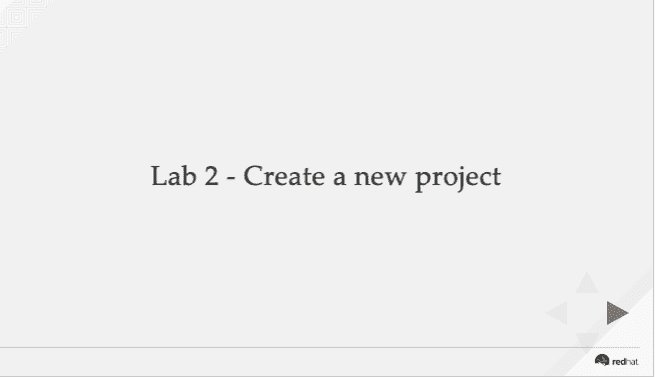

# 现代业务逻辑工具研讨会，实验 2:创建新项目

> 原文：<https://developers.redhat.com/blog/2019/04/01/modern-business-logic-tooling-workshop-lab-2-create-a-new-project>

本系列文章展示了如何开始使用现代业务逻辑工具。这些更新从从 JBoss BPM 到 Red Hat Decision Manager 和从 JBoss BPM Suite 到 Red Hat Process Automation Manager 开始。

第一次实验室更新展示了如何在你的笔记本电脑上安装 Red Hat Decision Manager。本文重点介绍了 Red Hat Process Automation Manager 的第二次实验室更新，它展示了如何创建一个新项目。

我们去实验室看看，好吗？

### 实验 2:创建新项目

本实验是学习开发过程集成项目的第二步。它一步一步地展示了如何从头开始创建一个新项目。最简单的方法是[直接进入实验 2](https://bpmworkshop.gitlab.io/rhpam/lab02.html) :

如果您对研讨会的某个部分有任何不清楚的意见或问题，请联系我。

*Last updated: March 26, 2019*