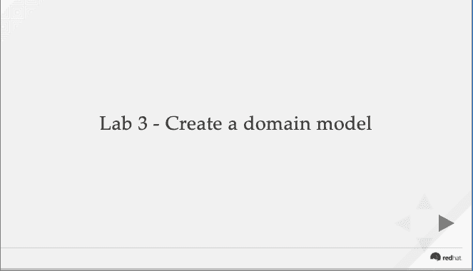

# 现代业务逻辑工具研讨会，实验 3:创建领域模型

> 原文：<https://developers.redhat.com/blog/2019/04/19/modern-business-logic-tooling-workshop-lab-3-create-a-domain-model>

自从开始更新我的免费在线规则和展示如何开始使用现代业务逻辑工具的流程自动化研讨会以来，我们已经在流程自动化方面取得了很大进展。更新从从 JBoss BPM 到 Red Hat Decision Manager 和从 JBoss BPM Suite 到 Red Hat Process Automation Manager 开始。

第一个实验室更新展示了如何在你的笔记本电脑上安装 Red Hat Decision Manager，第二个实验室[展示了如何创建一个新项目。本文重点介绍了 Red Hat Process Automation Manager 的最新实验室更新，在这里您将学习如何创建域模型。](https://developers.redhat.com/blog/2019/04/01/modern-business-logic-tooling-workshop-lab-2-create-a-new-project/)

我们去实验室看看，好吗？

### 实验 3:创建领域模型

本实验是学习开发过程集成项目的最新一步。这是关于如何创建你的第一个领域模型的一步一步的指南。最简单的方法是[直接进入实验 3](https://bpmworkshop.gitlab.io/rhpam/lab03.html) :

如果对研讨会的任何部分有不清楚的意见或反馈，请联系我们。敬请关注即将到来的下一次实验室更新！

*Last updated: April 17, 2019*