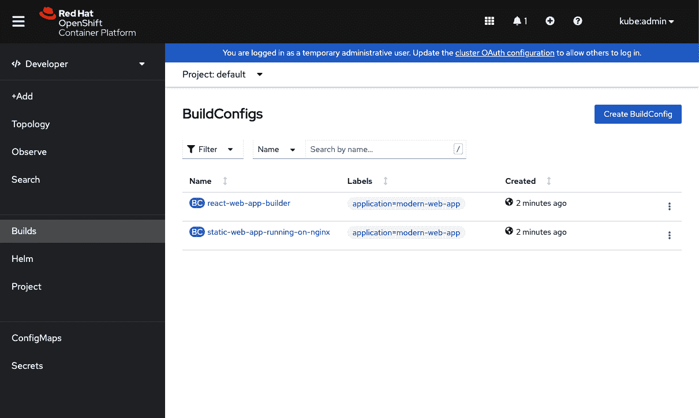
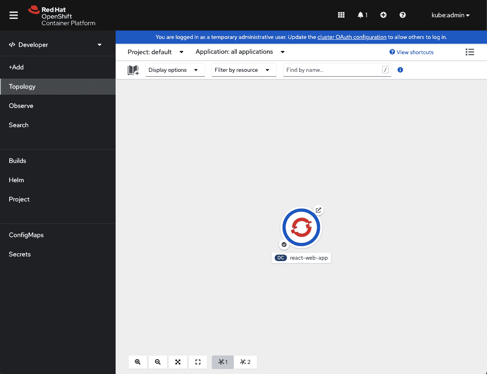
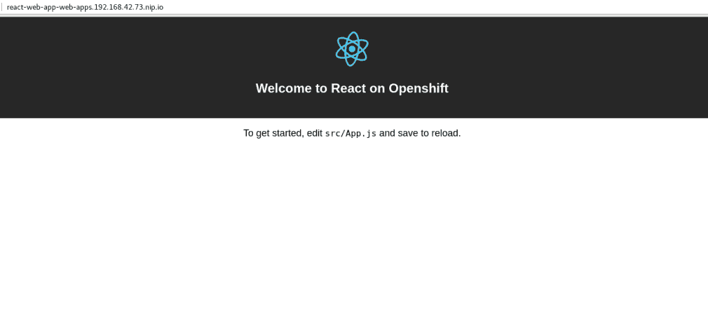

# OpenShift 上的现代 web 应用程序:第 2 部分——使用链式构建

> 原文：<https://developers.redhat.com/blog/2018/10/23/modern-web-applications-on-openshift-part-2-using-chained-builds>

[在上一篇文章](/blog/2018/10/04/modern-web-apps-openshift-part-1/)中，我们快速浏览了一个新的 source-to-image (S2I)构建器映像，它是为在 [Red Hat OpenShift](/openshift) 上构建和部署现代 web 应用程序而设计的。上一篇文章关注的是如何快速部署您的应用程序，而本文将研究如何使用 S2I 映像作为“纯”构建器映像，并将其与 OpenShift 链式构建结合起来。

**阅读系列:**

*   第 1 部分:[如何用最少的步骤部署现代 web 应用](/blog/2018/10/04/modern-web-apps-openshift-part-1/)

*   第 2 部分:[将 Node.js 构建器映像与当前的 HTTP 服务器映像结合起来](/blog/2018/10/23/modern-web-applications-on-openshift-part-2-using-chained-builds/)

*   第 3 部分:[在 OpenShift 上运行应用程序的开发服务器，同时与本地文件系统同步](/blog/2019/01/17/modern-web-applications-on-openshift-part-3-openshift-as-a-development-environment/)

## 纯粹的建设者形象

正如上一篇文章中提到的，大多数现代 web 应用程序现在都有一个构建步骤。在构建步骤中完成的常见工作流是诸如传输代码、连接多个文件和缩小文件之类的事情。一旦这些工作流完成，生成的文件(静态 HTML、JavaScript 和 CSS)将被放入输出文件夹。文件夹的位置通常取决于您正在使用的构建工具，但是对于 React 这样的工具，位置是`./build`(稍后将详细介绍这个位置)。

### 源到图像(S2I)

我们不会深入 S2I 的“什么和如何”(你可以[在这里](https://docs.okd.io/latest/architecture/core_concepts/builds_and_image_streams.html#source-build)阅读更多内容)，但我们应该理解其中的两个阶段，以便更好地理解 Node.js 构建器映像正在做什么。

#### 组装阶段

组装阶段与运行`docker build`时发生的情况非常相似。这个阶段的结果将是一个新的 Docker 图像。当一个构建在 OpenShift 上运行时，这个阶段也会发生。

对于 Web App Builder 映像，assemble 脚本负责安装应用程序的依赖项并运行您的构建。默认情况下，构建器图像将使用`npm run build`。

正如我之前所说，你的“构建”应用的位置取决于你使用的构建工具。比如 React 用的是`./build`，而 Angular app 用的是`project_name/dist`。正如您在第 1 部分中看到的，这个输出目录，默认为`build`，可以使用`OUTPUT_DIR`环境变量覆盖。

#### 运行阶段

当从组装阶段对新创建的图像调用`docker run`时，该阶段运行。这也是在 OpenShift 部署期间运行的内容。默认情况下，运行脚本将运行您的`package.json`的“启动”脚本。

虽然这有助于快速部署您的应用程序，但这不是提供静态内容的推荐方式。因为我们只提供静态内容，所以我们不需要在映像中安装 Node.js 我们只需要一台网络服务器。

在这种情况下——我们的构建需求不同于我们的运行时需求——链式构建可以提供帮助。

## 链式构件

引用官方 OpenShift 文档中关于[链式构建](https://docs.okd.io/latest/dev_guide/builds/advanced_build_operations.html#dev-guide-chaining-builds)的内容:

> 两个构建可以链接在一起:一个生成编译后的工件，另一个将工件放在运行工件的单独映像中。

这意味着我们可以使用 Web App Builder 映像来运行我们的构建，然后我们可以使用 Web 服务器映像，如 NGINX，来提供我们的内容。

这允许我们将 Web 应用程序构建器映像用作“纯”构建器，同时保持我们的运行时映像较小。

让我们看一个例子，看看这一切是如何结合在一起的。

这个[示例应用](https://github.com/nodeshift-blog-examples/react-web-app-chained-build)，是一个使用`create-react-app` CLI 工具创建的基本 React 应用。

我已经添加了一个 [OpenShift 模板文件](https://github.com/nodeshift-blog-examples/react-web-app-chained-build/blob/master/.openshiftio/application.yaml)来把所有东西拼凑在一起。

让我们来看看这个文件中一些更重要的部分。

```
parameters:
  - name: SOURCE_REPOSITORY_URL
    description: The source URL for the application
    displayName: Source URL
    required: true
  - name: SOURCE_REPOSITORY_REF
    description: The branch name for the application
    displayName: Source Branch
    value: master
    required: true
  - name: SOURCE_REPOSITORY_DIR
    description: The location within the source repo of the application
    displayName: Source Directory
    value: .
    required: true
  - name: OUTPUT_DIR
    description: The location of the compiled static files from your Node.js builder
    displayName: Output Directory
    value: build
    required: false
```

参数部分应该是不言自明的，但是我想调出`OUTPUT_DIR`参数。对于我们的 React 示例，我们不需要担心它，因为默认值是 React 使用的值，但是如果您使用 Angular 或其他值，您可以更改它。

现在让我们来看看图像流。

```
- apiVersion: v1
  kind: ImageStream
  metadata:
    name: react-web-app-builder  // 1 
  spec: {}
- apiVersion: v1
  kind: ImageStream
  metadata:
    name: static-web-app-running-on-nginx  // 2 
  spec: {}
- apiVersion: v1
  kind: ImageStream
  metadata:
    name:  node-ubi-s2i-image // 3
  spec:
    tags:
    - name: latest
      from:
        kind: DockerImage
        name: registry.access.redhat.com/ubi8/nodejs-14:latest
- apiVersion: v1
  kind: ImageStream
  metadata:
    name: nginx-image-runtime // 4
  spec:
    tags:
    - name: latest
      from:
        kind: DockerImage
        name: 'centos/nginx-112-centos7:latest'
```

首先，我们来看看第三和第四张图片。我们可以看到两者都被定义为 Docker 图像，我们可以看到它们来自哪里。

第三个是节点 S2I 图像，`registry.access.redhat.com/ubi8/nodejs-14`，它使用最新的标签。

第四个是 NGINX 映像(版本 1.12)，使用来自 [Docker hub](https://hub.docker.com/r/centos/nginx-112-centos7/) 的最新标签。

现在，让我们来看看前两张图片。两个图像都是空的。这些图像将在构建阶段创建，但是为了完整起见，让我解释一下每个图像将包含什么。

第一个图像`react-web-app-builder`，将是**节点-ubi-s2i-image** 图像的“组装”阶段的结果，一旦它与我们的源代码结合。这就是为什么我把它命名为“T1”

第二个图像，**static-we B- app-running-on-nginx**，将是将`nginx-image-runtime`与来自`react-web-app-builder`图像的一些文件组合的结果。这个图像也将是“已部署”的图像，并且将只包含 web 服务器和应用程序的静态 HTML、JavaScript 和 CSS。

现在这听起来可能有点混乱，但是一旦我们查看构建配置，事情应该会变得更加清晰。

在这个模板中，有两个构建配置。让我们一次看一个。

```
apiVersion: v1
  kind: BuildConfig
  metadata:
    name: react-web-app-builder
  spec:
    output:
      to:
        kind: ImageStreamTag
        name: react-web-app-builder:latest // 1
    source:   // 2 
      git:
        uri: ${SOURCE_REPOSITORY_URL}
        ref: ${SOURCE_REPOSITORY_REF}
      contextDir: ${SOURCE_REPOSITORY_DIR}
      type: Git
    strategy:
      sourceStrategy:
        from:
          kind: ImageStreamTag
          name: node-ubi-s2i-image:latest // 3
      type: Source
    triggers: // 4
    - github:
        secret: ${GITHUB_WEBHOOK_SECRET}
      type: GitHub
    - type: ConfigChange
    - imageChange: {}
      type: ImageChange
```

第一个，`react-web-app-builder`，挺标准的。我们看到第 1 行告诉我们这个构建的结果将被放入到`react-web-app-builder`图像中，这是我们在查看上面的图像流列表时看到的。

接下来，第 2 行只是告诉我们代码来自哪里。在本例中，它是一个 Git 存储库，位置、`ref`和上下文目录由我们前面看到的参数定义。

第 3 行只是告诉我们使用我们在`ImageStream`部分看到的`node-ubi-s2i-image`图像

最后要调用的是第 4 行，它只是设置了几个触发器，所以当有变化时，这个构建可以在没有手动交互的情况下启动。

正如我之前所说，这是一个非常标准的构建配置。现在让我们来看看第二个构建配置。大部分与第一个非常相似，但有一个重要的区别:

```
apiVersion: v1
  kind: BuildConfig
  metadata:
    name: static-web-app-running-on-nginx
  spec:
    output:
      to:
        kind: ImageStreamTag
        name: static-web-app-running-on-nginx:latest // 1
    source: // 2
      type: Image
      images:                              
        - from:
            kind: ImageStreamTag
            name: react-web-app-builder:latest // 3
          paths:
            - sourcePath:  /opt/app-root/src/${OUTPUT_DIR}/.   // 4
              destinationDir: .  // 5

    strategy: // 6
      sourceStrategy:
        from:
          kind: ImageStreamTag
          name: nginx-image-runtime:latest
        incremental: true
      type: Source
    triggers:
    - github:
        secret: ${GITHUB_WEBHOOK_SECRET}
      type: GitHub
    - type: ConfigChange
    - type: ImageChange
      imageChange: {}
    - type: ImageChange
      imageChange:
        from:
          kind: ImageStreamTag
          name: react-web-app-builder:latest // 7
```

第二个构建配置，**static-we b-app-running-on-nginx**，以一种相当标准的方式开始。

1 号线并不是什么新东西。它告诉我们，这个构建的结果将被放入**static-web-app-running-on-nginx**映像中。

与第一个构建配置一样，我们有一个 source 部分，第 2 行，但是这一次我们说我们的源来自一个图像。它所来自的图像是我们刚刚创建的图像，`react-web-app-builder`(在第 3 行中指定)。我们想要使用的文件位于图像内部，该位置在第 4 行指定:`/opt/app-root/src/${OUTPUT_DIR}/`。如果您还记得，这就是我们从应用程序的构建步骤中生成的文件的最终位置。

第 5 行中指定的目标目录就是当前目录(这都发生在一些神奇的 OpenShift 中，而不是在您的本地计算机上)。

第 6 行的策略部分也类似于第一个构建配置。这一次，我们将使用我们在`ImageStream`部分看到的`nginx-image-runtime`。

最后要指出的是触发器部分，第 7 行，它将在`react-web-app-builder`图像改变时触发这个构建。

模板的其余部分是相当标准的部署配置、服务和路由，我们不需要深入研究。请注意，将要部署的映像将是`react-web-app-runtime`映像。

## 部署应用程序

现在我们已经看了模板，让我们看看如何轻松地部署这个应用程序。

我们可以使用 OpenShift 客户端工具`oc`来部署我们的模板:

```
$ find . | grep openshiftio | grep application | xargs -n 1 oc apply -f

$ oc new-app --template react-web-app -p SOURCE_REPOSITORY_URL=https://github.com/lholmquist/react-web-app
```

第一个命令只是寻找`./openshiftio/application.yaml`模板的一种过度工程化的方法。第二个基于该模板创建一个新的应用程序。运行这些命令后，我们可以看到有两个构建:



回到概览屏幕，我们应该看到正在运行的 pod:



单击链接应该会导航到我们的应用程序，这是默认的 React 应用程序页面:

[](https://developers.redhat.com/blog/wp-content/uploads/2018/10/react-web-app-web.png)

## 额外加分:让它成为一个有角度的应用

对于喜欢使用 Angular 的开发人员来说，这里有一个关于 T2 的例子。除了那个`OUTPUT_DIR`变量之外，模板基本相同。

## 额外加分:用 Apache web 服务器替换 NGINX

本文展示了如何使用 NGINX 映像作为我们的 web 服务器，但是如果您想使用 Apache 服务器，那么很容易将它替换掉。它实际上可以通过一个或两个步骤来完成。

你需要做的就是在模板文件中，将 [NGINX 图像](https://github.com/lholmquist/react-web-app/blob/master/.openshiftio/application.yaml#L66)替换为 [Apache 图像](https://hub.docker.com/r/centos/httpd-24-centos7/)。

## 摘要

虽然本系列的第一篇文章展示了如何在 OpenShift 上快速获得现代 web 应用程序，但本文更深入地探讨了 Node.js Builder 映像正在做什么，以及如何使用链式构建将它与纯 web 服务器(如 NGINX)相结合，以获得更适合生产的构建。

在下一篇也是最后一篇文章中，我们将看看如何在 OpenShift 上运行 web 应用程序的开发服务器，同时保持本地和远程文件同步。

## 额外资源

*   [部署到 OpenShift:不耐烦的开发者指南](https://developers.redhat.com/books/deploying-openshift/):获取免费电子书。
*   了解更多关于 [OpenShift 和 Kubernetes](https://developers.redhat.com/topics/kubernetes/) 的信息。

*Last updated: November 8, 2021*