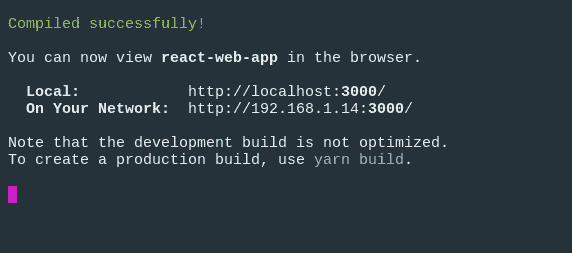
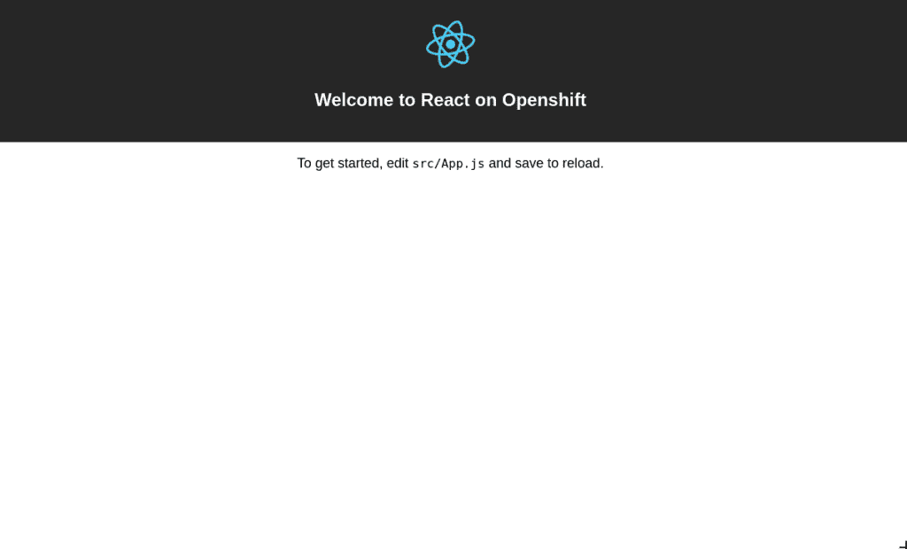
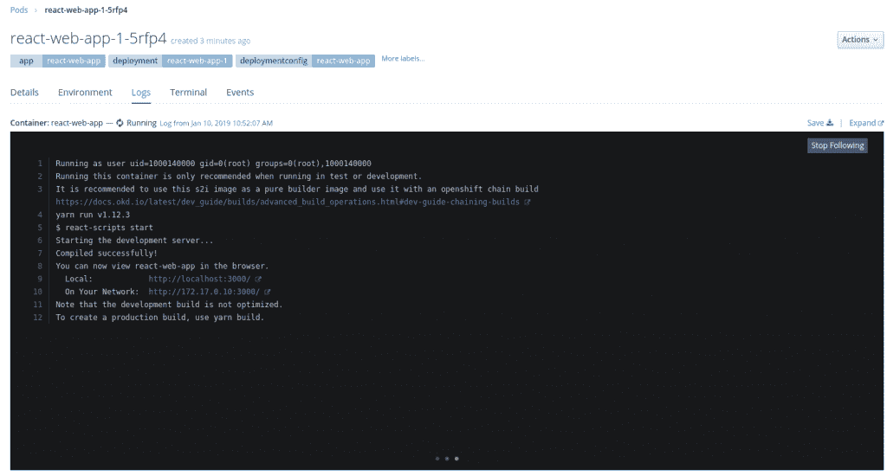

# OpenShift 上的现代 web 应用程序:第 3 部分——作为开发环境的 Openshift

> 原文：<https://developers.redhat.com/blog/2019/01/17/modern-web-applications-on-openshift-part-3-openshift-as-a-development-environment>

欢迎回到这个关于在 Red [Hat OpenShift](http://openshift.com/) 上部署现代 web 应用程序的多部分系列的最后一部分。在[的第一篇文章](https://developers.redhat.com/blog/2018/10/04/modern-web-apps-openshift-part-1/)中，我们看了看如何使用最少的命令部署一个现代的 web 应用程序。

在[第二部分](https://developers.redhat.com/blog/2018/10/23/modern-web-applications-on-openshift-part-2-using-chained-builds/)中，我们深入了解了新的源到图像(S2I)网络应用构建器的工作原理，以及如何将其作为链式构建的一部分。

这第三部分也是最后一部分将介绍如何在 OpenShift 上运行应用程序的“开发工作流程”。

## 开发工作流程

正如在[第一篇文章](https://developers.redhat.com/blog/2018/10/04/modern-web-apps-openshift-part-1/)中提到的，现代 web 应用程序的一个常见开发工作流是运行一个“开发服务器”来监视本地文件的变化。当发生更改时，应用程序的内部版本将会运行，浏览器将使用更新后的应用程序进行刷新。

大多数现代框架都在各自的 CLI 工具中内置了这个“开发服务器”。

### 当地的例子

让我们首先从本地运行我们的应用程序开始，这样我们就可以看到这个工作流应该如何工作。我们将继续使用我们在之前的文章中看到的 [React 示例](https://github.com/lholmquist/react-web-app)。尽管我们在这里使用 React 作为例子，但是对于所有其他现代框架来说，工作流概念是非常相似的。

对于这个 React 示例，为了启动“开发服务器”,我们运行以下命令:

```
$ npm run start

```

我们应该在终端中看到类似这样的内容:

[](https://developers.redhat.com/blog/wp-content/uploads/2018/10/react-dev-server-local-1.png)

我们的应用程序应该在默认浏览器中打开:

 [](https://developers.redhat.com/blog/wp-content/uploads/2018/10/react-localhost.png)

现在，如果我们对一个文件进行更改，我们应该会看到浏览器中运行的应用程序使用最新的更改进行刷新。

正如我之前所说，这是本地开发的一个常见工作流，但是我们如何将这个工作流放到 OpenShift 上呢？

### OpenShift 上的开发服务器

在[之前的文章](https://developers.redhat.com/blog/2018/10/23/modern-web-applications-on-openshift-part-2-using-chained-builds/)中，我们看了一下 S2I 图像的运行阶段。我们看到为我们的 web 应用提供服务的默认方式是使用`serve`模块。

然而，如果我们[仔细查看正在运行脚本](https://github.com/nodeshift/ubi8-s2i-web-app/blob/master/s2i/run#L10)，我们可以看到我们可以指定一个环境变量`$NPM_RUN`，它赋予我们执行定制命令的能力。

例如，使用`nodeshift`模块，部署我们的应用程序的命令可能如下所示:

```
$ npx nodeshift --deploy.env NPM_RUN="yarn start" --dockerImage=nodeshift/ubi8-s2i-web-app

```

注意:上面的例子已经被缩短以显示一个想法。

这里我们将`NPM_RUN`环境变量添加到我们的部署中。这将告诉我们的运行阶段运行`yarn start`，这将启动我们的 OpenShift pod 中的 React 开发服务器。

如果您看一下运行 pod 的日志，您可能会看到类似这样的内容:

[](https://developers.redhat.com/blog/wp-content/uploads/2019/01/react-pod-dev-server.png)

当然，这并不重要，除非我们可以将本地代码与远程集群上被监视的代码同步。

### 远程和本地同步

幸运的是，我们可以再次使用`nodeshift`来帮助我们。我们可以使用`watch`命令。

在我们运行命令来部署应用程序的开发服务器之后，我们可以运行这个命令:

```
$ npx nodeshift watch

```

这将连接到我们刚刚创建的正在运行的 pod，并将我们的本地文件与我们的远程集群同步，同时还会观察我们的本地系统的变化。

因此，如果您要更新`src/App.js`文件，该更改将被检测并复制到远程集群，然后运行的开发服务器将刷新浏览器。

为了完整起见，下面是完整的命令:

```
$ npx nodeshift --strictSSL=false --dockerImage=nodeshift/ubi8-s2i-web-app --build.env YARN_ENABLED=true --expose --deploy.env NPM_RUN="yarn start" --deploy.port 3000

$ npx nodeshift watch --strictSSL=false

```

`watch`命令是对`oc rsync`命令的抽象。要了解这是如何工作的更多信息，[请点击这里](https://docs.okd.io/latest/dev_guide/copy_files_to_container.html)。

尽管我们看到的例子使用了 React，但这种技术也适用于其他框架。您只需要更改`NPM_RUN`环境变量。

## 结论

在这个由 3 部分组成的系列中，我们看到了如何以几种方式将现代 web 应用程序部署到 OpenShift。

[在第一部分中，](https://developers.redhat.com/blog/2018/10/04/modern-web-apps-openshift-part-1/)我们看到了如何快速上手新的网络应用程序 S2I 图像。

第 2 部分更深入地探讨了 S2I 映像是如何工作的以及如何使用链式构建。

最后一部分简要概述了如何在 OpenShift 上运行开发服务器，下一部分将讨论 [OpenShift 管道，以及如何使用该工具作为链式构建](https://developers.redhat.com/blog/2020/04/27/modern-web-applications-on-openshift-part-4-openshift-pipelines/)的替代。

## 额外资源

*   部署到 OpenShift:不耐烦的开发者指南
*   [使用 Red Hat OpenShift 应用程序运行时和 Istio 构建 Container-Native Node.js 应用程序](https://developers.redhat.com/blog/2018/06/11/container-native-nodejs-istio-rhoar/)
*   [如何用 Chrome DevTools 在 OpenShift 上调试你的 Node.js 应用](https://developers.redhat.com/blog/2018/05/15/debug-your-node-js-application-on-openshift-with-chrome-devtools/)
*   [零表示在三个命令中打开 shift](https://developers.redhat.com/blog/2018/04/16/zero-express-openshift-3-commands/)
*   [宣布:Node.js 在 Red Hat OpenShift 应用程序运行时正式发布](https://developers.redhat.com/blog/2018/03/12/rhoar-nodejs-annoucement/)
*   [使用 Prometheus 监控 OpenShift 上的 Node.js 应用](https://developers.redhat.com/blog/2018/12/21/monitoring-node-js-applications-on-openshift-with-prometheus/)
*   关于 [OpenShift 和 Kubernetes 的其他文章](https://developers.redhat.com/topics/kubernetes/)

*Last updated: May 4, 2020*