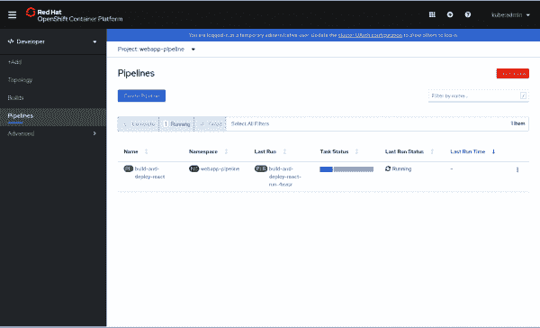
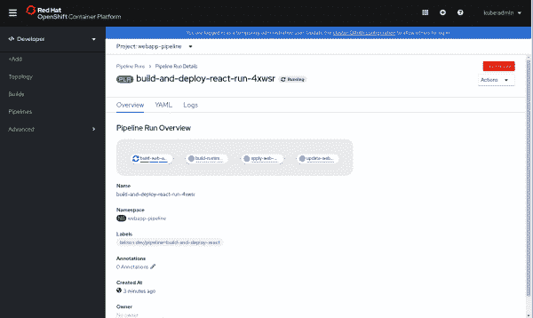
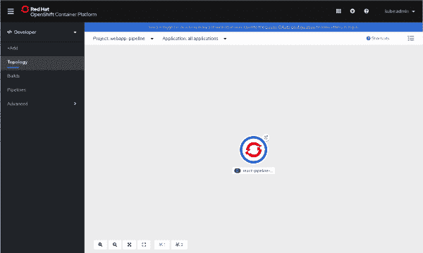
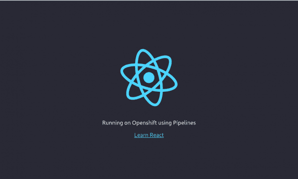

# OpenShift 上的现代 web 应用程序，第 4 部分:Openshift 管道

> 原文：<https://developers.redhat.com/blog/2020/04/27/modern-web-applications-on-openshift-part-4-openshift-pipelines>

当我撰写本系列的第 3 部分“OpenShift 上的现代 web 应用:第 3 部分—作为开发环境的 open shift 时，我说过这是最后一部分。然而，有一种新技术非常适合将现代 Web 应用程序部署到 OpenShift，所以第 4 部分是必要的。作为回顾，在[的第一篇文章](https://developers.redhat.com/blog/2018/10/04/modern-web-apps-openshift-part-1/)中，我们研究了如何使用最少的命令部署现代 web 应用程序。在第二部分的[中，我们深入了解了新的源到图像(S2I)网络应用构建器是如何工作的，以及如何将其用作链式构建的一部分。在第三个](https://developers.redhat.com/blog/2018/10/23/modern-web-applications-on-openshift-part-2-using-chained-builds/)的[中，我们看了看如何在](https://developers.redhat.com/blog/2019/01/17/modern-web-applications-on-openshift-part-3-openshift-as-a-development-environment/) [Red Hat OpenShift](https://developers.redhat.com/openshift/) 上运行你的应用的“开发工作流程”。本文讨论 OpenShift 管道，以及如何将该工具用作链式构建的替代工具。

## 什么是 OpenShift 管道？

OpenShift Pipelines 是一个云原生的持续集成和交付(CI/CD)解决方案，用于使用 Tekton 构建管道。Tekton 是一个灵活的、Kubernetes 本地的开源 CI/CD 框架，它通过抽象底层细节来实现跨多个平台(Kubernetes、无服务器、虚拟机等)的自动化部署。

这篇文章假设你对管道有一些了解，所以如果你是这项技术的新手，先看看这个官方教程。

## 设置您的环境

为了有效地遵循本文，需要进行一些初始设置:

1.  建立一个 OpenShift 4 集群:我一直在使用 CodeReady Containers (CRD)来建立这个环境(这里是[设置指令](https://cloud.redhat.com/openshift/install/crc/installer-provisioned))。
2.  一旦您的集群启动并运行，安装管道操作符，这只需要几次点击(这里是如何[安装操作符](https://github.com/openshift/pipelines-tutorial/blob/master/install-operator.md))。
3.  在这里获取 [Tekton CLI ( `tkn`)。](https://github.com/tektoncd/cli#installing-tkn)
4.  运行`create-react-app` CLI 工具来创建我们最终将部署的应用程序(这个[基本 React 示例](https://github.com/nodeshift-starters/react-pipeline-example))。
5.  (可选)通过运行`npm install`和`npm start`，克隆 repo 以在本地运行示例。

应用程序 repo 还有一个`k8s`目录，其中包含可用于部署应用程序的 Kubernetes/OpenShift YAMLs。你可以找到我们将在这个回购中创建的`Tasks`、`ClusterTasks`、`Resources`和`Pipelines`。

## 入门指南

对于这个例子，我们首先需要在 OpenShift 集群上创建一个新项目。新项目将被命名为`webapp-pipeline`。通过调用以下命令创建这个新项目:

`$ oc new-project webapp-pipeline`

这里的命名对于本教程来说很重要，所以如果您决定更改它，请注意我调用项目名称的地方，并相应地进行更新。从这里开始，本文将反向工作。我们将首先创建组成管道的所有小部分，然后我们将创建管道。

所以，首先...

## 任务

让我们创建几个*任务*，作为*管道*的一部分，帮助我们稍后部署应用程序。第一个任务是`apply_manifests_task`，负责应用应用程序 k8s 目录中的 Kubernetes 资源(服务、部署和路由)YAMLs。第二个任务是`update_deployment_task`，负责用管道创建的新映像更新部署的映像。

现在不用太担心这些。这些任务更像是实用程序，我们一会儿就会看到它们。现在，使用以下内容创建这些任务:

```
$ oc create -f https://raw.githubusercontent.com/nodeshift/webapp-pipeline-tutorial/master/tasks/update_deployment_task.yaml
$ oc create -f https://raw.githubusercontent.com/nodeshift/webapp-pipeline-tutorial/master/tasks/apply_manifests_task.yaml

```

然后，您可以使用`tkn` CLI 来确保它们已被创建:

```
$ tkn task ls

NAME                AGE
apply-manifests     1 minute ago
update-deployment   1 minute ago

```

**注意:**这些任务是您当前项目的本地任务。

## 集群任务

集群任务与任务非常相似。它仍然是一个可重用的步骤集合，当这些步骤组合在一起时，执行一个特定的任务，只是集群任务可用于整个集群。要查看添加管道操作符时预安装的集群任务列表，请再次使用`tkn` CLI:

```
$ tkn clustertask ls

NAME                       AGE
buildah                    1 day ago
buildah-v0-10-0            1 day ago
jib-maven                  1 day ago
kn                         1 day ago
maven                      1 day ago
openshift-client           1 day ago
openshift-client-v0-10-0   1 day ago
s2i                        1 day ago
s2i-go                     1 day ago
s2i-go-v0-10-0             1 day ago
s2i-java-11                1 day ago
s2i-java-11-v0-10-0        1 day ago
s2i-java-8                 1 day ago
s2i-java-8-v0-10-0         1 day ago
s2i-nodejs                 1 day ago
s2i-nodejs-v0-10-0         1 day ago
s2i-perl                   1 day ago
s2i-perl-v0-10-0           1 day ago
s2i-php                    1 day ago
s2i-php-v0-10-0            1 day ago
s2i-python-3               1 day ago
s2i-python-3-v0-10-0       1 day ago
s2i-ruby                   1 day ago
s2i-ruby-v0-10-0           1 day ago
s2i-v0-10-0                1 day ago

```

我们现在将创建两个集群任务。第一个创建一个 S2I 映像并将其推入内部的 OpenShift 注册表，第二个使用我们构建的应用程序的内容构建我们的基于 NGINX 的映像

### 创建和推送图像

对于第一个集群任务，我们遵循上一篇文章中关于链构建的相同过程的一部分。在那里，我们使用 S2I 图像(`ubi8-s2i-web-app`)来“构建”我们的 web 应用程序。此操作产生了一个存储在内部 OpenShift 注册表中的图像。我们将使用 web 应用程序 S2I 映像为我们的应用程序创建一个`DockerFile`,然后使用 Buildah 实际构建该映像并将其推入内部 OpenShift 注册表:如果您使用 NodeShift 部署您的应用程序，这实际上就是 OpenShift 所做的事情。

如果你想知道我怎么知道我需要所有这些步骤，答案是我不需要。我复制了 Node.js 官方版本，并根据我的需求进行了更新。

现在，创建`s2i-web-app`集群任务:

```
$ oc create -f https://raw.githubusercontent.com/nodeshift/webapp-pipeline-tutorial/master/clustertasks/s2i-web-app-task.yaml

```

我不会深入该文件中的每个条目，但我想指出一个特定的参数:`OUTPUT_DIR`:

```
params:
      - name: OUTPUT_DIR
        description: The location of the build output directory
        default: build

```

该参数默认为`build`，这是 React 放置其构建内容的地方。不同的框架可能有不同的位置。比如 Ember 用的`dist`。第一个集群任务的输出将是一个包含我们构建的 HTML、JavaScript 和 CSS 的图像。

### 构建基于 NGINX 的映像

对于第二个集群任务，我们需要创建一个任务，使用我们构建的应用程序的内容来构建基于 NGINX 的映像。这基本上是前述文章的链式构建部分。

为此，创建与另一个任务相同的`webapp-build-runtime`集群任务:

```
$ oc create -f https://raw.githubusercontent.com/nodeshift/webapp-pipeline-tutorial/master/clustertasks/webapp-build-runtime-task.yaml

```

如果您查看这些集群任务的代码，您会注意到我们没有指定我们正在使用什么样的 Git repo，或者我们正在创建什么样的映像名称。例如，我们只指定传入一个 Git repo 或一个图像，并输出一个图像。这个过程允许我们在不同的应用程序中重用这些集群任务。

这很好地引导我们进入...

## 资源

因为我们刚刚了解到我们的集群任务应该尽可能通用，所以我们需要创建资源来用作输入(Git repo)和输出(结果图像)。我们需要的第一个资源是应用程序所在的 Git repo。该资源可能看起来像这样:

```
# This resource is the location of the git repo with the web application source
apiVersion: tekton.dev/v1alpha1
kind: PipelineResource
metadata:
  name: web-application-repo
spec:
  type: git
  params:
    - name: url
      value: https://github.com/nodeshift-starters/react-pipeline-example
    - name: revision
      value: master

```

该`PipelineResource`属于`git`类型。我们可以在 params 部分看到，`url`针对一个特定的回购协议，我们还指定了主分支(这是可选的，但为了完整起见，我将它包括在内)。

我们需要的下一个资源是一个图像，我们将在其中存储`s2i-web-app`任务的结果。这个过程可能类似于:

```
# This resource is the result of running "npm run build",  the resulting built files will be located in /opt/app-root/output
apiVersion: tekton.dev/v1alpha1
kind: PipelineResource
metadata:
  name: built-web-application-image
spec:
  type: image
  params:
    - name: url
      value: image-registry.openshift-image-registry.svc:5000/webapp-pipeline/built-web-application:latest

```

这个`PipelineResource`是`image`类型的，`url`的值指向内部的 OpenShift 图像注册表——特别是在`webapp-pipeline`名称空间中的那个。如果您使用不同的名称空间，则相应地更改该值。

最后一个资源也将是一个`image`类型，这将是我们最终要部署的 NGINX 映像:

```
# This resource is the image that will be just the static html, css, js files being run with nginx
apiVersion: tekton.dev/v1alpha1
kind: PipelineResource
metadata:
  name: runtime-web-application-image
spec:
  type: image
  params:
    - name: url
      value: image-registry.openshift-image-registry.svc:5000/webapp-pipeline/runtime-web-application:latest

```

同样，这个资源将图像存储在内部 OpenShift 注册表的`webapp-pipeline`名称空间中。

要一次创建所有这些资源，运行这个`create`命令:

```
$ oc create -f https://raw.githubusercontent.com/nodeshift/webapp-pipeline-tutorial/master/resources/resource.yaml

```

然后，您可以使用以下命令查看创建的资源:

```
$ tkn resource ls

```

## 管道

现在我们已经有了所有的部分，让我们把它们放在我们的管道中。您可以通过运行以下命令来创建管道:

```
$ oc create -f https://raw.githubusercontent.com/nodeshift/webapp-pipeline-tutorial/master/pipelines/build-and-deploy-react.yaml

```

在我们运行这个命令之前，让我们看一下各个部分。首先，名字:

```
apiVersion: tekton.dev/v1alpha1
kind: Pipeline
metadata:
  name: build-and-deploy-react

```

然后，在`spec`部分，我们看到指定我们之前创建的资源:

```
spec:
  resources:
    - name: web-application-repo
      type: git
    - name: built-web-application-image
      type: image
    - name: runtime-web-application-image
      type: image

```

然后，我们为管道运行创建任务。我们要运行的第一个任务是我们之前创建的`s2i-web-app`集群任务:

```
tasks:
    - name: build-web-application
      taskRef:
        name: s2i-web-app
        kind: ClusterTask

```

该任务接受一个输入(即`git`资源)和一个输出(即`built-web-application-image`资源)。我们还传递一个参数来告诉我们的集群任务，我们不需要验证 TLS，因为我们正在使用自签名证书:

```
resources:
        inputs:
          - name: source
            resource: web-application-repo
        outputs:
          - name: image
            resource: built-web-application-image
      params:
        - name: TLSVERIFY
          value: "false"

```

下一个任务有类似的设置，但是这次调用我们之前创建的`webapp-build-runtime`集群任务:

```
name: build-runtime-image
    taskRef:
      name: webapp-build-runtime
      kind: ClusterTask

```

与我们之前的任务类似，我们正在传递一个资源，但这次是`built-web-application-image`(这是我们之前任务的输出)。同样，我们指定一个图像作为输出。这个任务应该在前一个任务之后运行，所以我们添加了`runAfter`字段:

```
resources:
        inputs:
          - name: image
            resource: built-web-application-image
        outputs:
          - name: image
            resource: runtime-web-application-image
        params:
        - name: TLSVERIFY
          value: "false"
      runAfter:
        - build-web-application

```

接下来的两个任务负责应用 web 应用程序的`k8s`目录中的服务、路由和部署 YAML 文件，然后用新创建的映像更新部署。这是我们在开始时定义的两个集群任务。

### 运行管道

现在所有的部分都创建好了，我们终于可以用下面的命令运行新的管道了:

```
$ tkn pipeline start build-and-deploy-react

```

此时，CLI 将变成交互式的，您需要在每个提示符下选择适当的资源。对于`git`资源，选择`web-application-repo`。然后，选择`built-web-application-image`作为第一个图像资源，选择`runtime-web-application-image`作为第二个图像资源:

```
? Choose the git resource to use for web-application-repo: web-application-repo (https://github.com/nodeshift-starters/react-pipeline-example)
? Choose the image resource to use for built-web-application-image: built-web-application-image (image-registry.openshift-image-registry.svc:5000/webapp-pipeline/built-web-
application:latest)
? Choose the image resource to use for runtime-web-application-image: runtime-web-application-image (image-registry.openshift-image-registry.svc:5000/webapp-pipeline/runtim
e-web-application:latest)
Pipelinerun started: build-and-deploy-react-run-4xwsr

```

通过运行以下命令来检查管道的状态:

```
$ tkn pipeline logs -f

```

在管道完成和应用程序部署之后，用这个小命令获取公开的路由:

```
$ oc get route react-pipeline-example --template='http://{{.spec.host}}'

```

为了更直观，我们可以在 web 控制台的 **Developer** 视图中查看我们的管道，并单击**管道**部分，如图 1 所示。

[](/sites/default/files/blog/2020/03/web-app-pipeline-web-console1.png)Overview of a Running Pipeline

图 1:正在运行的管道的概述。">

单击正在运行的管道以查看更多细节，如图 2 所示。

[](/sites/default/files/blog/2020/03/web-app-pipeline-web-console-2.png)Running Pipeline Detail

图 2:正在运行的管道的细节。">

一旦有了细节，您就可以在**拓扑**视图中看到您正在运行的应用程序，如图 3 所示。

[](/sites/default/files/blog/2020/03/web-app-pipeline-web-console-3.png)Running Pod

图 3:正在运行的 pod。">

单击圆圈右上角的图标打开应用程序。图 4 显示了这将是什么样子。

[](/sites/default/files/blog/2020/03/web-app-pipeline-web-console-4.png)React Application

图 4:运行 React 应用程序。">

### 包扎

在本文中，我们看到了如何使用 OpenShift 管道来模拟链式构建模板方法。你可以在这个回购中找到我们创造的所有东西[。除了 React 之外，还有一些 GitHub 的问题，需要用另一个框架添加一个例子，所以请随意投稿！](https://github.com/nodeshift/webapp-pipeline-tutorial)

*Last updated: January 21, 2022*