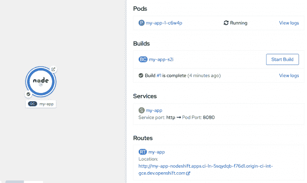
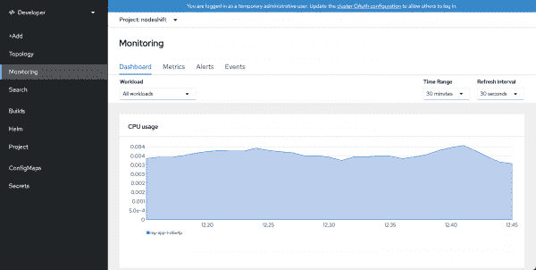
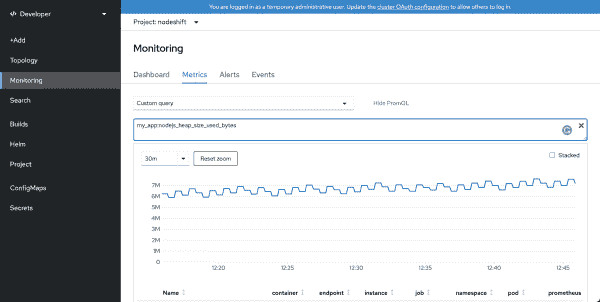
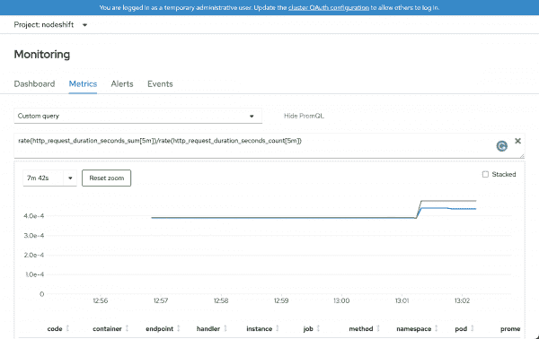

# 使用 Prometheus 监控 Red Hat OpenShift 上的 Node.js 应用程序

> 原文：<https://developers.redhat.com/blog/2021/03/22/monitor-node-js-applications-on-red-hat-openshift-with-prometheus>

关于 [Node.js](/topics/nodejs-develop-server-side-javascript-applications) 的一个伟大之处在于它在容器中的表现。随着向[集装箱化部署和环境的转变](/topics/containers)带来了额外的复杂性。其中一个复杂性是观察应用程序及其资源内部发生了什么，以及资源使用何时超出了预期标准。

Prometheus 是一个开发人员可以用来增加可观察性的工具。这是一个可安装的服务，它从您的应用程序中收集测量指标，并将它们存储为时间序列数据。Prometheus 是先进的，经过了实战检验，是运行在容器内部的 Node.js 应用程序的最佳选择。

## 默认和自定义检测

为了让您的应用程序向 Prometheus 提供指标，它必须公开一个指标端点。对于 Node.js 应用程序，公开指标端点的最佳方式是使用节点包管理器(NPM)注册中心提供的 [prom 客户端模块](https://www.npmjs.com/package/prom-client)。`prom-client`模块公开了普罗米修斯推荐的所有[默认指标](https://prometheus.io/docs/instrumenting/writing_clientlibs/#standard-and-runtime-collectors)。

默认包括诸如`process_cpu_seconds_total`和`process_heap_bytes`的度量。除了公开默认的度量标准，`prom-client`还允许开发人员定义他们自己的度量标准，正如我们在本文中将要做的。

## 简单的 Express.js 应用程序

让我们首先创建一个简单的 [Express.js](https://expressjs.com/) 应用程序。在这个应用程序中，`/api/greeting`处的服务端点接受`GET`请求，并以 JSON 的形式返回一个问候。以下命令将启动您的项目:

```
$ mkdir my-app && cd my-app

$ npm init -y

$ npm i express body-parser prom-client

```

这个命令序列应该创建一个`package.json`文件，并安装所有的应用程序依赖项。接下来，在文本编辑器中打开`package.json`文件，并将以下内容添加到`scripts`部分:

```
"start": "node app.js"

```

### 应用程序源代码

以下代码是一个相当简单的 Express.js 应用程序。在文本编辑器中创建一个名为`app.js`的新文件，并将以下内容粘贴到其中:

```
'use strict';
const express = require('express');
const bodyParser = require('body-parser');

// Use the prom-client module to expose our metrics to Prometheus
const client = require('prom-client');

// enable prom-client to expose default application metrics
const collectDefaultMetrics = client.collectDefaultMetrics;

// define a custom prefix string for application metrics
collectDefaultMetrics({ prefix: 'my_app:' });

const histogram = new client.Histogram({
  name: 'http_request_duration_seconds',
  help: 'Duration of HTTP requests in seconds histogram',
  labelNames: ['method', 'handler', 'code'],
  buckets: [0.1, 5, 15, 50, 100, 500],
});

const app = express();
const port = process.argv[2] || 8080;

let failureCounter = 0;

app.use(bodyParser.json());
app.use(bodyParser.urlencoded({ extended: true }));

app.get('/api/greeting', async (req, res) => {
  const end = histogram.startTimer();
  const name = req.query?.name || 'World';

  try {
    const result = await somethingThatCouldFail(`Hello, ${name}`);
    res.send({ message: result });
  } catch (err) {
    res.status(500).send({ error: err.toString() });
  }

  res.on('finish', () =>
    end({
      method: req.method,
      handler: new URL(req.url, `http://${req.hostname}`).pathname,
      code: res.statusCode,
    })
  );
});

// expose our metrics at the default URL for Prometheus
app.get('/metrics', async (req, res) => {
  res.set('Content-Type', client.register.contentType);
  res.send(await client.register.metrics());
});

app.listen(port, () => console.log(`Express app listening on port ${port}!`));

function somethingThatCouldFail(echo) {
  if (Date.now() % 5 === 0) {
    return Promise.reject(`Random failure ${++failureCounter}`);
  } else {
    return Promise.resolve(echo);
  }
}

```

### 部署应用程序

您可以使用以下命令将应用程序部署到 Red Hat OpenShift:

```
$ npx nodeshift --expose

```

该命令创建应用程序部署所需的所有 OpenShift 对象。部署成功后，您将能够访问您的应用程序。

### 验证应用程序

这个应用程序公开了两个端点:`/api/greetings`获取问候消息，而`/metrics`获取普罗米修斯指标。首先，您将看到通过访问`greetings` URL 生成的 JSON 问候:

```
$ curl http://my-app-nodeshift.apps.ci-ln-5sqydqb-f76d1.origin-ci-int-gce.dev.openshift.com/api/greeting

```

如果一切顺利，你会得到一个像这样的成功回复:

```
{"content":"Hello, World!"}

```

现在，使用以下方法获取您的 Prometheus 应用程序指标:

```
$ curl ${your-openshift-application-url}/metrics

```

您应该能够看到如图 1 所示的输出。

[](/sites/default/files/blog/2021/03/Screenshot-01-1.png)

Figure 1: Topology view from the developer perspective of the OpenShift web console.

## 配置普罗米修斯

从 4.6 版本开始，OpenShift 自带了一个内置的 Prometheus 实例。要使用此实例，您需要从管理员帐户配置监视堆栈，并为集群上用户定义的项目启用指标。

### 创建集群监视配置映射

要配置核心的[红帽 OpenShift 容器平台](/courses/openshift/getting-started)监控组件，必须在`openshift-monitoring`项目中创建`cluster-monitoring-config` `ConfigMap`对象。创建一个名为`cluster-monitoring-config.yaml`的 YAML 文件，并粘贴如下内容:

```
apiVersion: v1
kind: ConfigMap
metadata:
  name: cluster-monitoring-config
  namespace: openshift-monitoring
data:
  config.yaml: |
    enableUserWorkload: true

```

然后，将该文件应用到 OpenShift 集群:

```
$ oc apply -f cluster-monitoring-config.yaml

```

您还需要授予用户权限，以便为用户定义的项目配置监控。运行以下命令，用适当的值替换*用户*和*名称空间*:

```
$ oc policy add-role-to-user monitoring-edit *user* -n *namespace*

```

### 创建服务监视器

最后要做的是为您的应用程序部署一个服务监视器。部署服务监视器允许 Prometheus 定期检查您的应用程序的`/metrics`端点，以获得最新的指标。创建一个名为`service-monitor.yaml`的文件，并粘贴如下内容:

```
apiVersion: monitoring.coreos.com/v1
kind: ServiceMonitor
metadata:
  labels:
    k8s-app: nodeshift-monitor
  name: nodeshift-monitor
  namespace: nodeshift
spec:
  endpoints:
    - interval: 30s
      port: http
      scheme: http
  selector:
    matchLabels:
      project: my-app

```

然后，将这个文件部署到 OpenShift:

```
$ oc apply -f service-monitor.yaml

```

现在整个 OpenShift 监控栈应该已经配置好了。

## 普罗米修斯仪表板

在 OpenShift 4.6 中，Prometheus 仪表盘与 OpenShift 集成在一起。要访问仪表板，转到您的项目并选择左边的 **Monitoring** 项，如图 2 所示。

[](/sites/default/files/blog/2021/03/Screenshot-02.png)

Figure 2: Prometheus monitoring in the OpenShift dashboard.

要查看普罗米修斯指标(使用 [PromQL](https://prometheus.io/docs/prometheus/latest/querying/basics/) ，请转到名为**指标**的第二个选项卡。您可以查询和绘制应用程序提供的任何指标。例如，图 3 显示了堆的大小。

[](/sites/default/files/blog/2021/03/Screenshot-03.png)

Figure 3: A heap graph in Prometheus.

## 测试应用程序

接下来，让我们使用 [Apache Bench](https://httpd.apache.org/docs/2.4/programs/ab.html) 工具来增加应用程序的负载。我们将达到我们的 API 端点 10，000 次，每次有 100 个并发请求:

```
$ ab -n 10000 -c 100 http://my-app-nodeshift.apps.ci-ln-5sqydqb-f76d1.origin-ci-int-gce.dev.openshift.com/api/greeting

```

生成这个负载后，我们可以返回到主 Prometheus 仪表板屏幕，并构造一个简单的查询来查看服务的执行情况。我们将使用我们定制的`http_request_duration_seconds`指标来测量过去五分钟内的平均请求持续时间。在文本框中键入以下查询:

```
rate(http_request_duration_seconds_sum[5m])/rate(http_request_duration_seconds_count[5m])
```

然后，转到 Prometheus 仪表板，查看如图 4 所示的精美图形。

[](/sites/default/files/blog/2021/03/Screenshot-04.png)

Figure 4: Results from a custom query.

我们得到两行输出，因为我们有两种类型的响应:成功的响应(200)和服务器错误(500)。我们还可以看到，随着负载的增加，完成 HTTP 请求所需的时间也会增加。

## 结论

本文简要介绍了如何使用 Prometheus 监控 Node.js 应用程序。您将希望为生产应用程序做更多的事情，包括设置警报和添加自定义指标以支持[红色指标](https://github.com/nodeshift/nodejs-reference-architecture/blob/master/docs/operations/metrics.md#guidance)。但是我将把这些选项留给另一篇文章。希望这足以让你开始并准备学习更多。

要了解更多关于 Red Hat 在 Node.js 方面的进展，请查看我们新的 [Node.js 登录页面](/topics/nodejs-develop-server-side-javascript-applications)。

*Last updated: March 31, 2021*