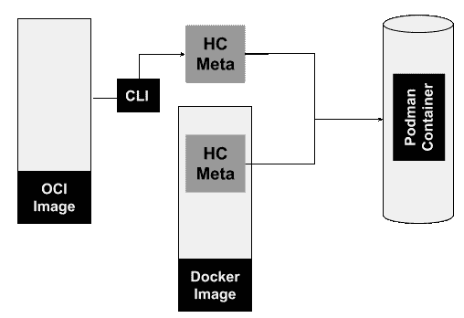
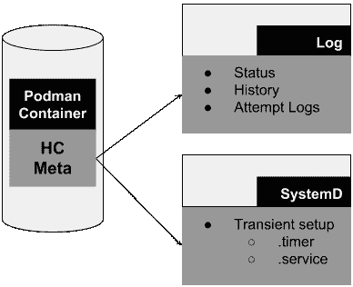

# 使用 Podman 监控集装箱的活力和可用性

> 原文：<https://developers.redhat.com/blog/2019/04/18/monitoring-container-vitality-and-availability-with-podman>

在 [Podman](https://developers.redhat.com/articles/podman-next-generation-linux-container-tools/) 开发出一定水平的稳定性和功能性后不久，我们开始听到这样的问题，“容器健康检查怎么样？”这是一个棘手的问题，没有简单明了的答案。我的同事和我偶尔会讨论健康检查，但我们是一个无梦的环境，这使得这种事情具有挑战性。没有长时间运行的进程或守护进程来安排健康检查，我们需要查看操作系统的其他部分来启动它们。最近，这些问题变得越来越明显，是时候为我们的用户解决这个问题了。

我很高兴地说，最新的 [Podman 版本 1.2](https://podman.io/releases/) 现在有能力执行集装箱健康检查。本文描述了健康检查，并解释了我们如何为 Podman 实现它们。

## 什么是健康检查？

“健康检查”是一种用户可以确定容器内部运行的主进程的“健康”或准备情况的方式。这不仅仅是一个简单的“我的容器在运行吗？”问题。更像是“我的应用程序准备好了吗？”因此，健康检查实际上是验证容器及其应用程序是否响应的一种方式。

运行状况检查由五个基本部分组成:

1.  命令
2.  重试次数
3.  间隔
4.  开始时期
5.  超时

健康检查的核心是*命令*。Podman 将在目标容器内执行命令，并等待“0”或“故障退出”代码。例如，如果您有一个运行 Nginx 服务器的容器，您的 healthcheck 命令可以像 curl 命令一样简单，成功地连接到 web 端口以确保 Nginx 有响应。

其他四个组件与运行状况检查本身的计划相关。它们是可选的，如果您选择不为每一个指定值，它们都有默认值。*重试次数*定义在容器被标记为“不健康”之前需要发生的连续失败的健康检查次数成功的运行状况检查会重置重试计数器。

*间隔*指标描述了运行 healthcheck 命令的时间间隔。确定间隔值有点艺术。如果间隔值太小，您的系统将花费大量时间运行健康检查；如果间隔太长，你会很难赶上暂停。该值是一个持续时间，如“30s”或“1h2m”

**注**:持续时间字符串是一个可能有符号的十进制数序列，每个都有一个可选的分数和一个单位后缀，如“300ms”、“1.5h”或“2h45m”有效的时间单位是“纳秒”、“美国”、“秒”、“毫秒”、“秒”、“米”和“小时”

第四部分是*起始周期*。这描述了从容器启动到您希望忽略运行状况检查失败之间的时间。更简单地说，如果运行状况检查在此期间失败，它将不被视为失败。在此期间，集装箱的健康检查状态将是从开始的*。如果健康检查成功返回，集装箱的健康检查状态将从开始变为*健康*。*

最后一个组件是*超时*定义。与间隔值一样，它也是一个持续时间。它描述了在被认为不成功之前运行状况检查本身必须完成的时间段。

## 告诉我

从 Podman 1.2 开始，您可以使用命令行界面将健康检查定义为容器创建的一部分。假设您想要定义一个运行状况检查，并手动运行该运行状况检查。健康检查目前仅针对以 root 用户身份运行的 Podman 运行。

```
$ sudo podman run -dt --name hc1 --healthcheck-command 'CMD-SHELL curl http://localhost || exit 1' --healthcheck-interval=0 quay.io/libpod/alpine_nginx:latest
d25ee6faaf6e5e12c09e734b1ac675385fe4d4e8b52504dd01a60e1b726e3edb
$ sudo podman healthcheck run hc1
Healthy
$ echo $?
0
```

在`podman run`命令中，注意`--healthcheck-command`的使用，这里定义了健康检查命令本身。请记住，这是一个在容器本身“内部”运行的命令。在这种情况下，curl 命令需要出现在容器中。另外，请注意`--healthcheck-interval`标志和它的“0”值。间隔标志定义运行运行状况检查的时间频率。“0”值表示我们希望手动运行运行状况检查。

如果您只提供该命令，那么不仅会定义运行状况检查，而且还会使用默认值自动安排运行状况检查。Podman 使用 systemd 计时器来安排运行状况检查。如果没有 systemd，就不会自动安排运行状况检查。您可以使用不同的工具(如“cron”作业)来安排运行状况检查，但是您必须手动完成这项工作。

## 关于图像和容器类型

要真正理解 Podman 中的健康检查，您需要理解 Podman 理解的两种主要图像类型:“docker”和“oci:”。只有 Docker 映像类型将健康检查元数据存储为映像本身的一部分。Docker 参考生成器的[健康检查部分](https://docs.docker.com/engine/reference/builder/#healthcheck)对此进行了描述。OCI 映像规范不包括运行状况检查定义。OCI 映像不能嵌入或保留运行状况检查元数据的事实实际上导致了一种非常灵活的方法来定义(有时重新定义)运行状况检查本身。

[](/sites/default/files/blog/2019/04/hc1-e1554734939726.png)

图 healthcheck 元数据的来源及其到 Podman 容器的路径。">

图 1 显示了 healthcheck 元数据的来源以及它如何成为 Podman 容器的一部分。如前所述，Docker 图像可以包含元数据，并且该元数据可以被传递到 Podman 容器上。如果 Docker 映像中定义的健康检查不充分，那么 Docker 映像的元数据可以被 podman CLI 覆盖。对于 OCI 映像，只能使用 CLI 定义运行状况检查。

为容器定义的运行状况检查元数据不能“保存”到 OCI 映像以供重用。例如，Podman `commit`命令允许用户从 Podman 图像创建图像，并且默认为“oci”格式；但是，您可以将格式切换为“docker ”,运行状况检查将成为结果图像的一部分。

## 健康检查在 Podman 中如何工作

Podman 的健康检查实现可以分为三部分(如图 2 所示):

1.  图像和容器元数据
2.  记录
3.  行程安排

第一部分是上一节讨论的图像和容器元数据。事实上，它是健康检查的核心部分，没有它，健康检查就无法存在。

[](/sites/default/files/blog/2019/04/hc2-e1554735221828.png)

图 2:健康检查的三个主要部分。">

还会创建运行状况检查的日志文件。它保留容器的健康状态以及历史记录，包括以前的健康检查尝试。最后，由 systemd 完成调度。当一个容器启动并进行健康检查时，Podman 执行一个. service 和。计时器文件。这仅仅意味着。服务和。计时器文件不是永久的，可能会在重新启动时丢失。事实上，如果停止同一个容器。服务和。计时器文件被删除；如果您手动停止瞬态计时器或服务，情况也是如此。正如您可能已经得出的结论。定时器文件定义了调度方面(间隔)和。服务包含 Podman healthcheck 命令。

### 瞬态健康检查定时器

以下是 Podman 为一个以“81b9…”开头的容器创建的计时器文件示例。这个特定的容器定义了 30 秒的时间间隔。

```
$ cat 81b9da5145f9d2ab3f6ab27e4ec15e95d8975f796be819248f149a617aa3055f.timer
# This is a transient unit file, created programmatically via the systemd API. Do not edit.
[Unit]
Description=/usr/bin/podman healthcheck run 81b9da5145f9d2ab3f6ab27e4ec15e95d8975f796be819248f149a617aa3055f

[Timer]
OnUnitInactiveSec=30s
AccuracySec=1s
RemainAfterElapse=no
```

### 短暂健康检查服务

当 Podman 创建一个临时服务文件时，它看起来像下面这样:

```
$ cat 81b9da5145f9d2ab3f6ab27e4ec15e95d8975f796be819248f149a617aa3055f.service
# This is a transient unit file, created programmatically via the systemd API. Do not edit.
[Unit]
Description=/usr/bin/podman healthcheck run 81b9da5145f9d2ab3f6ab27e4ec15e95d8975f796be819248f149a617aa3055f

[Service]
ExecStart=
ExecStart=@/usr/bin/podman "/usr/bin/podman" "healthcheck" "run" "81b9da5145f9d2ab3f6ab27e4ec15e95d8975f796be819248f149a617aa3055f"

```

注意，如果您的系统没有 systemd，您仍然可以使用 Podman healthchecks。Podman 只使用 systemd 处理健康检查计时。您可以使用 cron 或其他一些调度应用程序。此外，您可以使用 Podman 手动运行 healthcheck 命令，容器的健康和日志将会相应地更新。

## 与运行状况检查的结果交互

您可以使用 Podman 与运行状况检查结果和状态进行交互。最直接的方法是在容器上使用`podman inspect`。假设我创建了一个运行 Nginx 的容器，并如下定义了一个健康检查:

```
$ sudo podman run -dt --name hc --healthcheck-start-period 2m --healthcheck-retries 5 --healthcheck-command "CMD-SHELL curl http://localhost  || exit 1" quay.io/libpod/alpine_nginx:latest
164747229c31eb0214c2aa63997171104e38f93d8aa4d5e315b16679213c078d
```

有了这个 healthcheck 定义，该命令运行 curl 来确保 Nginx 有响应。重试限制设置为 5，我提供了两分钟的启动时间。时间间隔将默认为 30 秒。让容器运行几秒钟后，我们可以检查容器，以查看运行状况检查状态和随后的配置。

在 inspect 命令的输出中，我们可以看到 healthcheck 状态被设置为 *healthy* ，甚至可以看到所执行的 curl 命令的日志。也记录开始和停止时间。

```
$ sudo podman inspect hc
[
    {
        "ID": "164747229c31eb0214c2aa63997171104e38f93d8aa4d5e315b16679213c078d",
        "Created": "2019-03-26T14:27:21.928727195-05:00",
        "Path": "nginx",
        "Args": [
            "-g",
            "daemon off;"
        ],
        "State": {
            "OciVersion": "1.0.1-dev",
            "Status": "running",
            "Running": true,
            "Paused": false,
 ...
            "StartedAt": "2019-03-26T14:27:22.439699271-05:00",
            "FinishedAt": "0001-01-01T00:00:00Z",
            "Healthcheck": {
                "Status": "healthy",
                "FailingStreak": 0,
                "Log": [
                    {
                        "Start": "2019-03-26T14:27:22.597838221-05:00",
                        "End": "2019-03-26T14:27:22.847910361-05:00",
                        "ExitCode": 0,
                        "Output": "  % Total    % Received % Xferd  Average Speed Time    Time     Time  Current\n                                 Dload  Upload  Total Spent    Left  Speed\n\r  0     0    0     0    0     0      0      0 --:--:-- --:--:-- --:--:--     0\r100    12  100    12    0     0  12000      0 --:--:-- --:--:-- --:--:-- 12000\npodman rulez"
                    }
                ]
            }
        },
        "Image": "3ef70f7291f47dfe2b82931a993e16f5a44a0e7a68034c3e0e086d77f5829adc",
        "ImageName": "quay.io/libpod/alpine_nginx:latest",
...
        "Config": {
            ...
            "StopSignal": 15,
            "Healthcheck": {
                "Test": [
                    "CMD-SHELL",
                    "curl",
                    "http://localhost",
                    "],
                "StartPeriod": 120000000000,
                "Interval": 30000000000,
                "Timeout": 30000000000,
                "Retries": 5
            }
        }
    }
]
```

作为`podman inspect`输出的一部分，我们还可以将 healthcheck 配置视为容器元数据。字段*测试*指的是健康检查命令。*起始周期*、*间隔*和*超时*被转换为毫秒。而*重试次数*是一个简单的整数。

您还可以通过使用带有`podman ps`命令的过滤器来获得容器健康检查状态的概要视图。

```
$ sudo podman ps -a --filter health=healthy
CONTAINER ID  IMAGE                      COMMAND               CREATED         STATUS             PORTS  NAMES
71dac13c36d9  quay.io/libpod/alpine_nginx:latest  nginx -g daemon o... 27 seconds ago  Up 27 seconds ago     hc2
164747229c31  quay.io/libpod/alpine_nginx:latest  nginx -g daemon o... 14 minutes ago  Up 14 minutes ago     hc
```

当使用健康过滤器时，您可以使用*健康*、*开始*或*不健康*的值。

## 总结

Podman 中包含健康检查功能，这为未来提供了一些有趣的可能性。我们当然对最近在 Podman 中增加的事件以及事件和诸如健康检查之类的事情之间可能的交互感兴趣。另一个想法是将健康检查的概念应用于吊舱，以及使用边车集装箱是否是一个理想的解决方案。这将使我们能够专注于 pod 级别的健康检查，甚至是容器本身以外的健康检查。最后，将重启策略与健康检查相关联可能会非常有用，这样就能够在容器或 pod 变得“不健康”时实际采取*动作*

*Last updated: April 7, 2022*