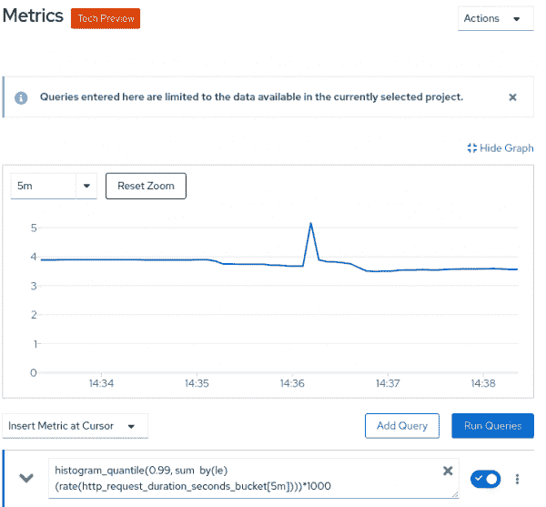

# 监控。Kubernetes 上的 NET 核心应用程序

> 原文：<https://developers.redhat.com/blog/2020/08/05/monitoring-net-core-applications-on-kubernetes>

Prometheus 是一款开源监控解决方案，从系统及其应用程序中收集指标。作为开发人员，您可以查询这些指标并使用它们来创建警报，您可以将这些警报用作仪表板的来源。一个例子是使用普罗米修斯与[格拉夫纳](https://grafana.com/)的度量。

在本文中，我将向您展示如何使用 Prometheus 来监控一个[。运行在](https://developers.redhat.com/topics/dotnet/) [Kubernetes](https://developers.redhat.com/topics/kubernetes/) 上的网络核心应用。请注意，本文不包括安装说明。我提供了一个使用 Prometheus [操作符](https://developers.redhat.com/topics/kubernetes/operators/)在 Kubernetes 上创建和配置 Prometheus 的参考。

**注意**:了解更多关于 Prometheus 对[监控部署在 OpenShift 上的 Kubernetes 和容器化应用](https://docs.openshift.com/container-platform/4.3/monitoring/monitoring-your-own-services.html#creating-alerting-rules_monitoring-your-own-services)的支持。

## 使用 Prometheus 进行开源监控

Prometheus 以一个[时间序列](https://en.wikipedia.org/wiki/Time_series)组织数据。这种类型的数据图对于跟踪数值随时间的变化非常有用。然后，Prometheus 使用时间序列跟踪以下内容:

*   **计数器**:只能递增的值，比如处理的请求数。
*   **量表**:可以上下浮动的值，比如使用的内存。
*   **直方图**:在多个桶中计数的值，如响应时间。

单个指标(如 HTTP 响应时间)对应于多个具有唯一标签集的时间序列。由于有了这些标签，您可以根据特定标准过滤查询，比如特定 URL 的 HTTP 响应时间。

## 部署普罗米修斯

您可以使用 [Prometheus 操作符](https://github.com/coreos/prometheus-operator)在 Kubernetes 上创建和配置 Prometheus。为了设置这个示例，我首先创建了一个项目，用户拥有监视权限。我按照 [*中描述的步骤监控自己的服务*](https://docs.openshift.com/container-platform/4.3/monitoring/monitoring-your-own-services.html) 来创建项目和用户。

## 公开指标。网络核心

我们将使用 [prometheus-net](https://github.com/prometheus-net/prometheus-net) 库从。网芯。这个库包括一个用于监控的包。NET 核心，以及用于监控 ASP.NET 核心的独立包。ASP.NET 核心监控包包括与 web 服务器相关的其他指标。

如`prometheus-net` [自述](https://github.com/prometheus-net/prometheus-net)中所述，我们需要包含`prometheus-net.AspNetCore`包:

```
<ItemGroup>
  <PackageReference Include="prometheus-net.AspNetCore" Version="3.5.0" />
</ItemGroup>

```

接下来，我们将添加一个端点，Prometheus 将使用它来检索指标:

```
app.UseEndpoints(endpoints =>
{
  // ...
  endpoints.MapMetrics();
};

```

最后，我们能够捕获 HTTP 指标:

```
public void Configure(IApplicationBuilder app, ...)
{
  // ...
  app.UseRouting();
  app.UseHttpMetrics();
  // ...
}

```

我们将在 [Red Hat OpenShift](https://developers.redhat.com/products/openshift/overview) 上部署该应用程序，并使其可从集群外部访问:

```
$ oc new-app dotnet:3.1~https://github.com/redhat-developer/s2i-dotnetcore-ex#dotnetcore-3.1-monitor --context-dir app
$ oc expose service s2i-dotnetcore-ex

```

既然我们的应用程序已经启动并运行，我们可以看看 Prometheus 在`/metrics`路径中使用的 HTTP 端点。请注意 ASP.NET 核心应用程序公开的不同仪表、计数器和直方图:

```
# HELP process_private_memory_bytes Process private memory size
# TYPE process_private_memory_bytes gauge
process_private_memory_bytes 383516672
# HELP process_working_set_bytes Process working set
# TYPE process_working_set_bytes gauge
process_working_set_bytes 229879808
# HELP http_requests_in_progress The number of requests currently in progress in the ASP.NET Core pipeline. One series without controller/action label values counts all in-progress requests, with separate series existing for each controller-action pair.
# TYPE http_requests_in_progress gauge
http_requests_in_progress{method="GET",controller="",action=""} 1
http_requests_in_progress{method="POST",controller="Home",action="Index"} 0
http_requests_in_progress{method="GET",controller="Home",action="Index"} 0
# HELP http_requests_received_total Provides the count of HTTP requests that have been processed by the ASP.NET Core pipeline.
# TYPE http_requests_received_total counter
http_requests_received_total{code="200",method="POST",controller="Home",action="Index"} 1
http_requests_received_total{code="200",method="GET",controller="Home",action="Index"} 1288
http_requests_received_total{code="200",method="GET",controller="",action=""} 4944
# HELP http_request_duration_seconds The duration of HTTP requests processed by an ASP.NET Core application.
# TYPE http_request_duration_seconds histogram
http_request_duration_seconds_sum{code="200",method="GET",controller="Home",action="Index"} 0.5861144999999994
http_request_duration_seconds_count{code="200",method="GET",controller="Home",action="Index"} 1288
http_request_duration_seconds_bucket{code="200",method="GET",controller="Home",action="Index",le="0.001"} 1262
...
http_request_duration_seconds_bucket{code="200",method="GET",controller="Home",action="Index",le="+Inf"} 1288
http_request_duration_seconds_sum{code="200",method="GET",controller="",action=""} 8.691159999999982
http_request_duration_seconds_count{code="200",method="GET",controller="",action=""} 4944
...

```

您可以看到内存指标，如`process_working_set_bytes`标尺。您还可以看到`http_request_duration_seconds`，它展示了请求持续时间的直方图。根据`code`、`method`、`controller`和`action`，该`process_working_set_bytes`指标具有时间序列。这让我们可以根据这些标签进行过滤。直方图数据在`http_request_duration_seconds_bucket`指标中，该指标使用`le`(小于或等于)标签定义存储桶。直方图还包括一个`*_count`和`*_sum`指标。

## 监控。网络应用

现在，我们需要为。NET 应用程序。我们在 OpenShift 上通过向名称空间添加一个`PodMonitor`或`ServiceMonitor`配置来实现这一点。OpenShift Prometheus 操作员拾取这些资源并配置监控。

接下来，让我们看看我们已经部署的服务。我们将使用这些信息来配置`ServiceMonitor`:

```
$ oc get service s2i-dotnetcore-ex -o yaml
apiVersion: v1
kind: Service
metadata:
  annotations:
    openshift.io/generated-by: OpenShiftNewApp
  creationTimestamp: 2020-05-08T11:48:02Z
  labels:
    app: s2i-dotnetcore-ex
  name: s2i-dotnetcore-ex
  namespace: demoproject
  resourceVersion: "22076"
  selfLink: /api/v1/namespaces/demoproject/services/s2i-dotnetcore-ex
  uid: 2aa94ebe-2384-4544-bcbe-b8283bd2db60
spec:
  clusterIP: 172.30.35.187
  ports:
  - name: 8080-tcp
    port: 8080
    protocol: TCP
    targetPort: 8080
  selector:
    app: s2i-dotnetcore-ex
    deploymentconfig: s2i-dotnetcore-ex
  sessionAffinity: None
  type: ClusterIP
status:
  loadBalancer: {}

```

### 配置服务监视器

我们将添加一个与服务配置中的`app: s2i-dotnetcore-ex`标签、`name: 8080-tcp`端口和`namespace: demoproject`名称空间相匹配的`ServiceMonitor`。

首先，我们创建一个包含以下内容的`example-app-service-monitor.yaml`文件:

```
apiVersion: monitoring.coreos.com/v1
kind: ServiceMonitor
metadata:
  labels:
    k8s-app: prometheus-example-monitor
  name: prometheus-example-monitor
  namespace: demoproject
spec:
  endpoints:
  - interval: 30s
    port: 8080-tcp
    scheme: http
  selector:
    matchLabels:
      app: s2i-dotnetcore-ex

```

请注意，该配置包括监控间隔，在本例中设置为`30s`。

剩下要做的就是添加监视器:

```
$ oc apply -f example-app-service-monitor.yaml

```

## 质疑普罗米修斯

既然 Prometheus 正在监视我们的应用程序，我们可以查看我们收集的指标。首先，打开 OpenShift web 用户界面(UI)并转到**高级>指标**页面。在这个页面上，我们可以执行 Prometheus 查询。 [PromQL](https://prometheus.io/docs/prometheus/latest/querying/basics/) 是 Prometheus 查询语言，它提供了一种简单的、富有表现力的语言来查询 Prometheus 收集的时间序列。

例如，我们将使用一个查询来计算。网络应用服务:

```
histogram_quantile(0.99, sum by(le) (rate(http_request_duration_seconds_bucket[5m])))*1000

```

图 1 显示了由 Prometheus 生成的响应时间图。

[](/sites/default/files/blog/2020/06/prom_screenshot.png)

Figure 1: A histogram graphs a .NET application service's 99% quantile response time.

### PromQL 查询

如果您不熟悉 PromQL，我们来分析一下这个查询。我们使用的`http_request_duration_seconds_bucket`指标来自我们在`/metrics`路径下看到的`http_request_duration_seconds`直方图。

因为这些值是不断递增的计数器，所以我们在五分钟的窗口内应用`rate`操作。这为我们提供了过去五分钟内的响应时间变化。`http_request_duration_seconds_bucket`指标被分割成多个时间序列(按照`code`、`method`等等)。我们不关心这些个别系列，我们就总结一下。我们添加了`by (le)`参数来维护组成直方图的各个桶。我们使用`histogram_quantile`获得 99%的分位数值，乘以`1000`获得以毫秒为单位的时间。

## 结论

在本文中，您了解了如何使用 Prometheus 进行监控。NET 核心应用程序部署在 Kubernetes 上。如果您想继续这个例子，您可以使用 Prometheus 收集的指标来[生成警报](https://docs.openshift.com/container-platform/4.3/monitoring/monitoring-your-own-services.html#creating-alerting-rules_monitoring-your-own-services)并在一个或多个 [Grafana 仪表板](https://prometheus.io/docs/visualization/grafana/)中查看它们。如果你很好奇，可以看看 OpenShift 4.3 对[通过网络控制台访问普罗米修斯、警告 UI 和 Grafana](https://docs.openshift.com/container-platform/4.3/monitoring/cluster_monitoring/prometheus-alertmanager-and-grafana.html) 的支持。

*Last updated: July 30, 2020*